# Agent-Based Modeling Skill

A skill for AI assistants that encodes the full agent-based modeling (ABM)
lifecycle: deciding whether ABM is the right tool, designing and documenting
models (ODD), implementing in Mesa/NetLogo/Agents.jl, verifying → calibrating →
validating (in that order), running sensitivity analysis and replications, and
interpreting results honestly.

The skill has a strong point of view. It takes hard positions because vague
guidance produces sloppy models: one run is an anecdote, calibration fit is not
validation, OFAT alone cannot establish robustness, and LLM-driven generative
agents make validation *worse*, not better. These claims are grounded in the
peer-reviewed ABM methodology literature — not personal preference — and the
references directory documents the evidence behind each stance.

## What's inside

```
SKILL.md                          — skill hub; load this first
references/
  odd-protocol.md                 — ODD documentation standard (7 elements, 11 design concepts)
  validation-and-calibration.md   — verify → calibrate → validate; ABC, history matching
  analysis-and-experiments.md     — replications, global SA, burn-in, reporting
  limitations-and-pitfalls.md     — over-parameterization, artefacts, black-box, boundary conditions
  frameworks-and-tools.md         — NetLogo, Mesa, Repast, Agents.jl, FLAME GPU
  generative-llm-agents.md        — LLM-driven agents: appeal, dangers, responsible use
  key-literature.md               — annotated bibliography by phase
assets/
  mesa_model_template.py          — runnable Schelling model (Mesa 3.x); adapt, don't start blank
  odd_template.md                 — fill-in ODD model-description template
scripts/
  replication_convergence.py      — how many runs? (CV convergence method)
  sensitivity_analysis.py         — Morris screening + Sobol indices via SALib
evals/
  evals.json                      — 11 capability evals across the ABM lifecycle
  trigger_eval.json               — 22 should/should-not-trigger queries
  run_evals.py                    — eval harness (requires claude CLI)
```

## Installation

```bash
npx skills add https://github.com/JacobElder/jakes-skills/tree/main/agent-based-modeling
```

Or manually:

```bash
cp -r jakes-skills/agent-based-modeling ~/.claude/skills/agent-based-modeling
```

Once installed, the skill applies automatically whenever you ask about agent-based models, multi-agent simulations, ABM methodology, ODD protocol, Mesa/NetLogo/Agents.jl, sensitivity analysis, model calibration or validation, or emergent behavior.

To run the bundled scripts, install Python dependencies first:

```bash
pip install -r requirements.txt
```

Requires Python 3.10+.

## Run the scripts

```bash
# How many replications does your model need?
python scripts/replication_convergence.py --demo

# Global sensitivity analysis (Morris + Sobol)
python scripts/sensitivity_analysis.py --demo

# Run the Mesa Schelling template
python assets/mesa_model_template.py --seed 1
python assets/mesa_model_template.py --converge   # uses replication_convergence.py
```

## Run the evals

Requires the [Claude Code CLI](https://claude.ai/code) (`claude` on PATH) and an
Anthropic API key.

```bash
# Capability evals — baseline and with skill loaded
python evals/run_evals.py

# With-skill only (faster)
python evals/run_evals.py --condition with_skill

# Trigger routing evals
python evals/run_evals.py --trigger

# Re-use cached results
python evals/run_evals.py --skip-existing
```

Results are written to `evals/results/`.

## Benchmark results

Evaluated on 11 capability evals spanning the full ABM lifecycle, graded by
`claude-haiku-4-5` against explicit assertions (executor: `claude-sonnet-4-6`).

| Condition | Score | Pass rate |
|-----------|-------|-----------|
| Base model (no skill) | 40 / 57 | 70.2% |
| With skill | 57 / 57 | **100%** |
| **Delta** | | **+29.8 pp** |

```mermaid
xychart-beta horizontal
    title "Pass rate by lifecycle phase (■ with skill  □ base model)"
    x-axis ["Reporting stochastic output", "Sensitivity analysis", "Calibration vs validation", "ODD documentation", "Model selection", "Triggering (22 queries)"]
    y-axis "Pass rate (%)" 0 --> 100
    bar [100, 100, 100, 100, 100, 100]
    bar [60, 60, 80, 80, 80, 100]
```



Trigger routing (22 queries): **100%** accuracy — the skill fires on ABM tasks
and skips unrelated queries (ML training, CFD, Monte Carlo finance, etc.).

The largest gains come from tasks that require the bundled scaffolding: running
global sensitivity analysis with Morris + Sobol (+5 on eval 7), properly
reporting stochastic output (+3 on eval 10), and applying the full
verification → calibration → validation distinction (+2 on eval 2).

## Example output

### One stochastic run is an anecdote — the ensemble is the result

ABM outputs are stochastic. A single run produces a plausible trajectory, not a finding. The skill requires ensemble analysis before any result is reported.


**Left** — A single SIR epidemic run (N=1000, β=0.35, γ=0.10): peak infection appears at day ~25, count ~407. Report this and you've reported one possible world. **Right** — 100-run ensemble: the median peak is ~364, but individual runs range from below 200 to above 400. The single run (dashed red) falls near the upper tail. The shaded bands show 5–95th and 25–75th percentile envelopes. The skill enforces this before any parameter interpretation or policy conclusion: stochastic ABMs need enough replications for the output distribution to stabilize (CV convergence method, bundled in `scripts/replication_convergence.py`), and results should report ensemble statistics — not the trajectory that happened to come first.

---

## Design philosophy

**Opinionated by design.** The most common ABM failure modes are not technical —
they are methodological: skipping verification before calibration, treating
calibration fit as validation, running one stochastic replicate and calling it a
result, or using OFAT sweeps to claim robustness. An assistant that hedges on
these questions is worse than useless; it legitimizes sloppy practice. This skill
takes direct, defensible positions — and cites the literature that backs them.

**Lifecycle, not a bag of tricks.** The skill is organized around the actual
modeling workflow (decide → design → document → implement → verify → calibrate →
validate → analyze → interpret), so assistance is anchored to where the user
actually is, not an undifferentiated capability dump.

**Bundled scripts as defaults.** `replication_convergence.py` and
`sensitivity_analysis.py` are the default tools for their respective tasks. The
skill explicitly directs users to them rather than re-deriving these computations
by hand each time.

