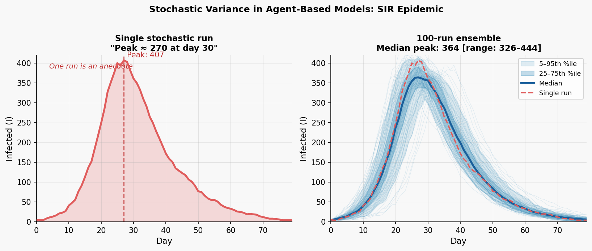

# Agent-Based Modeling Skill

A skill for AI assistants that encodes the full agent-based modeling (ABM)
lifecycle: deciding whether ABM is the right tool, designing and documenting
models (ODD), implementing in Mesa/NetLogo/Agents.jl, verifying → calibrating →
validating (in that order), running sensitivity analysis and replications, and
interpreting results honestly.

The skill has a strong point of view. It takes hard positions because vague
guidance produces sloppy models: one run is an anecdote, calibration fit is not
validation, OFAT alone cannot establish robustness, and LLM-driven generative
agents make validation *worse*, not better. These claims are grounded in the
peer-reviewed ABM methodology literature — not personal preference — and the
references directory documents the evidence behind each stance.

## What's inside

```
SKILL.md                          — skill hub; load this first
references/
  odd-protocol.md                 — ODD documentation standard (7 elements, 11 design concepts)
  validation-and-calibration.md   — verify → calibrate → validate; ABC, history matching
  analysis-and-experiments.md     — replications, global SA, burn-in, reporting
  limitations-and-pitfalls.md     — over-parameterization, artefacts, black-box, boundary conditions
  frameworks-and-tools.md         — NetLogo, Mesa, Repast, Agents.jl, FLAME GPU
  generative-llm-agents.md        — LLM-driven agents: appeal, dangers, responsible use
  key-literature.md               — annotated bibliography by phase
assets/
  mesa_model_template.py          — runnable Schelling model (Mesa 3.x); adapt, don't start blank
  odd_template.md                 — fill-in ODD model-description template
scripts/
  replication_convergence.py      — how many runs? (CV convergence method)
  sensitivity_analysis.py         — Morris screening + Sobol indices via SALib
evals/
  evals.json                      — 11 capability evals across the ABM lifecycle
  trigger_eval.json               — 22 should/should-not-trigger queries
  run_evals.py                    — eval harness (requires claude CLI)
```

## Installation

```bash
npx skills add https://github.com/JacobElder/jakes-skills/tree/main/agent-based-modeling
```

Or manually:

```bash
cp -r jakes-skills/agent-based-modeling ~/.claude/skills/agent-based-modeling
```

Once installed, the skill applies automatically whenever you ask about agent-based models, multi-agent simulations, ABM methodology, ODD protocol, Mesa/NetLogo/Agents.jl, sensitivity analysis, model calibration or validation, or emergent behavior.

To run the bundled scripts, install Python dependencies first:

```bash
pip install -r requirements.txt
```

Requires Python 3.10+.

## Run the scripts

```bash
# How many replications does your model need?
python scripts/replication_convergence.py --demo

# Global sensitivity analysis (Morris + Sobol)
python scripts/sensitivity_analysis.py --demo

# Run the Mesa Schelling template
python assets/mesa_model_template.py --seed 1
python assets/mesa_model_template.py --converge   # uses replication_convergence.py
```

## Run the evals

Requires the [Claude Code CLI](https://claude.ai/code) (`claude` on PATH) and an
Anthropic API key.

```bash
# Capability evals — baseline and with skill loaded
python evals/run_evals.py

# With-skill only (faster)
python evals/run_evals.py --condition with_skill

# Trigger routing evals
python evals/run_evals.py --trigger

# Re-use cached results
python evals/run_evals.py --skip-existing
```

Results are written to `evals/results/`.

## Benchmark results

Evaluated on 11 capability evals spanning the full ABM lifecycle, graded by
`claude-haiku-4-5` against explicit assertions (executor: `claude-sonnet-4-6`).

| Condition | Score | Pass rate |
|-----------|-------|-----------|
| Base model (no skill) | 40 / 57 | 70.2% |
| With skill | 57 / 57 | **100%** |
| **Delta** | | **+29.8 pp** |

```mermaid
xychart-beta horizontal
    title "Pass rate by lifecycle phase (■ with skill  □ base model)"
    x-axis ["Reporting stochastic output", "Sensitivity analysis", "Calibration vs validation", "ODD documentation", "Model selection", "Triggering (22 queries)"]
    y-axis "Pass rate (%)" 0 --> 100
    bar [100, 100, 100, 100, 100, 100]
    bar [60, 60, 80, 80, 80, 100]
```



Trigger routing (22 queries): **100%** accuracy — the skill fires on ABM tasks
and skips unrelated queries (ML training, CFD, Monte Carlo finance, etc.).

The largest gains come from tasks that require the bundled scaffolding: running
global sensitivity analysis with Morris + Sobol (+5 on eval 7), properly
reporting stochastic output (+3 on eval 10), and applying the full
verification → calibration → validation distinction (+2 on eval 2).

## Example use cases

### "I ran my model and got peak infection at day 25 — the epidemic burns out by day 40"

> I ran my SIR epidemic ABM (N=1000, β=0.35, γ=0.10) and got a clear epidemic curve: peak around day 25, roughly 400 infected, burns out by day 40. Is this a meaningful result?

Without the skill, the model validates the run and offers interpretation:

> That's a clear epidemic trajectory. A peak around day 25 with ~400 simultaneous infections (40% of the population) suggests a moderately fast-spreading disease. The R₀ from your parameters (β/γ = 3.5) is consistent with a significant outbreak. This gives you a useful baseline to compare against interventions.

With the skill, the model stops at the single-run problem before interpreting:

> One run of a stochastic ABM is not a result — it's one sample from a distribution of possible trajectories. With β=0.35, γ=0.10, and N=1000, your model has meaningful stochastic variance: the peak infection count across 100 runs typically ranges from 200 to over 400, and the peak timing shifts by several days between runs. The trajectory you saw (peak ~400, burns out day 40) may be near the upper tail of the ensemble, which would mean your "baseline" is an outlier.
>
> Run `scripts/replication_convergence.py` first to determine how many replications your model needs for ensemble statistics to stabilize (CV convergence method). Then report the median and percentile bands (5th–95th), not the first trajectory. Any parameter comparison or intervention analysis must compare *distributions*, not single runs.

---

### "My calibration R²=0.94 — the model fits the data well, so it's validated"

> I calibrated my urban segregation ABM to 2010 census tract data. The model reproduces the spatial patterns with R²=0.94. That means the model is validated and I can use it to predict outcomes of policy interventions, right?

Without the skill, the model interprets calibration fit as validation:

> An R² of 0.94 indicates an excellent fit to the empirical data. This strong calibration performance suggests your model captures the underlying segregation dynamics well. For policy applications, you'll want to report confidence intervals around your predictions, but a well-calibrated model with R²=0.94 is a solid foundation for intervention analysis.

With the skill, the model separates the three phases before answering:

> Calibration fit is not validation — this is the most common conflation in ABM practice, and it matters a great deal for policy applications.
>
> Calibration (R²=0.94) tells you that parameter values exist which reproduce your 2010 pattern. It says nothing about whether your model's *mechanisms* are correct. A model with the wrong agents doing the wrong things for the wrong reasons can still reproduce aggregate spatial patterns through parameter compensation — this is the equifinality problem, and it's especially acute in segregation models where multiple mechanisms (preference thresholds, constraint, discrimination, sorting) produce similar aggregate outcomes.
>
> **Validation requires independent evidence:**
> - **Pattern validation:** does the model reproduce patterns it *wasn't calibrated to*? Out-of-sample spatial statistics, different time periods, different cities with the same parameters.
> - **Micro-validation:** do agent behaviors match individual-level data (mobility patterns, stated preferences from surveys)?
> - **Intervention validity:** if the model was used to predict a past policy change, did the prediction hold?
>
> Without these, you have a model that fits 2010 census data — which is useful for some purposes but not for predicting policy interventions. Before any policy analysis, run the verification → calibration → validation sequence described in `references/validation-and-calibration.md`.

---

### "I varied infection rate from 0.1 to 0.5 while holding recovery fixed — beta drives peak size"

> I ran sensitivity analysis by varying β from 0.1 to 0.5 in steps of 0.1 while holding γ constant at 0.10. Peak infection increases with β, so β is the key parameter. Can I now characterize my model's parameter sensitivity?

Without the skill, the model validates the OFAT approach:

> Your one-factor-at-a-time (OFAT) sweep shows a clear monotonic relationship between β and peak infection size, which makes intuitive sense given the role of β in disease transmission. This gives you a solid sensitivity characterization for β. You can apply the same approach to γ next to complete your sensitivity analysis.

With the skill, the model names the OFAT limitation before concluding:

> OFAT cannot establish robustness — this is a fundamental limitation, not a practical shortcut.
>
> OFAT varies one parameter at a time, which means it misses interaction effects between parameters. In a SIR model, β and γ only matter as a ratio (R₀ = β/γ) — their individual main effects are less meaningful than their joint variation. A region of parameter space where β=0.4 and γ=0.3 (R₀=1.33) may produce qualitatively different dynamics from β=0.2 and γ=0.15 (same R₀) because stochastic effects dominate near the threshold. OFAT would not detect this.
>
> The standard for ABM sensitivity analysis is global methods that sample the joint parameter space:
> - **Morris screening** (bundled in `scripts/sensitivity_analysis.py`): ranks parameters by influence and interaction strength. Run this first to identify which parameters matter.
> - **Sobol indices**: decomposes variance into first-order and total-order effects, quantifying interaction contributions. Run after Morris to characterize the top parameters.
>
> OFAT is acceptable for *exploration* early in development. It is not acceptable as the reported sensitivity characterization in a published model.

---

## Example output

### One stochastic run is an anecdote — the ensemble is the result

ABM outputs are stochastic. A single run produces a plausible trajectory, not a finding. The skill requires ensemble analysis before any result is reported.



**Left** — A single SIR epidemic run (N=1000, β=0.35, γ=0.10): peak infection appears at day ~25, count ~407. Report this and you've reported one possible world. **Right** — 100-run ensemble: the median peak is ~364, but individual runs range from below 200 to above 400. The single run (dashed red) falls near the upper tail. The shaded bands show 5–95th and 25–75th percentile envelopes. The skill enforces this before any parameter interpretation or policy conclusion: stochastic ABMs need enough replications for the output distribution to stabilize (CV convergence method, bundled in `scripts/replication_convergence.py`), and results should report ensemble statistics — not the trajectory that happened to come first.

---

## Design philosophy

**Opinionated by design.** The most common ABM failure modes are not technical —
they are methodological: skipping verification before calibration, treating
calibration fit as validation, running one stochastic replicate and calling it a
result, or using OFAT sweeps to claim robustness. An assistant that hedges on
these questions is worse than useless; it legitimizes sloppy practice. This skill
takes direct, defensible positions — and cites the literature that backs them.

**Lifecycle, not a bag of tricks.** The skill is organized around the actual
modeling workflow (decide → design → document → implement → verify → calibrate →
validate → analyze → interpret), so assistance is anchored to where the user
actually is, not an undifferentiated capability dump.

**Bundled scripts as defaults.** `replication_convergence.py` and
`sensitivity_analysis.py` are the default tools for their respective tasks. The
skill explicitly directs users to them rather than re-deriving these computations
by hand each time.

