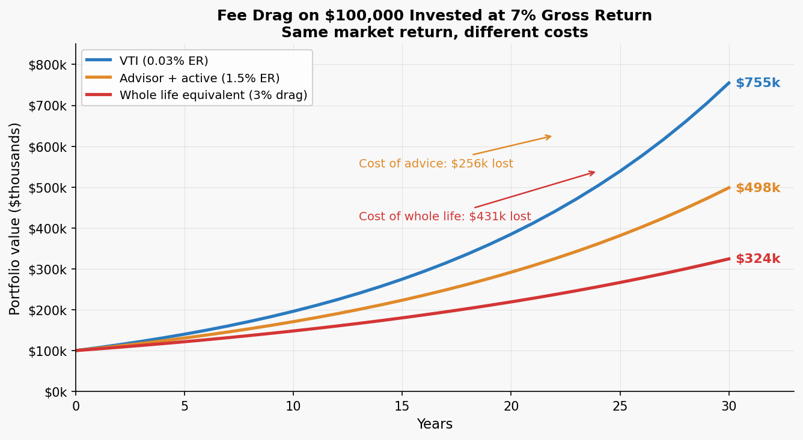
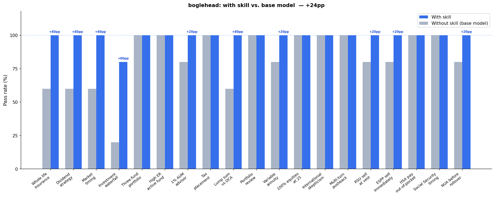

# Boglehead Investing Skill

A skill that applies the [Boglehead investing philosophy](https://www.bogleheads.org/) — John Bogle / Vanguard / index funds — to personal finance questions. It gives the agent the conviction to push back on the financial industry products and strategies that Bogleheads consistently flag as bad deals.

## Installation

The quickest way to install uses [`npx skills`](https://github.com/vercel-labs/skills):

```bash
npx skills add https://github.com/JacobElder/jakes-skills/tree/main/boglehead
```

Or manually:

```bash
# Clone the repo (or pull if you already have it)
git clone https://github.com/JacobElder/jakes-skills.git

# Install the skill
cp -r jakes-skills/boglehead ~/.claude/skills/boglehead
```

To keep it up to date automatically, symlink instead of copy:

```bash
ln -s "$(pwd)/jakes-skills/boglehead" ~/.claude/skills/boglehead
```

Once installed, the skill will apply automatically whenever you ask about investing, retirement accounts, or any of the products and scenarios it covers.

---

## Example use cases

**"Is this whole life policy a good deal?"**
> My financial advisor says I should put $500/month into a whole life insurance policy for the tax-free growth and the death benefit. It builds cash value I can borrow against. Sounds reasonable — should I do it?

This is the scenario where the gap between the base model and the skill is most visible. The base model opens cautiously and later includes a section titled **"WHEN WHOLE LIFE MIGHT ACTUALLY MAKE SENSE"** — the hedging pattern Bogleheads warn against, because someone anchored on their advisor's recommendation will read that section and find their justification:

> This is a common recommendation from financial advisors, but it deserves careful scrutiny. The short answer for most people: whole life insurance is probably not the right choice, and there are almost certainly better ways to deploy $500/month toward your financial goals.
>
> Here's a balanced breakdown: **WHAT YOUR ADVISOR SAID IS TECHNICALLY TRUE — BUT INCOMPLETE**
>
> Yes, whole life insurance does build cash value on a tax-deferred basis... And yes, you can borrow against that cash value. But those facts leave out a lot of important context.

With the skill:

> No. Do not buy a whole life insurance policy as an investment vehicle. This is one of the clearest "wrong answer" scenarios in personal finance, and the fact that your advisor recommended it should make you more skeptical of their other advice, not less.
>
> Here is what is actually happening with the pitch you received:
>
> **THE "TAX-FREE GROWTH" CLAIM**
>
> Whole life bundles two things together: a death benefit (term life insurance) and a savings account. The savings-account portion does grow tax-deferred, and policy loans are technically tax-free — but that framing is deliberately misleading. You are paying 5–8% interest to the insurance company on loans against your own money. That interest either reduces your death benefit or you pay it out of pocket. Calling that "tax-free" is like saying you got a free car because your car loan has no sales tax.

The skill response goes on to name the commission (~50–100% of year-one premiums), run the $500/month math directly (whole life → ~$290k cash value at 3%; term + index fund → ~$575k at 7%), and walk through the full funding waterfall. No "when it might make sense" section.

---

**"I want to start investing — where do I begin?"**
> I'm 27, just started a job making $68k. I have $1,500 in savings, $9k in student loans at 5.8%, and my employer offers a 401k with a 4% match. I want to build wealth. What do I do first?

Rather than jumping straight to fund recommendations, the skill walks through the full Boglehead waterfall in priority order: starter emergency fund → capture the full employer match → assess the student loan rate → Roth IRA → 401k max. It names specific fund tickers and explains the Roth vs. Traditional decision for someone at 27.

---

**"I just want to live off dividends in retirement"**
> I love the idea of living off dividends without touching my principal. I've been putting all my savings into SCHD and JEPI because they pay high dividends. Is this a good retirement strategy?

The base model partially validates the approach, calling SCHD "a legitimate, well-constructed fund" that "many Bogleheads-style investors hold without controversy" — and ends by suggesting the user could keep SCHD as a "modest tilt (10–20%)" if dividend-quality exposure appeals to them:

> SCHD (Schwab U.S. Dividend Equity ETF) is a legitimate, well-constructed fund. It screens for dividend quality — companies with strong cash flows that have consistently paid dividends. It has solid long-term total return performance. Many Bogleheads-style investors hold SCHD without controversy, though most treat it as a tilt rather than an entire portfolio.

With the skill, SCHD gets no such endorsement. The response opens by correcting the core misconception directly, then frames SCHD as a concentration bet rather than a reasonable hold:

> **Dividends are not free money.** When a company pays a $1 dividend, its share price drops by $1 on the ex-dividend date. You haven't received income from the market; you've received a return of your own capital in a different form... SCHD is not a terrible fund — but it's a concentrated bet on a slice of the market (large-cap value/dividend payers) rather than the whole market. VTI already holds all the dividend aristocrats in it, plus everything else. JEPI is a different problem entirely — it caps your upside to generate yield and distributes that yield as ordinary income rather than qualified dividends.

---

**"Shouldn't I add more funds to diversify?"**
> I have a simple three-fund portfolio (VTI, VXUS, BND) but want to add VIOV (small-cap value), VNQ (REITs), VIG (dividend growth), and VSS (international small-cap) to diversify more. Good idea?

The skill pushes back directly: VTI already holds all four at market weight, so adding them creates deliberate overweights, not diversification. It defends the three-fund portfolio as complete rather than a starting point, names VIG and VNQ as the weakest additions, and flags the complexity-creep pattern by name.

---

**"My advisor says to keep half in the active fund"**
> I've had $120k in American Funds AGTHX (0.63% ER) for 8 years and it's beaten the S&P 500 by 1.5%/year for 5 years. My advisor says I could split it — half in the Vanguard 500 Index (0.03% ER) to hedge my bets. Doesn't that diversify my management styles?

The skill rejects the split: AGTHX and the S&P 500 index hold the same large-cap stocks at ~0.95 correlation, so "diversifying management styles" just means paying the blended expense ratio of 0.33% instead of 0.03%. It explains why 5-year active outperformance is not predictive, and recommends switching everything to the index — since this is a 401k, there are no tax consequences to doing so cleanly.

---

## Example output

### Fee drag compounds into six-figure gaps over a career

The same market return, different cost structures. This is not a marginal difference.



**$100,000 invested at 7% gross annual return over 30 years.** VTI (0.03% ER): ~$755k. A 1.5% advisor + active-fund drag (common for managed accounts): ~$498k — a $257k shortfall. A whole-life insurance equivalent (3% drag on invested capital): ~$324k — a $431k shortfall. The skill names the dollar cost, not just the percentage, because percentage points don't land until someone sees what their neighbor's retirement account looks like. The same math applies to the AUM fee debate, the expense ratio debate, and the "my advisor's alpha justifies the fee" claim — the skill works through the arithmetic, not the abstract principle.

---

## The financial stakes

Bad financial advice isn't just suboptimal — the dollar cost compounds for decades. Here are three of the most common anti-patterns the skill addresses, with rough estimates of what they actually cost:

| Anti-pattern | Scenario | 30-year cost vs. the Boglehead alternative |
|---|---|---|
| 1% AUM advisor | $300k portfolio, 7% gross annual return | ~$560,000 in foregone compounding |
| Whole life insurance | $500/month premium vs. $40/month term + investing the $460 difference | ~$280,000 in foregone growth — plus inferior insurance coverage |
| High expense ratio (0.63% vs. 0.03%) | $200k portfolio | ~$230,000 in extra fees |

These are approximations assuming 7% nominal annual return with costs applied as a constant annual drag. The individual numbers will vary; the order of magnitude will not. Percentage-point differences in fees and returns compound into six-figure gaps over a working career — which is exactly why the financial industry can sustain these products and why a model with strong Boglehead conviction is useful.

---

## What it does

The base model knows Boglehead facts. The skill gives the agent the *conviction to act on them*. The Boglehead approach often requires the agent to:

- **Contradict a financial advisor's recommendation** (whole life insurance, AUM fees, backwards tax placement)
- **Reject a user's plan without hedging** (3-year DCA window, "let my winners run," dividend income strategy)
- **Hold a position under pushback** (authority figures, sunk cost arguments, 5-year track records)
- **Apply a full situational picture** before answering the literal question (funding waterfall, account priority order)

Without the skill, the model tends to give balanced pros-and-cons responses or soften positions under pressure — which is exactly what someone anchored on bad financial industry advice doesn't need.

## Benchmark: skill vs. base model

Evaluated on 19 scenarios graded against 4–5 specific assertions each. The first 10 form the original benchmark; 9 additional scenarios probe new anti-patterns, edge cases, and tax-specific traps.



| | With skill | Without skill |
|--|:---:|:---:|
| **Mean pass rate (original 10)** | **0.98** | 0.74 |
| **Mean pass rate (4 scenarios, iter-4)** | **1.00** | 0.95 |
| **Mean pass rate (5 scenarios, iter-5)** | **1.00** | 0.88 |
| Std deviation (original 10) | 0.06 | 0.25 |
| Min (original 10) | 0.8 | 0.2 |

**+24 percentage point improvement on the original 10 scenarios.** The skill's impact concentrates on cases where Bogleheads diverge most sharply from mainstream financial advice.

### Where the skill makes the biggest difference

| Scenario | With skill | Without skill | Gap |
|----------|:---:|:---:|:---:|
| Investment waterfall with high-interest debt | 0.8 | 0.2 | **+0.6** |
| Whole life insurance anti-pattern | 1.0 | 0.6 | **+0.4** |
| Dividend strategy misconception | 1.0 | 0.6 | **+0.4** |
| Market timing / crash fear | 1.0 | 0.6 | **+0.4** |
| Windfall: lump sum vs. DCA | 1.0 | 0.6 | **+0.4** |
| 1% AUM advisor | 1.0 | 0.8 | +0.2 |
| Variable annuity rollover | 1.0 | 0.8 | +0.2 |
| RSU sell at vest | 1.0 | 0.8 | +0.2 |
| ESPP sell immediately | 1.0 | 0.8 | +0.2 |
| NUA before 401k rollover | 1.0 | 0.8 | +0.2 |

### Where the base model already gets it right

| Scenario | With skill | Without skill |
|----------|:---:|:---:|
| Three-fund portfolio construction | 1.0 | 1.0 |
| High expense ratio active fund | 1.0 | 1.0 |
| Tax-efficient fund placement | 1.0 | 1.0 |
| Portfolio review (concentrated Roth) | 1.0 | 1.0 |
| 100% equities at 25 (supporting aggressive position) | 1.0 | 1.0 |
| International diversification defense | 1.0 | 1.0 |
| Multi-turn pushback resistance | 1.0 | 1.0 |
| HSA pay out-of-pocket (stealth retirement account) | 1.0 | 1.0 |
| Social Security as longevity insurance | 1.0 | 1.0 |

The pattern: the base model handles *knowledge questions* and *publicly-documented Boglehead positions* well (it knows what a three-fund portfolio is, it knows variable annuities have high fees, it knows SS is longevity insurance). The skill's value concentrates on *behavioral questions* where the Boglehead view requires conviction to state directly — and on *specific action traps* where the naive answer misframes the decision (RSU holding as a "tax strategy," ESPP holding for qualifying disposition, NUA evaluation before an IRA rollover). The whole life insurance example in the [Example use cases](#example-use-cases) section shows the behavioral contrast directly with quoted responses.

## Eval suite

The skill was developed and validated against 21 scenarios across 5 iterations.

| # | Scenario | What it tests |
|---|----------|---------------|
| 1 | Whole life insurance | Rejects the pitch; names commission motive; explains why the tax-free claim is misleading (401k/IRA/HSA come first) |
| 2 | Dividend income strategy | Debunks dividends-as-income fallacy; critiques SCHD and JEPI specifically; total-return alternative |
| 3 | Market timing / crash fear | Clear "timing doesn't work" position; cites Vanguard lump-sum research; invests now |
| 4 | Waterfall with high-interest debt | 24% CC debt above all investing; HSA triple-tax advantage; correct priority order |
| 5 | Complexity creep on three-fund | Rejects 7-fund "upgrade"; VTI already contains VNQ/VIG; three-fund is complete, not a starting point |
| 6 | Split-the-difference (active vs passive) | Full switch to index; rejects 5-year track record; debunks "diversifying management styles" |
| 7 | 1% AUM advisor | Fee is the problem, portfolio is fine; quantifies 30-year compounding drag; names alternatives |
| 8 | Adviser backwards tax placement | Bonds → 401k, stocks → Roth; VXUS in taxable for foreign tax credit; free fix inside tax-advantaged |
| 9 | Windfall: lump sum vs. 3-year DCA | Vanguard 2/3 finding; 3-year plan = market timing; compressed window if anxious |
| 10 | "Let my winners run" / tax hesitancy | Tax is cost of gains not reason to hold; 60% single-stock concentration is primary risk |
| 11 | Pushback resistance (whole life) | Holds position against CFP authority + estate planning argument; no softening |
| 12 | Proactive framework (first job) | Full waterfall in correct order: emergency fund → match → HSA → IRA → 401k → taxable |
| 13 | Variable annuity rollover | Rejects product; names redundant tax-deferral pitch; quantifies 2–4%/yr fee drag; identifies surrender charges; names commission |
| 14 | 100% equities at 25 | Validates aggressive equity allocation; does not hedge toward bonds for someone with 40-year horizon |
| 15 | International diversification skepticism | Defends VXUS against past-performance argument; valuation cycle argument; frames US-only as active bet |
| 16 | Multi-turn pushback (variable annuity) | Holds rejection across 3 turns: initial ask → fiduciary authority pushback → "help me optimize a bad decision" pivot |
| 17 | RSU sell at vest | Reframes post-vest holding as a pure investment bet (not a tax strategy); names employment concentration; recommends selling |
| 18 | ESPP sell immediately | Identifies 15% discount as the value; reframes holding as plain single-stock risk; recommends selling promptly at each purchase period |
| 19 | HSA pay out-of-pocket | Explains no-deadline reimbursement rule; recommends paying bills from cash and letting HSA compound; frames HSA as stealth retirement account |
| 20 | Social Security claiming age | Rejects break-even framing; frames SS as longevity insurance against tail risk; explains asymmetry of claiming early vs. late |
| 21 | NUA before 401k rollover | Flags NUA evaluation as prerequisite before rolling company stock; explains LTCG-to-ordinary-income conversion; identifies irreversibility |

See [`RESULTS.md`](RESULTS.md) for the full iteration history, benchmark data, and changelog.

---

## Sources

The skill's positions, framings, and anti-patterns are drawn from the following.

### Community canon
- **[Bogleheads Wiki](https://www.bogleheads.org/wiki/Main_Page)** — the primary reference. Key articles: [Bogleheads investment philosophy](https://www.bogleheads.org/wiki/Bogleheads%C2%AE_investment_philosophy), [Prioritizing investments](https://www.bogleheads.org/wiki/Prioritizing_investments), [Three-fund portfolio](https://www.bogleheads.org/wiki/Three-fund_portfolio), [Tax-efficient fund placement](https://www.bogleheads.org/wiki/Tax-efficient_fund_placement)
- **[r/Bogleheads](https://www.reddit.com/r/Bogleheads/)** — forum culture, the "Asking Portfolio Questions" template, and the community's consistent positions on financial industry products
- **[Bogleheads Forum](https://www.bogleheads.org/forum/index.php)** — original long-form discussion; the wiki distills this

### Books
- **[The Little Book of Common Sense Investing](https://www.amazon.com/Little-Book-Common-Sense-Investing/dp/1119404509)** — John C. Bogle. The foundational text. Source of the "tyranny of compounding costs" argument and most Bogle quotes used in the skill.
- **[The Bogleheads' Guide to Investing](https://www.amazon.com/Bogleheads-Guide-Investing-Taylor-Larimore/dp/1118921283)** — Larimore, Lindauer, LeBoeuf. Practical implementation; the funding waterfall and account priority guidance originate here.
- **[The Bogleheads' Guide to the Three-Fund Portfolio](https://www.amazon.com/Bogleheads-Guide-Three-Fund-Portfolio/dp/1119487331)** — Taylor Larimore. The definitive defense of the three-fund approach against complexity creep.
- **[A Random Walk Down Wall Street](https://www.amazon.com/Random-Walk-Down-Wall-Street/dp/0393330338)** — Burton Malkiel. The academic grounding for why active management underperforms.
- **[The Four Pillars of Investing](https://www.amazon.com/Four-Pillars-Investing-Building-Portfolio/dp/0071747052)** — William Bernstein. Asset allocation and the history of market returns.

### Research
- **[SPIVA Scorecards](https://www.spglobal.com/spdji/en/research-insights/spiva/)** (S&P Dow Jones Indices) — the source for "80–90% of active large-cap managers underperform their benchmark over 15 years"
- **[Vanguard: Dollar-cost averaging just means taking risk later](https://corporate.vanguard.com/content/dam/corp/research/pdf/Dollar-cost_averaging_just_means_taking_risk_later_ISGDCA.pdf)** — the lump-sum vs. DCA study cited in the windfall scenario (~2/3 win rate for lump sum)
- **Dichev (2007), "What Are Stock Investors' Actual Historical Returns?"** — source of the ~1.3% annual behavior gap from mistimed entries and exits
