# Boglehead Investing Skill

A Claude skill that applies the [Boglehead investing philosophy](https://www.bogleheads.org/) — John Bogle / Vanguard / index funds — to personal finance questions. It gives Claude the conviction to push back on the financial industry products and strategies that Bogleheads consistently flag as bad deals.

## What it does

Base Claude knows Boglehead facts. The skill gives it the *conviction to act on them*. The Boglehead approach often requires Claude to:

- **Contradict a financial advisor's recommendation** (whole life insurance, AUM fees, backwards tax placement)
- **Reject a user's plan without hedging** (3-year DCA window, "let my winners run," dividend income strategy)
- **Hold a position under pushback** (authority figures, sunk cost arguments, 5-year track records)
- **Apply a full situational picture** before answering the literal question (funding waterfall, account priority order)

Without the skill, Claude tends to give balanced pros-and-cons responses or soften positions under pressure — which is exactly what someone anchored on bad financial industry advice doesn't need.

## Benchmark: skill vs. base Claude

Evaluated on 10 real investing scenarios. Each is graded against 4–5 specific assertions about whether Claude took the correct Boglehead position.

```mermaid
xychart-beta
    title "Pass Rate by Scenario"
    x-axis ["Whole life", "Dividend strat", "Mkt timing", "Waterfall", "Three-fund", "High ER fund", "1% AUM", "Tax placement", "Lump sum", "Portfolio review"]
    y-axis "Pass rate" 0 --> 1
    bar [1.0, 1.0, 1.0, 0.8, 1.0, 1.0, 1.0, 1.0, 1.0, 1.0]
    bar [0.6, 0.6, 0.6, 0.2, 1.0, 1.0, 0.8, 1.0, 0.6, 1.0]
```

| | With skill | Without skill |
|--|:---:|:---:|
| **Mean pass rate** | **0.98** | 0.74 |
| Std deviation | 0.06 | 0.25 |
| Min | 0.8 | 0.2 |

**+24 percentage point improvement overall.** The skill's impact concentrates on the cases where Bogleheads diverge most sharply from mainstream financial advice.

### Where the skill makes the biggest difference

| Scenario | With skill | Without skill | Gap |
|----------|:---:|:---:|:---:|
| Investment waterfall with high-interest debt | 0.8 | 0.2 | **+0.6** |
| Whole life insurance anti-pattern | 1.0 | 0.6 | **+0.4** |
| Dividend strategy misconception | 1.0 | 0.6 | **+0.4** |
| Market timing / crash fear | 1.0 | 0.6 | **+0.4** |
| Windfall: lump sum vs. DCA | 1.0 | 0.6 | **+0.4** |
| 1% AUM advisor | 1.0 | 0.8 | +0.2 |

### Where base Claude already gets it right

| Scenario | With skill | Without skill |
|----------|:---:|:---:|
| Three-fund portfolio construction | 1.0 | 1.0 |
| High expense ratio active fund | 1.0 | 1.0 |
| Tax-efficient fund placement | 1.0 | 1.0 |
| Portfolio review (concentrated Roth) | 1.0 | 1.0 |

The pattern: base Claude handles *knowledge questions* well (it knows what a three-fund portfolio is), but struggles on *behavioral questions* — the cases where the Boglehead view is directionally strong and the financial industry incentives point the other way.

## Eval suite

The skill was developed and validated against 12 scenarios across 3 iterations. The final skill passes all 12 at 100%.

| # | Scenario | What it tests |
|---|----------|---------------|
| 1 | Whole life insurance | Rejects the pitch; names commission motive; explains why the tax-free claim is misleading (401k/IRA/HSA come first) |
| 2 | Dividend income strategy | Debunks dividends-as-income fallacy; critiques SCHD and JEPI specifically; total-return alternative |
| 3 | Market timing / crash fear | Clear "timing doesn't work" position; cites Vanguard lump-sum research; invests now |
| 4 | Waterfall with high-interest debt | 24% CC debt above all investing; HSA triple-tax advantage; correct priority order |
| 5 | Complexity creep on three-fund | Rejects 7-fund "upgrade"; VTI already contains VNQ/VIG; three-fund is complete, not a starting point |
| 6 | Split-the-difference (active vs passive) | Full switch to index; rejects 5-year track record; debunks "diversifying management styles" |
| 7 | 1% AUM advisor | Fee is the problem, portfolio is fine; quantifies 30-year compounding drag; names alternatives |
| 8 | Adviser backwards tax placement | Bonds → 401k, stocks → Roth; VXUS in taxable for foreign tax credit; free fix inside tax-advantaged |
| 9 | Windfall: lump sum vs. 3-year DCA | Vanguard 2/3 finding; 3-year plan = market timing; compressed window if anxious |
| 10 | "Let my winners run" / tax hesitancy | Tax is cost of gains not reason to hold; 60% single-stock concentration is primary risk |
| 11 | Pushback resistance (whole life) | Holds position against CFP authority + estate planning argument; no softening |
| 12 | Proactive framework (first job) | Full waterfall in correct order: emergency fund → match → HSA → IRA → 401k → taxable |

See [`RESULTS.md`](RESULTS.md) for the full iteration history, benchmark data, and changelog.
