# Causal Inference Skill

A Claude skill that applies Pearl's framework for causal reasoning — the Ladder of Causation, DAGs, identification strategies, and the structural distinction between good and bad controls — to data analysis and experiment design questions.

## What it does

Base Claude knows causal inference concepts. The skill gives it the *precision to apply them correctly under pressure*. The hard cases in causal inference require Claude to:

- **Reject a seemingly-valid natural experiment** (sequential user IDs aren't truly random; the identification assumption must be verified, not assumed)
- **State that bias direction is unknown** rather than guessing it's upward (a violated exclusion restriction can bias an IV estimate in any direction — more data doesn't fix it)
- **Name the right condition that's violated** in a front-door setup (complete mediation, not just the back-door block)
- **Recommend the right alternative estimand** when the question and the data don't match (LATE vs ATE in forced rollouts; cluster randomization for network features)

Without the skill, Claude tends to agree with the plausible-sounding parts of an argument, characterize violations with confident-but-wrong directionality, or miss the condition that's most commonly overlooked. These aren't subtle — they lead directly to wrong decisions.

## Benchmark: skill vs. base Claude

Evaluated on 7 causal inference scenarios covering common applied pitfalls. Each scenario is graded on 4–5 specific assertions about whether Claude reached the correct causal conclusion.

```mermaid
xychart-beta horizontal
    title "Pass Rate by Scenario (■ with skill  □ base Claude)"
    x-axis ["Rung identification", "DiD staggered rollout", "Front-door criterion", "LATE vs ATE rollout", "RDD manipulation", "IV exclusion violation", "Interference / SUTVA"]
    y-axis "Pass rate" 0 --> 1
    bar [1.0, 1.0, 1.0, 1.0, 1.0, 1.0, 1.0]
    bar [0.8, 1.0, 1.0, 1.0, 1.0, 0.75, 1.0]
```

| | With skill | Without skill |
|--|:---:|:---:|
| **Mean pass rate** | **1.00** | 0.94 |
| Assertions passed | 30 / 30 | 28 / 30 |

**+6 percentage points overall.** The skill's impact concentrates on the two cases where a specific piece of domain knowledge is easy to miss — not on the structural mechanics that base Claude handles reliably.

### Where the skill makes the biggest difference

| Scenario | With skill | Without skill | Gap | What base Claude misses |
|----------|:---:|:---:|:---:|---|
| IV exclusion restriction violation | 1.00 | 0.75 | **+25pp** | Bias direction is *unknown*, not just upward — a direct Z→Y effect can go either way; more data doesn't fix it |
| Rung identification (sequential user IDs) | 1.00 | 0.80 | **+20pp** | Arbitrary-looking assignment ≠ independent assignment; the +4.2% estimate requires an explicit balance test before it's defensible |

### Where base Claude already gets it right

| Scenario | With skill | Without skill | What it correctly handles |
|----------|:---:|:---:|---|
| DiD staggered rollout (TWFE bias) | 1.00 | 1.00 | Goodman-Bacon decomposition; names Callaway-Sant'Anna / Sun-Abraham |
| Front-door identification | 1.00 | 1.00 | Two-stage estimator; complete-mediation condition; flags ambition confound |
| LATE vs ATE in forced rollout | 1.00 | 1.00 | Distinguishes compliers from never-takers; recommends forced-adoption experiment |
| RDD threshold manipulation | 1.00 | 1.00 | Flags density spike as sorting; rejects "internal-only" defense; recommends McCrary test |
| Interference / SUTVA | 1.00 | 1.00 | Names SUTVA violation; explains control-group contamination; recommends cluster randomization |

The pattern: base Claude handles the *structural mechanics* of causal methods reliably (it knows what the Goodman-Bacon decomposition is, it knows what SUTVA means). It struggles on *identification edge cases* — the specific condition that's most commonly overlooked, or the correct characterization of what happens when an assumption fails.

## Eval suite

The skill was developed and validated across 5 iterations against 7 scenarios.

| # | Scenario | What it tests |
|---|----------|---------------|
| 1 | Sequential user ID A/B bug | Rejects "essentially random" claim; explains cohort confounding from sequential assignment; recommends pre-treatment covariate balance test; names what valid identification would actually require |
| 2 | TWFE with staggered rollout | Confirms reviewer's concern; explains forbidden comparisons; names Goodman-Bacon decomposition; recommends heterogeneity-robust estimator |
| 3 | Front-door with unmeasured confounder | Recognizes front-door identification opportunity; describes two-stage estimator; flags complete-mediation condition (no direct X→Y path); warns about halo-effect violation |
| 4 | LATE vs ATE in opt-in / forced rollout | Identifies $32 as LATE not ATE; explains why never-takers are the target population for forced rollout; refuses to confirm $32 as planning figure; recommends forced-adoption experiment |
| 5 | RDD with density spike above threshold | Names spike as evidence of score manipulation; explains why internal-threshold knowledge enables CSM sorting; recommends McCrary density test and covariate balance checks |
| 6 | IV exclusion restriction (distance to gym) | Confirms exclusion restriction violated via multiple SES pathways; states bias direction is unknown (not just upward); provides formal plim bias expression; recommends never-taker falsification test |
| 7 | Interference in user-level A/B test | Confirms SUTVA violation; explains control-group contamination via treated friends; explains why +15% doesn't extrapolate to full launch; recommends cluster randomization |

See [`causal-inference-workspace/`](../causal-inference-workspace/) for the full iteration history, benchmark data, and graded transcripts.
