# Causal Inference Skill

A skill that applies Pearl's framework for causal reasoning — the Ladder of Causation, DAGs, identification strategies, and the structural distinction between good and bad controls — to data analysis and experiment design questions.

## Installation

```bash
npx skills add https://github.com/JacobElder/jakes-skills/tree/main/causal-inference
```

Or manually:

```bash
cp -r jakes-skills/causal-inference ~/.claude/skills/causal-inference
```

Once installed, the skill will apply automatically whenever you ask about causal questions, experiment validity, or whether a data analysis supports a cause-and-effect conclusion.

---

## Example use cases

**"Can we trust our A/B test result?"**
> Our A/B framework had a bug — it assigned users to groups based on the last digit of their user ID. Digits 0–4 got the new checkout, 5–9 got the old one. We're seeing +4.2% conversion. Our analyst says user IDs are arbitrary so this is basically random. Can we use it?

The skill rejects the "arbitrary = random" claim, explains that sequential ID assignment creates a cohort split (newer vs. older users differ on account age, acquisition channel, trust), and refuses to call +4.2% a causal estimate without a balance check on pre-treatment covariates. It names what valid quasi-experimental identification would actually require.

---

**"Which features should we intervene on to reduce churn?"**
> Our churn model gets 92% AUC. Top features are account_age, last_login_days, support_tickets, and pricing_tier. Which of these should we target in our retention campaigns?

The skill distinguishes prediction from causation, identifies `last_login_days` as a downstream symptom (customers stop logging in *because* they're already disengaging — it's a consequence, not a cause), and formally contrasts P(churn | low logins) with P(churn | do(low logins)). It recommends building a causal DAG before deciding what to intervene on, and flags `pricing_tier` as the most promising upstream lever.

---

**"Is my IV valid?"**
> I'm using distance to the nearest gym as an instrument for gym membership to estimate the effect of exercise on health outcomes. My colleague says the exclusion restriction is violated. Are they right?

The skill confirms the exclusion restriction is almost certainly violated — distance to gym correlates with health through neighborhood wealth, food access, air quality, and residential self-selection, all independent of whether someone joins a gym. Crucially, it states that the bias direction is *unknown*, not just upward: the direct distance→health effect could go either way, so the IV estimate may be wrong in sign, not just magnitude. It recommends a never-taker falsification test.

---

**"Should I trust my DiD estimate?"**
> We rolled out a customer success program to different regions at different times over 18 months. A reviewer says our two-way fixed effects regression may be biased. Is that right?

The skill confirms the concern: TWFE with staggered adoption and heterogeneous treatment effects is biased even when parallel trends holds, because already-treated units serve as controls for later-treated ones ("forbidden comparisons"). It names the Goodman-Bacon decomposition and recommends switching to Callaway-Sant'Anna or Sun-Abraham.

---

## What it does

The base model knows causal inference concepts. The skill gives the agent the *precision to apply them correctly under pressure*. The hard cases in causal inference require the agent to:

- **Reject a seemingly-valid natural experiment** (sequential user IDs aren't truly random; the identification assumption must be verified, not assumed)
- **State that bias direction is unknown** rather than guessing it's upward (a violated exclusion restriction can bias an IV estimate in any direction — more data doesn't fix it)
- **Name the right condition that's violated** in a front-door setup (complete mediation, not just the back-door block)
- **Recommend the right alternative estimand** when the question and the data don't match (LATE vs ATE in forced rollouts; cluster randomization for network features)
- **Apply the do-operator formally** to distinguish observation from intervention (P(churn | low logins) vs P(churn | do(low logins)))
- **Refuse to endorse a near-IV as a confounder control** (conditioning amplifies bias when unmeasured confounding is present)

Without the skill, the model tends to agree with the plausible-sounding parts of an argument, characterize violations with confident-but-wrong directionality, or miss the condition that's most commonly overlooked. These aren't subtle — they lead directly to wrong decisions.

## Benchmark: skill vs. base model

Evaluated on 13 causal inference scenarios covering common applied pitfalls. Each scenario is graded on 4–5 specific assertions about whether the model reached the correct causal conclusion.

```mermaid
xychart-beta horizontal
    title "Pass Rate by Scenario (■ with skill  □ base model)"
    x-axis ["IV exclusion violation", "Simpson's paradox", "Table 2 fallacy", "Near-IV bias amplification", "Predictive vs causal", "Selection bias", "Rung identification", "DiD staggered rollout", "Front-door criterion", "LATE vs ATE rollout", "RDD manipulation", "Mediator overcontrol", "Interference / SUTVA"]
    y-axis "Pass rate" 0 --> 1
    bar [1.0, 1.0, 1.0, 1.0, 1.0, 1.0, 1.0, 1.0, 1.0, 1.0, 1.0, 1.0, 1.0]
    bar [0.5, 0.5, 0.5, 0.75, 0.75, 0.75, 0.8, 1.0, 1.0, 1.0, 1.0, 1.0, 1.0]
```



| | With skill | Without skill |
|--|:---:|:---:|
| **Mean pass rate** | **1.00** | 0.81 |
| Assertions passed | 54 / 54 | 44 / 54 |

**+19 percentage points overall.** The skill's impact concentrates on the cases where a specific piece of domain knowledge is easy to miss — not on the structural mechanics that the base model handles reliably.

### Where the skill makes the biggest difference

| Scenario | With skill | Without skill | Gap | What the base model misses |
|----------|:---:|:---:|:---:|---|
| IV exclusion restriction violation | 1.00 | 0.50 | **+50pp** | Bias direction is *unknown*, not just upward — a direct Z→Y effect can go either way; more data doesn't fix it |
| Simpson's paradox | 1.00 | 0.50 | **+50pp** | Whether to disaggregate depends on whether the split variable is a confounder or a mediator — the aggregate result can be the correct one |
| Table 2 Fallacy | 1.00 | 0.50 | **+50pp** | Only the focal coefficient in a regression is causally identified; control coefficients describe model fit, not causal effects of those variables |
| Near-IV bias amplification | 1.00 | 0.75 | **+25pp** | Conditioning on a near-instrument in the presence of unmeasured confounders amplifies bias rather than reducing it |
| Predictive vs causal features | 1.00 | 0.75 | **+25pp** | Feature importance doesn't tell you what to intervene on; last_login_days is a downstream symptom, not a lever — P(churn \| low logins) ≠ P(churn \| do(low logins)) |
| Selection bias / power users | 1.00 | 0.75 | **+25pp** | Filtering to 90-day active users before measuring onboarding effects conditions on a collider, making the analysis uninterpretable |
| Rung identification (sequential user IDs) | 1.00 | 0.80 | **+20pp** | Arbitrary-looking assignment ≠ independent assignment; the +4.2% estimate requires an explicit balance test before it's defensible |

### Where the base model already gets it right

| Scenario | With skill | Without skill | What it correctly handles |
|----------|:---:|:---:|---|
| DiD staggered rollout (TWFE bias) | 1.00 | 1.00 | Goodman-Bacon decomposition; names Callaway-Sant'Anna / Sun-Abraham |
| Front-door identification | 1.00 | 1.00 | Two-stage estimator; complete-mediation condition; flags ambition confound |
| LATE vs ATE in forced rollout | 1.00 | 1.00 | Distinguishes compliers from never-takers; recommends forced-adoption experiment |
| RDD threshold manipulation | 1.00 | 1.00 | Flags density spike as sorting; rejects "internal-only" defense; recommends McCrary test |
| Mediator overcontrol | 1.00 | 1.00 | Post-treatment variable is a mediator; controlling blocks the mechanism; total vs. direct effect distinction |
| Interference / SUTVA | 1.00 | 1.00 | Names SUTVA violation; explains control-group contamination; recommends cluster randomization |

The pattern: the base model handles the *structural mechanics* of causal methods reliably (it knows what the Goodman-Bacon decomposition is, it knows what SUTVA means, it knows what a mediator is). It struggles on *identification edge cases* — the specific condition that's most commonly overlooked, or the correct characterization of what happens when an assumption fails.

## Eval suite

The skill was developed and validated across 6 iterations against 13 scenarios.

| # | Scenario | What it tests |
|---|----------|---------------|
| 1 | Sequential user ID A/B bug | Rejects "essentially random" claim; explains cohort confounding from sequential assignment; recommends pre-treatment covariate balance test; names what valid identification would actually require |
| 2 | Selection bias / power users | Identifies filtering to 90-day actives as collider conditioning; explains why the onboarding correlation is uninterpretable within that group; recommends measuring onboarding at the full cohort level |
| 3 | Near-IV bias amplification | Identifies prior performance as a near-instrument; warns that controlling for it with unmeasured confounders present amplifies bias; refuses to unconditionally endorse "control for things that predict both" |
| 4 | Table 2 Fallacy | Explains only the focal coefficient is causally identified; country coefficient describes model fit, not causal effect of country; recommends separate analysis if country effect is the question |
| 5 | TWFE with staggered rollout | Confirms reviewer's concern; explains forbidden comparisons; names Goodman-Bacon decomposition; recommends heterogeneity-robust estimator |
| 6 | Mediator overcontrol | Identifies motivation as a post-treatment mediator; warns controlling for it yields direct effect not total effect; distinguishes estimands; rejects unconditional inclusion |
| 7 | Front-door with unmeasured confounder | Recognizes front-door identification opportunity; describes two-stage estimator; flags complete-mediation condition (no direct X→Y path); warns about halo-effect violation |
| 8 | Simpson's paradox | Identifies "Continue on App" feature as redirecting users between platforms (mediator, not confounder); explains aggregate result is the correct estimate; rejects analyst's recommendation to kill the feature |
| 9 | LATE vs ATE in opt-in / forced rollout | Identifies $32 as LATE not ATE; explains why never-takers are the target population for forced rollout; refuses to confirm $32 as planning figure; recommends forced-adoption experiment |
| 10 | Predictive features vs causal levers | Refuses to use feature importance as intervention guide; identifies last_login_days as downstream symptom; applies do-operator to show P(churn \| observe) ≠ P(churn \| intervene); recommends causal DAG |
| 11 | RDD with density spike above threshold | Names spike as evidence of score manipulation; explains why internal-threshold knowledge enables CSM sorting; recommends McCrary density test and covariate balance checks |
| 12 | IV exclusion restriction (distance to gym) | Confirms exclusion restriction violated via multiple SES pathways; states bias direction is unknown (not just upward); provides formal plim bias expression; recommends never-taker falsification test |
| 13 | Interference in user-level A/B test | Confirms SUTVA violation; explains control-group contamination via treated friends; explains why +15% doesn't extrapolate to full launch; recommends cluster randomization |

See [`causal-inference-workspace/`](../causal-inference-workspace/) for the full iteration history, benchmark data, and graded transcripts.
