# comp-modeling — a skill for computational and cognitive modeling

[](https://github.com/JacobElder/jakes-skills/actions/workflows/test.yml)
[](https://www.python.org/)

A skill for fitting **generative process models** of behavior to trial-by-trial data — RL, prospect theory, drift diffusion, category learning, delay discounting, and Bayesian learning. Built around the methodological consensus of Daw (2011), Wilson & Collins (2019), Palminteri et al. (2017), and Lee & Wagenmakers (2014).

The skill has a point of view. Hierarchical Bayes is the default, not an advanced option. Parameter recovery is non-negotiable, not optional polish. Fitting a model without a baseline comparison is not a finding. The skill's job is to hold those positions when a user wants to skip them.

## Installation

```bash
npx skills add https://github.com/JacobElder/jakes-skills/tree/main/comp-modeling
```

Or manually:

```bash
git clone https://github.com/JacobElder/jakes-skills.git
cp -r jakes-skills/comp-modeling ~/.claude/skills/comp-modeling
```

To keep it up to date automatically, symlink instead of copy:

```bash
ln -s "$(pwd)/jakes-skills/comp-modeling" ~/.claude/skills/comp-modeling
```

Once installed, the skill fires when you ask about fitting cognitive models, estimating learning rates, running hBayesDM/HDDM/Stan, or anything involving trial-level behavioral data and process models.

---

## Example use cases

### "I fit the model and the learning rate looks reasonable."

**Prompt:** *"I fit a 3-parameter RL model to 60 subjects and the group-mean learning rate is 0.34 (SE 0.04). Is that publishable?"*

The base model reads the question charitably and responds to what was asked:

> That looks like a reasonable learning rate estimate. The SE of 0.04 gives you a 95% CI of roughly 0.26–0.42, which suggests the estimate is well-identified. Whether it's publishable depends on your journal standards and how it connects to the theoretical narrative.

With the skill, the estimate is treated as a claim that needs validation rather than a number that needs narrative context:

> Not yet — there are four things you need before that number means anything.
>
> **Parameter recovery.** A learning rate with an SE is not a measured quantity; it's an estimate. The question is whether your design can actually recover α to the precision implied by that SE. Run the simulation loop: sample 100 (α, β) pairs, simulate 60 subjects at your trial count, fit them back, compute Spearman ρ between true and recovered. ρ > 0.7 is the minimum for individual estimates; ρ < 0.4 means the number you're reporting is noise, regardless of its SE.
>
> **Model comparison.** Did you compare to a simpler baseline — win-stay-lose-shift, RW without the third parameter, a perseveration model? "The best of one model" is not a comparison result. Use PSIS-LOO and report the ELPD difference with its SE.
>
> **Model recovery.** Even if your model wins LOO, can your design distinguish it from the competitors on simulated data? Build the confusion matrix. A model can win on real data for the same reason it's confused in simulation.
>
> **Posterior predictive checks.** Simulate behavior from the fitted model and compare to actual data on learning curves, win-stay/lose-shift rates, choice autocorrelation. A tight SE on a parameter that doesn't reproduce the phenomenon is a story about your likelihood, not your subjects.
>
> That's 1–2 more weeks. The review process will find all of this; better to find it now.

---

### "My learning rates are piling up at the boundary."

**Prompt:** *"When I fit Rescorla-Wagner with MLE, most subjects have α = 0.99 or 1.0. The inverse temperature is all over the place. LOO looks okay though."*

The base model often frames boundary estimates as theoretically meaningful:

> Learning rates close to 1 suggest subjects are heavily weighting the most recent outcome. This could reflect a high-uncertainty environment or limited working memory capacity. The variable inverse temperatures might indicate individual differences in response stochasticity.

With the skill, the boundary pileup triggers a named diagnosis:

> This is the α/β identification problem, not a subject characteristic.
>
> Three things are happening together: (1) With your trial count, the likelihood surface is flat near α = 1 — any α in (0.7, 1.0) fits about equally well, and the optimizer slides to the boundary. (2) When α ≈ 1, choice probability is dominated by the last outcome, so β can be anything — the parameters are completely non-identifiable in this regime. Your β estimates when α ≈ 1 are noise. (3) If subjects have a perseveration bias (common in bandit data), an RL model without a perseveration term inflates α to absorb the stay-tendency, pushing estimates further toward 1.
>
> LOO looking okay doesn't rescue this — a model can have competitive LOO with non-identified parameters. The fit is telling you the model predicts behavior at roughly the right frequency; it says nothing about whether α = 0.99 is the right value.
>
> Switch to MAP with a Beta(2,2) prior on α (same compute as MLE, dramatically more stable). Better: `hBayesDM::bandit2arm_delta` where hierarchical shrinkage keeps individual estimates off the boundary. Then test a perseveration-augmented variant and see if α drops to a more interpretable range (~0.1–0.4).

---

### "λ should be in here somewhere."

**Prompt:** *"I want to estimate loss aversion from a gain-only task — subjects choose between sure $5 and a 50/50 gamble for $10 or $0. Can I just put λ in the utility function?"*

The base model will often write the model and provide code:

> You can include λ in the utility function. For each trial, `U_gamble = 0.5 * 10^α`. Since outcomes are gains, set `U_sure = 5^α`, and the acceptance probability follows a softmax. Here's the implementation...

With the skill, the non-identifiability is flagged before any code appears:

> No — λ is not identifiable from this task, and putting it in the model will give you a number that has nothing to do with loss aversion.
>
> λ is the ratio of the slope around the reference point on the loss side to the slope on the gain side. For it to be estimable from choices, subjects need to face outcomes that straddle the reference point — some gains and some losses. When every outcome is a gain, the loss term in the utility function (`-λ · (-x)^β`) is never evaluated. The model can absorb any λ by rescaling α or the choice sensitivity, and your optimizer will return whichever value it started near.
>
> The $0 outcome doesn't save you — $0 is not a loss unless the reference point is positive (e.g., an expected endowment), which this task doesn't establish.
>
> To estimate λ, you need mixed gambles: choices where one branch is a gain and one is a loss. The Sokol-Hessner paradigm — 50/50 between +G and −L with the gain/loss magnitudes varying across trials — is the standard for isolating λ cleanly. Either redesign the task or fix λ to a literature value (Tversky-Kahneman median is 2.25, but individual variation is large).

---

## Benchmark: skill vs. base model

Evaluated against 39 prompts across three categories. Scores are from analytical rubric review — checking that each eval's `rubric_keywords` and `rubric_must_have_all` criteria are addressable from `SKILL.md` + the relevant reference file.

```mermaid
xychart-beta horizontal
    title "Pass rate by eval category (■ with skill  □ est. base model)"
    x-axis ["Triggering (10)", "Routing (12)", "Content (17)"]
    y-axis "Pass rate" 0 --> 1
    bar [0.90, 0.92, 0.88]
    bar [0.80, 0.58, 0.47]
```



| | With skill | Est. base model | Gap |
|--|:---:|:---:|:---:|
| **Triggering (10 evals)** | **9/10 (90%)** | ~8/10 (80%) | +10pp |
| **Routing (12 evals)** | **11/12 (92%)** | ~7/12 (58%) | +33pp |
| **Content (17 evals)** | **15/17 (88%)** | ~8/17 (47%) | +41pp |
| **Overall (39)** | **35/39 (90%)** | ~23/39 (59%) | **+31pp** |

The skill's impact concentrates on content evals — the cases where the correct response requires pushing back on a premature interpretation or naming a specific identification issue before providing code.

### Where the skill makes the biggest difference

| Eval | What the skill adds |
|------|---------------------|
| C1 fit-and-report trap | Refuses to validate α=0.34 without recovery, comparison, PPC |
| C2 α/β boundary | Names three mechanisms; immediate MAP/HB recommendation |
| C3 λ from gain-only | Flags non-identifiability before writing any code |
| C7 "just fit it" | Simulation + recovery + baseline before calling any fit valid |
| C8 best WAIC=50 | SE + PPC + model recovery required before endorsing winner |
| R6 volatile block | Notes that fixed-α RW *cannot* capture the block effect by design |
| R9 Stan divergent | Non-centered parameterization first, not "run more iterations" |

### Where the base model already gets it right

| Eval | Why |
|------|-----|
| T6 churn ML negative control | XGBoost is clearly not cognitive modeling |
| T7 t-test negative control | Descriptive stats don't get process-model treatment |
| T8 CFA negative control | SEM is a well-known distinct family |
| C4 HDDM RT units | ms-vs-seconds is documented in every HDDM tutorial |
| C13 drift by condition | "One drift per condition" is standard HDDM practice |

---

## Eval suite

39 evals across three categories.

### Triggering (10)

| # | Prompt type | Expected behavior |
|---|-------------|-------------------|
| T1 | RW reversal (direct model name) | Fires; RL + recovery refs |
| T2 | "Get a learning rate" (casual) | Fires; casual phrasing explicitly covered in description |
| T3 | hBayesDM debug | Fires; prospect_theory.md + hierarchical_stan.md |
| T4 | HDDM drift output | Fires; drift_diffusion.md; engages with numbers |
| T5 | ΔWAIC reliability | Fires; asks for SE before passing judgment |
| T6 | Churn prediction (negative) | Does NOT fire |
| T7 | Group t-test (negative) | Does NOT fire |
| T8 | CFA fit indices (negative) | Does NOT fire |
| T9 | Stroop RT (edge case) | Clarifies: DDM decomp or condition means? |
| T10 | Q-learning + model-based + hybrid | Fires; RL + model_comparison + recovery |

### Routing (12)

| # | Query | Primary reference |
|---|-------|-------------------|
| R1 | RW update math | reinforcement_learning.md |
| R2 | Loss aversion estimation | prospect_theory.md |
| R3 | Slow-error DDM pattern | drift_diffusion.md |
| R4 | GCM vs prototype stimuli | category_learning.md |
| R5 | Kirby MCQ scoring | delay_discounting.md |
| R6 | Volatile-block learning | bayesian_learning.md |
| R7 | Trustworthy parameter estimates | recovery.md |
| R8 | WAIC vs PSIS-LOO | model_comparison.md |
| R9 | Stan divergences | hierarchical_stan.md |
| R10 | RL-DDM with RTs | rl.md + drift_diffusion.md |
| R11 | DIVA vs GCM/ALCOVE/SUSTAIN | category_learning.md |
| R12 | Intractable-likelihood accumulator | hierarchical_stan.md (SBI section) |

### Content / workflow (17)

| # | The trap | What the skill catches |
|---|----------|------------------------|
| C1 | Reporting α=0.34 as if measured | Recovery + comparison + PPC required |
| C2 | α≈1, β noisy | Three-mechanism α/β diagnosis |
| C3 | λ from gain-only data | Non-identifiability before code |
| C4 | HDDM: a=1200, t=350 | RT-in-ms-vs-seconds |
| C5 | w as clinical correlate | Brown et al. 2020 test-retest warning |
| C6 | Everyone's α at group mean | Sigma/hyperprior shrinkage |
| C7 | "Write Stan and fit it" | Recovery + PPC + baseline insisted on |
| C8 | ΔWAIC=50, going with A | SE + PPC + model recovery |
| C9 | GCM c=2.3, w=(0.7,0.3) | c/w trade-off + MDS question |
| C10 | Per-block α as adaptation evidence | Descriptive vs normative distinction |
| C11 | MLE on 30 trials | Boundary estimates; MAP/HB |
| C12 | CPT looks great, no baseline | EU comparison required |
| C13 | One drift rate for 3 difficulties | Three drift rates; HDDM regression |
| C14 | "Best model for my data" | Clarifying questions first |
| C15 | Stan output Rhat=1.04 | Engages with actual diagnostic values |
| C16 | Discriminative reconstruction model | Routes to DIVA (Kurtz 2007) |
| C17 | Intractable-likelihood accumulator | Routes to sbi / BayesFlow |

---

## Structure

```
comp-modeling/
├── SKILL.md                          ← top-level skill (always loaded)
├── references/
│   ├── reinforcement_learning.md     ← RW, Q-learning, dual-α, two-step, PVL, hybrid MF/MB
│   ├── prospect_theory.md            ← OPT, CPT, weighting functions, Sokol-Hessner gambles
│   ├── drift_diffusion.md            ← DDM, LBA, race models, RL-DDM, HDDM patterns
│   ├── category_learning.md          ← GCM, ALCOVE, SUSTAIN, DIVA, COVIS, RULEX
│   ├── delay_discounting.md          ← exponential, hyperbolic, β-δ, constant-sensitivity, MCQ
│   ├── bayesian_learning.md          ← Kalman bandits, Behrens volatility, HGF, change-point
│   ├── recovery.md                   ← parameter and model recovery with code patterns
│   ├── model_comparison.md           ← AIC/BIC/WAIC/PSIS-LOO/Bayes factors
│   └── hierarchical_stan.md          ← Stan templates, non-centered param, SBI/BayesFlow
├── scripts/
│   ├── parameter_recovery.py         ← recovery loop: Spearman ρ, bias, RMSE, cross-param corr
│   ├── model_recovery.py             ← confusion + inversion matrices
│   └── posterior_predictive.py       ← PPC runner with bandit and DDM summary stats
└── evals/
    ├── eval_harness.py               ← 39 structured evals with rubric scoring
    ├── evals.md                      ← long-form rubric descriptions
    ├── golden_responses.md           ← ideal answers for 3 high-stakes prompts
    ├── triggering.json               ← trigger/negative-control evals
    ├── routing.json                  ← reference-routing evals
    ├── workflow.json                 ← pitfall + workflow evals
    └── results/                      ← per-run eval results (gitignored)
```

## Running the scripts

```bash
python scripts/parameter_recovery.py   # recovers α, β on 200-trial 70/30 bandit
python scripts/model_recovery.py       # RW vs dual-α confusion matrix
python scripts/posterior_predictive.py # PPC stats for a fitted bandit model
python evals/eval_harness.py           # loads + summarizes the eval set
```

The `model_recovery.py` self-test is intentionally underpowered — the dual-α model recovery diagonal is 0.40. The script demonstrates the exact problem it warns against: underpowered designs produce uninterpretable confusion matrices.

---

## Sources

### Foundational methods
- **Daw (2011).** Trial-by-trial data analysis using computational models. *Attention and Performance XXIII.*
- **Wilson & Collins (2019).** Ten simple rules for the computational modeling of behavioral data. *eLife*, 8:e49547.
- **Palminteri, Wyart & Koechlin (2017).** The importance of falsification. *Trends in Cognitive Sciences*, 21(6), 425–433.
- **Lee & Wagenmakers (2014).** *Bayesian Cognitive Modeling: A Practical Course.* Cambridge University Press.

### Reinforcement learning
- **Sutton & Barto (2018).** *Reinforcement Learning: An Introduction.* MIT Press.
- **Daw et al. (2011).** Model-based influences on humans' choices. *Neuron*, 69, 1204–1215.
- **Ahn, Haines & Zhang (2017).** hBayesDM. *Computational Psychiatry*, 1, 24–57.

### Risky choice
- **Kahneman & Tversky (1979).** Prospect theory. *Econometrica*, 47, 263–291.
- **Tversky & Kahneman (1992).** Cumulative prospect theory. *Journal of Risk and Uncertainty*, 5, 297–323.
- **Sokol-Hessner et al. (2009).** Thinking like a trader. *PNAS*, 106, 5035–5040.

### Drift diffusion
- **Ratcliff (1978).** A theory of memory retrieval. *Psychological Review*, 85, 59–108.
- **Wiecki, Sofer & Frank (2013).** HDDM. *Frontiers in Neuroinformatics*, 7:14.
- **Pedersen & Frank (2020).** RL-DDM. *Psychonomic Bulletin & Review*, 27, 659–678.

### Category learning
- **Nosofsky (1986).** GCM. *Journal of Experimental Psychology: General*, 115, 39–57.
- **Kruschke (1992).** ALCOVE. *Psychological Review*, 99, 22–44.
- **Love, Medin & Gureckis (2004).** SUSTAIN. *Psychological Review*, 111, 309–332.
- **Kurtz (2007).** DIVA. *Psychonomic Bulletin & Review*, 14, 560–576.
- **Davis, Love & Preston (2012).** SUSTAIN + neural data. *Neuron*, 75, 688–699.

### Delay discounting
- **Mazur (1987).** Hyperbolic discounting. *Quantitative Analyses of Behavior*, 5, 55–73.
- **Laibson (1997).** β-δ model. *Quarterly Journal of Economics*, 112, 443–478.
- **Kirby & Maraković (1996).** MCQ. *Journal of Experimental Psychology: General*, 125, 54–67.

### Bayesian learning
- **Daw et al. (2006).** Kalman bandit. *Nature*, 441, 876–879.
- **Behrens et al. (2007).** Volatility model. *Nature Neuroscience*, 10, 1214–1221.
- **Mathys et al. (2011).** HGF. *Frontiers in Human Neuroscience*, 5:39.
- **Nassar et al. (2010).** Change-point model. *Journal of Neuroscience*, 30, 12366–12378.

### Model comparison and estimation
- **Vehtari, Gelman & Gabry (2017).** PSIS-LOO and WAIC. *Statistics and Computing*, 27, 1413–1432.
- **Burnham & Anderson (2002).** *Model Selection and Multimodel Inference.* Springer.
- **Tejero-Cantero et al. (2020).** sbi toolkit. *Journal of Open Source Software*, 5(52), 2505.
