# comp-modeling — a skill for computational and cognitive modeling

[](https://github.com/JacobElder/jakes-skills/actions/workflows/test.yml)
[](https://www.python.org/)

A skill for fitting **generative process models** of behavior to trial-by-trial data — RL, prospect theory, drift diffusion, category learning, delay discounting, and Bayesian learning. Built around the methodological consensus of Daw (2011), Wilson & Collins (2019), Palminteri et al. (2017), and Lee & Wagenmakers (2014).

The skill has a point of view. Hierarchical Bayes is the default, not an advanced option. Parameter recovery is non-negotiable, not optional polish. Fitting a model without a baseline comparison is not a finding. The skill's job is to hold those positions when a user wants to skip them.

## Installation

```bash
npx skills add https://github.com/JacobElder/jakes-skills/tree/main/comp-modeling
```

Or manually:

```bash
git clone https://github.com/JacobElder/jakes-skills.git
cp -r jakes-skills/comp-modeling ~/.claude/skills/comp-modeling
```

To keep it up to date automatically, symlink instead of copy:

```bash
ln -s "$(pwd)/jakes-skills/comp-modeling" ~/.claude/skills/comp-modeling
```

Once installed, the skill fires when you ask about fitting cognitive models, estimating learning rates, running hBayesDM/HDDM/Stan, or anything involving trial-level behavioral data and process models.

---

## Example use cases

### "The parameters look great."

**Prompt:** *"I fit cumulative prospect theory to my gambles data and the parameters look great."*

The base model accepts this as a milestone and asks what to do next:

> Great! CPT parameter fitting is a solid checkpoint. What's your next step — do you want to validate the fit quality, visualize the results, incorporate this into the skill/eval pipeline, or something else?

With the skill, "the parameters look great" triggers a checklist before any celebration:

> Before you celebrate, let's check what you're actually seeing. The field consensus (Wilson & Collins 2019, Daw 2011) is that "parameters look great" alone is not sufficient evidence. Here's what you should triangulate:
>
> **What do you mean by "look great"?** Are you saying the parameters are in plausible ranges (e.g., risk aversion γ ∈ [0.5, 1.5], loss aversion λ ∈ [1.5, 3])? The fit beats a baseline or alternative model? Convergence diagnostics are clean?
>
> **More critically, have you done:**
> 1. **Parameter recovery?** Simulate data with known CPT parameters across the realistic range, refit, and check that recovered parameters correlate with the truth (Spearman ρ > ~0.7). This is the only way to know whether your parameters are even interpretable on this design.
> 2. **Model comparison?** Fit at least one alternative — e.g., expected utility (no probability distortion), a simpler value function, or a baseline like a simple logit on the gamble EV. Report the comparison with uncertainty (SE of the elpd difference).
> 3. **Posterior predictive checks?** Simulate behavior from your fitted model and compare to held-out behavioral summaries (choice curves by payoff, proportion of risky choices, etc.).
>
> If you've done all three, you have a real result. If not, you have parameters that fit the data, which is a much weaker claim.

---

### "Can I just put λ in the utility function?"

**Prompt:** *"I want to estimate loss aversion (λ) from a gain-only task with gambles like $10 vs sure $5."*

The base model acknowledges the problem but pivots to workarounds — assuming λ from the literature, combining datasets, or reframing outcomes:

> Loss aversion (λ) estimates the relative sensitivity to losses versus gains. The core problem: **a gain-only task doesn't directly identify λ** because λ only applies to the loss domain.
>
> Here are your options:
> **1. Assume λ from the literature (simplest)**
> Fix λ = 2.25 (Tversky & Kahneman's 1992 estimate) or another published value, then estimate other parameters...

With the skill, the non-identifiability is the first and only thing said:

> You've hit a fundamental **identification problem**: loss aversion (λ) cannot be estimated from a gain-only task.
>
> Loss aversion in prospect theory captures the asymmetry between losses and gains — it's literally the ratio of value sensitivity for losses vs gains: value for gains is v(x) = x^α; value for losses is v(x) = −λ|x|^α (where λ > 1 means losses loom larger). Without **both** gain and loss frames in your task, λ is unidentified. A gain-only design has no data to anchor the loss side of the asymmetry. You can fit it, but the parameter will be uninterpretable — it may just absorb noise or be poorly recovered.
>
> **What you *can* estimate from gain-only gambles:** risk aversion α (concavity of the value function), probability weighting γ (if modeling CPT), and inverse temperature β.
>
> **If you need loss aversion**, redesign the task to include loss gambles or mixed gambles. Then you can fit λ separately and get a meaningful comparison.

---

### "My learning rates are piling up at the boundary."

**Prompt:** *"I have a bunch of subjects whose fitted learning rate is essentially 1.0 (at the upper bound), and inverse temperature β is all over the place. The model fit is okay on LOO."*

The base model frames boundary estimates as theoretically meaningful and asks clarifying questions:

> This pattern suggests **parameter non-identifiability or compensation** — the learning rate and β are likely trading off to achieve similar fits, and the model can fit equally well with many different (η, β) combinations. Since LOO is reasonable, your model is generalizing, but individual parameters are unstable.
>
> A few diagnostics to check: Are η and β correlated across subjects? How many trials per subject? Are you fitting hierarchically or separately per subject?

With the skill, the boundary pileup triggers a named diagnosis with specific next steps:

> This is the **softmax inverse temperature / learning rate trade-off** — a classic non-identifiability problem in RL models.
>
> **What's happening:** When α approaches 1, the agent is effectively using only the most recent outcome. In this regime, the prediction error signal becomes sensitive to scaling. A high β paired with low α can produce nearly identical choice curves to a low β paired with high α. The model fits choices reasonably well, but the parameters are confounded — they're not independently interpretable quantities.
>
> **Why LOO fit is okay:** The model can still predict held-out choices because it's capturing *something* about how each subject chooses. The confounded parameters just mean you can't interpret which component (learning or choice sharpness) is driving individual differences.
>
> **Next steps:** (1) Parameter recovery first — simulate datasets with α and β varying independently, fit back, build the correlation matrix. If off-diagonal correlations are > ~0.4–0.5, the parameters trade off and this design can't separate them. (2) If recovery confirms the trade-off: constrain one parameter, reparameterize, or redesign the task to dissociate them. (3) If recovery shows α and β *are* recoverable, something else is wrong — check for bugs in the likelihood.

---

## Benchmark: skill vs. base model

Content evals were run live against the `claude` CLI (haiku model) with and without the skill appended as a system prompt. Triggering evals are from analytical rubric review. Routing evals require actual skill installation (file-loading mechanics) and were scored analytically.

```mermaid
xychart-beta horizontal
    title "Pass rate by eval category (■ with skill  □ base model)"
    x-axis ["Triggering (10, analytical)", "Routing (12, analytical)", "Content (23, live API)"]
    y-axis "Pass rate" 0 --> 1
    bar [0.90, 0.92, 1.00]
    bar [0.80, 0.58, 0.70]
```



| | With skill | Base model | Gap |
|--|:---:|:---:|:---:|
| **Triggering (10 evals, analytical)** | **9/10 (90%)** | ~8/10 (80%) | +10pp |
| **Routing (12 evals, analytical)** | **11/12 (92%)** | ~7/12 (58%) | +33pp |
| **Content (23 evals, live API)** | **23/23 (100%)** | 16/23 (70%) | **+30pp** |

The skill's impact concentrates on content evals — the cases where the correct response requires pushing back on a premature interpretation or naming a specific identification issue before providing code.

### Where the skill makes the biggest difference

These are the 7 content evals where the base model failed on the live run:

| Eval | Base model failure | What the skill does instead |
|------|--------------------|-----------------------------|
| C1 fit-and-report | Validates the estimate without requiring recovery, comparison, or PPC | Requires all three diagnostics before endorsing |
| C7 "just fit it" | Asks for the CSV without questioning the workflow | Asks about scientific goal, insists on simulation first |
| C8 ΔWAIC = 50 | Accepts the comparison without checking model recovery or PPC | Requires model recovery confusion matrix + PPC before endorsing |
| C10 per-block α | Treats fitting separate α per block as evidence of adaptation | Distinguishes descriptive (per-block α) from normative (Behrens/Kalman/HGF) |
| C11 30 trials MLE | Asks what model to fit without warning about trial count | Immediately flags boundary estimates; recommends MAP or hierarchical Bayes |
| C18 negative α | Hedges — "could suggest opposite learning directions" | Identifies it as a model bug (sign error, unconstrained parameter) immediately |
| C23 ε-greedy | Discusses style tradeoffs without naming the degenerate likelihood | Identifies the degenerate likelihood problem and recommends softmax |

### Where the base model already gets it right

| Eval | Why |
|------|-----|
| T6 churn ML negative control | XGBoost is clearly not cognitive modeling |
| T7 t-test negative control | Descriptive stats don't get process-model treatment |
| T8 CFA negative control | SEM is a well-known distinct family |
| C4 HDDM RT units | ms-vs-seconds is documented in every HDDM tutorial |
| C9 GCM parameters | Asks about task structure before endorsing c and w |
| C13 drift by condition | "One drift per condition" is standard HDDM practice |
| C15 Stan Rhat=1.04 | Engages with convergence diagnostics directly |

---

## Eval suite

45 evals across three categories.

### Triggering (10)

| # | Prompt type | Expected behavior |
|---|-------------|-------------------|
| T1 | RW reversal (direct model name) | Fires; RL + recovery refs |
| T2 | "Get a learning rate" (casual) | Fires; casual phrasing explicitly covered in description |
| T3 | hBayesDM debug | Fires; prospect_theory.md + hierarchical_stan.md |
| T4 | HDDM drift output | Fires; drift_diffusion.md; engages with numbers |
| T5 | ΔWAIC reliability | Fires; asks for SE before passing judgment |
| T6 | Churn prediction (negative) | Does NOT fire |
| T7 | Group t-test (negative) | Does NOT fire |
| T8 | CFA fit indices (negative) | Does NOT fire |
| T9 | Stroop RT (edge case) | Clarifies: DDM decomp or condition means? |
| T10 | Q-learning + model-based + hybrid | Fires; RL + model_comparison + recovery |

### Routing (12)

| # | Query | Primary reference |
|---|-------|-------------------|
| R1 | RW update math | reinforcement_learning.md |
| R2 | Loss aversion estimation | prospect_theory.md |
| R3 | Slow-error DDM pattern | drift_diffusion.md |
| R4 | GCM vs prototype stimuli | category_learning.md |
| R5 | Kirby MCQ scoring | delay_discounting.md |
| R6 | Volatile-block learning | bayesian_learning.md |
| R7 | Trustworthy parameter estimates | recovery.md |
| R8 | WAIC vs PSIS-LOO | model_comparison.md |
| R9 | Stan divergences | hierarchical_stan.md |
| R10 | RL-DDM with RTs | rl.md + drift_diffusion.md |
| R11 | DIVA vs GCM/ALCOVE/SUSTAIN | category_learning.md |
| R12 | Intractable-likelihood accumulator | hierarchical_stan.md (SBI section) |

### Content / workflow (23)

| # | The trap | What the skill catches |
|---|----------|------------------------|
| C1 | Reporting α=0.34 as if measured | Recovery + comparison + PPC required |
| C2 | α≈1, β noisy | Three-mechanism α/β diagnosis |
| C3 | λ from gain-only data | Non-identifiability before code |
| C4 | HDDM: a=1200, t=350 | RT-in-ms-vs-seconds |
| C5 | w as clinical correlate | Brown et al. 2020 test-retest warning |
| C6 | Everyone's α at group mean | Sigma/hyperprior shrinkage |
| C7 | "Write Stan and fit it" | Recovery + PPC + baseline insisted on |
| C8 | ΔWAIC=50, going with A | SE + PPC + model recovery |
| C9 | GCM c=2.3, w=(0.7,0.3) | c/w trade-off + MDS question |
| C10 | Per-block α as adaptation evidence | Descriptive vs normative distinction |
| C11 | MLE on 30 trials | Boundary estimates; MAP/HB |
| C12 | CPT looks great, no baseline | EU comparison required |
| C13 | One drift rate for 3 difficulties | Three drift rates; HDDM regression |
| C14 | "Best model for my data" | Clarifying questions first |
| C15 | Stan output Rhat=1.04 | Engages with actual diagnostic values |
| C16 | Discriminative reconstruction model | Routes to DIVA (Kurtz 2007) |
| C17 | Intractable-likelihood accumulator | Routes to sbi / BayesFlow |
| C18 | α = −0.08 "suggests aversive learning" | Identifies sign error / unconstrained parameter as a model bug |
| C19 | Pool all subjects into one sequence | Flags violation of trial independence; hierarchical Bayes instead |
| C20 | Fit model to block-level accuracy curves | Requires trial-by-trial likelihood; aggregation discards RPE sequence |
| C21 | Cue shifts drift v → "evidence accumulation" | Must also test starting-point z-bias model and compare |
| C22 | β = 5.2 vs β = 0.04 across reward scales | β is not scale-invariant; direct comparison invalid without normalization |
| C23 | ε-greedy for behavioral fitting | Degenerate likelihood; no gradient from non-greedy choices; use softmax |

---

## Structure

```
comp-modeling/
├── SKILL.md                          ← top-level skill (always loaded)
├── references/
│   ├── reinforcement_learning.md     ← RW, Q-learning, dual-α, two-step, PVL, hybrid MF/MB
│   ├── prospect_theory.md            ← OPT, CPT, weighting functions, Sokol-Hessner gambles
│   ├── drift_diffusion.md            ← DDM, LBA, race models, RL-DDM, HDDM patterns
│   ├── category_learning.md          ← GCM, ALCOVE, SUSTAIN, DIVA, COVIS, RULEX
│   ├── delay_discounting.md          ← exponential, hyperbolic, β-δ, constant-sensitivity, MCQ
│   ├── bayesian_learning.md          ← Kalman bandits, Behrens volatility, HGF, change-point
│   ├── recovery.md                   ← parameter and model recovery with code patterns
│   ├── model_comparison.md           ← AIC/BIC/WAIC/PSIS-LOO/Bayes factors
│   └── hierarchical_stan.md          ← Stan templates, non-centered param, SBI/BayesFlow
├── scripts/
│   ├── parameter_recovery.py         ← recovery loop: Spearman ρ, bias, RMSE, cross-param corr
│   ├── model_recovery.py             ← confusion + inversion matrices
│   └── posterior_predictive.py       ← PPC runner with bandit and DDM summary stats
└── evals/
    ├── eval_harness.py               ← 45 structured evals with rubric scoring
    ├── evals.md                      ← long-form rubric descriptions
    ├── golden_responses.md           ← ideal answers for 3 high-stakes prompts
    ├── triggering.json               ← trigger/negative-control evals
    ├── routing.json                  ← reference-routing evals
    ├── workflow.json                 ← pitfall + workflow evals
    └── results/                      ← per-run eval results (gitignored)
```

## Running the scripts

```bash
python scripts/parameter_recovery.py   # recovers α, β on 200-trial 70/30 bandit
python scripts/model_recovery.py       # RW vs dual-α confusion matrix
python scripts/posterior_predictive.py # PPC stats for a fitted bandit model
python evals/eval_harness.py           # loads + summarizes the eval set
```

The `model_recovery.py` self-test is intentionally underpowered — the dual-α model recovery diagonal is 0.40. The script demonstrates the exact problem it warns against: underpowered designs produce uninterpretable confusion matrices.

---

## Sources

### Foundational methods
- **Daw (2011).** Trial-by-trial data analysis using computational models. *Attention and Performance XXIII.*
- **Wilson & Collins (2019).** Ten simple rules for the computational modeling of behavioral data. *eLife*, 8:e49547.
- **Palminteri, Wyart & Koechlin (2017).** The importance of falsification. *Trends in Cognitive Sciences*, 21(6), 425–433.
- **Lee & Wagenmakers (2014).** *Bayesian Cognitive Modeling: A Practical Course.* Cambridge University Press.

### Reinforcement learning
- **Sutton & Barto (2018).** *Reinforcement Learning: An Introduction.* MIT Press.
- **Daw et al. (2011).** Model-based influences on humans' choices. *Neuron*, 69, 1204–1215.
- **Ahn, Haines & Zhang (2017).** hBayesDM. *Computational Psychiatry*, 1, 24–57.

### Risky choice
- **Kahneman & Tversky (1979).** Prospect theory. *Econometrica*, 47, 263–291.
- **Tversky & Kahneman (1992).** Cumulative prospect theory. *Journal of Risk and Uncertainty*, 5, 297–323.
- **Sokol-Hessner et al. (2009).** Thinking like a trader. *PNAS*, 106, 5035–5040.

### Drift diffusion
- **Ratcliff (1978).** A theory of memory retrieval. *Psychological Review*, 85, 59–108.
- **Wiecki, Sofer & Frank (2013).** HDDM. *Frontiers in Neuroinformatics*, 7:14.
- **Pedersen & Frank (2020).** RL-DDM. *Psychonomic Bulletin & Review*, 27, 659–678.

### Category learning
- **Nosofsky (1986).** GCM. *Journal of Experimental Psychology: General*, 115, 39–57.
- **Kruschke (1992).** ALCOVE. *Psychological Review*, 99, 22–44.
- **Love, Medin & Gureckis (2004).** SUSTAIN. *Psychological Review*, 111, 309–332.
- **Kurtz (2007).** DIVA. *Psychonomic Bulletin & Review*, 14, 560–576.
- **Davis, Love & Preston (2012).** SUSTAIN + neural data. *Neuron*, 75, 688–699.

### Delay discounting
- **Mazur (1987).** Hyperbolic discounting. *Quantitative Analyses of Behavior*, 5, 55–73.
- **Laibson (1997).** β-δ model. *Quarterly Journal of Economics*, 112, 443–478.
- **Kirby & Maraković (1996).** MCQ. *Journal of Experimental Psychology: General*, 125, 54–67.

### Bayesian learning
- **Daw et al. (2006).** Kalman bandit. *Nature*, 441, 876–879.
- **Behrens et al. (2007).** Volatility model. *Nature Neuroscience*, 10, 1214–1221.
- **Mathys et al. (2011).** HGF. *Frontiers in Human Neuroscience*, 5:39.
- **Nassar et al. (2010).** Change-point model. *Journal of Neuroscience*, 30, 12366–12378.

### Model comparison and estimation
- **Vehtari, Gelman & Gabry (2017).** PSIS-LOO and WAIC. *Statistics and Computing*, 27, 1413–1432.
- **Burnham & Anderson (2002).** *Model Selection and Multimodel Inference.* Springer.
- **Tejero-Cantero et al. (2020).** sbi toolkit. *Journal of Open Source Software*, 5(52), 2505.
