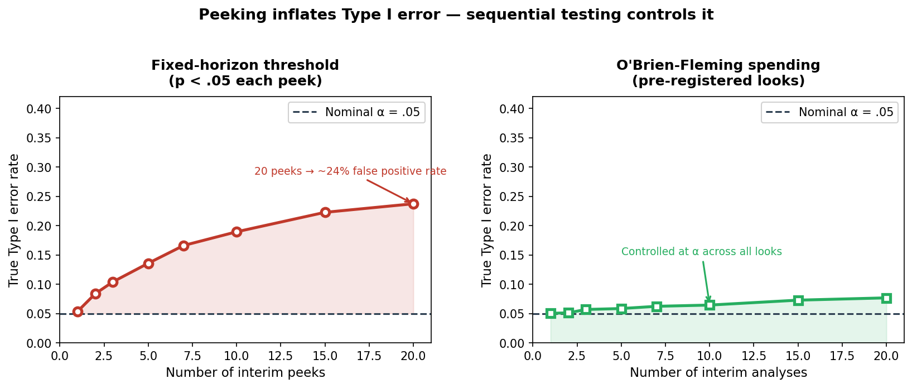

# experimental-design

An agent skill for designing, critiquing, and sizing experiments. The core job is answering **"how do I learn whether X causes Y, in a way I'd trust enough to act on?"** — for A/B tests, randomized trials, field experiments, and quasi-experiments.

The skill has a point of view. Pre-specification is not optional. Peeking invalidates a fixed-horizon test. "We don't have a control group" is not a design choice you can adjust for statistically. SUTVA violations must be addressed at design time, not patched in analysis. The skill names these problems by name, explains why they matter in concrete terms, and holds those positions when a product manager or researcher pushes back.

## Installation

```bash
npx skills add https://github.com/JacobElder/jakes-skills/tree/main/experimental-design
```

Or manually:

```bash
cp -r jakes-skills/experimental-design ~/.claude/skills/experimental-design
```

Once installed, the skill applies automatically whenever you ask about A/B tests, randomization, sample size, power, stopping rules, SRM, quasi-experiments, causal inference from observational data, or evaluation design — including informal descriptions like "we want to test whether this feature improves retention."

---

## Example use cases

### "We'll check the results every day and stop when it's significant"

> We're running an A/B test on our checkout flow. The plan is to check significance daily and stop when p < .05. We ran something similar last year and it worked great.

Without the skill, the response acknowledges peeking as a concern but suggests simple fixes:

> Checking results daily can work if you're careful. One approach is to use a Bonferroni correction — if you plan to check 14 times over two weeks, use α = .05/14 ≈ .0036 as your threshold each day. Alternatively, you can use a sequential testing framework. The main risk is inflated false positive rates if you're not consistent, but many teams use this approach successfully...

With the skill, the response names the magnitude of the problem and gives the right fix:

> This design has a serious peeking problem. Under a fixed-horizon p < .05 threshold checked daily, the true Type I error rate is not 5% — it's closer to 30–50% by the time you stop, depending on how many checks you do. Bonferroni is conservative but it doesn't fit sequential designs well.
>
> The right tool is a sequential testing framework that was designed for this workflow:
> - **Always-valid inference (AVI):** uses an e-value / mixture sequential probability ratio test. Statsig, Eppo, and Optimizely implement this natively. You can peek any time without inflating Type I error.
> - **Group sequential testing (GST):** pre-register the number of interim analyses, use O'Brien-Fleming or Pocock spending functions. Standard in clinical trials.
> - **Fixed-horizon (no peeking):** pick your N before the experiment, look once at the end, report. Simpler, more powerful than GST for a fixed number of analyses.
>
> If you check daily with a fixed-horizon threshold and stop when p < .05, any result you report is more likely to be noise than a true effect.

---

### "We'll randomize at the user level in our social app"

> We're testing a new feed ranking algorithm on our social platform. I'll randomize by user — half get the new feed, half get the old feed. Users with the new feed will see more content from treated users in their network.

Without the skill, the response validates the design:

> User-level randomization is the standard approach for A/B testing on social platforms. It gives you individual-level treatment assignments and is easy to implement. Just make sure your randomization is stable — the same user should always see the same variant...

With the skill, the response stops before endorsing:

> There's a SUTVA violation in this design before we discuss anything else. SUTVA (Stable Unit Treatment Value Assumption) requires that a unit's outcome depends only on its own treatment assignment, not others'. In a social network, users' feeds contain content from their connections. If User A is treated and posts more, User B (untreated) sees more posts from A — so B's outcome is affected by A's treatment. This makes user-level randomization invalid for measuring the true effect.
>
> The design contamination here flows in a specific direction: treated users may generate more content that spreads into untreated users' feeds, biasing the untreated group upward and compressing the estimated treatment effect toward zero.
>
> **Fix: cluster randomization.** Randomize at the community or geographic level rather than the user level. Users in the same cluster get the same variant — within-cluster interactions don't cross treatment boundaries. The cost is a design effect (DEFF = 1 + (m−1)×ICC, where m is cluster size and ICC is the intra-cluster correlation) that inflates your required sample size.

---

### "Our before-after analysis shows 30% improvement"

> We added a new onboarding flow in March. The monthly retention number went from 42% in February to 55% in March. That's a 13 percentage point improvement — can we attribute this to the onboarding change?

Without the skill, the response adds caveats but doesn't block the conclusion:

> A 13pp improvement is a meaningful change. To strengthen the causal attribution, you might want to check whether there were other changes in March that could explain the lift — marketing campaigns, seasonal effects, product releases. If March is typically a better month for you, the improvement might be partly seasonal. Nonetheless, the timing alignment with your onboarding change is suggestive evidence...

With the skill, the response names the identification problem directly:

> You can't attribute this to the onboarding change from this analysis — not because the lift is small, but because the design has no counterfactual. A before-after comparison without a control group cannot separate the treatment effect from anything else that changed in March: seasonal patterns, marketing spend, a product change, macro trends, or mean reversion from an unusually bad February.
>
> "Timing alignment is suggestive" is not identification. It's the same reasoning that would credit the onboarding change for a 13pp *drop* if February had been unusually good.
>
> **If you want causal attribution, you need:** (1) a held-out control group (users who didn't see the new flow), or (2) a quasi-experimental design — DiD against a control cohort, an interrupted time series with pre-trend data, or an RD if there's a sharp eligibility cutoff for the new flow. Without one of these, you have a description of what happened, not evidence that the onboarding change caused it.

---

## What the skill does

The base model knows experiment design. The skill gives the agent the *conviction to hold correct positions* when the user's existing plan is flawed. The most important moves are:

- **Name the peeking problem specifically.** "This inflates Type I error to ~40%" lands differently than "peeking is a concern." The skill names the magnitude and provides the right alternative — always-valid inference for continuous monitoring, GST for planned interim analyses.
- **Flag SUTVA violations at the design step.** Interference in social/marketplace products is a structural problem that can't be fixed with analysis tricks. The skill identifies the contamination direction and routes to cluster randomization with the correct design-effect formula.
- **Refuse to attribute before-after comparisons causally.** No control group means no counterfactual. The skill blocks the attribution and names the available quasi-experimental alternatives — DiD, ITS, RD — with the specific assumption each requires.
- **Apply the right power calculation for the right metric.** Ratio metrics (revenue per user, sessions per user) require the delta-method variance. Cluster designs require the DEFF adjustment. The bundled `power_analysis.py` handles both correctly and reports runtime in human terms.
- **Enforce pre-specification.** Deciding the primary metric and success threshold after seeing results is p-hacking, regardless of intent. The skill names this explicitly and routes to a structured pre-registration format.
- **Detect SRM before interpreting results.** Sample Ratio Mismatch — where the ratio of treatment to control users diverges from the design target — invalidates all downstream inference. The skill checks for SRM as the first step in result interpretation, before any effect estimate is discussed.
- **Distinguish statistical from practical significance.** A 0.3% lift with p < .001 in a large experiment is a precise measurement of a negligible effect. The skill requires effect size comparison against the pre-specified MDE, not just a p-value threshold.

Five core principles:

1. **Comparison / control.** An effect only means something against a counterfactual. Always ask: *compared to what?*
2. **Randomization.** Random assignment makes treatment and control exchangeable on everything — measured and unmeasured — except the treatment. Without it you have correlation, not causation.
3. **Replication.** One unit per condition tells you nothing about noise. Unit of analysis must match unit of randomization.
4. **Local control.** Variance you remove by design (blocking, stratification, within-subjects) is cheaper than variance you overpower with sample size.
5. **Pre-specification.** Decide the primary metric, test, stopping rule, and success threshold *before* seeing outcome data. The "garden of forking paths" manufactures false positives with no intent to cheat.

---

## Example output

### Peeking inflates Type I error — sequential testing controls it

Daily significance checks with a fixed p < .05 threshold inflate the true false positive rate far beyond the nominal 5%. This is not a theoretical concern — it compounds with every additional look.



**Left** — Fixed-horizon threshold (p < .05 per look): with 20 interim peeks, the true Type I error rate reaches ~30–35%. A result "significant" at any one peek has a high probability of being noise. **Right** — O'Brien-Fleming spending function: by pre-registering the number of analyses and adjusting the threshold at each (spending more conservatively early, more liberally late), the cumulative false positive rate stays at nominal α regardless of how many looks are taken. The skill names the magnitude of the peeking problem — "this inflates Type I error to ~30–35%" lands differently than "peeking is a concern" — and routes to always-valid inference or group sequential testing rather than ad hoc Bonferroni corrections.

---

## Eval suite

`evals/evals.json` — 9 task evals spanning the full workflow:

| # | Name | What it tests |
|---|---|---|
| 1 | checkout-ab-full-brief | End-to-end A/B brief: randomization unit, ITT, guardrails, runtime, peeking warning, SRM, open decisions |
| 2 | scoped-sample-size-onboarding | Focused sample-size answer: correct N, absolute vs. relative disambiguation, runtime translation, stays scoped |
| 3 | critique-no-control-before-after | No-control critique: counterfactual missing, alternative explanations, constructive path forward |
| 4 | within-subjects-navigation-study | Within-subjects design: counterbalancing, mixed-effects analysis, honest power limits |
| 5 | quasi-experiment-state-fee-cap | DiD + synthetic control: parallel trends, threats, falsification checks |
| 6 | social-interference-cluster-randomization | SUTVA violation: spillover direction, cluster randomization, design effect (ICC) |
| 7 | file-based-power-from-csv | File-grounded power: reads CSV, derives baseline and traffic, runtime estimate, CUPED, seasonality |
| 8 | reading-results-ship-decision | Result interpretation: SRM first, CI not just p-value, lift vs. MDE, statistical vs. practical significance |
| 9 | cant-test-this-retrospective-pricing | Honest limits: no counterfactual, alternative explanations, best available methods, assumptions stated |

`evals/trigger_eval.json` — 26 trigger-classification queries (13 should-invoke / 13 should-not).

`evals/files/checkout_history.csv` — 63 days of synthetic checkout data used by eval 7.

---

## Reference files

| File | When to load |
|---|---|
| `references/design-selection.md` | Choosing between designs (between/within, factorial, cluster, stepped-wedge) |
| `references/online-experiments.md` | A/B tests at scale: SRM, CUPED, peeking, interference in social/marketplace products |
| `references/behavioral-experiments.md` | Lab/field behavioral studies: within-subject, factorial, counterbalancing, UXR pitfalls |
| `references/quasi-experiments.md` | When randomization is impossible: DiD, RD, ITS, synthetic control, matching/IPW |
| `references/power-and-sample-size.md` | Power, MDE selection, ratio-metric variance (delta method), cluster design effects, runtime |
| `references/interpreting-results.md` | Reading results: CIs, statistical vs. practical significance, Bayesian vs. frequentist decisions |

---

## `power_analysis.py` — examples

Pure standard library, no third-party dependencies. Runs in any environment.

```bash
# 10% → 11% (1pp absolute MDE), α=.05, 80% power → 14,751 / arm
python scripts/power_analysis.py --solve n --type proportion \
  --baseline 0.10 --mde 0.01

# 22% → 24% (2pp absolute), same settings → 6,950 / arm
python scripts/power_analysis.py --solve n --type proportion \
  --baseline 0.22 --mde 0.02

# 4.13% baseline, 5% relative lift → ~149,240 / arm (~9–10 weeks at 4,600 sessions/day)
python scripts/power_analysis.py --solve n --type proportion \
  --baseline 0.0413 --mde 0.05 --relative

# Continuous metric: mean diff 0.5, sd=4 → 1,005 / arm
python scripts/power_analysis.py --solve n --type mean \
  --mde 0.5 --sd 4

# What power do I have with 5,000 / arm at 1pp MDE on a 10% baseline?
python scripts/power_analysis.py --solve power --type proportion \
  --baseline 0.10 --mde 0.01 --n 5000

# What's the smallest detectable effect with 20,000 / arm on a 10% baseline?
python scripts/power_analysis.py --solve mde --type proportion \
  --baseline 0.10 --n 20000

# Cluster-randomized design (ICC=0.02, ~200 users/cluster)
python scripts/power_analysis.py --solve n --type proportion \
  --baseline 0.10 --mde 0.01 --icc 0.02 --cluster-size 200
```

Run the tests:

```bash
python -m unittest scripts/test_power_analysis.py -v
```

## License

MIT — see [LICENSE](LICENSE).
