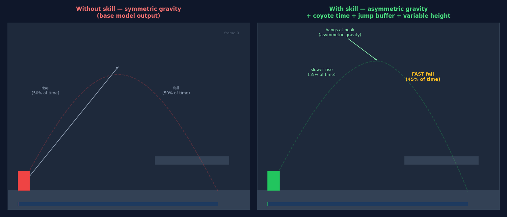
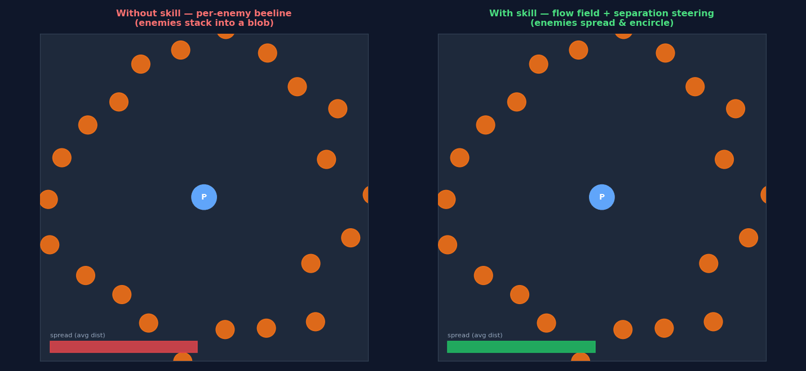
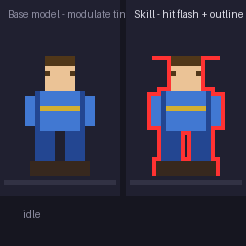
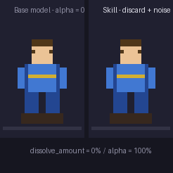
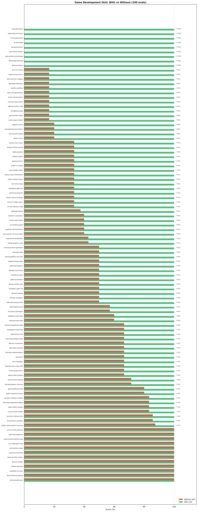

# Game Development Skill

A skill that gives the agent the procedural knowledge to build games that feel good and ship — not just games that compile. It encodes the techniques that separate "a programmer made this" from "this is a game": frame-independent movement, asymmetric jump gravity with coyote time and jump buffering, the juice toolkit (hitstop, trauma-based screenshake, tweening/easing, squash-and-stretch), ECS architecture for many-entity games, spatial-hash collision for hundreds of objects, flow-field pathfinding for enemy hordes, and the prototype → vertical-slice → ship process that prevents projects from dying in scope creep.

Covers **pixel art and retro games** (Zelda-like top-down, JRPG turn-based combat, Stardew-style farming sims) including pixel-perfect rendering setup (Nearest filter + integer scaling + camera snapping), grid-locked movement with tween animation, TileMap workflows, and sprite animation pipelines. Also covers **3D games**: CharacterBody3D controllers, SpringArm3D camera rigs that auto-prevent wall clipping, camera-relative movement, 3D pathfinding via NavigationAgent3D, skeletal animation blend trees, baked lighting, and modular level design.

Also covers **RPG systems** (status effects with per-effect StackPolicy, stat modifiers via additive + multiplicative formula, inventory, ability systems, crafting), **audio architecture** (bus hierarchy for volume sliders, stem-based adaptive music that syncs playback position instead of stop-and-start crossfade, 3D spatial audio, AudioPool), **shaders and visual effects** (hit flash, 8-direction sprite outline, dissolve via discard not alpha=0, palette swap, post-process), **multiplayer and netcode** (scope reality check, local co-op before online, rollback vs delay-based, authoritative server, relay services), and **save systems and meta-progression** (dual-file roguelike saves, version field from day 1, migration chains).

Also covers **UI/HUD** (signal-driven HUDs with UpdateResource pattern — game logic never touches HUD nodes directly), **advanced platformer mechanics** (wall jump with wall detection + grace period, one-way moving platforms via `set_collision_mask_value`, scene transitions with typewriter text and fades), **dialogue and narrative systems** (DialogueLineData Resource, branching via option arrays, tool selection: Ink + godot-ink for complex branching vs Dialogic for cutscene-heavy games), **weapons and shooting** (hitscan via `intersect_ray` vs projectile node tradeoffs, multiple firing modes as data-driven WeaponData Resources), **boss fights** (phase-based FSM with mandatory telegraph → active → recovery attack structure, AttackData Resource, invincibility during telegraph/active frames, boss invincibility as a skill loop not a difficulty setting), **camera systems** (room-zone camera transitions using Camera2D `limit_*` properties tweened via Area2D triggers, 3D lock-on camera with FOV + distance check via dot product + `is_instance_valid` guard), **stealth AI** (cone-of-vision detection as a 3-step pipeline: distance check → dot product angle check → raycast wall check; 5-state alert FSM with PATROL/SUSPICIOUS/ALERT/SEARCH/RETURNING), **fog of war and minimap** (PackedByteArray grid with UNSEEN/REVEALED/VISIBLE states, SubViewport-based minimap with shared World2D), and **bullet hell patterns** (BulletPool autoload pre-allocated at game start, BulletPatternData Resources, `Vector2.from_angle()` for polar coordinates, spiral patterns that accumulate angle each fire).

Also covers **behavior trees** (BTNode/Sequence/Selector/Decorator composites with Blackboard shared state, LimboAI/Beehave addon integration), **animation trees** (AnimationTree with BlendSpace1D/2D for locomotion and aiming, layered upper/lower body animation via AnimationNodeBlendTree + bone masks, call tracks for animation events), **inverse kinematics** (SkeletonIK3D with FABRIK for foot placement and hand grab, RayCast3D ground detection, lerp-based weight blending), **LOD and scene streaming** (GeometryInstance3D LOD distances, MultiMeshInstance3D GPU instancing, async chunk loading with ResourceLoader.load_threaded_request, hysteresis radii to prevent thrashing), **noise-based terrain and WFC** (FastNoiseLite two-noise biome system with elevation + moisture, SurfaceTool mesh generation, texture splatting via vertex color shader, domain warping, Wave Function Collapse adjacency rule propagation), **combo systems** (timestamped input buffer ring array, ComboStepData Resource, cancel windows via AnimationPlayer call tracks, per-frame hitbox control), **open world architecture** (ChunkManager autoload with async load queue, entity persistence, interest management, origin shifting for float precision), **vehicle physics** (VehicleBody3D + VehicleWheel3D, center of mass configuration, torque curve, surface friction via per-wheel RayCast3D), **ability systems** (AbilityData Resource + AbilityComponent pipeline: cost → cast → channel → fire → cooldown; interrupt vs cancel; tag-based gating for Silence/Stun), **GOAP and Utility AI** (Utility AI with normalized scoring and score noise, UtilityAgent tick interval, GOAP world state dict + A\* planner, BT+Utility and BT+GOAP hybrid patterns), **accessibility** (colorblind post-process shader using Daltonize/LMS matrices for protanopia/deuteranopia/tritanopia, SubtitleManager autoload with speaker color coding and sound-effect captions, control remapping), **localization** (TranslationServer CSV workflow, tr() + format() named placeholders — never concatenation, CJK fonts, RTL layout, tr_n() plural forms, string overflow via containers + autowrap), and **analytics and playtesting instrumentation** (TelemetryManager autoload with JSONL storage and buffered flush, TELEMETRY_ENABLED build flag, event-driven death heatmap and path recording, four-feature playtest build: session log + screenshot shortcut + in-game feedback button + build version display).

Also covers **3D navigation** (NavigationRegion3D + NavigationMesh setup with agent_height/agent_radius/cell_size, NavigationAgent3D correct loop: `set_target_position()` + `get_next_path_position()` every frame, RVO avoidance via `set_velocity()` + `velocity_computed` signal to prevent enemy stacking, `navigation_finished` signal, `NavigationObstacle3D` for dynamic obstacles, `NavigationLink3D` for multi-floor buildings, runtime async baking with `bake_navigation_mesh(true)` + `bake_finished`, `is_target_reachable()` fallback) and **2D lighting** (`CanvasModulate` as required ambient node — without it lights are invisible; `PointLight2D` texture/scale/energy/shadow; `LightOccluder2D` + `OccluderPolygon2D` for wall shadows; TileMap per-tile occlusion; `item_cull_mask` to exclude UI layers; `Sprite2D.normal_map` with import type must be Normal Map not Color; `range_height` 64–128 for top-down depth shading; Laigter for pixel art normal generation; `WorldEnvironment` has no effect on 2D).

Also covers **2D navigation** (NavigationAgent2D + NavigationRegion2D with NavigationPolygon, TileMap per-tile nav polygon setup in TileSet editor, `await bake_finished` before targeting — most-missed step, walls have no nav polygon not an explicit block, NavigationLink2D for ladders/portals, repath threshold pattern, `is_target_reachable()` fallback), **particles and VFX** (GPUParticles2D vs CPUParticles2D decision table, ParticleProcessMaterial with color_ramp gradient, one-shot bursts with `restart()` required before re-trigger, sub-emitters via `sub_emitter_mode` END_OF_LIFE/COLLISION, particle pool with `finished` signal for recycle — not allocation per hit, trail particles with `local_coords=false` on projectiles, `amount_ratio` for runtime density scaling), **full-screen post-processing** (`hint_screen_texture` uniform + `SCREEN_UV` — not `hint_texture` or `UV`; `ColorRect` in `CanvasLayer` layer=127; vignette/chromatic aberration/scanlines/barrel distortion all combined in one pass; `WorldEnvironment` has no effect on 2D sprites), **custom Resources and data-driven design** (`class_name MyData extends Resource` with `@export_group`, typed arrays, `.tres` vs `.res`; the shared-reference trap — always `.duplicate(true)` before mutating a preloaded resource; deep vs shallow duplicate; factory spawn pattern; `ResourceSaver.save()` for runtime persistence), **async resource loading** (`preload` vs `load` vs `load_threaded_request` decision table; polling loop with THREAD_LOAD_LOADED/FAILED status; `progress[0]` for loading bar; resource cache and `clear_cache()` between levels), and **memory management and orphan nodes** (orphan nodes — instantiated but not added to tree, never auto-freed; `queue_free()` vs `free()` safety; orphan detection in Debugger → Monitors; pool nodes stay in tree via hide/disable; `is_instance_valid()` not `!= null`; `WeakRef` for circular RefCounted references; observer lists as `Array[WeakRef]` with dead-ref pruning; lambda capture risk in timers/tweens; `_exit_tree()` for cleanup).

Also covers **visual shaders and shader graph** (visual shader editor vs code shader decision table — same bytecode, different authoring; node-to-GLSL mapping: FragmentOutput→`void fragment()`, Texture2D→`texture()`, Time→TIME, uniform nodes→uniform declarations; `set_shader_parameter()` works identically for both; save as `.tres` resource for artist workflow; Expression node for inline GLSL within the graph; Convert to Text is one-way; `render_mode unshaded` for emissive/UI shaders), **collision layer architecture** (layer = what a body IS, mask = what it detects; full layer/mask table for a 2D action game with 8 categories; hitbox+hurtbox as separate Area2D nodes; hurtbox pulls damage via `get_damage()` not push; `CollisionShape2D.disabled` for attack window control not `Area2D.monitoring`; i-frames by disabling hurtbox; `set_collision_layer_value()` and bit-shift syntax), and **signal and event architecture** (signals flow upward/sideways, method calls flow downward; scene root wires sibling connections; Inventory→HUD pattern where emitter holds no receiver reference; autoload event bus for cross-scene signals; typed signal parameters; `CONNECT_ONE_SHOT`; autoload for global services; anti-pattern: `get_node()` paths from child to sibling).

Also covers **lighting and global illumination** (LightmapGI vs VoxelGI vs SDFGI decision table by scene type, full 6-step LightmapGI setup including the most-missed step: LightmapGIProbe placement for dynamic objects), **profiling and optimization** (5-step workflow for diagnosing GPU vs CPU bottlenecks via Process Time vs Frame Time, Debug Draw Overdraw, Profiler flame chart sorted by Self time, per-frame allocation patterns and cache fixes, MultiMeshInstance3D draw call reduction), **mobile and touch input** (virtual thumbstick with dynamic origin and dead zone re-mapping, multi-touch finger index tracking, adaptive UI with canvas_items stretch, safe area insets via `DisplayServer.get_display_safe_area()`), and **cutscenes and cinematics** (AnimationPlayer as time sequencer with property/call/audio tracks, camera handoff via `make_current()`, skippable cutscene two-press confirm state machine, `get_tree().paused` + `PROCESS_MODE_ALWAYS` for input capture, shared cleanup path for skip and normal completion).

## Installation

```bash
npx skills add https://github.com/JacobElder/jakes-skills/tree/main/game-development
```

Or manually:

```bash
cp -r jakes-skills/game-development ~/.claude/skills/game-development
```

Once installed, the skill applies automatically when the user wants to build or improve a game in Godot, Unity, LÖVE, PyGame, Bevy, or Phaser — including character controllers, collision, enemy AI, procedural generation, game feel, engine selection, pixel art rendering, top-down movement, JRPG turn-based combat, 3D character controllers, third-person cameras, scoping a project, RPG systems (status effects, inventory, stat modifiers), audio architecture (bus hierarchy, adaptive music), shaders and visual effects, multiplayer and netcode, save systems and meta-progression, UI/HUD design, advanced platformer mechanics (wall jump, moving platforms, scene transitions), dialogue and narrative systems, weapons and shooting mechanics, boss fight architecture, camera systems (room zones, lock-on), stealth AI (cone of vision, alert FSM), fog of war and minimap, bullet hell patterns, behavior trees (LimboAI, Beehave), animation trees and inverse kinematics, LOD and scene streaming, noise-based terrain and Wave Function Collapse, combo systems, open world architecture and origin shifting, vehicle physics (VehicleBody3D), ability systems (GAS-lite), GOAP and Utility AI, colorblind accessibility modes, subtitles and closed captions, localization and internationalization, analytics and playtest instrumentation, baked global illumination (LightmapGI, VoxelGI, SDFGI), performance profiling (GPU vs CPU, overdraw, draw call reduction), mobile touch input (virtual joystick, safe area, adaptive UI scaling), cutscenes and cinematics (AnimationPlayer sequencing, camera handoff, skippable cutscenes), visual shaders and shader graph (visual editor vs code, node-to-GLSL mapping, artist workflow), collision layer and mask architecture (hitbox/hurtbox layers, i-frames, friendly-fire exclusion), signal and event architecture (signals vs direct calls vs autoloads, scene-root wiring, event bus), 3D navigation (NavigationAgent3D, NavigationMesh baking, RVO avoidance, dynamic obstacles), 2D lighting (PointLight2D, CanvasModulate, LightOccluder2D, normal maps for depth), 2D navigation (NavigationAgent2D, TileMap pathfinding, NavigationRegion2D baking), particles and VFX (GPUParticles2D, sub-emitters, one-shot pools, hit VFX composition), full-screen post-processing (screen-space shaders, vignette, chromatic aberration, scanlines, barrel distortion), custom Resources and data-driven design (.duplicate(true), factory pattern, ResourceSaver), async resource loading (load_threaded_request, progress bar, cache management), or memory management (orphan nodes, WeakRef, circular references, queue_free).

---

## Example use cases

### "My platformer movement feels floaty"

> My 2D Unity action game technically works but it feels lifeless and floaty, and hitting enemies has no impact. What can I do?

Without the skill, the response covers hitstop, screenshake, particles, and sound — but never mentions tweening/easing on animation transitions or squash-and-stretch, which are the primary culprits for "floaty" character feel:

> **Hits feel weightless — add hitstop first.** When a developer says "I added particles, sounds, and screenshake but hits still feel weak," the missing ingredient is almost always hitstop...
>
> **Add screenshake on hits.** Screenshake pairs with hitstop to sell impact. The right implementation uses a trauma value, not a fixed shake...
>
> **Spawn hit particles.** A small burst of sparks or blood on contact...
>
> **Sound on every action.** Sound is the cheapest high-impact improvement. Wire an impact sound to every hit, with pitch randomization to prevent machine-gun sameness...

With the skill, the response leads with tweening/easing and squash-and-stretch as named, primary techniques alongside hitstop and screenshake:

> ## 1. Floaty movement — fix the controller architecture and add easing
>
> Before adding any juice, check whether your player uses a **dynamic Rigidbody2D driven by forces**. If it does, that's your floatiness — forces feel slippery because you're fighting the physics engine's momentum model. The fix is architectural: switch to a **kinematic Rigidbody2D** and set velocity directly...
>
> ### Tweening and easing on animation transitions
>
> **Instant snaps from idle → run → idle are a major source of "floatiness."** The fix is to tween or blend transitions rather than cutting between them.
>
> ```csharp
> // Wrong: instant snap
> transform.localScale = new Vector3(1f, 1f, 1f);
>
> // Right: tween with an easing curve
> transform.DOScale(new Vector3(1f, 1f, 1f), 0.1f).SetEase(Ease.OutBack);
> ```
>
> ## 2. Squash-and-stretch on the player character
>
> **Squash-and-stretch is the single most effective tool for making 2D characters feel alive.** Without it, characters look pasted onto the world. Apply on jump takeoff, landing, and attack:
>
> ```csharp
> // On jump:
> transform.DOKill();
> transform.DOScaleY(0.7f, 0.05f).SetEase(Ease.OutQuad)
>     .OnComplete(() =>
>         transform.DOScaleY(1.2f, 0.08f).SetEase(Ease.OutQuad)
>     );
>
> // On land:
> transform.DOScaleY(0.6f, 0.04f).SetEase(Ease.OutQuad)
>     .OnComplete(() =>
>         transform.DOScale(Vector3.one, 0.12f).SetEase(Ease.OutBounce)
>     );
> ```
>
> Keep the deformation subtle (0.7–1.3 range) unless your art style is intentionally cartoonish. The goal is subconscious weight, not obvious distortion.

---

### "My Godot platformer character feels floaty when jumping"

> I'm making a platformer in Godot 4. My character can jump but it feels floaty and imprecise. The movement is all done in _process. What's wrong and how do I fix it?

Without the skill, the response moves physics to `_physics_process` and gives gravity, but generates symmetric-gravity code without coyote time, jump buffering, or variable jump height:

> ```gdscript
> extends CharacterBody2D
>
> const SPEED = 200.0
> const JUMP_VELOCITY = -400.0
> var gravity = ProjectSettings.get_setting("physics/2d/default_gravity")
>
> func _physics_process(delta):
>     if not is_on_floor():
>         velocity.y += gravity * delta
>     if Input.is_action_just_pressed("ui_accept") and is_on_floor():
>         velocity.y = JUMP_VELOCITY
>     var direction = Input.get_axis("ui_left", "ui_right")
>     velocity.x = direction * SPEED
>     move_and_slide()
> ```

With the skill, the response produces the complete platformer recipe — asymmetric gravity, coyote time, jump buffer, and variable jump height:

> ```gdscript
> extends CharacterBody2D
>
> @export var speed: float = 200.0
> @export var jump_velocity: float = -480.0
> @export var gravity_up: float = 900.0     # slower on the way up
> @export var gravity_down: float = 1600.0  # faster on the way down — the key to not feeling floaty
> @export var coyote_time: float = 0.12     # seconds of grace after walking off a ledge
> @export var jump_buffer_time: float = 0.12 # seconds to buffer a jump input before landing
>
> var coyote_timer: float = 0.0
> var jump_buffer_timer: float = 0.0
>
> func _physics_process(delta: float) -> void:
>     var on_floor := is_on_floor()
>
>     # Coyote time: decay after leaving floor, reset on landing
>     if on_floor:
>         coyote_timer = coyote_time
>     else:
>         coyote_timer = max(0.0, coyote_timer - delta)
>
>     # Jump buffer: keep the intent for a short window
>     if Input.is_action_just_pressed("jump"):
>         jump_buffer_timer = jump_buffer_time
>     else:
>         jump_buffer_timer = max(0.0, jump_buffer_timer - delta)
>
>     # Jump: consume both coyote time and buffer together
>     if jump_buffer_timer > 0.0 and coyote_timer > 0.0:
>         velocity.y = jump_velocity
>         coyote_timer = 0.0
>         jump_buffer_timer = 0.0
>
>     # Variable jump height: release early to cut the arc short
>     if Input.is_action_just_released("jump") and velocity.y < 0:
>         velocity.y *= 0.45
>
>     # Asymmetric gravity: snappy up, weighty down
>     var grav := gravity_up if velocity.y < 0 else gravity_down
>     velocity.y += grav * delta
>
>     var direction := Input.get_axis("move_left", "move_right")
>     velocity.x = direction * speed
>     move_and_slide()
> ```

The jump arc looks fundamentally different — tighter, more responsive, and more predictable:



**Red** — base model output: symmetric parabola, no coyote time, no jump buffer. The character misses ledges by one frame and the arc feels floaty. **Green** — with-skill output: asymmetric gravity (fast up, weighted down), coyote time for grace after ledge edges, jump buffer so pre-pressed inputs land correctly.

---

### "Vampire Survivors clone in LÖVE — how do I handle hundreds of entities?"

> I want to build a Vampire Survivors style game in LÖVE where there can be hundreds of enemies and projectiles on screen at once. How should I structure it and handle all the collision checks so it doesn't grind to a halt?

Without the skill, the response organises code into flat modules but never names ECS as the architecture for many-entity games and never explains *why* class hierarchies break down at scale:

> I'd recommend a modular structure: `main.lua` orchestrates the loop, `enemy.lua` manages enemy state, `player.lua` handles input, `collision.lua` does detection. For collision at scale, use a spatial grid rather than checking every pair...

With the skill, the response opens with the ECS case, explains metatable overhead at scale, and provides a complete spatial-hash + pool architecture:

> ## Why Not a Class Hierarchy
>
> The intuitive approach is `Enemy extends Character extends Entity` with a big `update()` method on each class. This breaks down fast in a survivors-like:
>
> - Every call to `update()` dispatches through Lua's metatable inheritance chain for each of hundreds of objects — measurable overhead at scale.
> - Shared state accumulates on base classes, creating an implicit god object spread across a hierarchy.
>
> The right model for a many-entity game is **ECS-ish**: entities are plain data tables with no methods, and behavior lives in separate system functions that iterate over the relevant data.
>
> ## Spatial Hash: Kill the O(n²)
>
> With 300 enemies and 200 bullets, naive all-pairs collision is 60,000 tests per frame. A spatial hash reduces that to a handful per bullet.
>
> ```lua
> function SpatialHash:query_nearby(wx, wy, callback)
>     local cs = self.cell_size
>     local cx = math.floor(wx / cs)
>     local cy = math.floor(wy / cs)
>     for dy = -1, 1 do
>         for dx = -1, 1 do
>             local key = self:_key(cx + dx, cy + dy)
>             local cell = self.cells[key]
>             if cell then
>                 for i = 1, #cell do callback(cell[i]) end
>             end
>         end
>     end
> end
> ```

The result in motion — 22 enemies, same starting positions, same target:



**Left** — base model output: every enemy beelines directly to the player, all stacking into an indistinguishable blob. **Right** — with-skill output: flow field navigation + boids-style separation steering keeps enemies spread, readable, and encircling — the spread bar shows the difference quantitatively.

---

### "How do I make enemies flash white on hit and give them an outline in Godot?"

> I want my enemies to flash white when they take damage, and have a colored outline around their sprites at all times. How do I do this in Godot 4?

Without the skill, the response uses `modulate` — a built-in Color property that tints the whole sprite. It works, but produces no outline and the tint is a blunt color shift rather than a clean white flash:

> ```gdscript
> func take_damage():
>     modulate = Color(1.5, 0.5, 0.5)   # reddish tint
>     await get_tree().create_timer(0.1).timeout
>     modulate = Color.WHITE
> ```

With the skill, the response leads with a `canvas_item` shader using `mix()` to blend toward white (preserving alpha), plus a second pass doing the 8-direction UV-offset outline — the correct shader technique for both effects:

> ```glsl
> // HitFlashOutline.gdshader
> shader_type canvas_item;
> uniform float flash_t : hint_range(0.0, 1.0) = 0.0;
> uniform vec4 outline_color : source_color = vec4(1.0, 0.2, 0.2, 1.0);
> uniform float outline_width : hint_range(1.0, 8.0) = 3.0;
>
> void fragment() {
>     vec4 col = texture(TEXTURE, UV);
>     vec2 texel = outline_width / vec2(textureSize(TEXTURE, 0));
>     float a = col.a;
>     a = max(a, texture(TEXTURE, UV + vec2( texel.x,       0.0)).a);
>     a = max(a, texture(TEXTURE, UV + vec2(-texel.x,       0.0)).a);
>     a = max(a, texture(TEXTURE, UV + vec2(      0.0,  texel.y)).a);
>     a = max(a, texture(TEXTURE, UV + vec2(      0.0, -texel.y)).a);
>     // outline where the dilated mask exceeds the original alpha
>     if (col.a < 0.1 && a > 0.1) {
>         COLOR = outline_color;
>         return;
>     }
>     COLOR = mix(col, vec4(1.0), flash_t);  // white flash preserves shape
> }
> ```

The outline is always visible; the flash fires on damage and decays in two frames:



**Left** — base model output: a red color modulate tint. No outline, no crisp white flash. **Right** — with-skill output: persistent colored outline using the 8-direction UV-offset technique, plus a clean white flash that fires on impact using `mix()` in the shader (preserving alpha correctly, unlike setting `modulate = Color.WHITE`).

---

### "My enemies dissolve when they die but it looks wrong — just a ghost fade"

> In my Godot game, enemies fade out when they die using `modulate.a = 0`. It looks bad — they turn into a transparent ghost. How do I get a proper dissolve effect?

Without the skill, the response keeps the alpha approach and suggests `Tween` to animate `modulate.a` from 1 to 0 — cleaner code, same ghost result:

> ```gdscript
> func die():
>     var tween = create_tween()
>     tween.tween_property(self, "modulate:a", 0.0, 0.8)
>     await tween.finished
>     queue_free()
> ```

With the skill, the response explains that `alpha = 0` is the wrong tool for dissolve — it fades the whole sprite uniformly, producing a ghost. The correct approach is a noise-texture shader using `discard`, which removes pixels hard-edge based on a threshold, creating a pixel-by-pixel dissolve:

> ```glsl
> // Dissolve.gdshader
> shader_type canvas_item;
> uniform sampler2D noise_texture;
> uniform float dissolve_amount : hint_range(0.0, 1.0) = 0.0;
>
> void fragment() {
>     float noise = texture(noise_texture, UV).r;
>     // discard — not alpha = 0 — so there is no ghost transparency
>     if (noise < dissolve_amount) discard;
>     COLOR = texture(TEXTURE, UV);
> }
> ```
> Drive `dissolve_amount` via AnimationPlayer from 0 → 1 over the death duration.

The visual difference between the two approaches:



**Left** — base model output: `alpha = 0` fade. The sprite becomes a transparent ghost that lingers. **Right** — with-skill output: `discard` against a smooth noise texture. Pixels wink out individually, edge-first — the standard dissolve effect used in action games and RPGs.

---

## What the skill does

The base model knows game development concepts. The skill gives the agent the *specific non-negotiables* to apply them correctly.

- **Frame independence without exception.** Every generated movement line is audited before return: `position += speed` is flagged and corrected to `position += speed * delta`. Physics in `_physics_process`/`FixedUpdate`, not `_process`/`Update`. This is the most common silent defect in generated game code.
- **Full platformer feel recipe — 2D and 3D.** Godot and Unity platformer requests get the complete set: asymmetric gravity (fast up, weighted down), coyote time, jump buffer, variable jump height. These four apply to 3D (CharacterBody3D) exactly as to 2D. The base model produces working but floaty code missing exactly these four.
- **Juice toolkit by name.** Diagnosing "floaty" or "lifeless" triggers explicit naming of: tweening/easing (not instant snaps), squash-and-stretch on 2D characters, hitstop (Time.timeScale freeze), trauma-based screenshake, knockback, hit flash, and sound with pitch randomization. Not just "add particles."
- **ECS for many-entity games.** Survivors-like, bullet-hell, or RTS prompts get an explicit ECS or ECS-ish recommendation with the reason — metatable dispatch overhead at scale, god objects spread across class hierarchies — and a working flat-data-table + system-function architecture.
- **Deliberate engine selection.** The default is Godot 4.x for most small 2D and indie 3D — stated with a reason, not hedged. Python game → not PyGame for Steam, Godot with GDExtension or Godot 4's Python-like GDScript. Casual web → Phaser, not Unity WebGL.
- **Pixel-perfect rendering, always both settings.** Pixel art requests get both: texture filter → Nearest AND Stretch Mode → canvas_items with a small base resolution. Missing either produces blurry or shimmering pixels. Camera pixel-snapping (round before assign) is included as the third piece.
- **3D camera: SpringArm3D, not a raycast.** Third-person camera requests lead with the SpringArm3D pivot rig (Player → CameraPivot → SpringArm3D → Camera3D) as the singular correct structure. The base model often leads with a manual raycast option; the skill names SpringArm as primary, explains the mask setup (world layer only), and warns against direct Camera3D parenting.
- **Retro/pixel-art patterns.** Zelda-like top-down requests get: grid-locked movement (logical grid position + tween visual), facing direction from last non-zero velocity, 4-directional priority, TileMap layer setup, and collision layer architecture. JRPG requests get: ATB/turn-order state machine pattern, damage formula in data, dialogue character-reveal system.
- **RPG systems: component pattern and correct stat formula.** Status effects are StatusEffectData Resources on an EffectManager component (not subclasses on enemies) with per-effect StackPolicy (REPLACE / ADD / IGNORE) — the base model uses a single global max_stacks flag and misses the per-effect policy. Stat modifiers use the flat-then-additive-then-multiplicative formula; the base model uses simple summation.
- **Audio: bus hierarchy and stem-based adaptive music.** Audio bus setup is always Master → Music / SFX → subgroups, with volume saved as linear [0,1] and converted via `linear_to_db()` at assignment time. Adaptive music uses continuously-playing stems (all tracks run from game start, volumes set to 0), never stop-and-start crossfades that restart from position 0 — the most common mistake in generated adaptive music code, worth 80pp delta in evals.
- **Multiplayer: scope warning and local co-op first.** Any online multiplayer request opens with an honest scope estimate (online multiplayer adds 30–100% dev time, plus hosting costs). The recommendation path is always: local co-op → LAN → online. The base model skips local co-op and jumps to MultiplayerAPI; the skill names it first.
- **Save systems: logical state only, version field mandatory from day 1.** Save code serializes logical data (item IDs, numbers, seeds) — never Nodes, Resources with signals, or scene trees. Version field is included from the first line of the save dict. Roguelike runs use dual-file: volatile run.json (deleted on death) + permanent meta.json (unlocks, currency, records). Save format changes always use a migration chain (migrate_v1_to_v2 functions), never field-presence checks.
- **Signal-driven HUD: never poll, never couple.** HUD scenes connect to signals and receive UpdateResource data objects — they never read game state directly and game logic never references HUD nodes. Base model responses frequently couple HUD to game nodes directly.
- **Boss fight architecture: 3-phase mandatory, invincibility enforced.** Every boss attack has telegraph → active → recovery phases defined in an AttackData Resource. The boss is invincible during telegraph and active frames (take_damage returns early), vulnerable only during recovery. This is the skill loop, not a difficulty setting. Base model produces flat if/elif chains with hardcoded timers.
- **Stealth AI: detection pipeline, not a distance check.** Cone of vision is three sequential checks — distance culling first, then `dot(forward, to_player) > cos(half_fov)` angle check, then a raycast for wall occlusion. The alert FSM has five states (PATROL/SUSPICIOUS/ALERT/SEARCH/RETURNING) with `_enter_state()` centralising side effects and `_generate_search_positions()` on ALERT→SEARCH transition.
- **Camera systems: limits, not lerp.** Room zone transitions tween `Camera2D.limit_left/right/top/bottom` (not camera position) triggered by CameraZone Area2D signals, keeping the camera physically constrained to the room. 3D lock-on uses FOV angle check (dot product) + distance to avoid locking enemies behind the player, lerps to the player–target midpoint, guards with `is_instance_valid()`, and cycles via a sorted candidate list index.
- **Bullet hell: pooled, pattern-as-data.** Bullet pool pre-allocated at game start (800+ bullets), BulletPatternData Resource drives all pattern parameters. Circle patterns use `TAU / bullet_count` step with `Vector2.from_angle()`. Spiral patterns accumulate `_spiral_angle` across fire calls — the angle is never reset. Base model instantiates bullets per-fire and produces drift-prone spiral implementations.
- **Weapons: hitscan vs projectile is a design choice, not a tech choice.** Hitscan (`intersect_ray`) is instant and zero-latency — correct for sniper rifles and shotguns. Projectile nodes (Area2D + velocity) are dodgeable — correct for bullet-hell and skill shots. Recommends both patterns and names the tradeoff. Multiple firing modes use a WeaponData Resource with an enum-driven pattern, cooldown as a float timer.
- **Behavior trees: tick architecture, not concept description.** BT requests get the complete implementation: BTNode base class with Status enum (SUCCESS/FAILURE/RUNNING), BTSequence (AND logic) and BTSelector (OR logic) composites, Blackboard shared state Dictionary, and Decorator nodes for conditions. Recommends LimboAI or Beehave for production use. Base model describes BT concepts without implementing the tick/return architecture.
- **AnimationTree: set() API, not play().** Locomotion and aiming requests use AnimationTree with BlendSpace1D/2D — never `animation_player.play()`, which cannot blend. Upper-body aiming uses AnimationNodeBlendTree with an Add2 node and bone mask so the upper body overlays locomotion. Base model reaches for `play()` for all animation requests.
- **Inverse kinematics: SkeletonIK3D with FABRIK.** Foot placement and hand grab requests use SkeletonIK3D with FABRIK algorithm, per-foot RayCast3D ground detection, lerp-based weight blending (not start/stop toggle), and pelvis height adjustment. Base model does not know SkeletonIK3D.
- **LOD and streaming: three-layer approach.** Performance requests for large scenes combine GeometryInstance3D LOD distances, MultiMeshInstance3D GPU instancing for repeated objects, and shadow culling — not just "add LOD." Async chunk loading uses ResourceLoader.load_threaded_request() with hysteresis radii (UNLOAD_RADIUS > LOAD_RADIUS) to prevent thrashing.
- **Noise terrain: two maps, not one.** Biome terrain generation uses separate elevation and moisture FastNoiseLite instances — biome identity is the intersection of both thresholds. SurfaceTool mesh generation with vertex colors drives a GLSL texture splatting shader. Domain warping produces more natural-looking transitions. Base model uses a single noise map.
- **Ability systems: data vs runtime separation, mandatory.** Ability requests get AbilityData Resource (schema, shared across all actors) separate from AbilityComponent runtime (cooldowns, cast state — per-actor). Cooldown in the Resource is the single most common mistake; the skill enforces it belongs in the component. Full pipeline: cost check → cast → channel → fire → finish.
- **Utility AI: normalized, noisy, interval-based.** All action scores normalized to [0, 1] (un-normalized scores always produce the same winner). Score noise `randf_range(0, 0.05)` breaks ties and prevents mechanical identical behavior. `decision_interval` of 0.25s prevents per-frame evaluation. Base model produces unnormalized scores with no noise.
- **Localization: format() not concatenation, enforced.** Any dynamic translated string uses `tr("KEY").format({"item": name})` with named placeholders. String `+` concatenation with `tr()` is flagged as the critical mistake — word order differs between languages. `tr_n()` for plural forms. CJK font fallback required for Japanese/Chinese/Korean builds.
- **Colorblind accessibility: Daltonize post-process, not per-asset.** Colorblind mode requests use a full-screen post-process shader on a CanvasLayer with Daltonize algorithm and LMS color space matrices — covering protanopia, deuteranopia, and tritanopia with a correction_strength parameter. No per-asset changes required.
- **Telemetry: event-driven JSONL with build flag stripping.** Analytics requests use discrete events (not per-frame sampling), buffered writes to JSONL files, a TELEMETRY_ENABLED build constant, and a minimum viable event set: session, level, death, ability, economy. Base model samples state every frame and stores everything in a memory array.

---

## Benchmark: skill vs. base model

Evaluated across 100 scenarios covering the core game-development failure modes — including pixel art rendering, 3D game development, RPG systems, audio architecture, shaders, multiplayer netcode, save systems, UI/HUD, advanced platformer mechanics, dialogue systems, weapons, boss fights, camera systems, stealth AI, fog of war/minimap, bullet hell patterns, behavior trees, animation trees, inverse kinematics, LOD and scene streaming, noise-based terrain and WFC, combo systems, open world architecture, vehicle physics, ability systems, GOAP and Utility AI, accessibility, localization, analytics, lighting and global illumination, profiling and optimization, mobile touch input, cutscenes and cinematics, visual shaders and shader graph, collision layer architecture, signal/event architecture, 3D navigation, 2D lighting, 2D pathfinding, particles and VFX, full-screen post-processing, custom Resources and data-driven design, async resource loading, and memory management. Evals are LLM-graded against specific, objective assertions; executor and grader are separate calls to prevent self-grading inflation.

```
with_skill:    100%   (599/599 expectations)
without_skill:  50.1%  (300/599 expectations)
delta:         +49.9pp
```



### Results by eval

| Eval | Without skill | With skill | Delta |
|------|:---:|:---:|:---:|
| scope-finish-deckbuilder | 3/7 (43%) | **7/7 (100%)** | +57pp |
| hitstop-priority-trap | 3/5 (60%) | **5/5 (100%)** | +40pp |
| rigidbody-avatar-trap | 3/5 (60%) | **5/5 (100%)** | +40pp |
| 3d-camera-springarm | 4/7 (57%) | **7/7 (100%)** | +43pp |
| zelda-topdown-grid | 4/7 (57%) | **7/7 (100%)** | +43pp |
| enemy-horde-pathing | 5/7 (71%) | **7/7 (100%)** | +29pp |
| 3d-character-controller | 6/7 (86%) | **7/7 (100%)** | +14pp |
| godot-platformer-feel | 8/10 (80%) | **10/10 (100%)** | +20pp |
| godot-autoload-overuse | 4/5 (80%) | **5/5 (100%)** | +20pp |
| procgen-dungeon-validate | 5/6 (83%) | **6/6 (100%)** | +17pp |
| framerate-dependent-debug | 5/6 (83%) | **6/6 (100%)** | +17pp |
| engine-select-python-cozy-sim | 7/8 (88%) | **8/8 (100%)** | +12pp |
| survivors-collision-love | 6/7 (86%) | **7/7 (100%)** | +14pp |
| pixel-perfect-setup | 6/6 (100%) | 6/6 (100%) | +0pp |
| game-feel-diagnosis | 9/9 (100%) | 9/9 (100%) | +0pp |
| survivors-like-perf-love | 7/7 (100%) | 7/7 (100%) | +0pp |
| camera-lerp-framerate-trap | 5/5 (100%) | 5/5 (100%) | +0pp |
| ecs-small-game-trap | 5/5 (100%) | 5/5 (100%) | +0pp |
| adaptive-music | 1/5 (20%) | **5/5 (100%)** | +80pp |
| inventory-equipment-data | 4/6 (67%) | **6/6 (100%)** | +33pp |
| multiplayer-scope-trap | 4/6 (67%) | **6/6 (100%)** | +33pp |
| status-effects-design | 5/6 (83%) | **6/6 (100%)** | +17pp |
| audio-bus-hierarchy | 6/6 (100%) | 6/6 (100%) | +0pp |
| sprite-hit-flash-outline | 6/6 (100%) | 6/6 (100%) | +0pp |
| dissolve-shader | 5/5 (100%) | 5/5 (100%) | +0pp |
| rollback-netcode | 6/6 (100%) | 6/6 (100%) | +0pp |
| roguelike-run-save | 6/6 (100%) | 6/6 (100%) | +0pp |
| save-format-versioning | 6/6 (100%) | 6/6 (100%) | +0pp |
| boss-phase-fsm | 0/6 (0%) | **6/6 (100%)** | +100pp |
| lock-on-camera | 1/6 (17%) | **6/6 (100%)** | +83pp |
| camera-room-zones | 2/6 (33%) | **6/6 (100%)** | +67pp |
| bullet-hell-patterns | 3/6 (50%) | **6/6 (100%)** | +50pp |
| dialogue-tool-choice | 3/6 (50%) | **6/6 (100%)** | +50pp |
| moving-platform-one-way | 3/6 (50%) | **6/6 (100%)** | +50pp |
| scene-transition-typewriter | 3/6 (50%) | **6/6 (100%)** | +50pp |
| wall-jump-slide | 3/6 (50%) | **6/6 (100%)** | +50pp |
| weapon-firing-modes | 3/6 (50%) | **6/6 (100%)** | +50pp |
| alert-state-machine | 4/6 (67%) | **6/6 (100%)** | +33pp |
| boss-telegraph | 4/6 (67%) | **6/6 (100%)** | +33pp |
| branching-dialogue-data | 4/6 (67%) | **6/6 (100%)** | +33pp |
| fog-of-war | 4/6 (67%) | **6/6 (100%)** | +33pp |
| hitscan-vs-projectile | 4/6 (67%) | **6/6 (100%)** | +33pp |
| minimap-implementation | 4/6 (67%) | **6/6 (100%)** | +33pp |
| signal-driven-hud | 4/6 (67%) | **6/6 (100%)** | +33pp |
| cone-of-vision-stealth | 5/6 (83%) | **6/6 (100%)** | +17pp |
| homing-bullet-pool | 6/6 (100%) | 6/6 (100%) | +0pp |
| behavior-tree-npc-ai | 1/6 (17%) | **6/6 (100%)** | +83pp |
| selector-vs-sequence | 2/5 (40%) | **5/5 (100%)** | +60pp |
| animationtree-locomotion | 1/5 (20%) | **5/5 (100%)** | +80pp |
| upper-body-aim-layer | 0/5 (0%) | **5/5 (100%)** | +100pp |
| ik-foot-placement | 0/5 (0%) | **5/5 (100%)** | +100pp |
| ik-hand-grab | 0/5 (0%) | **5/5 (100%)** | +100pp |
| lod-performance | 0/5 (0%) | **5/5 (100%)** | +100pp |
| chunk-world-loading | 1/5 (20%) | **5/5 (100%)** | +80pp |
| noise-biome-terrain | 0/5 (0%) | **5/5 (100%)** | +100pp |
| wave-function-collapse | 1/6 (17%) | **6/6 (100%)** | +83pp |
| combo-input-buffer | 2/5 (40%) | **5/5 (100%)** | +60pp |
| attack-cancel | 1/5 (20%) | **5/5 (100%)** | +80pp |
| open-world-chunk-design | 0/5 (0%) | **5/5 (100%)** | +100pp |
| float-precision-origin-shift | 4/6 (67%) | **6/6 (100%)** | +33pp |
| car-handling-godot | 2/5 (40%) | **5/5 (100%)** | +60pp |
| surface-friction-driving | 2/6 (33%) | **6/6 (100%)** | +67pp |
| ability-pipeline | 2/6 (33%) | **6/6 (100%)** | +67pp |
| ability-tags-blocking | 0/6 (0%) | **6/6 (100%)** | +100pp |
| utility-ai-enemy | 0/6 (0%) | **6/6 (100%)** | +100pp |
| bt-fsm-goap-choice | 4/6 (67%) | **6/6 (100%)** | +33pp |
| colorblind-modes | 3/6 (50%) | **6/6 (100%)** | +50pp |
| subtitle-system | 2/6 (33%) | **6/6 (100%)** | +67pp |
| godot-localization | 3/6 (50%) | **6/6 (100%)** | +50pp |
| string-overflow-i18n | 3/6 (50%) | **6/6 (100%)** | +50pp |
| gameplay-telemetry | 1/6 (17%) | **6/6 (100%)** | +83pp |
| playtest-instrumentation | 2/5 (40%) | **5/5 (100%)** | +60pp |
| godot-gi-choice | 2/6 (33%) | **6/6 (100%)** | +67pp |
| lightmap-baking | 3/8 (38%) | **8/8 (100%)** | +63pp |
| profiler-workflow | 1/6 (17%) | **6/6 (100%)** | +83pp |
| draw-call-optimization | 1/6 (17%) | **6/6 (100%)** | +83pp |
| touch-virtual-joystick | 1/6 (17%) | **6/6 (100%)** | +83pp |
| mobile-ui-scaling | 2/6 (33%) | **6/6 (100%)** | +67pp |
| animationplayer-cutscene | 5/7 (71%) | **7/7 (100%)** | +29pp |
| cutscene-skip-system | 1/6 (17%) | **6/6 (100%)** | +83pp |
| visual-shader-editor | 2/6 (33%) | **6/6 (100%)** | +67pp |
| shader-graph-to-code | 3/7 (43%) | **7/7 (100%)** | +57pp |
| collision-layer-architecture | 2/6 (33%) | **6/6 (100%)** | +67pp |
| hitbox-hurtbox-layers | 2/6 (33%) | **6/6 (100%)** | +67pp |
| signals-vs-direct-calls | 1/6 (17%) | **6/6 (100%)** | +83pp |
| cross-system-communication | 2/5 (40%) | **5/5 (100%)** | +60pp |
| navigation-agent-3d | 3/6 (50%) | **6/6 (100%)** | +50pp |
| navmesh-baking | 3/6 (50%) | **6/6 (100%)** | +50pp |
| 2d-lighting-setup | 1/6 (17%) | **6/6 (100%)** | +83pp |
| 2d-normal-maps | 2/6 (33%) | **6/6 (100%)** | +67pp |
| navigation-agent-2d | 2/6 (33%) | **6/6 (100%)** | +67pp |
| tilemap-navigation | 3/6 (50%) | **6/6 (100%)** | +50pp |
| gpu-particles-setup | 1/6 (17%) | **6/6 (100%)** | +83pp |
| particle-pooling-vfx | 2/6 (33%) | **6/6 (100%)** | +67pp |
| fullscreen-post-process | 3/6 (50%) | **6/6 (100%)** | +50pp |
| screen-space-shader | 1/6 (17%) | **6/6 (100%)** | +83pp |
| custom-resource-design | 2/6 (33%) | **6/6 (100%)** | +67pp |
| resource-loader-async | 2/6 (33%) | **6/6 (100%)** | +67pp |
| orphan-node-cleanup | 4/6 (67%) | **6/6 (100%)** | +33pp |
| circular-reference-trap | 2/6 (33%) | **6/6 (100%)** | +67pp |

### Where the skill makes the biggest difference

| Scenario | Base model gap | What the skill adds |
|---|:---:|---|
| scope-finish-deckbuilder | 43% base | Leads with toy→prototype→vertical-slice→ship; names the next cut; refuses to scaffold saves/menus before fun is proven |
| hitstop-priority-trap | 60% base | Names hitstop as the highest-ROI fix for weak combat; gives correct frame-duration guidance (30–130 ms); warns against maxing it out |
| rigidbody-avatar-trap | 60% base | Identifies force-driven Rigidbody2D as the architectural root cause of floatiness; recommends kinematic controller switch |
| 3d-camera-springarm | 57% base | Recommends SpringArm3D as the primary (not optional) solution; correctly excludes player/enemy layers from the spring mask; names direct Camera3D parenting as the bug |
| zelda-topdown-grid | 57% base | Implements grid-locked tween pattern explicitly (logical snaps, visual tweens); covers last-facing idle animation; defines layer/mask architecture |
| adaptive-music | 20% base | Stems play continuously at volume 0 (never stop-and-start); late stem entry syncs playback_position from the running stems; base model crossfades by stopping old track and restarting from 0 |
| enemy-horde-pathing | 71% base | Recommends a shared flow field (Dijkstra-map) instead of per-enemy A*; names separation steering to prevent stacking |
| inventory-equipment-data | 67% base | Flat + additive-percent + multiplicative modifier formula; type-agnostic modifier dispatch; base model uses simple summation |
| multiplayer-scope-trap | 67% base | Opens with scope warning (30–100% extra dev time); recommends local co-op before online; base model skips straight to MultiplayerAPI |
| godot-platformer-feel | 80% base | Full platformer recipe: asymmetric gravity + coyote time + jump buffer + variable jump height (all four, not just gravity) |
| godot-autoload-overuse | 80% base | Doesn't open with "solid starting point"; names the antipattern immediately; doesn't hedge with "will ship fine for small games" |
| status-effects-design | 83% base | Per-effect StackPolicy enum (REPLACE/ADD/IGNORE); base model uses a single global max_stacks flag |
| 3d-character-controller | 86% base | Applies all 2D platformer feel techniques (asymmetric gravity, coyote, jump buffer, variable height) to 3D; enforces @export tunables |
| boss-phase-fsm | 0% base | Phase-based boss FSM with mandatory AttackData Resource and `_enter_phase()` side-effect centralisation; base model produces flat if/elif chains with hardcoded per-phase health thresholds |
| lock-on-camera | 17% base | Target acquisition uses FOV angle check (dot product) + distance, not just nearest; camera lerps to player–target midpoint; `is_instance_valid()` guard; cycle index into pre-built candidate list; Sprite3D marker projected to screen |
| camera-room-zones | 33% base | Transitions by tweening Camera2D `limit_left/right/top/bottom` (not camera position); CameraZone as Area2D triggers the autoload CameraController; bounds derived from CollisionShape2D AABB |
| boss-telegraph | 33% base | Mandatory 3-phase structure (telegraph → active → recovery) enforced in data (AttackData.telegraph_duration); boss invincible during telegraph/active; `take_damage()` returns early if state is telegraphing or attacking |
| wall-jump-slide | 50% base | Wall-slide uses `is_on_wall_only()` with capped fall speed; wall-jump requires `last_wall_direction` and jump-grace window (can't be pressed continuously); base model produces instant snap wall-jump with no grace period |
| bullet-hell-patterns | 50% base | BulletPool autoload pre-allocated at game start; BulletPatternData Resource; `Vector2.from_angle()` for polar coordinates; spiral accumulates `_spiral_angle` each fire call (not reset) |
| dialogue-tool-choice | 50% base | Names Ink + godot-ink for complex branching (flags, variables, conditions) vs Dialogic for cutscene-heavy games; base model recommends Dialogic generically without distinguishing use cases |
| behavior-tree-npc-ai | 17% base | Shows BTNode/Sequence/Selector composites with Status enum and Blackboard; base model describes BT concepts without implementing the tick/return architecture |
| animationtree-locomotion | 20% base | Uses AnimationTree BlendSpace1D with set() API; base model uses animation_player.play() which cannot blend locomotion states |
| upper-body-aim-layer | 0% base | AnimationNodeBlendTree with Add2 + bone mask for layered upper-body aim; base model has no knowledge of bone-masked layering |
| ik-foot-placement | 0% base | SkeletonIK3D with FABRIK, per-foot RayCast3D, lerp weight, and pelvis height adjustment; base model does not know SkeletonIK3D or FABRIK |
| lod-performance | 0% base | GeometryInstance3D LOD distances + MultiMeshInstance3D GPU instancing + shadow culling combined; base model treats LOD as a single mesh setting |
| noise-biome-terrain | 0% base | Two-noise biome system (elevation × moisture), SurfaceTool mesh generation, vertex color texture splatting shader, domain warping; base model uses a single noise map without biome table |
| open-world-chunk-design | 0% base | Full async pipeline with hysteresis radii, entity persistence, interest management, and origin shifting; base model uses synchronous load() |
| ability-tags-blocking | 0% base | Reference-counted tag Dictionary with blocked_by/required_tags gates; base model uses per-ability boolean flags |
| utility-ai-enemy | 0% base | Normalized [0,1] scores, score_noise, decision_interval, and can_use() gates; base model produces unnormalized scores evaluated every frame |
| gameplay-telemetry | 17% base | Event-driven JSONL with buffered flush and TELEMETRY_ENABLED build flag; base model samples state per-frame and stores all events in memory |
| surface-friction-driving | 33% base | Per-wheel RayCast3D + friction table Dictionary + lerp transition + engine force multiplier; base model uses group tags without lerp or engine adjustment |
| profiler-workflow | 17% base | GPU vs CPU distinction via Process Time vs Frame Time; Profiler sorted by Self (not Total); per-frame allocation cache pattern; base model gives generic "use the profiler" advice |
| draw-call-optimization | 17% base | Debugger Monitor targets (≤200 mobile / ≤1000 low-end / ≤5000 high-end); MultiMeshInstance3D code example; base model names instancing without concrete targets or code |
| touch-virtual-joystick | 17% base | Dynamic origin, finger index tracking, dead zone re-mapping (magnitude − dz) / (1 − dz); base model uses fixed joystick origin and hard snap at dead zone |
| cutscene-skip-system | 17% base | Two-press confirm state machine; get_tree().paused + PROCESS_MODE_ALWAYS; shared cleanup path; _fire_end_events() for skipped call tracks; base model uses single-press with duplicated cleanup |
| godot-gi-choice | 33% base | LightmapGIProbe as most-missed step; cannot combine LightmapGI + VoxelGI on same geometry; decision table by scene type; base model omits dynamic object handling |
| mobile-ui-scaling | 33% base | DisplayServer.get_display_safe_area() applied to MarginContainer; minimum touch target size; font scaling via Theme; base model covers stretch mode but omits safe area and touch targets |
| lightmap-baking | 38% base | Full 6-step LightmapGI workflow; LightmapGIProbe every 4–6m for dynamic objects; UV2 bleeding diagnosis; base model covers bake button but skips LightmapGIProbe and gi_mode settings |
| signals-vs-direct-calls | 17% base | Directional rule (signals up/sideways, calls down); scene root as wiring node; typed signal parameters; base model knows signals but doesn't teach the scene-root pattern or the directional rule |
| collision-layer-architecture | 33% base | Separate layers for player/enemy bullets (friendly-fire exclusion); named layers in Project Settings; bit-shift code syntax; base model uses the same layer for all projectiles |
| visual-shader-editor | 33% base | Same bytecode as code shader; .tres resource for artist workflow; Expression node for inline GLSL; render_mode unshaded; base model doesn't clarify performance equivalence or .tres workflow |
| hitbox-hurtbox-layers | 33% base | CollisionShape2D.disabled (not Area2D.monitoring) for hitbox window; hurtbox pulls damage via get_damage() (not pushed); i-frames by disabling hurtbox shape; base model toggles monitoring |
| cross-system-communication | 40% base | Scene root dispatches to all four systems from single signal; AudioManager as autoload (not signal) for cross-scene audio; explains why get_node() path coupling breaks; base model uses all signals without distinguishing scope |
| shader-graph-to-code | 43% base | Full node-to-GLSL mapping table; Expression node; one-way Convert to Text; data-flow reading order; base model explains texture() and TIME but omits FragmentOutput mapping and Expression node |
| 2d-lighting-setup | 17% base | CanvasModulate as the required ambient node (most-missed); item_cull_mask for UI exclusion; TileMap per-tile occlusion; WorldEnvironment irrelevance; base model covers CanvasModulate but misses shadow_filter, cull mask, and TileMap setup |
| 2d-normal-maps | 33% base | Import type Normal Map fix as primary cause; range_height 64–128 for top-down shading; AnimatedSprite2D per-frame limitation; Laigter; base model names the normal_map property but omits the import fix and range_height |
| navigation-agent-3d | 50% base | RVO avoidance (avoidance_enabled + set_velocity() + velocity_computed signal); navigation_finished signal; agent_height/radius on NavigationMesh; base model gets set_target_position and get_next_path_position correct but skips avoidance and arrival signal |
| navmesh-baking | 50% base | geometry_source_geometry_mode for chunk filtering; AABB-restricted baking; is_target_reachable() fallback; avoidance vs rebake distinction; base model knows async bake + bake_finished but omits chunked-world optimizations |
| navigation-agent-2d | 33% base | RVO avoidance (avoidance_enabled + set_velocity() + velocity_computed); repath threshold to avoid calling set_target_position() every frame; is_target_reachable() fallback; base model uses navigate_to() which doesn't exist in Godot 4 |
| tilemap-navigation | 50% base | await bake_finished before spawning agents (most-missed); walls have no nav polygon — absence is what makes them impassable; base model misses the spawn-after-bake requirement |
| gpu-particles-setup | 17% base | restart() required before re-triggering one-shot (base model just sets emitting=true); explosiveness for burst feel; color_ramp via GradientTexture1D; sub-emitters (sub_emitter_mode, sub_emitter_amount_at_end); amount_ratio for density scaling |
| particle-pooling-vfx | 33% base | Pool uses finished signal for recycle (not polling emitting flag); restart() before each play; layered hit VFX (burst + sprite flash + sound + hitstop); trail local_coords=false on projectiles; base model allocates new instance per hit |
| fullscreen-post-process | 50% base | hint_screen_texture not hint_texture; SCREEN_UV not UV for sampling; WorldEnvironment has no effect on 2D sprites; base model uses incorrect hint_texture and UV |
| screen-space-shader | 17% base | hint_screen_texture uniform; SCREEN_UV sampling; sinusoidal scanlines (resolution-independent vs mod(FRAGCOORD)); barrel distortion with out-of-bounds black edge; combined single-pass approach |
| custom-resource-design | 33% base | Shared-reference trap: .duplicate(true) required before mutating any preloaded resource; deep vs shallow duplicate; factory pattern; base model shows @export but omits the mutation trap |
| resource-loader-async | 33% base | progress[0] parameter for loading bar; THREAD_LOAD_FAILED handling; resource cache behavior; preload-large-assets hitch warning; base model gets happy-path polling right but omits these |
| circular-reference-trap | 33% base | Observer list as Array[WeakRef] with dead-ref pruning on notify; lambda capture risk in timers (captures self, may outlive node); CONNECT_ONE_SHOT mitigation; decision table of when to use each; base model knows WeakRef but misses lambda and observer patterns |

### Evals where the base model already performs well (regression guards)

| Eval | Note |
|---|---|
| pixel-perfect-setup | Base model knows Nearest filter + canvas_items setup well from Godot documentation |
| game-feel-diagnosis | Base model names all feedback channels; these evals serve as non-regression guards |
| survivors-like-perf-love | Base model covers spatial hashing and pooling on this specific framing |
| camera-lerp-framerate-trap | Frame-independence diagnostic already correct in base model |
| ecs-small-game-trap | Base model appropriately recommends against ECS for tiny single-mechanic games |
| audio-bus-hierarchy | Base model knows AudioServer.set_bus_volume_db() API well |
| sprite-hit-flash-outline | Base model handles basic 2D shader patterns (hit flash, outline) correctly |
| dissolve-shader | Base model uses discard correctly for dissolve effects |
| rollback-netcode | Base model correctly explains rollback, determinism requirement, and recommends godot-rollback-netcode addon |
| roguelike-run-save | Base model uses dual-file pattern and version field when prompted with roguelike context |
| save-format-versioning | Base model implements migration chain pattern when explicitly asked about format migration |
| homing-bullet-pool | Base model identifies the BulletPool pattern and rotation-based homing (not velocity snap) when the problem is framed explicitly as a performance question |
| float-precision-origin-shift | Base model correctly identifies float precision as the root cause and implements basic origin shifting (67% base) |
| bt-fsm-goap-choice | Base model correctly categorizes FSM/BT/Utility/GOAP use cases even without the AI design framework (67% base) |

---

## Eval suite

| # | Eval | Non-negotiable(s) tested |
|---|------|--------------------------|
| 0 | `godot-platformer-feel` | Frame independence + jump recipe + Godot idioms |
| 1 | `survivors-like-perf-love` | Frame independence + decoupling/ECS + spatial partitioning + pooling (LÖVE) |
| 2 | `scope-finish-deckbuilder` | Find the fun / scope / prototype process |
| 3 | `engine-select-python-cozy-sim` | Deliberate engine selection + data-driven architecture |
| 4 | `game-feel-diagnosis` | Full juice toolkit: tweening/easing, squash-stretch, hitstop, screenshake (Unity) |
| 5 | `enemy-horde-pathing` | Enemy AI: flow fields + separation + many-agent perf |
| 6 | `procgen-dungeon-validate` | Procedural generation: seed + technique + generate-then-validate |
| 7 | `framerate-dependent-debug` | Frame independence: diagnostic framing (broken code given) |
| 8 | `survivors-collision-love` | Spatial hash + pooling as code (LÖVE/Lua) |
| 9 | `camera-lerp-framerate-trap` | Frame independence trap: lerp called with constant 0.1, not dt-scaled |
| 10 | `rigidbody-avatar-trap` | Force-driven Rigidbody2D as root cause of floatiness |
| 11 | `ecs-small-game-trap` | Anti-over-engineering: don't recommend ECS for tiny single-mechanic games |
| 12 | `hitstop-priority-trap` | Juice priority: hitstop first, not particles first |
| 13 | `godot-autoload-overuse` | Godot idioms: autoload overuse antipattern diagnosis |
| 14 | `pixel-perfect-setup` | Pixel art rendering: Nearest filter + integer scaling + camera snapping |
| 15 | `zelda-topdown-grid` | Pixel art / retro: TileMap, grid-locked movement, 4-directional animation, facing, collision layers |
| 16 | `3d-character-controller` | 3D: CharacterBody3D, manual gravity, camera-relative input, @export, coyote/buffer/variable height in 3D |
| 17 | `3d-camera-springarm` | 3D: SpringArm3D rig as primary solution, mask config, no direct Camera3D parenting |
| 18 | `status-effects-design` | RPG: StatusEffectData Resource, StackPolicy enum (REPLACE/ADD/IGNORE), component pattern |
| 19 | `inventory-equipment-data` | RPG: ItemData + StatModifier, flat+additive-pct+multiplicative formula, type-agnostic dispatch |
| 20 | `audio-bus-hierarchy` | Audio: Master→Music/SFX bus tree, AudioServer.set_bus_volume_db(), linear_to_db() |
| 21 | `adaptive-music` | Audio: stem-based approach (all stems run continuously), playback_position sync for late entry |
| 22 | `sprite-hit-flash-outline` | Shaders: hit flash via mix(), 8-direction outline via textureSize() UV offset |
| 23 | `dissolve-shader` | Shaders: noise texture + discard (not alpha=0), AnimationPlayer-driven threshold |
| 24 | `multiplayer-scope-trap` | Multiplayer: scope warning, local co-op first recommendation, honest time/cost estimate |
| 25 | `rollback-netcode` | Multiplayer: rollback mechanics, determinism requirement, GGPO/godot-rollback-netcode |
| 26 | `roguelike-run-save` | Save systems: dual-file (run.json + meta.json), logical state only, version field |
| 27 | `save-format-versioning` | Save systems: migration chain, sensible defaults, backup before migration |
| 28 | `signal-driven-hud` | UI/HUD: signal-based decoupling, UpdateResource pattern, no game logic in HUD nodes |
| 29 | `scene-transition-typewriter` | UI: typewriter text via Timer + character reveal, scene transition via AnimationPlayer, no blocking await chains |
| 30 | `wall-jump-slide` | Advanced platformer: wall-slide with capped fall speed, wall-jump with `last_wall_direction` and grace window |
| 31 | `moving-platform-one-way` | Advanced platformer: `set_collision_mask_value` for one-way drop-through, `move_and_slide()` on kinematic platform |
| 32 | `branching-dialogue-data` | Dialogue: DialogueLineData Resource with option arrays, signal-driven flow, separation from game logic |
| 33 | `hitscan-vs-projectile` | Weapons: `intersect_ray` for hitscan (instant, zero latency), Area2D projectile for dodgeable shots; tradeoff guidance |
| 34 | `weapon-firing-modes` | Weapons: WeaponData Resource, data-driven firing modes (semi/burst/auto), cooldown as float timer not boolean |
| 35 | `boss-phase-fsm` | Boss fights: phase-based FSM, AttackData Resource, `_enter_phase()` side effects, health threshold triggers |
| 36 | `camera-room-zones` | Camera: Camera2D `limit_*` tweened via CameraZone Area2D; bounds from CollisionShape2D AABB |
| 37 | `cone-of-vision-stealth` | Stealth AI: 3-step cone detection (distance → dot product → raycast); `detection_level` float accumulator |
| 38 | `alert-state-machine` | Stealth AI: 5-state FSM (PATROL/SUSPICIOUS/ALERT/SEARCH/RETURNING); `_enter_state()` centralises side effects |
| 39 | `minimap-implementation` | Minimap: SubViewport + shared World2D vs icon overlay; WORLD_RADIUS coordinate math; viewport-clamp masking |
| 40 | `bullet-hell-patterns` | Bullet hell: BulletPool autoload; BulletPatternData Resource; circle via TAU/count, spiral via accumulated angle |
| 41 | `fog-of-war` | Fog of war: PackedByteArray grid, UNSEEN/REVEALED/VISIBLE states, `_draw()` rects, `hex_encode()` for save |
| 42 | `dialogue-tool-choice` | Dialogue tools: Ink + godot-ink for branching logic; Dialogic for cutscene-heavy games; tags for portrait/audio |
| 43 | `lock-on-camera` | Camera: lock-on with FOV + distance via dot product, lerp to midpoint, `is_instance_valid()`, cycle index |
| 44 | `boss-telegraph` | Boss fights: mandatory 3-phase attacks, AttackData.telegraph_duration, invincibility during telegraph/active |
| 45 | `homing-bullet-pool` | Weapons: BulletPool pre-allocation, rotation-based homing (clamp turn angle × delta), Area2D collision signals |
| 46 | `behavior-tree-npc-ai` | BT: BTNode/Sequence/Selector composites, Blackboard, LimboAI/Beehave, composable subtrees vs FSM |
| 47 | `selector-vs-sequence` | BT: AND (Sequence) vs OR (Selector) logic, RUNNING status and tick-across-frames, failure propagation |
| 48 | `animationtree-locomotion` | AnimationTree: BlendSpace1D, set() parameters API, no animation_player.play() for locomotion |
| 49 | `upper-body-aim-layer` | AnimationTree: AnimationNodeBlendTree, Add2 with bone mask, BlendSpace2D for aim |
| 50 | `ik-foot-placement` | IK: SkeletonIK3D, FABRIK, RayCast3D per foot, lerp weight, pelvis height adjustment |
| 51 | `ik-hand-grab` | IK: SkeletonIK3D hand grab, Marker3D target, Area3D proximity, lerp weight |
| 52 | `lod-performance` | LOD: GeometryInstance3D distances, MultiMeshInstance3D GPU instancing, shadow culling |
| 53 | `chunk-world-loading` | Streaming: load_threaded_request(), LOAD/UNLOAD_RADIUS hysteresis, ChunkManager autoload, entity persistence |
| 54 | `noise-biome-terrain` | Terrain: two FastNoiseLite maps, biome table, SurfaceTool + vertex colors, texture splatting shader, domain warping |
| 55 | `wave-function-collapse` | WFC: entropy-based collapse, adjacency rule propagation, contradiction handling, WFC vs BSP |
| 56 | `combo-input-buffer` | Combos: timestamped buffer array, consume_buffered(), ComboStepData Resource, animation window gates |
| 57 | `attack-cancel` | Combos: cancel windows via AnimationPlayer call tracks, cancel vs interrupt distinction, hitbox disable on cancel |
| 58 | `open-world-chunk-design` | Open world: async loading, hysteresis radii, entity persistence, interest management, origin shifting |
| 59 | `float-precision-origin-shift` | Open world: float precision loss at distance, origin shift implementation, world_offset coordinate conversion |
| 60 | `car-handling-godot` | Vehicles: VehicleBody3D + VehicleWheel3D, center_of_mass_mode CUSTOM, torque curve, speed-dependent steering |
| 61 | `surface-friction-driving` | Vehicles: per-wheel RayCast3D surface detection, wheel_friction_slip lerp, engine force multiplier |
| 62 | `ability-pipeline` | Abilities: AbilityData Resource vs AbilityComponent runtime, cost→cast→channel→fire pipeline, interrupt + mana refund |
| 63 | `ability-tags-blocking` | Abilities: reference-counted tag Dictionary, blocked_by + required_tags, add/remove tag, stun interrupt |
| 64 | `utility-ai-enemy` | Utility AI: normalized [0,1] scores, score_noise, decision_interval, can_use() prerequisite, export weights |
| 65 | `bt-fsm-goap-choice` | AI design: FSM→BT→Utility→GOAP progression, BT+Utility hybrid, when GOAP is justified |
| 66 | `colorblind-modes` | Accessibility: Daltonize/LMS post-process shader, protanopia/deuteranopia/tritanopia, correction_strength |
| 67 | `subtitle-system` | Accessibility: SubtitleManager autoload, CanvasLayer layer, BBCode speaker color, sound effect captions |
| 68 | `godot-localization` | i18n: tr() + format() named placeholders, no concatenation, tr_n() plurals, auto_translate_mode, CJK fonts |
| 69 | `string-overflow-i18n` | i18n: containers + EXPAND_FILL fix, autowrap_mode, ScrollContainer, pseudolocalization, RTL layout |
| 70 | `gameplay-telemetry` | Analytics: event-driven JSONL telemetry, TelemetryManager autoload, buffered flush, TELEMETRY_ENABLED flag |
| 71 | `playtest-instrumentation` | Analytics: four-feature playtest build (session log, screenshot, feedback button, version label), post-playtest workflow |
| 72 | `godot-gi-choice` | Lighting: LightmapGI vs VoxelGI vs SDFGI decision table; LightmapGIProbe as most-missed step for dynamic objects |
| 73 | `lightmap-baking` | Lighting: full 6-step LightmapGI setup — UV2, gi_mode, LightmapGI node, LightmapGIProbe placement, light bake mode, bake |
| 74 | `profiler-workflow` | Profiling: GPU vs CPU via Process/Frame Time, Debug Draw Overdraw, Profiler Self-time, per-frame allocation cache fix |
| 75 | `draw-call-optimization` | Profiling: draw call targets, MultiMeshInstance3D for 1,000 meshes → 1 draw call, VisibilityNotifier3D culling |
| 76 | `touch-virtual-joystick` | Mobile: dynamic-origin virtual joystick, multi-touch finger index, dead zone re-mapping, limit_length() clamp |
| 77 | `mobile-ui-scaling` | Mobile: canvas_items+expand, anchor presets, DisplayServer.get_display_safe_area() → MarginContainer, touch target size |
| 78 | `animationplayer-cutscene` | Cinematics: AnimationPlayer property + call tracks, make_current() camera handoff, get_tree().paused, fade transition |
| 79 | `cutscene-skip-system` | Cinematics: two-press IDLE→PENDING→CONFIRMED state machine, shared cleanup path, _fire_end_events() for skipped tracks |
| 80 | `visual-shader-editor` | Visual shaders: same bytecode as code; .tres resource for artist workflow; Expression node; render_mode unshaded; set_shader_parameter() |
| 81 | `shader-graph-to-code` | Visual shaders: node-to-GLSL mapping (FragmentOutput, Texture2D, Time, uniforms, Mix); set_shader_parameter(); Expression node; Convert to Text one-way |
| 82 | `collision-layer-architecture` | Collision: layer vs mask, 8-category layer table, player/enemy bullets on separate layers, set_collision_layer_value(), Project Settings naming |
| 83 | `hitbox-hurtbox-layers` | Collision: hitbox+hurtbox as Area2D children, hurtbox pulls get_damage(), CollisionShape2D.disabled for window control, i-frames by disabling hurtbox |
| 84 | `signals-vs-direct-calls` | Signals: upward/sideways rule, scene root wires siblings, typed signals, autoload event bus for cross-scene, direct calls for parent→child |
| 85 | `cross-system-communication` | Signals: player_died signal, scene root dispatches to 4 systems, AudioManager autoload for cross-scene audio, anti-pattern get_node() path coupling |
| 86 | `navigation-agent-3d` | Navigation: NavigationRegion3D + NavigationMesh, set_target_position(), get_next_path_position(), RVO avoidance + velocity_computed, navigation_finished, agent_height/radius |
| 87 | `navmesh-baking` | Navigation: async bake_navigation_mesh(true) + bake_finished, geometry_source_geometry_mode, AABB-restricted baking, avoidance vs rebake, is_target_reachable() |
| 88 | `2d-lighting-setup` | 2D lighting: CanvasModulate required, PointLight2D full config, LightOccluder2D + TileMap occlusion, item_cull_mask, WorldEnvironment irrelevant for 2D |
| 89 | `2d-normal-maps` | 2D lighting: normal map import type fix, Sprite2D.normal_map, range_height for top-down depth, Laigter tool, AnimatedSprite2D per-frame limitation |
| 90 | `navigation-agent-2d` | 2D navigation: NavigationAgent2D loop, set_target_position() (not navigate_to()), RVO avoidance + velocity_computed, repath threshold, is_target_reachable() |
| 91 | `tilemap-navigation` | 2D navigation: TileMap nav polygon in TileSet editor, await bake_finished before targeting, walls have no polygon, spawn-after-bake pattern |
| 92 | `gpu-particles-setup` | Particles: GPUParticles2D one-shot burst, restart() before re-trigger, explosiveness, color_ramp gradient, sub-emitters (END_OF_LIFE mode), amount_ratio |
| 93 | `particle-pooling-vfx` | Particles: pool with finished signal recycle, layered hit VFX (burst + flash + sound + hitstop), trail local_coords=false, drop not allocate when pool exhausted |
| 94 | `fullscreen-post-process` | Post-processing: hint_screen_texture + SCREEN_UV, ColorRect in CanvasLayer layer=127, vignette + chromatic aberration, WorldEnvironment irrelevant for 2D, runtime set_shader_parameter() |
| 95 | `screen-space-shader` | Post-processing: hint_screen_texture, SCREEN_UV, scanlines (sinusoidal), barrel distortion with black edges, combine in one pass, performance note |
| 96 | `custom-resource-design` | Resources: class_name extends Resource, @export_group, shared-reference trap, .duplicate(true) for runtime instances, resource inheritance, factory pattern, ResourceSaver |
| 97 | `resource-loader-async` | Resources: preload vs load vs load_threaded_request decision, THREAD_LOAD_LOADED/FAILED polling, progress[0] for bar, cache behavior, clear_cache() between levels |
| 98 | `orphan-node-cleanup` | Memory: orphan node definition and cause, queue_free() vs free(), Debugger Orphan Nodes monitor, pool nodes stay in tree, is_instance_valid(), _exit_tree() cleanup |
| 99 | `circular-reference-trap` | Memory: RefCounted cycle explanation, WeakRef fix, Array[WeakRef] observer list with dead-ref pruning, lambda capture risk, CONNECT_ONE_SHOT, decision table |

---

## Sources

- **Vlambeer / Jan Willem Nijman (2013).** "The Art of Screenshake." GDC talk. — Canonical reference for game-feel techniques: hitstop, screenshake, squash-stretch, audio layers, juice priority order.
- **Celeste (Matt Thorson, Noel Berry).** The textbook implementation of the platformer feel recipe: asymmetric gravity, coyote time, jump buffering, variable jump height. Codebase analysis widely discussed in the platformer dev community.
- **Game Programming Patterns (Robert Nystrom, 2014).** `gameprogrammingpatterns.com` — Patterns: Component, Event Queue, Spatial Partition, Object Pool, Game Loop, Update Method. Free online.
- **Fix Your Timestep (Glenn Fiedler, 2004).** `gafferongames.com/post/fix_your_timestep/` — The definitive reference for fixed-timestep simulation with interpolated rendering.
- **Screen Space (various).** Trauma-based screenshake: `squirrel.pl/media/gdc2012_camera.pdf` (Squirrel Eiserloh, GDC 2012).
- **Bevy ECS documentation.** `bevyengine.org` — Reference ECS architecture for Rust game development; patterns portable to LÖVE/Lua flat-table ECS-ish.
- **Godot 4 documentation.** `docs.godotengine.org` — CharacterBody2D, move_and_slide, signal system, autoload/singleton antipattern notes. AudioServer, FileAccess, JSON APIs.
- **Unity Manual.** `docs.unity3d.com` — Rigidbody2D kinematic mode, FixedUpdate, CharacterController, Time.timeScale, Cinemachine ImpulseSource, Audio Mixer.
- **LÖVE documentation.** `love2d.org/wiki/` — love.update(dt), love.physics, love.graphics. Reference for all LÖVE eval patterns.
- **GGPO Networking SDK.** `ggpo.net` — Reference implementation of rollback netcode; the technical standard for fighting games.
- **godot-rollback-netcode (Chris Snopek / Snopek Games).** The community addon for rollback netcode in Godot 4.
- **Nakama (Heroic Labs).** `heroiclabs.com/nakama` — Open-source relay/matchmaking server used in Godot multiplayer architecture recommendations.
- **Photon Engine.** `photonengine.com` — Commercial relay/matchmaking alternative; covered in multiplayer relay services section.
