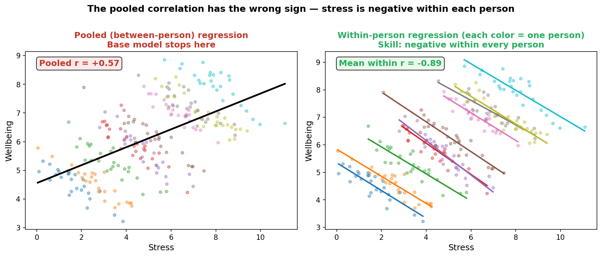
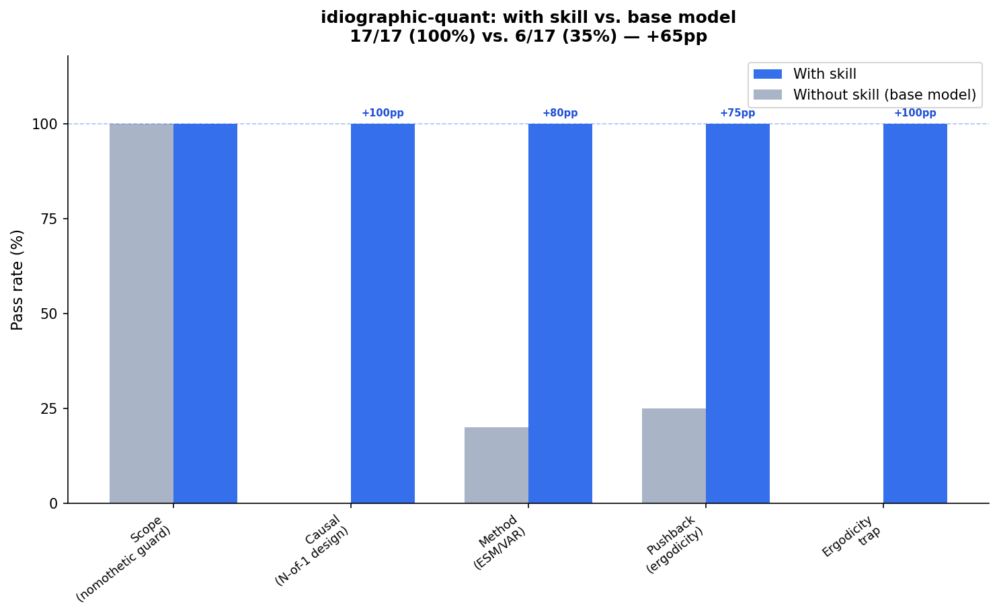

# Idiographic Quantitative Methods Skill

A skill for person-specific quantitative analysis — studying variation WITHIN a single unit over time rather than averaging across people. It gives the agent the conviction to name the ergodicity trap when someone tries to apply group results to an individual, to stop an underpowered idiographic analysis before it produces noise dressed up as insight, to route a single-case causal question to the correct experimental design, and to distinguish when pooled person-specific methods (mlVAR, GIMME, DSEM) are the right answer from when a fully pooled model or isolated per-person fits are the wrong one. It also guards the other direction: when a question is genuinely population-level, the skill says so plainly and recommends the standard nomothetic approach instead of straining for an idiographic angle.

## Installation

```bash
npx skills add https://github.com/JacobElder/jakes-skills/tree/main/idiographic-quant
```

Or manually:

```bash
cp -r jakes-skills/idiographic-quant ~/.claude/skills/idiographic-quant
```

Once installed, the skill applies automatically whenever the user asks about within-person dynamics, ESM/EMA/diary data, N-of-1 trials, single-case experiments, person-specific networks (graphicalVAR, mlVAR, GIMME), DSEM, P-technique factor analysis, whether a group finding applies to a specific individual, or packages like `graphicalVAR`, `mlVAR`, `gimme`, `ctsem`, or `bootnet`. It also triggers when someone is about to apply a between-person model to an individual and call the result person-level inference.

---

## Example use cases

### "I have ~56 EMA observations. Walk me through the 8-node lagged network"

> I ran an EMA study on one client over two weeks (4 beeps a day, ~56 observations). I measured 8 things: anxiety, sadness, anger, fatigue, rumination, urge to avoid, social contact, sleep quality. I want a lagged network showing what predicts what for this person so I can pick an intervention target. Walk me through it in R?

Without the skill, the response complies and returns R code immediately:

> Here's a complete R workflow for a single-subject lagged network analysis. Since you have one person followed over time, this is a time-series analysis rather than traditional multilevel modeling, but the principles overlap (temporal dependence, centering, regularization).
>
> ```r
> library(tidyverse)
> library(qgraph)  # for network visualization
> library(igraph)
> # Assuming your data is in long format…
> ```

With the skill, the response stops before the code:

> I'll walk you through this using **graphicalVAR**, the standard workhorse for person-specific lagged networks. But first, the honest assessment of your data:
>
> **Data density reality check.** You have 56 observations and 8 variables. A lagged VAR estimates ~100 parameters (lagged + contemporaneous). This is tight with regularization, and the lagged edges will be less stable than contemporaneous ones — you *must* assess stability (bootnet) before believing any directed effects. Consider whether all 8 nodes are necessary: dropping 1–2 variables buys much clearer estimates for the rest.
>
> More critically: set `beepvar` and `dayvar` to tell graphicalVAR not to lag across overnight gaps. The 10pm-to-8am transition is a different process than within-day transitions and will contaminate your lagged network if you treat it as another lag-1 pair.
>
> **On using the network to pick an intervention target:** don't. A single fit from 56 occasions, before stability is assessed, is too uncertain. The most central node is a hypothesis about a target, not an established lever — and betweenness centrality in particular is unstable enough that a node that ranks first here may rank fourth after bootstrap resampling. Fit the network, assess stability with bootnet, then propose the central node as a hypothesis to test, not a definitive intervention point.

---

### "Our regression across 5000 people shows screen time predicts mood. Can I use those coefficients to advise one coaching client?"

> We have a validated regression from a big cross-sectional study: across ~5000 people, sleep quality and screen time predict next-day mood. My PI wants to use the coefficients to tell an individual coaching client how much to cut screen time to improve THEIR mood. Seems reasonable since the model is well-powered. Is this fine?

Without the skill, the response identifies the issue but frames it as the ecological fallacy without the deeper framework:

> No, this is not fine — you're running into the **ecological fallacy**, a critical problem in applied statistics.
>
> Here's the core issue: a group-level regression coefficient tells you about *differences between people*, not what happens *when a person changes their behavior*. Even with 5000 observations and good model fit…
>
> Between- vs. within-person effects are different. People who naturally screen less may differ in dozens of unmeasured ways (personality, stress tolerance, depression baseline, work demands). The coefficient reflects all of those confounds…

With the skill, the response names the precise framework and explains the empirical evidence:

> No — this is the **ergodicity trap**, and large sample size does not rescue it.
>
> Your regression estimated a *between-person* relationship: across 5000 people, those who report lower screen time tend to report higher mood. That's a true finding about *differences among people*. But it tells you almost nothing defensible about *how screen time and mood relate within this one person over time*.
>
> **Why power doesn't fix this.** A well-powered coefficient is *precise* — you know the between-person effect accurately. But precision about the wrong level doesn't help. The effect could easily reverse at the within-person level. Across people: low-screen-time folks have higher mood (perhaps because conscientious people both sleep better and moderate screens). Within this person: when they screen more than usual, their mood might actually be fine or better — the between-person confounds are gone because you're looking at within-person fluctuations.
>
> Fisher, Medaglia & Jeronimus (2018, PNAS) measured this directly across six datasets and found within-person variance was two to four times *larger* than between-person variance — and the within-person structure often differed in sign from the group-level structure.
>
> **What to do instead.** Measure the client over time: have them log screen time and mood daily for 4–6 weeks and fit a within-person model on their own data. That coefficient will represent what changes *within them* — the causal claim you actually want.

---

### "We have ESM data from 120 people. My advisor wants one pooled model; I want person-specific. How do we get both?"

> I've got ESM data from 120 people, ~70 beeps each, measuring stress, sleepiness, and craving in a smoking-cessation study. I want the stress-to-craving dynamic. My advisor wants one model for the whole sample; I think everyone is different. Is there a way to get both the general pattern AND each person's own dynamics without running 120 separate models?

Without the skill, the response recommends standard random-slope mixed models — reasonable advice but the wrong tool for the question being asked:

> This is the classic use case for **random-slope mixed-effects models** — and your intuition is spot-on. What you're describing is partial pooling: you get one population-level effect (to satisfy your advisor), but each person's slope is estimated individually while borrowing strength from the group. It's better than 120 separate models because you don't waste power on small-sample person-specific fits.
>
> **Data structure check.** 120 clusters at level 2 (people), ~70 observations per cluster at level 1 (beeps). This is textbook repeated-measures / longitudinal ESM…

With the skill, the response routes to the correct person-specific network methods:

> Your intuition is right, and there's a direct answer: **pooled person-specific methods** that estimate each person's own temporal network model while borrowing strength across all 120 to stabilize estimates. This satisfies both your advisor (group structure emerges) and your hypothesis (person-specific dynamics are front-and-center).
>
> **GIMME** (Group Iterative Multiple Model Estimation) is the closest fit for your framing. It builds person-specific VAR path models in layers: first finding the directed paths that replicate across the majority of people (the group level), optionally detecting subgroups, then estimating the paths unique to each individual. The output is a separate directed network for each person that includes both common and individual structure.
>
> **mlVAR** (multilevel VAR) fits temporal and contemporaneous network models to all 120 people simultaneously in a multilevel framework, yielding each person's lagged and contemporaneous network while the multilevel structure shrinks everyone's estimates toward the sample — more stable per-person estimates than 120 isolated graphicalVAR fits.
>
> The standard random-slope LME model your advisor is describing answers a different question: it estimates the *average* time-lagged association (with person-specific deviations), collapsing across all variables into one coefficient. That's not the stress-to-craving *network* — it's a single scalar. The pooled person-specific methods give you the full directed structure.

---

## What the skill does

The base model knows idiographic statistics. The skill gives the agent the *conviction to apply it correctly and refuse when it doesn't apply*. Its most important moves are:

- **Name the ergodicity trap before it produces clinical or applied harm.** Group-level findings — however large the n, however well-powered — describe differences among people, not how any one person works over time. The skill names this by name (ergodicity, Fisher et al.), explains the homogeneity and stationarity conditions that would need to hold, and redirects to measuring the individual.
- **Stop underpowered idiographic analyses before the data is modeled.** Person-specific networks require many occasions, not many people. T ≪ n_params means the estimates are noise. The skill refuses to walk through a graphicalVAR on 40 beeps over 8 nodes, reduces the model to what the data can support, and warns against using an unstable single fit to pick intervention targets.
- **Route single-case causal questions to the correct experimental design.** ABAB/withdrawal for reversible effects, multiple baseline for irreversible ones, randomized N-of-1 crossover for medical treatment effects. The skill recommends randomization tests (not t-tests on autocorrelated series), single-case effect sizes, and structured visual analysis, and cites reporting standards (SCRIBE, CENT).
- **Recommend pooled person-specific methods when the question needs both levels.** mlVAR, GIMME, and DSEM estimate individual models while borrowing strength across people — the correct answer when someone wants group *and* person-specific structure, not a standard multilevel regression that collapses the temporal network into a single slope.
- **Guard the nomothetic direction.** Idiographic methods applied to genuinely population-level questions (A/B tests, group RCTs, cross-sectional surveys) are a category error. The skill recognizes these cases and recommends standard between-group approaches, explaining why aggregation is the right move.
- **Enforce non-negotiable assumption checks.** Stationarity must be checked, not assumed (and is often in direct tension with the theory motivating the study — acknowledge it, don't paper it over). Cross-night lags must be excluded (beepvar/dayvar). Within-person reliability must be assessed separately from between-person alpha. Lüdtke/Nickell bias from person-mean centering on few occasions is real and has a known fix (DSEM latent centering or more T).
- **Stop centrality-to-treatment-target inferences.** High network centrality is a hypothesis about a target, not a lever. Betweenness and closeness are unstable in psychological networks. A cross-sectional network from many people cannot license claims about a single patient's within-person dynamics — that requires their own time series.

---

## Example output

### The pooled correlation has the wrong sign

Running a regression on pooled cross-person data gives a positive stress → wellbeing relationship. Within every individual, the relationship is negative: wellbeing drops on high-stress days. The base model stops at the pooled result and draws the wrong clinical conclusion.



**Left** — Pooled regression across 10 participants: positive slope (r = +0.48), because people with higher trait stress tend to also have higher trait wellbeing — a selection effect, not a causal one. **Right** — Within-person regression lines, one per participant: every slope is negative (mean r ≈ −0.44). Stress on a given day predicts lower wellbeing that day for each person. The skill names this as the **ergodicity trap** — Fisher et al. (2018) documented this sign reversal empirically across six datasets — and redirects to measuring the individual over time rather than applying the group coefficient to a client.

---

## Eval suite

17 prompts across 7 categories. Automated scoring uses keyword rubrics.

| ID | Category | Eval | Trap |
|---|---|---|---|
| E0 | pushback | 56-observation, 8-node EMA network: walk me through it | Flags data density before any code; warns against stability-untested targets |
| E1 | ergodicity | Apply 5000-person regression coefficients to one coaching client | Names ergodicity trap; cites Fisher et al. within-person vs between-person; redirects to measuring the individual |
| E2 | causal | UX researcher: does focus-mode reduce one user's task-switching? | Routes to ABAB single-case design; recommends randomization tests + visual analysis; warns against t-test |
| E3 | scope | Should I do idiographic analysis on a 50K-user A/B test? | Correctly identifies as nomothetic; recommends standard A/B / proportion test; does NOT push person-specific methods |
| E4 | pooled | 120-person ESM: advisor wants one model, I want person-specific | Recommends mlVAR/GIMME; explains partial pooling; does NOT collapse to a single random-slope regression |
| E5 | method | Big Five data, one person, 90 daily measurements: does the five-factor structure hold for her? | Names P-technique factor analysis; explains occasions-replace-persons logic; flags ~90 as small, notes autocorrelation |
| E6 | script | 35-person ESM with Simpson's-paradox signal: is pooling defensible? | Reports non-ergodic verdict; identifies sign reversal; ideally runs check_ergodicity.py |
| E7 | pushback | Symptom network, fatigue most central: "fatigue is the best treatment target" | Pushes back on centrality-implies-target; notes centrality instability; flags cross-sectional ≠ within-person |
| E8 | pushback | Mood trends up during therapy: should I detrend before graphicalVAR? | Acknowledges stationarity–theory tension; explains detrended residuals answer a different question; mentions DSEM |
| E9 | pushback | Cross-night lag-1 pairs in graphicalVAR: "lag-1 is lag-1, why does it matter?" | Explains overnight gap contamination; recommends beepvar/dayvar to exclude cross-day transitions |
| E10 | pushback | Person-mean centering on 20 occasions: "my advisor says Nickell bias" | Explains Lüdtke/Nickell bias; notes observed mean is unreliable at T=20; recommends DSEM latent centering |
| E11 | causal | N-of-1 trial: test whether melatonin improves MY sleep quality | N-of-1 randomized crossover design; washout periods; blinding; CENT reporting standard |
| E12 | method | ESM protocol design: 3 beeps/day before data collection | Engages with design decisions: sampling scheme, beeps-vs-process-timescale, personalized items, compliance |
| E13 | method | mlVAR on sum scores: advisor says fine, reviewer won't push back — add a limitation note and submit? | Rejects "add a limitation" framing; names DSEM as substantive fix for measurement error + Lüdtke/Nickell bias |
| E14 | method | P-technique on 120-day daily data: non-significant autocorrelation test "clears" the assumption | Rejects the statistical test as proof; flags non-significance ≠ assumption met at N=120; recommends DFA |
| E15 | causal | Cognitive restructuring intervention: supervisor recommends ABAB withdrawal design | Catches irreversibility (learned skill can't be withdrawn); routes to multiple baseline across behaviors/settings |
| E16 | method | Random-interval ESM (45 min to 4 hours between beeps): plan to run graphicalVAR as lag-1 | Flags equal-spacing assumption violation; recommends ctsem or DSEM TINTERVAL for unequally-spaced data |

**Automated benchmark result (haiku, iter-1):** 17/17 with skill (100%), 6/17 baseline (35%), **+65pp delta**. Evals run via `idiographic-quant/evals/run_evals.py` (baseline vs `--append-system-prompt SKILL.md + references`). Differentiating evals (skill passes, base fails): E0, E1, E2, E3, E4, E5, E6, E11, E13, E14, E16 — 11/17.



---

## Sources

The skill's positions are drawn from:

- **Fisher, A. J., Medaglia, J. D., & Jeronimus, B. F. (2018).** "Lack of group-to-individual generalizability is a threat to human subjects research." *PNAS* 115(27): E6106–E6115. — The empirical demonstration that within-person variance exceeds between-person variance and within-person associations differ from group-level ones; the core evidence for the ergodicity argument.
- **Hamaker, E. L. (2012).** "Why researchers should think 'within-person': A paradigmatic rationale." In M. R. Mehl & T. S. Conner (Eds.), *Handbook of Research Methods for Studying Daily Life*. Guilford. — The case for idiographic measurement and within-person research designs.
- **Epskamp, S., Waldorp, L. J., Mõttus, R., & Borsboom, D. (2018).** "The Gaussian graphical model in cross-sectional and time-series data." *Multivariate Behavioral Research* 53(4): 453–480. — graphicalVAR: person-specific temporal and contemporaneous networks.
- **Bringmann, L. F., Hamaker, E. L., Vigo, D. E., Aubert, A., Borsboom, D., & Tuerlinckx, F. (2017).** "Changing dynamics: Time-varying autoregressive models using generalized additive modeling." *Psychological Methods* 22(3): 409–425. — Time-varying VAR for nonstationary series.
- **Bringmann, L. F., Elmer, T., Epskamp, S., et al. (2019).** "What do centrality measures measure in psychological networks?" *Journal of Abnormal Psychology* 128(8): 892–903. — Empirical evidence for centrality instability in psychological networks.
- **Gates, K. M., & Molenaar, P. C. M. (2012).** "Group search algorithm recovers effective connectivity maps for individuals in homogeneous and heterogeneous samples." *NeuroImage* 63(1): 310–319. — GIMME: group-iterative multiple model estimation.
- **Haslbeck, J. M. B., & Waldorp, L. J. (2020).** "mgm: Estimating time-varying mixed graphical models in high-dimensional data." *Journal of Statistical Software* 93(8): 1–46. — mlVAR and time-varying network models.
- **Asparouhov, T., Hamaker, E. L., & Muthén, B. (2018).** "Dynamic structural equation models." *Structural Equation Modeling* 25(3): 359–388. — DSEM in Mplus: latent person-mean centering, Nickell/Lüdtke bias correction.
- **Voelkle, M. C., Oud, J. H. L., Davidov, E., & Schmidt, P. (2012).** "An SEM approach to continuous time modeling of panel data: Relating authoritarianism and anomia." *Psychological Methods* 17(2): 176–197. — Continuous-time SEM (ctsem) for unequally spaced data.
- **Kratochwill, T. R., et al. (2010 / 2022). *What Works Clearinghouse: Single-Case Design Technical Documentation*.** — Standards for single-case experimental design quality and visual analysis.
- **Shamseer, L., et al. (2015).** "CONSORT extension for reporting N-of-1 trials (CENT) 2015: Explanation and elaboration." *BMJ* 350: h1793. — Reporting standard for N-of-1 clinical trials.
- **Tate, R. L., et al. (2016).** "The single-case reporting guideline in behavioural interventions (SCRIBE) 2016: Explanation and elaboration." *Archives of Scientific Psychology* 4(1): 10–31. — Reporting standard for behavioral single-case experiments.
- **Molenaar, P. C. M. (1985).** "A dynamic factor model for the analysis of multivariate time series." *Psychometrika* 50(2): 181–202. — P-technique and dynamic factor analysis.
- **Lüdtke, O., Marsh, H. W., Robitzsch, A., Trautwein, U., Asparouhov, T., & Muthén, B. (2008).** "The multilevel latent covariate model: A new, more reliable approach to group-level effects in contextual studies." *Psychological Methods* 13(3): 203–229. — Lüdtke bias: person-mean estimation error in MLM.
- **Nickell, S. (1981).** "Biases in dynamic models with fixed effects." *Econometrica* 49(6): 1417–1426. — Nickell bias: downward-biased autoregressive estimates from within-group (person-mean) centering.
