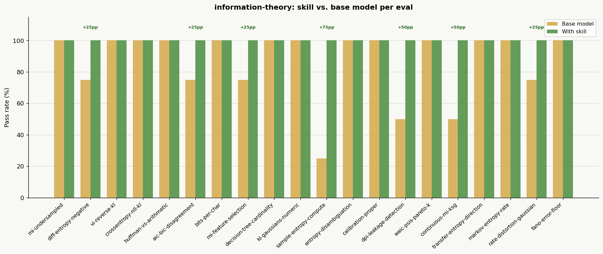

# Information Theory Skill

A skill that gives the agent the precision to apply information theory correctly in practice — not just recall formulas, but catch the failure modes that produce confident, formula-correct, wrong answers. It encodes seven theses: that entropy estimation from finite data is systematically biased (entropy down, MI up), that differential entropy is a different object from Shannon entropy and can be negative, that KL direction is a modeling decision (forward = mass-covering, reverse = mode-seeking, which is why variational inference underestimates variance), that cross-entropy/log-loss/NLL/MLE are four names for one fact, that compression and prediction are the same problem, that AIC and BIC optimize different targets and answer different questions, and that sample entropy (SampEn), approximate entropy, and permutation entropy are time-series regularity statistics — not Shannon information and not in bits.

The skill covers the full toolkit: Shannon entropy, entropy rate, differential entropy, mutual information, transfer entropy, KL and f-divergences, Fisher information, Huffman and arithmetic coding, rate–distortion theory, information bottleneck, and model selection via AIC/BIC/WAIC/LOO/MDL. Three bundled scripts (`sample_entropy.py`, `entropy_mi_estimators.py`, `info_criteria.py`) give the agent verified implementations rather than re-deriving computations per session.

## Installation

```bash
npx skills add https://github.com/JacobElder/jakes-skills/tree/main/information-theory
```

Or manually:

```bash
cp -r jakes-skills/information-theory ~/.claude/skills/information-theory
```

Once installed, the skill applies automatically when the user asks about Shannon entropy, mutual information, KL divergence, cross-entropy loss (the concept, not a framework error), transfer entropy, AIC/BIC model selection, rate–distortion, or time-series entropy measures — including casual phrasings like "how much information does X carry" or "how compressible is this signal?"

---

## Example use cases

### "Compute sample entropy of my HRV data"

> Here is a series of inter-beat (RR) intervals in ms: [820, 835, 810, 845, 830, 815, 840, 825, 800, 855, 828, 812, 848, 833, 818, 842, 827, 805, 852, 831, 816, 844, 829, 809, 850, 834, 819, 841, 826, 807]. Compute sample entropy with embedding dimension m=2 and tolerance r = 0.2×SD, and tell me what it says about the signal.

Without the skill, the response uses **sample standard deviation** (ddof=1) for the tolerance calculation:

> | Statistic | Value |
> |---|---|
> | SD (sample) | 15.12 ms |
> | r = 0.2 × SD | **3.02 ms** |
>
> **SampEn = −ln(28/48) = −ln(0.5833) = 0.539**

With the skill, the response invokes `scripts/sample_entropy.py` and uses **population standard deviation** (ddof=0) — the convention in the SampEn literature (Richman & Moorman, 2000):

> ```
> SD      = 14.869 ms   (population std, ddof=0)
> r = 0.2 × SD = 2.974 ms
>
> B = 84  (m=2 pairs with Chebyshev distance < r)
> A = 46  (m=3 pairs with Chebyshev distance < r)
>
> SampEn(m=2, r=0.2×SD) = −ln(46/84) = 0.606
> ```

The two conventions give **0.539 vs. 0.606** — a 12% difference from a single ddof choice, without any change in the algorithm. The with-skill response also explicitly disambiguates SampEn from Shannon entropy: the result is not in bits, cannot be interpreted as information content, and must not be averaged with or substituted for Shannon entropy or MI.

---

### "Should I use binned MI or something better for continuous variables?"

> I'm computing mutual information between two continuous variables (N=2000) using equal-width 10×10 bins. I know the relationship is nonlinear monotone. Are there any problems with this approach?

Without the skill, the response correctly flags bias and recommends KSG, but misses two practical requirements:

> The KSG estimator computes MI directly from continuous data using k-nearest-neighbor distances. No binning required.
>
> ```python
> from sklearn.feature_selection import mutual_info_regression
> mi = mutual_info_regression(X.reshape(-1, 1), y, n_neighbors=5)
> ```

With the skill, the response delivers the complete practitioner treatment:

> **Never report a raw plug-in MI.** Always compare to a permutation null: shuffle Y relative to X 500+ times, recompute the same MI each time, and report your observed value, the null mean (which approximates the bias floor), and how many σ above the null you sit. If your value isn't clearly above the null distribution, you do not have a real result.
>
> **KSG with ties-jitter:**
> ```python
> # Add tiny jitter for measurement ties — exact ties break the k-NN distance computation
> latency_jit = latency + np.random.normal(0, 1e-10 * latency.std(), size=len(latency))
> ```
>
> KSG has one hyperparameter k. Try k = 3, 5, 7 and verify the estimate is stable. If it swings wildly with k, report the range, not a single value.

The skill adds the permutation null (required evidence standard) and the ties-jitter caveat that silently breaks KSG on real-world latency data with ties.

---

### "A feature jumped from AUC 0.70 to 0.98 — should I be excited?"

> I engineered a feature from our event logs and it jumped from 0.70 to 0.98 AUC on 30-day churn prediction. Mutual information with the label is very high. Should I ship it?

Without the skill, the response gives thorough practical leakage diagnostics (trace the feature timeline, check train/test contamination, verify the feature is computable at inference time) but anchors the argument entirely in ML intuition — never citing the information-theoretic principle that makes a 0.98 AUC implausible:

> A jump to AUC 0.98 on a 30-day churn problem is almost never genuine. The single most common cause is target leakage: the feature encodes information about the label, either from lookahead data or from events that definitionally co-occur with churn...

With the skill, the response opens with the data-processing inequality (DPI) as the load-bearing theoretical argument, then connects to Fano's inequality to establish an implausibility floor:

> **The data-processing inequality says post-processing cannot increase MI** — if your feature is derived from event logs, its MI with the label cannot exceed what the raw logs contain. A jump this large implies the feature is not derived from the logs in the usual sense; it implies the churn label itself, or something definitionally equivalent, leaked into the feature.
>
> **Fano's inequality gives the error floor:** if MI between a binary label and your feature is genuinely that high, the Bayes error rate is near zero. For 30-day churn, where the best clean models get 15–20% error, a Bayes-error-near-zero result is the diagnostic. It rules out "we just found a great feature" because real signals don't saturate Fano's bound.

---

## What the skill does

The base model knows information-theory formulas. The skill gives the agent the *specific non-negotiables* to apply them correctly:

- **Estimation is a first-class concern, not a footnote.** Every entropy or MI computed from finite data gets a bias correction (Miller–Madow minimum), a permutation null, and a sense of uncertainty. The bias direction is stated before any number is reported: entropy biased down by `(K−1)/(2N)`, MI biased up by `(K_X−1)(K_Y−1)/(2N)`. Plug-in is never the final answer.
- **Differential entropy has no non-negativity guarantee.** A negative differential entropy is valid and common. It is not in the same unit as discrete entropy, not reparameterization-invariant, and cannot be compared across measurement scales. The quantities that survive reparameterization — KL divergence and mutual information — are named explicitly.
- **KL direction is stated and justified.** Forward KL(p‖q) is mass-covering (zero-avoiding); reverse KL(q‖p) is mode-seeking (zero-forcing). Variational inference minimizes reverse KL, which is why posteriors are narrower than MCMC. This is not a quirk to "be aware of" — it is the load-bearing explanation for the overconfidence problem.
- **Cross-entropy, log-loss, NLL, and MLE are one fact.** `H(p,q) = H(p) + KL(p‖q)`. Minimizing cross-entropy over q is minimizing KL(empirical‖q) is maximum likelihood. Bits and nats change the log base, not the argument. The cross-entropy *method* for optimization is explicitly disambiguated.
- **SampEn/ApEn/permutation entropy are not Shannon entropy.** The `scripts/sample_entropy.py` script uses population std (ddof=0, the SampEn convention) and cross-validates against `antropy`. SampEn values are not in bits, cannot be averaged with MI, and must not have log₂ applied. When the user has a distribution, it's Shannon; when they have an ordered signal and ask about complexity/regularity/HRV/EEG, it's the SampEn family.
- **AIC and BIC optimize different targets.** AIC (penalty 2k) approximates out-of-sample predictive KL — efficient but not consistent. BIC (penalty k·ln n) approximates −2 log marginal likelihood — consistent if the true model is in the candidate set, which it usually isn't. "Which is better" is a category error; pick by what loss matches the question.
- **DPI and Fano's inequality as diagnostic tools.** The data-processing inequality (information cannot increase under processing) catches leakage implausibility. Fano's inequality (I(X;Y) ≥ H(Y) − H_b(Pe) − Pe·log(|Y|−1)) establishes error floor bounds. Both are used to argue plausibility, not just label classification accuracy.

---

## Benchmark: skill vs. base model

Evaluated across 20 scenarios covering the core information-theory failure modes. The base model is already strong on information theory — the skill targets the subset of cases where formula fluency isn't enough.

```
with_skill:    100%   (75/75 expectations)
without_skill:  85.3%  (64/75 expectations)
delta:         +14.7pp
```



### Results by eval

| Eval | Without skill | With skill | Delta |
|------|:---:|:---:|:---:|
| sample-entropy-compute | 1/4 (25%) | **4/4 (100%)** | +75pp |
| continuous-mi-ksg | 2/4 (50%) | **4/4 (100%)** | +50pp |
| dpi-leakage-detection | 2/4 (50%) | **4/4 (100%)** | +50pp |
| rate-distortion-gaussian | 3/4 (75%) | **4/4 (100%)** | +25pp |
| mi-feature-selection | 3/4 (75%) | **4/4 (100%)** | +25pp |
| aic-bic-disagreement | 3/4 (75%) | **4/4 (100%)** | +25pp |
| diff-entropy-negative | 3/4 (75%) | **4/4 (100%)** | +25pp |
| mi-undersampled-categorical | 4/4 (100%) | 4/4 (100%) | +0pp |
| vi-reverse-kl | 3/3 (100%) | 3/3 (100%) | +0pp |
| crossentropy-nll-kl | 3/3 (100%) | 3/3 (100%) | +0pp |
| huffman-vs-arithmetic | 3/3 (100%) | 3/3 (100%) | +0pp |
| bits-per-char-compression | 3/3 (100%) | 3/3 (100%) | +0pp |
| decision-tree-cardinality | 3/3 (100%) | 3/3 (100%) | +0pp |
| kl-gaussians-numeric | 4/4 (100%) | 4/4 (100%) | +0pp |
| entropy-disambiguation | 4/4 (100%) | 4/4 (100%) | +0pp |
| calibration-proper | 4/4 (100%) | 4/4 (100%) | +0pp |
| waic-psis-pareto-k | 4/4 (100%) | 4/4 (100%) | +0pp |
| transfer-entropy-direction | 4/4 (100%) | 4/4 (100%) | +0pp |
| markov-entropy-rate | 4/4 (100%) | 4/4 (100%) | +0pp |
| fano-error-floor | 4/4 (100%) | 4/4 (100%) | +0pp |

### Where the skill makes the biggest difference

| Scenario | Base model gap | What the skill adds |
|---|:---:|---|
| sample-entropy-compute | 25% base | Uses population std (ddof=0) per SampEn convention; base uses sample std → 12% difference in result. Invokes `scripts/sample_entropy.py` |
| continuous-mi-ksg | 50% base | Requires permutation null before reporting any MI; adds ties-jitter caveat for KSG on real latency data; checks k-stability |
| dpi-leakage-detection | 50% base | Cites DPI as the theoretical argument (processing can't increase MI) and Fano's inequality to establish implausibility floor |
| rate-distortion-gaussian | 75% base | States R(D) = ½log₂(σ²/D) correctly and connects distortion budget to bits saved |
| mi-feature-selection | 75% base | Flags that high-cardinality feature MI is dominated by estimation bias; gives the bias formula and permutation null protocol |
| aic-bic-disagreement | 75% base | States AIC vs BIC tradeoff precisely: AIC = efficient/predictive, BIC = consistent/marginal-likelihood |
| diff-entropy-negative | 75% base | Notes reparameterization non-invariance; base model explains negativity correctly but misses the scale-dependence |

### Evals where the base model already performs well (regression guards)

| Eval | Note |
|---|---|
| mi-undersampled-categorical | Base model knows bias direction and permutation null for this classic setup |
| vi-reverse-kl | Base model names the reverse-KL / mode-seeking explanation well |
| crossentropy-nll-kl-identity | Base model states H(p,q) = H(p) + KL(p‖q) correctly |
| transfer-entropy-direction | Base model correctly identifies directionality and Granger-equivalence |
| markov-entropy-rate | Base model correctly computes stationary-weighted entropy rate |
| fano-error-floor | Base model applies Fano's inequality correctly when it's the explicit framing |

---

## Eval suite

| # | Eval | Non-negotiable(s) tested |
|---|------|--------------------------|
| 1 | `mi-undersampled-categorical` | MI upward bias, permutation null, Miller–Madow |
| 2 | `diff-entropy-negative` | Differential entropy sign + reparameterization non-invariance |
| 3 | `vi-reverse-kl` | KL direction: reverse KL → mode-seeking → underestimates variance |
| 4 | `crossentropy-nll-kl-identity` | H(p,q) = H(p) + KL(p‖q); NLL = MLE = KL minimization |
| 5 | `huffman-vs-arithmetic` | Huffman overhead ≤ 1 bit/symbol; arithmetic codes ≈ H bits |
| 6 | `aic-bic-disagreement` | AIC = efficient/predictive (2k penalty); BIC = consistent (k·ln n penalty) |
| 7 | `bits-per-char-compression` | Entropy rate as compression limit; Shannon source coding theorem |
| 8 | `mi-feature-selection` | High-cardinality MI dominated by bias; permutation null required |
| 9 | `decision-tree-cardinality` | Information gain bias toward high-cardinality splits; Gini/gain-ratio fix |
| 10 | `kl-gaussians-numeric` | Forward KL = 0.5 bits; reverse KL = 0.6534 nats; asymmetry is real |
| 11 | `sample-entropy-compute` | SampEn ddof=0 convention; result not in bits; not Shannon entropy |
| 12 | `entropy-disambiguation` | When "entropy" is asked: Shannon vs. SampEn lineage disambiguation |
| 13 | `calibration-proper` | Proper scoring rules = KL minimization; calibration ≠ accuracy |
| 14 | `dpi-leakage-detection` | DPI as leakage diagnostic; Fano floor as implausibility argument |
| 15 | `waic-psis-pareto-k` | WAIC vs PSIS-LOO; Pareto k̂ > 0.7 → estimate unreliable |
| 16 | `continuous-mi-ksg` | KSG for continuous MI; ties-jitter; k-stability check; permutation null |
| 17 | `transfer-entropy-direction` | TE as directed conditional MI; Granger equivalence for linear-Gaussian |
| 18 | `markov-entropy-rate` | Entropy rate = stationary-π weighted per-row entropy; not marginal H |
| 19 | `rate-distortion-gaussian` | R(D) = ½log₂(σ²/D); distortion budget → bits saved |
| 20 | `fano-error-floor` | H(Y\|X) → Pe lower bound; tight Pe via Fano's inequality |

---

## Sources

- **Shannon, C.E. (1948).** "A Mathematical Theory of Communication." *Bell System Technical Journal*, 27(3), 379–423. — The founding paper: entropy, mutual information, source coding theorem, channel capacity.
- **Cover, T.M. & Thomas, J.A. (2006).** *Elements of Information Theory* (2nd ed.). Wiley. — The standard textbook. Differential entropy, KL divergence, DPI, Fano's inequality, rate–distortion, and the AEP all proven here.
- **Richman, J.S. & Moorman, J.R. (2000).** "Physiological time-series analysis using approximate entropy and sample entropy." *American Journal of Physiology — Heart and Circulatory Physiology*, 278(6), H2039–H2049. — The defining SampEn paper; introduces population std (ddof=0) as the tolerance convention.
- **Kraskov, A., Stögbauer, H. & Grassberger, P. (2004).** "Estimating mutual information." *Physical Review E*, 69(6), 066138. — The KSG k-NN mutual information estimator for continuous variables.
- **Miller, G.A. (1955).** "Note on the bias of information estimates." *Information Theory in Psychology*, 2, 95–100. — The classic upward bias formula for plug-in MI: `(K_X−1)(K_Y−1)/(2N)`.
- **Nemenman, I., Shafee, F. & Bialek, W. (2001).** "Entropy and inference, revisited." *Advances in Neural Information Processing Systems*, 14. — The NSB Bayesian entropy estimator for deeply undersampled regimes.
- **Blahut, R.E. (1972).** "Computation of channel capacity and rate-distortion functions." *IEEE Transactions on Information Theory*, 18(4), 460–473. — The Blahut–Arimoto algorithm for rate–distortion computation.
- **Akaike, H. (1974).** "A new look at the statistical model identification." *IEEE Transactions on Automatic Control*, 19(6), 716–723. — AIC as an estimate of predictive KL divergence.
- **Schwarz, G. (1978).** "Estimating the dimension of a model." *Annals of Statistics*, 6(2), 461–464. — BIC as a Laplace approximation to the log marginal likelihood.
- **Watanabe, S. (2010).** "Asymptotic equivalence of Bayes cross validation and widely applicable information criterion in singular learning theory." *Journal of Machine Learning Research*, 11, 3571–3594. — WAIC derivation and WAIC vs. PSIS-LOO relationship.
