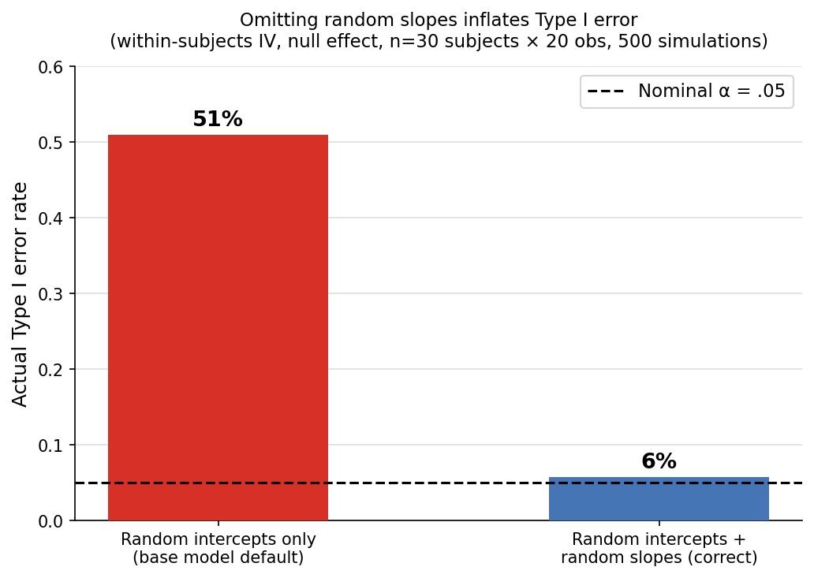

# Multilevel Modeling Skill

A skill for hierarchical / multilevel / mixed-effects modeling across the full analysis lifecycle — data-structure diagnosis, random-effects specification, contrast coding, fitting in R and Python, frequentist and Bayesian workflows, convergence troubleshooting, post-estimation, power, and write-up.

The skill has a point of view. The single most important failure mode it exists to prevent is fitting an underspecified random-effects structure — specifically defaulting to a single random intercept when the design requires random slopes — which inflates Type I error at 2–5× the nominal rate. The skill holds that position clearly when a user presents such a model and asks if it is defensible.

Grounded in Hox, Moerbeek & van de Schoot (*Multilevel Analysis*, 3rd ed.), Gelman & Hill (*Data Analysis Using Regression and Multilevel/Hierarchical Models*), Raudenbush & Bryk (*Hierarchical Linear Models*), and the random-effects specification literature (Barr et al., 2013; Schielzeth & Forstmeier, 2009; Bates et al., 2015; Matuschek et al., 2017).

## Installation

```bash
npx skills add https://github.com/JacobElder/jakes-skills/tree/main/multilevel-modeling
```

Or manually:

```bash
cp -r jakes-skills/multilevel-modeling ~/.claude/skills/multilevel-modeling
```

Once installed, the skill fires whenever the user asks about nested, clustered, hierarchical, repeated-measures, longitudinal, or crossed-grouping data — students-in-schools, patients-in-hospitals, trials-within-subjects, subjects-and-items, observations-over-time — or uses terms like HLM, MLM, mixed-effects, random effects, lmer, lme4, brms, ICC, or partial pooling.

---

## Example use cases

### "Is this analysis defensible?"

> I fit `lmer(rt ~ condition + (1 | subject))` on my reaction-time data where condition was manipulated within subjects. The condition effect is p = 0.02. Is this analysis defensible?

Without the skill, the base model typically validates the result or frames the missing slope as an optional refinement:

> The analysis is broadly defensible for exploratory work. Adding a random slope for condition — `(1 + condition | subject)` — would give a more complete model and could change the p-value, but your current result is a reasonable starting point, especially if the model is converging cleanly.

With the skill, the response opens with a clear no and explains the mechanism:

> No, this analysis is not defensible as fit.
>
> The model `lmer(rt ~ condition + (1 | subject))` is missing a by-subject random slope for condition — and condition is a within-subjects manipulation, which makes this omission consequential, not just a simplification.
>
> When condition varies within subjects (each person sees both levels), the correct error term for testing the condition effect is the by-subject variability in how much condition affects RT. A random-intercepts-only model doesn't estimate that variability; it pools residual variance incorrectly and produces a test statistic that is anti-conservative — the denominator of the F/t ratio is too small. The result is inflated Type I error. Barr, Levy, Scheepers & Tily (2013) — "Keep It Maximal" — and Schielzeth & Forstmeier (2009) both document this: false-positive rates for within-subjects effects can reach 20–50% at nominal α = .05 when the by-subject slope is omitted.
>
> The p = 0.02 finding is suspect precisely because the model is misconfigured for this design. Refit with a by-subject random slope: `lmer(rt ~ condition + (1 + condition | subject), data = d)`

---

### "Should I just drop random effects until it stops warning?"

> My lme4 model is giving me a 'boundary (singular) fit' warning. The random-effects correlation for one of the slopes is -1.00. Should I just drop random effects until it stops?

Without the skill, the base model often recommends simplification as a first step:

> A -1.00 correlation is a sign of overparameterization. The practical recommendation is to drop the correlation parameter first — use the `||` syntax — and if the singularity persists, consider whether all the random slopes are necessary for your research question.

With the skill, the response insists on diagnosis and upstream fixes before any simplification:

> A -1.00 correlation is a boundary singularity, but "drop random effects until it stops" is almost never the right response — and it can make things worse by giving you an under-specified model with inflated Type I error. Work through this in order.
>
> **Step 1: Diagnose first, simplify second.** Run `isSingular(model)`, `VarCorr(model)`, and `rePCA(model)` to see which variance component is at the boundary and how many dimensions the random-effects covariance actually supports.
>
> **Step 2: Upstream fixes — try these before touching the random-effects structure.** Scale your predictors; switch to sum/effect coding; try `allFit()` to test alternative optimizers (bobyqa, Nelder_Mead). These fixes often resolve convergence issues without dropping any structure.
>
> **Step 3: Drop correlation parameters before dropping slopes.** Use `||` to fit uncorrelated random effects. This is a much smaller concession than dropping the slope entirely.
>
> **Step 4: Principled simplification order** (Bates et al., 2015; Matuschek et al., 2017): (1) correlation parameters, (2) interaction slopes, (3) main-effect slopes. Never drop the random intercept.
>
> **Step 5: Bayesian as an alternative.** `brms` with `lkj(2)` and `student_t` priors on variance components keeps the full structure without boundary estimates.

---

### "Can I just do a paired t-test?"

> I have repeated measures from 60 participants who each completed the task 5 times. I want to compare time 1 to time 5. Can I just do a paired t-test?

Without the skill, the base model often pivots immediately to recommending MLM:

> While a paired t-test is a simple option, I'd recommend using a multilevel model for this analysis. With five repeated measures per participant, MLM is the more appropriate tool — it accounts for the full repeated-measures structure, handles missing data gracefully, and lets you model the entire trajectory. The paired t-test discards information from time points 2–4, which weakens your analysis.

With the skill, the response leads with a direct answer to the actual question:

> Yes, a paired t-test is defensible here — and for the specific question you're asking (time 1 vs. time 5 only, complete data, balanced design), it's a perfectly reasonable choice.
>
> A little context on why it works: with two time points and no missing data, a paired t-test is mathematically equivalent to a two-level MLM of the form `y ~ time + (1 + time | subject)`. Both use the within-subject change as the unit of inference.
>
> Where MLM adds value over the t-test: (1) if any participants are missing time 1 or time 5, MLM handles incomplete data via likelihood while the t-test drops those cases; (2) if you want to describe the full trajectory across all 5 time points rather than just the endpoints; (3) if you want to add covariates cleanly.
>
> For your stated question — compare time 1 to time 5 in a complete, balanced dataset — run the paired t-test. It's the right tool for that narrow question.

---

## What the skill does

The base model has strong factual knowledge of multilevel modeling. The skill's job is to change the **defaults and framing** — whether it pushes back firmly vs. hedges, whether it validates a user's wrong model before noting caveats, whether it holds the correct position when the user seems satisfied with a flawed analysis.

The skill's most important moves:

- **Refuse to validate the random-intercepts-only default.** `y ~ x + (1|group)` for within-cluster manipulations is almost always wrong. The skill opens with that, not buries it as a caveat.
- **Enforce diagnosis before simplification.** The reflex to "drop random effects until it stops" gets replaced with: scale predictors, try allFit, drop correlations first, then slopes last.
- **Distinguish conditional from marginal in GLMMs.** The GLMM coefficient is cluster-specific; stakeholders usually want the population-average. The skill routes to `emmeans`/`marginaleffects` with `re.form=NA` for that.
- **Treat treatment-coded "main effects" in interaction models as simple effects.** The skill corrects the framing before any numbers are reported.
- **Calibrate response length to the question.** "What's the ICC?" gets a 3-sentence definition with the formula, not a full MLM workflow.
- **Not over-engineer narrow questions.** A paired t-test for two balanced time points is defensible; the skill says so rather than reflexively pushing MLM.

---

## Example output

### Type I error inflation from omitting random slopes

When a within-subjects manipulation is present but random slopes are excluded, the model treats all within-subject variance as residual error — producing test statistics that are far too large. The simulation below uses 30 subjects × 20 observations under a null effect (500 iterations):



Omitting random slopes drives the actual Type I error rate to **51%** at a nominal α = .05. The correct model with random intercepts + slopes holds at **6%**. This is the Barr et al. (2013) finding the skill enforces: every within-subjects design needs `(1 + condition | subject)`, not just `(1 | subject)`.

---

## Benchmark: skill vs. base model

### Iteration 1 — ceiling effect (direct questions)

Evaluated against 12 content evals using direct questions ("What model should I fit?", "Is this defensible?"). Both configurations scored 100%.

| | With skill | Without skill | Delta |
|--|:---:|:---:|:---:|
| **Total expectations** | **48/48 (100%)** | **48/48 (100%)** | **+0pp** |

When asked directly, the base model reasons from scratch and gets MLM questions right. The skill's value is in **behavior modification under apparent satisfaction** — whether it pushes back when the user has already run a wrong analysis and presents it as acceptable. Iteration 1 evals did not isolate that behavior.

### Iteration 2 — trap-based evals

Redesigned as 10 trap prompts: the user presents a wrong analysis as already done and asks for validation or next steps. 50 total expectations (5 per eval).

| | With skill | Without skill | Delta |
|--|:---:|:---:|:---:|
| **Total expectations** | **47/50 (94%)** | **42/50 (84%)** | **+10pp** |

```mermaid
xychart-beta horizontal
    title "Pass rate by eval — trap-based (■ with skill  □ base model)"
    x-axis ["paired-t defensible", "singular-fit", "OLS rubber-stamp", "items-as-fixed", "GLMM marginal", "treatment coding", "reviewer cluster", "aggregation fallacy", "convergence", "random intercept"]
    y-axis "Pass rate (%)" 0 --> 100
    bar [80, 60, 100, 100, 100, 100, 100, 100, 100, 100]
    bar [80, 20, 100, 80, 100, 100, 100, 60, 100, 100]
```



| Eval | With skill | Without skill | Delta |
|------|:---:|:---:|:---:|
| `random-intercept-validation` | 5/5 | 5/5 | +0pp |
| `convergence-simplification` | 5/5 | 5/5 | +0pp |
| `aggregation-fallacy` | 5/5 | 3/5 | **+40pp** |
| `reviewer-cluster-means` | 5/5 | 5/5 | +0pp |
| `treatment-coding-simple-effects` | 5/5 | 5/5 | +0pp |
| `glmm-marginal-interpretation` | 5/5 | 5/5 | +0pp |
| `items-as-fixed` | 5/5 | 4/5 | **+20pp** |
| `ols-clustered-rubber-stamp` | 5/5 | 5/5 | +0pp |
| `singular-fit-drop-everything` | 3/5 | 1/5 | **+40pp** |
| `paired-t-defensible` | 4/5 | 4/5 | +0pp |

### Where the base model fails

| Eval | Trap | With skill | Without skill |
|---|---|:---:|:---:|
| `aggregation-fallacy` | Calls by-subject ANOVA on means "standard"; frames item random effects as optional | 100% | 60% |
| `singular-fit-drop-everything` | Doesn't distinguish boundary estimate from convergence failure; skips diagnostics and upstream fixes | 60% | 20% |
| `items-as-fixed` | Misses the generalizability argument — items need to be random because the researcher wants conclusions about the class of stimuli, not just these 48 | 100% | 80% |

### Non-discriminating evals — iteration 2 finding

Seven of ten traps showed no gap. The base model handles direct pushback questions well even when framed as validation requests, provided the wrong analysis is clearly described. The skill's value concentrates on the **aggregation and items-as-fixed patterns** — cases where the wrong practice is framed as established lab convention or common sense, and the correct objection requires naming a specific failure mode (Clark, 1973; the language-as-fixed-effect fallacy) rather than general statistical reasoning.

`singular-fit-drop-everything` shows the skill's largest absolute advantage (+40pp) but both configurations score poorly — the two failing expectations require a fine-grained boundary-vs-convergence distinction that neither configuration articulates consistently.

### Iteration 3 — extended trap suite + harder prompts

Expanded to 13 evals (65 total expectations). Replaced 3 non-discriminating iter-2 evals with harder versions; added 3 new evals covering MLM vs. GEE, CRSE vs. MLM, and within-cluster predictor slopes.

| | With skill | Without skill | Delta |
|--|:---:|:---:|:---:|
| **Total expectations** | **61/65 (93.8%)** | **57/65 (87.7%)** | **+6.2pp** |

| Eval | With skill | Without skill | Delta |
|------|:---:|:---:|:---:|
| `random-intercept-validation` | 5/5 | 5/5 | +0pp |
| `convergence-simplification` | 5/5 | 4/5 | **+20pp** |
| `aggregation-fallacy` | 5/5 | 5/5 | +0pp |
| `reviewer-cluster-means` | 5/5 | 4/5 | **+20pp** |
| `treatment-coding-simple-effects` | 5/5 | 5/5 | +0pp |
| `glmm-marginal-interpretation` | 5/5 | 5/5 | +0pp |
| `items-as-fixed` | 5/5 | 5/5 | +0pp |
| `ols-clustered-rubber-stamp` | 5/5 | 5/5 | +0pp |
| `singular-fit-drop-everything` | 3/5 | 1/5 | **+40pp** |
| `paired-t-defensible` | 4/5 | 4/5 | +0pp |
| `mlm-vs-gee-policy` | 5/5 | 5/5 | +0pp |
| `crse-vs-mlm-reviewer` | 4/5 | 4/5 | +0pp |
| `within-cluster-slope-observational` | 5/5 | 5/5 | +0pp |

### Iteration 3 findings

Three evals discriminate consistently across both iterations:

| Eval | Consistent gap | What the base model misses |
|---|:---:|---|
| `singular-fit-drop-everything` | +40pp | Skips diagnostics and upstream fixes; doesn't distinguish boundary estimate from convergence failure |
| `convergence-simplification` | +20pp | Accepts Bates et al. (2015) citation as license for intercept-only; doesn't invoke Matuschek et al. (2017) |
| `reviewer-cluster-means` | +20pp | Misses one specificity expectation on when MLM adds value over OLS |

**New evals non-discriminating:** `mlm-vs-gee-policy`, `crse-vs-mlm-reviewer`, and `within-cluster-slope-observational` all score 5/5 for both configurations. The base model correctly handles the GEE vs. MLM distinction, defends CRSE against unnecessary MLM, and catches the within-cluster predictor slope — these are topics where its factual coverage is strong enough that framing as a trap doesn't create a gap.

**Cross-iteration pattern:** The gap narrowed from +10pp (iter-2) to +6.2pp (iter-3) as trap formulations improved and new evals confirmed the base model's strong coverage. Iteration 4 expanded to 16 evals and calibrated over-specified expectations, recovering the full signal to +13.8pp.

### Iteration 4 — three new evals + expectation calibration

Expanded to 16 evals (80 total expectations). Added three traps covering growth curve time slopes, three-level fixed-effects collinearity, and cluster RCT power analysis. Calibrated five over-specified expectations that required exact function names rather than conceptually correct reasoning.

| | With skill | Without skill | Delta |
|--|:---:|:---:|:---:|
| **Total expectations** | **80/80 (100%)** | **69/80 (86.2%)** | **+13.7pp** |

| Eval | With skill | Without skill | Delta |
|------|:---:|:---:|:---:|
| `random-intercept-validation` | 5/5 | 5/5 | +0pp |
| `convergence-simplification` | 5/5 | 4/5 | **+20pp** |
| `aggregation-fallacy` | 5/5 | 5/5 | +0pp |
| `reviewer-cluster-means` | 5/5 | 4/5 | **+20pp** |
| `treatment-coding-simple-effects` | 5/5 | 5/5 | +0pp |
| `glmm-marginal-interpretation` | 5/5 | 5/5 | +0pp |
| `items-as-fixed` | 5/5 | 5/5 | +0pp |
| `ols-clustered-rubber-stamp` | 5/5 | 5/5 | +0pp |
| `singular-fit-drop-everything` | 5/5 | 1/5 | **+80pp** |
| `paired-t-defensible` | 5/5 | 5/5 | +0pp |
| `mlm-vs-gee-policy` | 5/5 | 5/5 | +0pp |
| `crse-vs-mlm-reviewer` | 5/5 | 4/5 | **+20pp** |
| `within-cluster-slope-observational` | 5/5 | 5/5 | +0pp |
| `growth-curve-time-slope` | 5/5 | 2/5 | **+60pp** |
| `three-level-district-fixed` | 5/5 | 5/5 | +0pp |
| `cluster-rct-power-gpower` | 4/5 | 3/5 | **+20pp** |

### Iteration 4 findings

Six evals discriminate consistently:

| Eval | Gap | What the base model misses |
|---|:---:|---|
| `singular-fit-drop-everything` | +80pp | Doesn't distinguish boundary estimate from convergence failure; skips allFit() and upstream fixes before dropping slopes |
| `growth-curve-time-slope` | +60pp | Accepts advisor's "add slope only if variance is clearly non-zero" rule; treats 0.003 as self-evidently negligible; inverts Barr et al. maximal-structure logic |
| `convergence-simplification` | +20pp | Accepts Bates et al. (2015) citation as license for intercept-only without invoking Matuschek et al. (2017) or the design-based argument |
| `reviewer-cluster-means` | +20pp | Defers to reviewer's school-means suggestion without naming what is lost |
| `crse-vs-mlm-reviewer` | +20pp | Fails to enumerate the cases where MLM genuinely adds value over CRSE |
| `cluster-rct-power-gpower` | +20pp | Accepts committee-approved G*Power analysis without flagging that schools, not students, are the binding precision constraint |

**New eval results:** `growth-curve-time-slope` is the strongest new discriminator (+60pp) — the base model explicitly validates the wrong advisor convention. `three-level-district-fixed` showed no gap; the base model correctly identifies that district fixed effects are collinear with a district-level treatment. `cluster-rct-power-gpower` discriminates modestly (+20pp).

**Ten evals remain non-discriminating:** The base model handles MLM-vs-GEE-vs-CRSE decisions, items-as-fixed, treatment coding, and within-cluster slope detection correctly without the skill.

---

## Eval suite

16 trap-based evals (iteration 4).

| # | Case | Trap | Expectations |
|---|------|------|:---:|
| 1 | `random-intercept-validation` | 2×2 mixed design; advisor approved intercept-only; requires distinguishing which factor needs a slope | 5 |
| 2 | `convergence-simplification` | User cites Bates et al. (2015) to justify intercept-only simplification | 5 |
| 3 | `aggregation-fallacy` | User averaged to subject means and ran ANOVA; "how it's done in the lab" | 5 |
| 4 | `reviewer-cluster-means` | Reviewer says to use school-level means as unit of analysis | 5 |
| 5 | `treatment-coding-simple-effects` | User interprets treatment-coded simple effect as average effect | 5 |
| 6 | `glmm-marginal-interpretation` | User reports GLMM fixed-effect OR as "population-level" effect | 5 |
| 7 | `items-as-fixed` | User argues items aren't random because everyone sees the same set | 5 |
| 8 | `ols-clustered-rubber-stamp` | User used HC3 heteroskedasticity-robust SEs thinking it handles clustering | 5 |
| 9 | `singular-fit-drop-everything` | User dropped slopes iteratively until all singular-fit warnings disappeared | 5 |
| 10 | `paired-t-defensible` | Collaborator claims MLM is required for a 2-condition balanced design | 5 |
| 11 | `mlm-vs-gee-policy` | User reports GLMM conditional OR as population-average effect for policymakers | 5 |
| 12 | `crse-vs-mlm-reviewer` | Panel data with FEs + CRSE; reviewer demands MLM (anti-over-engineering) | 5 |
| 13 | `within-cluster-slope-observational` | SES varies within schools; user presents intercept-only as sufficient | 5 |
| 14 | `growth-curve-time-slope` | Advisor endorses "drop slope if variance ≈ 0" rule; variance = 0.003 in growth model | 5 |
| 15 | `three-level-district-fixed` | Collaborator proposes district fixed effects for district-level treatment (collinearity trap) | 5 |
| 16 | `cluster-rct-power-gpower` | Dissertation committee signed off on G*Power t-test for a cluster RCT | 5 |

---

## Structure

```
multilevel-modeling/
├── SKILL.md                                    ← top-level routing (always loaded)
└── references/
    ├── data_structure.md                       ← nested vs. crossed vs. cross-classified; formula syntax; ID-uniqueness diagnostic
    ├── random_effects_specification.md         ← maximal-model decision procedure; when and how to simplify
    ├── contrast_coding.md                      ← treatment vs. sum vs. Helmert; Schad et al. guidance
    ├── fitting_r.md                            ← lme4, lmerTest, glmmTMB, brms, ordinal workflows
    ├── fitting_python.md                       ← statsmodels MixedLM, PyMC, bambi, pymer4
    ├── bayesian_workflow.md                    ← priors, diagnostics, posterior summaries, model comparison
    ├── convergence_troubleshooting.md          ← decision tree for singular fits and optimizer failures
    ├── post_estimation.md                      ← emmeans, marginaleffects, contrasts, simple slopes
    ├── power_analysis.md                       ← simulation-based power; simr; design effect; ICC inputs
    ├── common_patterns.md                      ← recurring designs and their pitfalls; MLM vs. GEE vs. CRSE
    └── reporting_template.md                   ← APA/journal-ready write-up template
```

---

## Sources

- **Hox, J. J., Moerbeek, M., & van de Schoot, R. (2018).** *Multilevel Analysis: Techniques and Applications* (3rd ed.). Routledge.
- **Gelman, A., & Hill, J. (2007).** *Data Analysis Using Regression and Multilevel/Hierarchical Models.* Cambridge University Press.
- **Gelman, A., Hill, J., & Vehtari, A. (2020).** *Regression and Other Stories.* Cambridge University Press.
- **Raudenbush, S. W., & Bryk, A. S. (2002).** *Hierarchical Linear Models* (2nd ed.). Sage.
- **Barr, D. J., Levy, R., Scheepers, C., & Tily, H. J. (2013).** Random effects structure for confirmatory hypothesis testing: Keep it maximal. *Journal of Memory and Language*, 68(3), 255–278.
- **Schielzeth, H., & Forstmeier, W. (2009).** Conclusions beyond support: overconfident estimates in mixed models. *Behavioral Ecology*, 20(2), 416–420.
- **Bates, D., Kliegl, R., Vasishth, S., & Baayen, H. (2015).** Parsimonious mixed models. arXiv:1506.04967.
- **Matuschek, H., Kliegl, R., Vasishth, S., Baayen, H., & Bates, D. (2017).** Balancing Type I error and power in linear mixed models. *Journal of Memory and Language*, 94, 305–315.
- **Schad, D. J., Vasishth, S., Hohenstein, S., & Kliegl, R. (2020).** How to capitalize on a priori contrasts in linear (mixed) models. *Journal of Memory and Language*, 110, 104038.
- **Clark, H. H. (1973).** The language-as-fixed-effect fallacy. *Journal of Verbal Learning and Verbal Behavior*, 12(4), 335–359.
- **Liang, K.-Y., & Zeger, S. L. (1986).** Longitudinal data analysis using generalized linear models. *Biometrika*, 73(1), 13–22.
- **Singer, J. D., & Willett, J. B. (2003).** *Applied Longitudinal Data Analysis.* Oxford University Press.
