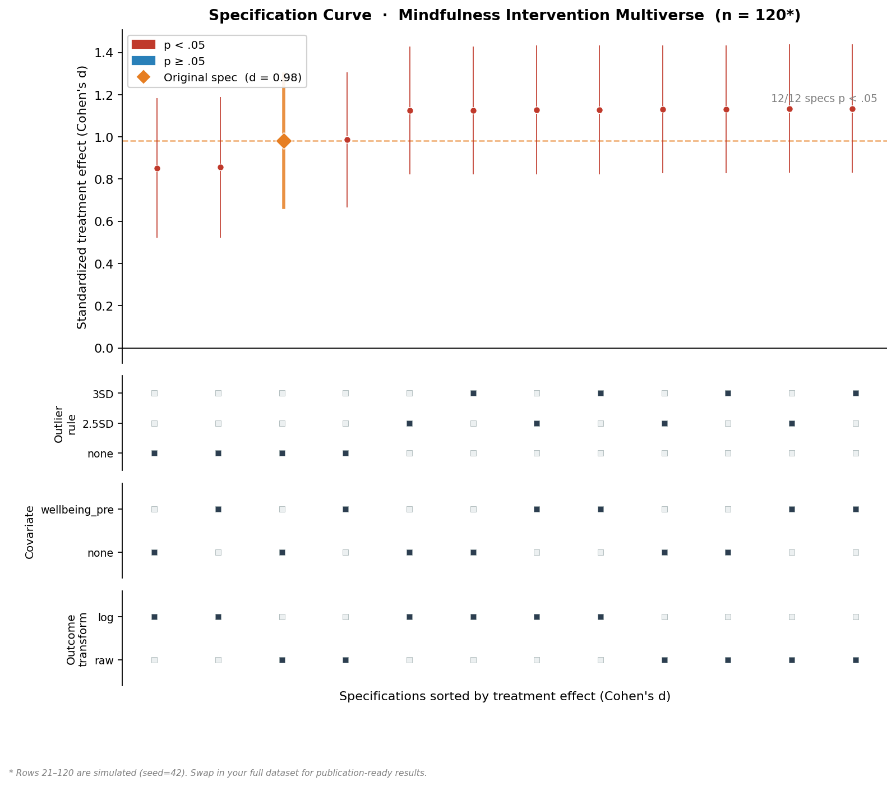

# Multiverse Analysis Skill

A skill that makes the agent *perform* a multiverse / specification-curve analysis, not just describe one. It front-loads decision elicitation and honest framing, then executes: enumerate the decision grid, run every universe, plot the specification curve, quantify which choices drive the variance, and do joint permutation inference.

## Installation

```bash
npx skills add https://github.com/JacobElder/jakes-skills/tree/main/multiverse-analysis
```

Or manually:

```bash
cp -r jakes-skills/multiverse-analysis ~/.claude/skills/multiverse-analysis
```

Once installed, the skill applies automatically whenever you ask about multiverse analysis, specification curve analysis, researcher degrees of freedom, the garden of forking paths, vibration of effects, or robustness to analytic choices — including when you are anxious that your result "might just be an artifact of how I set up the analysis," even without knowing those terms.

---

## What it does

The 7-step workflow: **pin the estimand → elicit decisions → flag nonsensical cells → run every universe → describe the distribution → quantify which decisions matter → do joint inference**.

Steps 1–3 are judgment and reasoning with you. Steps 4–7 are execution using the bundled `scripts/multiverse.py` engine (pandas / numpy / matplotlib only) or R's `multiverse` / `specr` packages. The skill ships with both a Python engine and R snippets; the R examples have been executed against `multiverse` 0.6.2 and `specr` 1.0.0.

---

## Worked example (15 lines)

```python
import sys; sys.path.insert(0, "~/.claude/skills/multiverse-analysis/scripts")
from multiverse import Multiverse, specification_curve, decision_importance, permutation_test
import pandas as pd

data = pd.read_csv("study.csv")   # columns: group (0/1), outcome, baseline

def analyze(data, c):
    df = data.copy()
    if c["outliers"]:
        z = (df["outcome"] - df["outcome"].mean()) / df["outcome"].std()
        df = df[z.abs() <= c["outliers"]]
    import statsmodels.formula.api as smf
    rhs = "group + baseline" if c["covariate"] else "group"
    m = smf.ols(f"outcome ~ {rhs}", data=df).fit()
    return {"estimate": m.params["group"], "p_value": m.pvalues["group"],
            "ci_low": m.conf_int().loc["group", 0], "ci_high": m.conf_int().loc["group", 1]}

mv = Multiverse(decisions={
    "outliers":  {"none": None, "3sd": 3.0, "2sd": 2.0},
    "covariate": {"no": False, "yes": True},
})
res = mv.run(analyze, data)
specification_curve(res, outfile="curve.png")
print(decision_importance(res))
permutation_test(mv, analyze, data, shuffle="group", n_perm=500)
```

---

## Example output

Running `specification_curve(res, outfile="curve.png")` on the mindfulness intervention example above produces this plot:



**Top panel** — Each point is one universe (specification), sorted by effect size. Red = p < .05, blue = p ≥ .05. The orange diamond marks the original published specification (d = 0.98). Here all 12 specifications are significant, and the effect holds across every combination of outlier rule, covariate choice, and outcome transform — a robust finding.

**Bottom panel** — Decision grid showing which analytical choices were active for each specification. Reading down a column tells you exactly what was varied. `decision_importance()` (not shown) would rank which row drives the most variance in effect size.

A fragile finding would show a mix of red and blue points and variance concentrated in one decision row — telling you exactly which analytical choice is load-bearing.

---

## Honest framing enforced

The skill is opinionated — deliberately so. It will tell you when your effect is fragile, warn against using the multiverse to cherry-pick a preferred specification, flag when mixing DVs on different scales makes the specification curve meaningless, and apply the "reasonable specification" criteria to curate the decision set rather than pad it.

---

## Benchmark

Evaluated on 6 tasks spanning the full skill surface. Graded with `claude-sonnet-4-6` executor and `claude-haiku-4-5` grader; an eval passes when all must-pass assertions hold and ≥ 80 % of scored assertions hold.

| Eval | Topic | Base | With skill |
|------|-------|------|------------|
| 0 | Full pipeline — robust effect | 5/6 ✓ | **6/6 ✓** |
| 1 | Fragile effect detection | 5/6 | **6/6 ✓** |
| 2 | Scale-comparability warning | 3/5 | **5/5 ✓** |
| 3 | Constraint elicitation (binary DV) | 4/5 | **5/5 ✓** |
| 4 | Correlation estimand setup | 4/5 | **5/5 ✓** |
| 5 | Adversarial cherry-picking pushback | 4/5 | **5/5 ✓** |
| **Total** | | 25/32 (78 %) | **32/32 (100 %)** |

**+21.9 pp** over the base model across all 6 evals.

---

## References

- Steegen, S., Tuerlinckx, F., Gelman, A., & Vanpaemel, W. (2016). Increasing transparency through a multiverse analysis. *Perspectives on Psychological Science*, 11(5), 702–712.
- Simonsohn, U., Simmons, J. P., & Nelson, L. D. (2020). Specification curve analysis. *Nature Human Behaviour*, 4(11), 1208–1214.
- Sarma, A., & Kay, M. (2020). Prior setting in practice: Strategies and rationales used in choosing prior distributions for Bayesian analysis. *CHI 2020*. (multiverse R package)
- Schweinsberg, M., et al. (2021). Same data, different conclusions. *Organizational Behavior and Human Decision Processes*, 165, 228–249.
