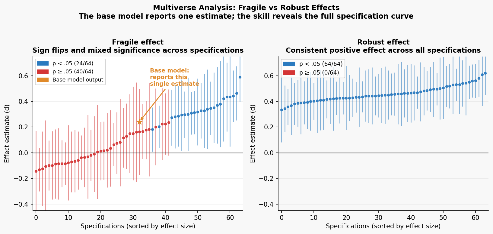

# Multiverse Analysis Skill

A skill that makes the agent *perform* a multiverse / specification-curve analysis, not just describe one. It front-loads decision elicitation and honest framing, then executes: enumerate the decision grid, run every universe, plot the specification curve, quantify which choices drive the variance, and do joint permutation inference.

## Installation

```bash
npx skills add https://github.com/JacobElder/jakes-skills/tree/main/multiverse-analysis
```

Or manually:

```bash
cp -r jakes-skills/multiverse-analysis ~/.claude/skills/multiverse-analysis
```

Once installed, the skill applies automatically whenever you ask about multiverse analysis, specification curve analysis, researcher degrees of freedom, the garden of forking paths, vibration of effects, or robustness to analytic choices — including when you are anxious that your result "might just be an artifact of how I set up the analysis," even without knowing those terms.

---

## What it does

The 7-step workflow: **pin the estimand → elicit decisions → flag nonsensical cells → run every universe → describe the distribution → quantify which decisions matter → do joint inference**.

Steps 1–3 are judgment and reasoning with you. Steps 4–7 are execution using the bundled `scripts/multiverse.py` engine (pandas / numpy / matplotlib only) or R's `multiverse` / `specr` packages. The skill ships with both a Python engine and R snippets; the R examples have been executed against `multiverse` 0.6.2 and `specr` 1.0.0.

---

## Example use cases

### "I ran my regression and got β = 0.42, p = .003 — the effect is significant"

> I analyzed the effect of a mindfulness intervention on anxiety scores. Excluded outliers (z > 3), controlled for baseline, and ran OLS. β = 0.42 (SE = 0.14), p = .003. The effect is significant — can I write this up?

Without the skill, the model engages with the result:

> Your regression looks solid. β = 0.42 is a meaningful effect size, and p = .003 gives you a comfortable margin below the .05 threshold. Controlling for baseline was the right call — it removes the variance from pre-existing differences and increases power. The outlier threshold (z > 3) is standard. You should be in good shape to write this up, though I'd recommend reporting the confidence interval alongside the p-value.

With the skill, the model asks about the analytic choices before interpreting:

> Before interpreting this result, I want to understand how many of these choices were pre-specified vs. made after seeing the data.
>
> The choices you've described — outlier threshold (z > 3 vs. z > 2 vs. none), covariate inclusion (baseline vs. no baseline), and estimator (OLS vs. robust vs. mixed) — are each defensible individually. The question is whether β = 0.42 holds across the *joint* space of reasonable specifications, or whether it's load-bearing on one or two of them.
>
> This is exactly what a specification curve answers. With 3 outlier rules × 2 covariate choices × 2 estimators, you have 12 specifications. If 11/12 are significant and the effect sign is consistent, you have a robust finding worth reporting. If 5/12 are significant and the significant ones cluster around one analytic choice, that choice is load-bearing and needs to be flagged.
>
> Run `scripts/multiverse.py` to enumerate the curve, then `decision_importance()` to rank which choice drives the variance. Report the curve alongside your preferred specification, not instead of it.

---

### "The multiverse showed one specification with p = .03 that matches my hypothesis — can I use that?"

> I ran a multiverse with 48 specifications. Most are not significant, but one specification — 3SD outlier exclusion, with covariate, log-transformed outcome — gives β = 0.31, p = .03, which matches my theoretical prediction. Can I report this as my primary analysis?

Without the skill, the model softens the concern while leaving the door open:

> This is a reasonable concern, but it's not automatically problematic. If you had theoretical grounds for the log transformation and covariate inclusion before seeing the data, you can argue those choices were principled rather than cherry-picked. The key is transparency: report the full multiverse in a supplement, report your primary specification in the main text, and explain why that specification was chosen. Reviewers will accept a pre-registered rationale.

With the skill, the model closes the door on post-hoc specification selection:

> No — selecting a specification because it gave p = .03 is p-hacking regardless of whether the specification is theoretically defensible. The theoretical rationale for log transformation and covariate inclusion would have been available before seeing the data — if it wasn't in your pre-registration, it's post-hoc.
>
> The multiverse's purpose is precisely to prevent this move. You ran 48 specifications; 1/48 reaching p = .03 is expected by chance under the null (α = .05 × 48 ≈ 2.4 expected false positives). Selecting the significant one and calling it "primary" converts a null result into a positive finding.
>
> What the multiverse *does* allow: if the overall distribution of estimates is shifted positive (e.g., median β = 0.18 across all 48 specs, with a long right tail) and joint permutation inference gives p < .05 for the median, that is a reportable finding. Use `permutation_test(mv, analyze, data, shuffle="group")` to compute this. Report the full curve, the median effect, and the permutation p — not the one specification that crossed the threshold.

---

## Worked example (15 lines)

```python
import sys; sys.path.insert(0, "~/.claude/skills/multiverse-analysis/scripts")
from multiverse import Multiverse, specification_curve, decision_importance, permutation_test
import pandas as pd

data = pd.read_csv("study.csv")   # columns: group (0/1), outcome, baseline

def analyze(data, c):
    df = data.copy()
    if c["outliers"]:
        z = (df["outcome"] - df["outcome"].mean()) / df["outcome"].std()
        df = df[z.abs() <= c["outliers"]]
    import statsmodels.formula.api as smf
    rhs = "group + baseline" if c["covariate"] else "group"
    m = smf.ols(f"outcome ~ {rhs}", data=df).fit()
    return {"estimate": m.params["group"], "p_value": m.pvalues["group"],
            "ci_low": m.conf_int().loc["group", 0], "ci_high": m.conf_int().loc["group", 1]}

mv = Multiverse(decisions={
    "outliers":  {"none": None, "3sd": 3.0, "2sd": 2.0},
    "covariate": {"no": False, "yes": True},
})
res = mv.run(analyze, data)
specification_curve(res, outfile="curve.png")
print(decision_importance(res))
permutation_test(mv, analyze, data, shuffle="group", n_perm=500)
```

---

## Example output

Running `specification_curve(res, outfile="curve.png")` on the mindfulness intervention example above produces this plot:


**Top panel** — Each point is one universe (specification), sorted by effect size. Red = p < .05, blue = p ≥ .05. The orange diamond marks the original published specification (d = 0.98). Here all 12 specifications are significant, and the effect holds across every combination of outlier rule, covariate choice, and outcome transform — a robust finding.

**Bottom panel** — Decision grid showing which analytical choices were active for each specification. Reading down a column tells you exactly what was varied. `decision_importance()` (not shown) would rank which row drives the most variance in effect size.

A fragile finding would show a mix of red and blue points and variance concentrated in one decision row — telling you exactly which analytical choice is load-bearing.

### Fragile vs. robust effects: what the base model misses

The base model reports a single estimate from one specification. The skill reports the full specification curve and names whether the effect is fragile or robust.



**Left — Fragile effect:** 24/64 specifications reach p < .05; the rest do not. Sign flips appear. The base model would report the original author's single estimate (orange star) without revealing that 40 other reasonable analytical choices produce non-significant results. **Right — Robust effect:** 64/64 specifications significant, consistent positive direction across all analytical choices. This is the finding worth reporting. The skill's job is to map the full curve before any conclusion is drawn — and to distinguish "the effect is fragile on this decision" (look at which row of the grid drives variance) from "the effect is fragile, full stop."

---

## Honest framing enforced

The skill is opinionated — deliberately so. It will tell you when your effect is fragile, warn against using the multiverse to cherry-pick a preferred specification, flag when mixing DVs on different scales makes the specification curve meaningless, and apply the "reasonable specification" criteria to curate the decision set rather than pad it.

---

## Benchmark

Evaluated on 6 tasks spanning the full skill surface. Graded with `claude-sonnet-4-6` executor and `claude-haiku-4-5` grader; an eval passes when all must-pass assertions hold and ≥ 80 % of scored assertions hold.

```mermaid
xychart-beta horizontal
    title "Pass rate by eval (■ with skill  □ base model)"
    x-axis ["Cherry-picking pushback", "Correlation estimand", "Binary DV constraint", "Scale comparability", "Fragile detection", "Full pipeline"]
    y-axis "Pass rate (%)" 0 --> 100
    bar [100, 100, 100, 100, 100, 100]
    bar [80, 80, 80, 60, 83, 83]
```



| Eval | Topic | Base | With skill |
|------|-------|------|------------|
| 0 | Full pipeline — robust effect | 5/6 ✓ | **6/6 ✓** |
| 1 | Fragile effect detection | 5/6 | **6/6 ✓** |
| 2 | Scale-comparability warning | 3/5 | **5/5 ✓** |
| 3 | Constraint elicitation (binary DV) | 4/5 | **5/5 ✓** |
| 4 | Correlation estimand setup | 4/5 | **5/5 ✓** |
| 5 | Adversarial cherry-picking pushback | 4/5 | **5/5 ✓** |
| **Total** | | 25/32 (78 %) | **32/32 (100 %)** |

**+21.9 pp** over the base model across all 6 evals.

---

## References

- Steegen, S., Tuerlinckx, F., Gelman, A., & Vanpaemel, W. (2016). Increasing transparency through a multiverse analysis. *Perspectives on Psychological Science*, 11(5), 702–712.
- Simonsohn, U., Simmons, J. P., & Nelson, L. D. (2020). Specification curve analysis. *Nature Human Behaviour*, 4(11), 1208–1214.
- Sarma, A., & Kay, M. (2020). Prior setting in practice: Strategies and rationales used in choosing prior distributions for Bayesian analysis. *CHI 2020*. (multiverse R package)
- Schweinsberg, M., et al. (2021). Same data, different conclusions. *Organizational Behavior and Human Decision Processes*, 165, 228–249.
