# nilearn fMRI Analysis Skill

A Claude skill for running reproducible fMRI analyses with [nilearn](https://nilearn.github.io). Covers four core workflows: first- and second-level GLM, functional connectivity, MVPA decoding, and brain visualization/reporting.

## Installation

```bash
npx skills add https://github.com/JacobElder/jakes-skills/tree/main/nilearn-fmri
```

Or manually:

```bash
git clone https://github.com/JacobElder/jakes-skills.git
cp -r jakes-skills/nilearn-fmri ~/.claude/skills/nilearn-fmri
```

Once installed, the skill triggers automatically whenever you ask about fMRI, BOLD, NIfTI files, BIDS datasets, GLM, contrasts, functional connectivity, resting-state, MVPA, decoding, or brain visualization — even without naming nilearn explicitly.

---

## Example use cases

**"Fit a first-level GLM on my task fMRI data"**

> I have a BIDS dataset at `/data/sub-01/func/sub-01_task-localizer_bold.nii.gz` with events in a matching `_events.tsv`. TR is 2s. Fit a first-level GLM and compute the contrast for `face > scrambled`.

Without the skill, base Claude often omits the HTML report, misses `make_glm_report`, and may leave out the TR or contrast vector. With the skill, Claude reads `references/glm.md` first, sets `t_r` explicitly, runs `compute_contrast`, saves the z-map, generates a full HTML report, and reports the actual z-range — not a placeholder.

---

**"I need FDR correction on my z-map"**

> Here's my z-map from a first-level GLM. Apply FDR correction at alpha=0.05 and tell me how many voxels survive and what the threshold was.

This is where the skill gap is largest. Without the skill, base Claude frequently uses `plot_stat_map(threshold=3.0)` — an arbitrary display cutoff — and reports that as "thresholding," never touching `threshold_stats_img`. With the skill, Claude calls `nilearn.glm.threshold_stats_img(z_map, alpha=0.05, height_control='fdr')`, reports the exact numeric FDR threshold, counts surviving voxels, and saves both the unthresholded and thresholded maps. The difference matters: a display threshold is not a statistical claim.

---

**"Run a group-level GLM on my first-level z-maps"**

> I have z-maps from 8 subjects. I want a one-sample t-test against zero (intercept-only design).

Without the skill, base Claude often averages the z-maps manually or reaches for `FirstLevelModel` a second time. With the skill, Claude instantiates `SecondLevelModel`, builds the intercept design matrix as a pandas DataFrame of ones, calls `.fit(zmaps, design_matrix=...)`, applies FDR correction, and produces a group z-map with documented parameters.

---

**"Extract seed-based connectivity from my resting-state data"**

> Use coordinates (-16, -16, 0) as a seed ROI with a 6mm sphere and correlate with every brain voxel.

Base Claude often doesn't know `NiftiSpheresMasker` exists. With the skill, Claude uses `NiftiSpheresMasker(seeds=[(-16, -16, 0)], radius=6, standardize='zscore_sample', t_r=...)`, extracts the seed timeseries alongside a whole-brain `NiftiMasker`, computes the dot-product correlation, and returns the result as a NIfTI via `inverse_transform`.

---

**"Decode face vs house with leave-one-run-out CV"**

> I have 120 trial volumes, face/house labels, and run numbers 0–5. Use SVC with leave-one-run-out.

Without the skill, base Claude frequently uses `sklearn.svm.SVC` and `cross_val_score` directly. This works for accuracy but loses everything nilearn adds: the brain-space weight map, `coef_img_` NIfTI, and the plotting pipeline. With the skill, Claude uses `nilearn.decoding.Decoder(estimator='svc', cv=LeaveOneGroupOut(), standardize='zscore_sample')`, passes `groups=` correctly, and saves the weight map — a complete deliverable, not just a number.

---

## The `standardize` trap

The most common nilearn mistake is `standardize=True`. It was deprecated in 0.13, emits a warning, and is removed in 0.15. The correct string is `standardize='zscore_sample'`. The skill enforces this in every masker and every `Decoder` call. Base Claude, trained on older examples, defaults to `True` in the majority of connectivity and decoding scenarios.

---

## Benchmark: skill vs. base Claude

Evaluated on 8 scenarios graded against 9–11 specific expectations each. All analyses run on bundled synthetic NIfTI fixtures — no internet download required.

```mermaid
xychart-beta horizontal
    title "Pass Rate by Eval (■ with skill  □ base Claude)"
    x-axis ["GLM: block design", "Connectivity (3 sub)", "MVPA decoding", "GLM: FDR threshold", "Group (2nd-level) GLM", "Seed connectivity", "NiftiMasker tSNR", "Multi-run GLM"]
    y-axis "Pass rate" 0 --> 1
    bar [1.0, 1.0, 1.0, 1.0, 1.0, 1.0, 1.0, 1.0]
    bar [0.90, 0.82, 0.60, 0.44, 0.38, 0.67, 0.60, 0.70]
```



| | With skill | Without skill |
|--|:---:|:---:|
| **Mean pass rate (all 8 evals)** | **1.00** | 0.64 |
| Std deviation | 0.00 | 0.17 |
| Min pass rate | 1.00 | 0.38 |

**+36 percentage point improvement overall.** The skill's impact concentrates on statistical inference APIs and API-correctness traps.

### Where the skill makes the biggest difference

| Eval | With skill | Without skill | Gap | Primary failure mode |
|------|:---:|:---:|:---:|---|
| Group (2nd-level) GLM | 1.00 | 0.38 | **+0.63** | Uses `FirstLevelModel` or manual average instead of `SecondLevelModel` |
| GLM: FDR thresholding | 1.00 | 0.44 | **+0.56** | Uses `plot_stat_map(threshold=...)` instead of `threshold_stats_img` |
| MVPA decoding | 1.00 | 0.60 | **+0.40** | Uses raw `sklearn.svm.SVC` — no weight map NIfTI, no `Decoder` |
| NiftiMasker tSNR | 1.00 | 0.60 | **+0.40** | Sets `detrend=True` which removes the mean, making tSNR ≈ 0 |
| Seed connectivity | 1.00 | 0.67 | **+0.33** | Doesn't use `NiftiSpheresMasker`; uses deprecated `standardize=True` |
| Multi-run GLM | 1.00 | 0.70 | **+0.30** | Uses `concat_imgs` instead of a list — loses run-level variance structure |

### Where base Claude already does well

| Eval | With skill | Without skill |
|------|:---:|:---:|
| GLM: block design | 1.00 | 0.90 |
| Connectivity (3 subjects) | 1.00 | 0.82 |

The pattern: base Claude handles standard GLM and connectivity pipelines reasonably well — these are well-documented in nilearn tutorials. The skill's value concentrates on (1) statistical inference APIs (`threshold_stats_img`, `SecondLevelModel`) that are less prominent in beginner examples, (2) deprecated argument traps (`standardize=True`, `detrend=True` for tSNR), and (3) less-known masker classes (`NiftiSpheresMasker`) that require knowing the right tool exists.

---

## Eval suite

8 evals run against bundled 16×16×16 synthetic NIfTI fixtures. Each fixture has injected signal at known locations, so correct code produces measurable results.

| # | Eval | Key APIs tested | Notable expectations |
|---|------|-----------------|----------------------|
| 1 | GLM: block design | `FirstLevelModel`, `compute_contrast`, `make_glm_report` | t_r set; HTML report; actual z-range reported |
| 2 | Connectivity: 3 subjects | `NiftiLabelsMasker`, `ConnectivityMeasure`, bandpass | `zscore_sample`; bandpass set; correct masker class |
| 3 | MVPA decoding | `nilearn.decoding.Decoder`, `LeaveOneGroupOut` | Decoder not raw sklearn; weight map NIfTI saved |
| 4 | GLM: FDR thresholding | `threshold_stats_img(height_control='fdr')` | Numeric threshold reported; not just plot argument |
| 5 | Group (2nd-level) GLM | `SecondLevelModel`, intercept design matrix | Correct model class; design matrix built as DataFrame |
| 6 | Seed-based connectivity | `NiftiSpheresMasker`, voxel-wise correlation | Sphere at correct MNI coords; `inverse_transform` used |
| 7 | NiftiMasker tSNR | `NiftiMasker(standardize=False, detrend=False)` | Mean preserved; median tSNR > 1; correct NIfTI output |
| 8 | Multi-run GLM | Multi-run `FirstLevelModel` with list interface | List not concat; single-run comparison; combined ≥ single |

Fixture ground truth:
- **GLM** (96 vol, TR=7s): block design, signal at voxel (4,8,8) → peak |z| ≈ 7
- **Connectivity** (150 vol, TR=2s, 3 subjects): 6-region atlas, r₁₂ = r₃₄ = 0.7, r₅₆ = −0.7
- **Decoding** (120 trials, 6 runs): face/house patterns in VT mask → SVC accuracy ≈ 0.99
- **Second-level** (8 subjects): z-maps with group signal at voxel (4,8,8) → group z-peak ≈ 5
- **Multi-run** (2 × 48 vol, TR=7s): same block design; combined model peak z ≥ single-run

---

## Structure

```
nilearn-fmri/
├── SKILL.md                      # Main skill: workflow + routing
├── references/                   # Loaded on demand for the workflow at hand
│   ├── datasets.md               #   built-in fetchers, BIDS, fMRIPrep, atlases
│   ├── glm.md                    #   first-level, second-level, contrasts, thresholding
│   ├── connectivity.md           #   maskers, ConnectivityMeasure, seed-based
│   ├── decoding.md               #   Decoder, MVPA, searchlight, weight maps
│   └── visualization.md          #   static plots, interactive views, reports
├── scripts/                      # Parameterized end-to-end helpers
│   ├── run_first_level_glm.py
│   ├── run_second_level_glm.py
│   ├── extract_connectome.py
│   ├── run_decoder.py
│   └── make_report.py
└── evals/
    ├── evals.json                # 8 tests covering all four workflows
    └── files/
        ├── make_fixtures.py      # generates core synthetic NIfTIs
        ├── make_extra_fixtures.py# generates second_level + multirun fixtures
        ├── glm/                  # bold, events, brain_mask, anat
        ├── connectivity/         # 3 subjects, atlas, confounds
        ├── decoding/             # bold, labels, vt_mask
        ├── second_level/         # 8 subject z-maps + brain_mask
        └── multirun/             # 2 runs, events, brain_mask
```

## Requirements

```bash
pip install nilearn nibabel scipy pandas matplotlib scikit-learn
```

## Running the eval fixtures

```bash
cd evals/files
python make_fixtures.py        # GLM, connectivity, decoding
python make_extra_fixtures.py  # second-level, multi-run
```

---

## Sources

- **[nilearn documentation](https://nilearn.github.io)** — API reference, user guide, and examples. Canonical reference for all masker classes, GLM, decoding, and plotting.
- **[nilearn changelog](https://github.com/nilearn/nilearn/blob/main/CHANGES.rst)** — 0.13–0.15 migration notes are the source for the `standardize` deprecation and `make_glm_report` → `generate_report` transition.
- **[BIDS specification](https://bids-specification.readthedocs.io)** — file naming conventions referenced in BIDS-aware workflows.
- **[fMRIPrep documentation](https://fmriprep.org)** — confound TSV structure and `load_confounds_strategy` guidance.
- **[Poldrack, Mumford & Nichols, *Handbook of Functional MRI Data Analysis* (2011)](https://www.cambridge.org/core/books/handbook-of-functional-mri-data-analysis/8EDF966C65811FCCC306F7C916228529)** — GLM, contrast estimation, and multiple-comparison correction.
