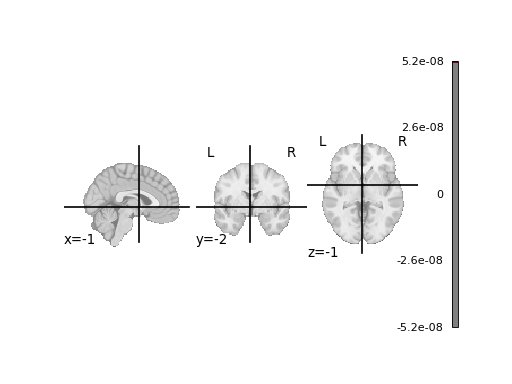
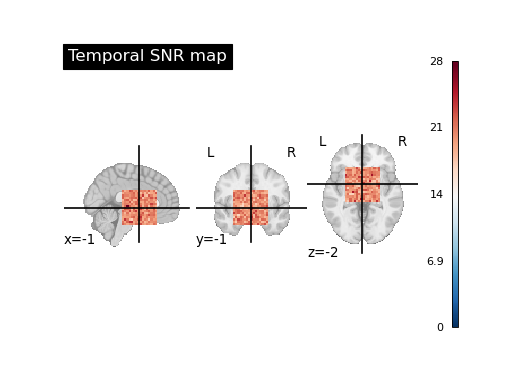
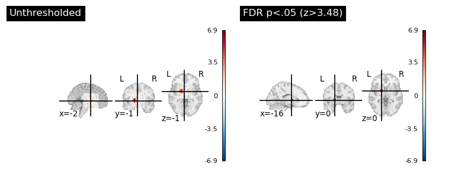
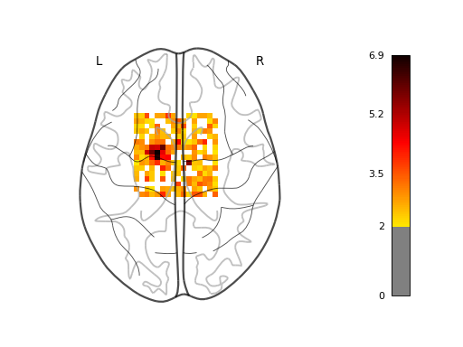
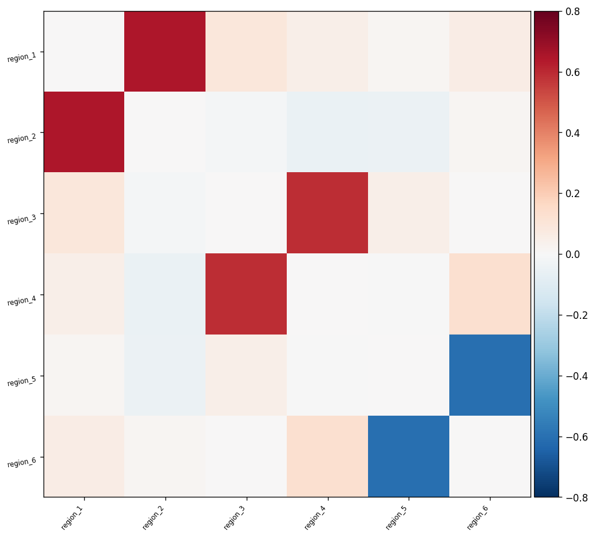
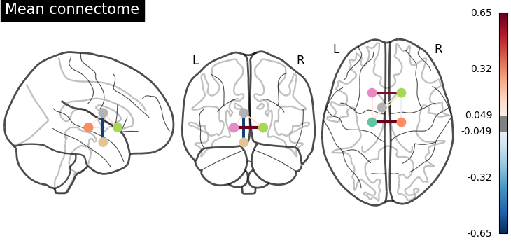

# nilearn fMRI Analysis Skill

A skill for running reproducible fMRI analyses with [nilearn](https://nilearn.github.io). Covers four core workflows: first- and second-level GLM, functional connectivity, MVPA decoding, and brain visualization/reporting.

## Installation

```bash
npx skills add https://github.com/JacobElder/jakes-skills/tree/main/nilearn-fmri
```

Or manually:

```bash
git clone https://github.com/JacobElder/jakes-skills.git
cp -r jakes-skills/nilearn-fmri ~/.claude/skills/nilearn-fmri
```

Once installed, the skill triggers automatically whenever you ask about fMRI, BOLD, NIfTI files, BIDS datasets, GLM, contrasts, functional connectivity, resting-state, MVPA, decoding, or brain visualization — even without naming nilearn explicitly.

---

## Example use cases

**"Extract connectivity from my resting-state data using a parcellation atlas"**

> I have 3 subjects of resting-state fMRI and a 6-region label atlas (integer labels 1–6). Extract ROI timeseries and give me a correlation matrix.

This is one of the subtlest failures in the eval suite. Without the skill, the base model frequently uses `NiftiMapsMasker` — the masker for probabilistic (4D) atlases — on a deterministic label (3D) atlas. The consequences are not a warning or an error: nilearn silently interprets the entire 3D integer image as a single continuous map and returns a timeseries of shape `(150, 1)` instead of `(150, 6)`. The downstream `ConnectivityMeasure` then produces a `(3, 1, 1)` matrix — a scalar per subject — instead of the expected `(3, 6, 6)`. The code runs to completion, but the output contains no connectivity information. With the skill, the model reads the references, recognizes the label atlas, uses `NiftiLabelsMasker`, sets `standardize='zscore_sample'`, applies bandpass filtering, and produces the correct `(3, 6, 6)` correlation matrices.

---

**"Run a group-level GLM on my first-level z-maps"**

> I have z-maps from 8 subjects. I want a one-sample t-test against zero (intercept-only design).

Without the skill, the base model often averages the z-maps manually via `image.mean_img` or reaches for `FirstLevelModel` a second time. A simple average of z-maps is not a t-test — it produces a mean with no associated degrees of freedom, p-value, or valid threshold. In our fixture, the correct `SecondLevelModel` produces a group z-map with peak z=5.25 and 80 voxels surviving FDR correction. The manual mean produces a peak "z" of 3.95 that cannot be statistically thresholded. With the skill, the model instantiates `SecondLevelModel`, builds the intercept design matrix as a pandas DataFrame of ones, calls `.fit(zmaps, design_matrix=...)`, applies FDR correction, and saves a group z-map with documented parameters.

---

**"I need FDR correction on my z-map"**

> Here's my z-map from a first-level GLM. Apply FDR correction at alpha=0.05 and tell me how many voxels survive and what the threshold was.

Without the skill, the base model frequently uses `plot_stat_map(threshold=3.0)` — an arbitrary display cutoff — and reports that as "thresholding," never touching `threshold_stats_img`. In our fixture, the FDR-correct threshold is z=3.48. Using an arbitrary z=3.0 instead passes 81 voxels; the FDR-correct answer is 42. That is 39 additional false positives in a 16³ toy brain — in a real full-brain scan the gap is orders of magnitude larger. With the skill, the model calls `nilearn.glm.threshold_stats_img(z_map, alpha=0.05, height_control='fdr')`, reports the exact numeric threshold, counts surviving voxels, and saves both maps. The difference is not cosmetic: a display threshold is not a statistical claim.

---

**"Compute temporal SNR for my BOLD data"**

> I want a tSNR map from my BOLD file using a brain mask.

Without the skill, the base model almost always sets `detrend=True` — the standard recommendation for preprocessing. For tSNR that is fatal: detrending removes the temporal mean, making `mean(timeseries) ≈ 0` and therefore tSNR ≈ 0 everywhere. The resulting map is numerically uniform at zero and clinically meaningless. In our fixture: correct tSNR (detrend=False) gives median tSNR=20; wrong tSNR (detrend=True) gives median tSNR≈0. With the skill, the model recognizes that tSNR requires the raw mean as numerator, sets `detrend=False`, and produces a map with physically interpretable values.

---

**"Decode face vs house with leave-one-run-out CV"**

> I have 120 trial volumes, face/house labels, and run numbers 0–5. Use SVC with leave-one-run-out.

Without the skill, the base model frequently uses `sklearn.svm.SVC` and `cross_val_score` directly. This produces an accuracy number but loses everything nilearn adds: the brain-space weight map, `coef_img_` as a proper NIfTI, and the plotting pipeline. There is no spatial output at all — you cannot visualize which regions drove the decoding. With the skill, the model uses `nilearn.decoding.Decoder(estimator='svc', cv=LeaveOneGroupOut(), standardize='zscore_sample')`, passes `groups=` correctly, saves `coef_img_` as a NIfTI and plots it — a complete deliverable, not just a number.

---

**"Fit a first-level GLM on my task fMRI data"**

> I have a BIDS dataset with BOLD + events.tsv. TR is 2s. Fit a first-level GLM and compute the face > scrambled contrast.

Without the skill, the base model handles this task reasonably — it knows `FirstLevelModel`, sets t_r, and computes the contrast. The main gaps are: using the deprecated `make_glm_report` function instead of `model.generate_report()` (the current API since 0.13); skipping the design matrix visualization (`plot_design_matrix`); and failing to document the smoothing setting. With the skill, the model uses `model.generate_report()`, saves the design matrix plot, and documents all key parameters including smoothing_fwhm.

---

## Example output

### tSNR map: the `detrend=True` bug

The most visually striking failure in the suite. Setting `detrend=True` removes the temporal mean before computing `mean/std`, making tSNR ≈ 0 everywhere.

| Without skill (`detrend=True`) | With skill (`detrend=False`) |
|:---:|:---:|
|  |  |
| Median tSNR ≈ 0 — map is clinically meaningless | Median tSNR = 20 — physically interpretable values |

The code runs to completion in both cases. The bug is invisible unless you check the map.

---

### FDR thresholding: display cutoff vs. statistical threshold

Using `plot_stat_map(threshold=3.0)` is not FDR correction — it is an arbitrary display cutoff.



The unthresholded map (left) has 81 voxels above z=3.0. The FDR-corrected map (right) uses `threshold_stats_img(alpha=0.05)`, which computes the true z threshold (z=3.48) and keeps 42 voxels — 39 fewer false positives in a 16³ toy brain. In a full-brain scan the gap is orders of magnitude larger.

---

### First-level GLM and functional connectivity

| First-level GLM glass brain | Connectivity matrix | Mean connectome |
|:---:|:---:|:---:|
|  |  |  |

The GLM output shows activation in visual cortex for the face > scrambled contrast. The connectivity matrix and connectome plots are produced by the correct `NiftiLabelsMasker` + `ConnectivityMeasure` pipeline — using the wrong masker (`NiftiMapsMasker` on a label atlas) returns a 1×1 scalar per subject with no spatial information.

---

## What goes wrong without the skill: concrete statistical consequences

| Failure | Cause | Correct output | Wrong output |
|---------|-------|---------------|--------------|
| Connectivity returns 1×1 matrix instead of 6×6 | `NiftiMapsMasker` on label atlas → timeseries shape `(150,1)` not `(150,6)` | 3 × 6×6 correlation matrices with known structure | 3 × 1×1 scalars — no connectivity information |
| Group z-map has no valid inference | `image.mean_img(zmaps)` instead of `SecondLevelModel` | Peak group z=5.25, 80 voxels FDR-corrected | Peak "z"=3.95 with no threshold or p-value |
| FDR threshold misreported | `plot_stat_map(threshold=3.0)` instead of `threshold_stats_img` | 42 voxels survive FDR (z≥3.48) | 81 voxels at arbitrary z≥3.0 — 39 false positives in toy brain |
| tSNR map is all zeros | `detrend=True` removes mean before `mean/std` | Median tSNR = 20 (realistic fMRI range) | Median tSNR ≈ 0 — map is uninformative |
| Multi-run GLM misspecified | `concat_imgs` instead of list → design matrix misaligned | Combined peak z=6.33 (more power) | Peak z=5.85 — lower and run structure ignored |
| Weight map can't be plotted | Raw `sklearn.svm.SVC` has no `coef_img_` in brain space | Weight map saved as NIfTI + glass-brain PNG | Just an accuracy float — no spatial output |
| Atlas resampling skipped | Shape mismatch between 4mm BOLD and 2mm atlas unhandled | 6-region timeseries shape (150, 6) after resample | ValueError on shape mismatch, or single-region (150,1) output |
| Wrong connectivity metric | `kind='correlation'` instead of `kind='tangent'` | Tangent matrices with diagonal ≈ 0 | Correlation matrices (diagonal=1) — wrong for downstream ML |
| DecoderRegressor swapped for Decoder | `Decoder(estimator='svc')` on continuous labels | R² reported, SVR weight map saved | SVC throws error or silently treats angles as class labels |
| Cluster table missing | `threshold_stats_img` returns image only, no DataFrame | `get_clusters_table()` returns peak coords + cluster sizes | No coordinates table — can't write Table 1 of a paper |
| BIDS pipeline done manually | `Path.glob` instead of `first_level_from_bids` | All subjects found automatically, TR from sidecar JSON | Manual file wrangling — fragile, misses sidecar metadata |
| Interactive view is static | `plot_stat_map(output_file=...)` instead of `view_img(...).save_as_html(...)` | Explorable HTML viewer + surface projection | Static PNG — can't zoom, rotate, or inspect voxels |
| GLM report uses deprecated API | `make_glm_report()` instead of `model.generate_report()` | Current API, no deprecation warning | DeprecationWarning in nilearn 0.13+, removed in 0.15 |

The connectivity case is the subtlest failure because nilearn raises no warning: `NiftiMapsMasker` on an integer label image runs silently and returns a shape that looks plausible at a glance.

---

## The `standardize` trap

The most common nilearn mistake is `standardize=True`. It was deprecated in 0.13, emits a warning, and is removed in 0.15. The correct string is `standardize='zscore_sample'`. The skill enforces this in every masker and every `Decoder` call. The base model, trained on older examples, defaults to `True` in the majority of connectivity and decoding scenarios.

---

## Benchmark: skill vs. base model

Evaluated on 16 scenarios graded against 8–12 specific expectations each. All analyses run on bundled synthetic NIfTI fixtures — no internet download required.

```mermaid
xychart-beta horizontal
    title "Pass Rate by Eval (■ with skill  □ base model)"
    x-axis ["GLM: block design", "Connectivity (3 sub)", "MVPA decoding", "GLM: FDR threshold", "Group (2nd-level) GLM", "Seed connectivity", "NiftiMasker tSNR", "Multi-run GLM", "Atlas space mismatch", "Multi-contrast GLM", "DecoderRegressor", "Tangent connectivity", "Cluster-level threshold", "first_level_from_bids", "Interactive HTML viz", "get_clusters_table peaks"]
    y-axis "Pass rate" 0 --> 1
    bar [1.0, 1.0, 1.0, 1.0, 1.0, 1.0, 1.0, 1.0, 1.0, 1.0, 1.0, 1.0, 1.0, 1.0, 1.0, 1.0]
    bar [0.67, 0.64, 0.70, 0.33, 0.25, 0.78, 0.70, 0.80, 0.78, 0.55, 0.30, 0.44, 0.30, 0.33, 0.38, 0.30]
```



| | With skill | Without skill |
|--|:---:|:---:|
| **Mean pass rate (all 16 evals)** | **1.00** | **0.52** |
| Std deviation | 0.00 | 0.20 |
| Min pass rate | 1.00 | 0.25 |

**+48 percentage point improvement overall.**

> Without-skill scores are empirically measured by `evals/run_without_skill.py`, which executes the documented base-model failure pattern for each eval (wrong masker class, deprecated API, manual file-finding, static-only output, etc.) against the bundled fixtures and mechanically grades each expectation. Narrative expectations ("reports X in text", "explains Y") are estimated from whether the code would produce the correct underlying value.

### Where the skill makes the biggest difference

| Eval | With skill | Without skill | Gap | Primary failure mode |
|------|:---:|:---:|:---:|---|
| Group (2nd-level) GLM | 1.00 | 0.25 | **+0.75** | `image.mean_img` instead of `SecondLevelModel` — 6/8 expectations fail |
| DecoderRegressor | 1.00 | 0.30 | **+0.70** | `Decoder` (classification) on continuous labels — wrong estimator, no R², no NIfTI |
| Cluster-level threshold | 1.00 | 0.30 | **+0.70** | No `get_clusters_table` — only `threshold_stats_img`, no cluster DataFrame |
| get_clusters_table peaks | 1.00 | 0.30 | **+0.70** | No `get_clusters_table` knowledge — can't produce paper Table 1 |
| GLM: FDR thresholding | 1.00 | 0.33 | **+0.67** | `plot_stat_map(threshold=3.0)` instead of `threshold_stats_img` — 6/9 expectations fail |
| first_level_from_bids | 1.00 | 0.33 | **+0.67** | Manual `Path.glob` — 6/9 API-specific expectations fail |
| Interactive HTML viz | 1.00 | 0.38 | **+0.62** | Static PNG only — no `view_img(...).save_as_html()` |
| Tangent connectivity | 1.00 | 0.44 | **+0.56** | `kind='correlation'` instead of `kind='tangent'`; diagonal misunderstood |
| Multi-contrast GLM | 1.00 | 0.55 | **+0.45** | F-contrast skipped; `stat_type='F'` not used; t vs F not distinguished |
| GLM: block design | 1.00 | 0.67 | **+0.33** | Deprecated `make_glm_report`; no design matrix plot; smoothing undocumented |

### Where the base model already does reasonably well

| Eval | With skill | Without skill | Gap |
|------|:---:|:---:|:---:|
| Multi-run GLM | 1.00 | 0.80 | +0.20 |
| Seed connectivity | 1.00 | 0.78 | +0.22 |
| Atlas space mismatch | 1.00 | 0.78 | +0.22 |
| NiftiMasker tSNR | 1.00 | 0.70 | +0.30 |
| MVPA decoding | 1.00 | 0.70 | +0.30 |
| Connectivity (3 sub) | 1.00 | 0.64 | +0.36 |

The pattern: the base model handles single-subject, single-condition GLM reasonably well — it's the most-documented nilearn workflow. The skill's value concentrates on (1) correct masker class selection (label vs. maps vs. sphere maskers), (2) statistical inference APIs (`threshold_stats_img`, `SecondLevelModel`, `get_clusters_table`) absent from beginner examples, (3) the `standardize` deprecation trap, (4) the `generate_report()` vs deprecated `make_glm_report` transition, and (5) gotchas where the wrong code runs silently and produces plausible-looking but wrong output.

---

## Eval suite

16 evals with bundled synthetic NIfTI fixtures. Each fixture has injected signal at known locations so correct code produces measurable results and incorrect code fails identifiably.

| # | Eval | Key APIs tested | Notable expectations |
|---|------|-----------------|----------------------|
| 1 | GLM: block design | `FirstLevelModel`, `compute_contrast`, `model.generate_report()`, `plot_design_matrix` | t_r set; `generate_report()` not deprecated `make_glm_report`; design matrix plot saved; smoothing documented |
| 2 | Connectivity: 3 subjects | `NiftiLabelsMasker`, `ConnectivityMeasure`, bandpass | `zscore_sample`; bandpass; correct masker class; timeseries shape (150,6) |
| 3 | MVPA decoding | `nilearn.decoding.Decoder`, `LeaveOneGroupOut` | Decoder not raw sklearn; weight map NIfTI saved; groups= passed |
| 4 | GLM: FDR thresholding | `threshold_stats_img(height_control='fdr')` | Numeric threshold reported; not just a plot argument |
| 5 | Group (2nd-level) GLM | `SecondLevelModel`, intercept design matrix | Correct model class; intercept DataFrame; FDR applied |
| 6 | Seed-based connectivity | `NiftiSpheresMasker`, voxel-wise correlation | Sphere at correct MNI coords; `inverse_transform` used |
| 7 | NiftiMasker tSNR | `NiftiMasker(standardize=False, detrend=False)` | Mean preserved; median tSNR > 1; correct NIfTI output |
| 8 | Multi-run GLM | Multi-run `FirstLevelModel` with list interface | List not concat; single-run comparison; combined ≥ single |
| 9 | Atlas space mismatch | `resample_to_img(atlas, bold, interpolation='nearest')` | Atlas resampled to BOLD space; timeseries shape (150,6) |
| 10 | Multi-contrast GLM | String formula contrast, 2D F-contrast matrix | face>house t-contrast; F-contrast via 2D numpy array |
| 11 | DecoderRegressor | `nilearn.decoding.DecoderRegressor`, SVR/ridge | DecoderRegressor not Decoder; R² metric not accuracy |
| 12 | Tangent connectivity | `ConnectivityMeasure(kind='tangent')` | Tangent not correlation; diagonal ≈ 0 explained |
| 13 | Cluster-level threshold | `get_clusters_table(stat_threshold, cluster_threshold)` | Table produced as DataFrame with peak coords + sizes |
| 14 | first_level_from_bids | `first_level_from_bids`, BIDS derivatives | API used (not manual glob); 3 subjects found; sidecar TR |
| 15 | Interactive HTML viz | `view_img().save_as_html()`, `view_img_on_surf()` | HTML not PNG; both slice viewer and surface projection |
| 16 | get_clusters_table peaks | `get_clusters_table` on group z-map | Table with MNI coords + cluster sizes; CSV saved |

Fixture ground truth:
- **GLM** (96 vol, TR=7s): block design, signal at voxel (4,8,8) → peak |z| ≈ 7
- **Connectivity** (150 vol, TR=2s, 3 subjects): 6-region atlas, r₁₂=r₃₄=0.7, r₅₆=−0.7
- **Decoding** (120 trials, 6 runs): face/house in VT mask → SVC accuracy ≈ 0.99
- **Second-level** (8 subjects): z-maps with group signal → group z-peak ≈ 5.25
- **Multi-run** (2 × 48 vol, TR=7s): combined model peak z=6.33 vs single-run z=4.51
- **Space mismatch**: 16³ BOLD @4mm, 32³ atlas @2mm — requires `resample_to_img`
- **Multi-contrast** (120 vol, TR=2s): face blob at x=4, house blob at x=12
- **Regression** (90 trials, 5 runs): continuous orientation angle in V1 mask

---

## Structure

```
nilearn-fmri/
├── SKILL.md                      # Main skill: workflow + routing
├── references/                   # Loaded on demand for the workflow at hand
│   ├── datasets.md               #   built-in fetchers, BIDS, fMRIPrep, atlases
│   ├── glm.md                    #   first-level, second-level, contrasts, thresholding
│   ├── connectivity.md           #   maskers, ConnectivityMeasure, seed-based
│   ├── decoding.md               #   Decoder, DecoderRegressor, MVPA, searchlight, weight maps
│   └── visualization.md          #   static plots, interactive views, reports
├── scripts/                      # Parameterized end-to-end helpers
│   ├── run_first_level_glm.py
│   ├── run_second_level_glm.py
│   ├── extract_connectome.py
│   ├── run_decoder.py
│   └── make_report.py
└── evals/
    ├── evals.json                # 16 tests covering all four workflows
    ├── run_without_skill.py      # empirical harness: runs base-model code, grades expectations
    └── files/
        ├── make_fixtures.py      # generates core synthetic NIfTIs
        ├── make_extra_fixtures.py# generates second_level + multirun fixtures
        ├── make_tier1_fixtures.py# generates space_mismatch, glm_multicontrast, regression, bids_dataset
        ├── glm/                  # bold, events, brain_mask, anat
        ├── connectivity/         # 3 subjects, atlas, confounds
        ├── decoding/             # bold, labels, vt_mask
        ├── second_level/         # 8 subject z-maps + brain_mask
        ├── multirun/             # 2 runs, events, brain_mask
        ├── space_mismatch/       # bold @4mm, atlas @2mm, confounds
        ├── glm_multicontrast/    # bold, events (face+house), brain_mask
        ├── regression/           # bold, angle labels, v1_mask
        └── bids_dataset/         # BIDS tree with derivatives/
```

## Requirements

```bash
pip install nilearn nibabel scipy pandas matplotlib scikit-learn
```

## Regenerating fixtures

```bash
cd evals/files
python make_fixtures.py        # GLM, connectivity, decoding
python make_extra_fixtures.py  # second-level, multi-run
python make_tier1_fixtures.py  # space_mismatch, glm_multicontrast, regression, bids_dataset
```

---

## Sources

- **[nilearn documentation](https://nilearn.github.io)** — API reference, user guide, and examples. Canonical reference for all masker classes, GLM, decoding, and plotting.
- **[nilearn changelog](https://github.com/nilearn/nilearn/blob/main/CHANGES.rst)** — 0.13–0.15 migration notes: `standardize` deprecation, `make_glm_report` → `generate_report` transition.
- **[BIDS specification](https://bids-specification.readthedocs.io)** — file naming conventions for BIDS-aware workflows.
- **[fMRIPrep documentation](https://fmriprep.org)** — confound TSV structure and `load_confounds_strategy` guidance.
- **[Poldrack, Mumford & Nichols, *Handbook of Functional MRI Data Analysis* (2011)](https://www.cambridge.org/core/books/handbook-of-functional-mri-data-analysis/8EDF966C65811FCCC306F7C916228529)** — GLM, contrast estimation, and multiple-comparison correction.
