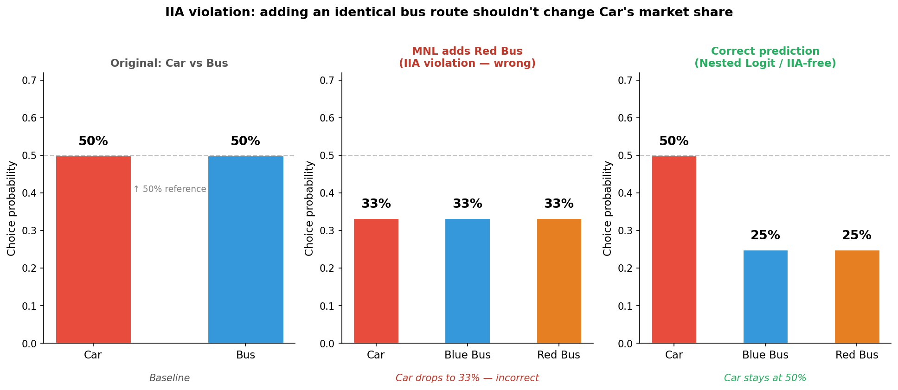

# Preference & Choice Modeling Skill

A skill that applies practitioner-grade methodology to preference and choice experiments — MaxDiff (including sparse, anchored, and Bandit variants), Choice-Based Conjoint (CBC), Adaptive CBC (ACBC), and Menu-Based Conjoint. It gives the agent the conviction to override platform defaults when they are wrong, to surface the guard rails that silently destroy studies, and to give the opinionated, technically precise answer that a senior conjoint practitioner would give instead of validating whatever plan the user already has.

## Installation

```bash
npx skills add https://github.com/JacobElder/jakes-skills/tree/main/preference-choice-modeling
```

Or manually:

```bash
cp -r jakes-skills/preference-choice-modeling ~/.claude/skills/preference-choice-modeling
```

Once installed, the skill applies automatically whenever you ask about MaxDiff, conjoint, CBC, sparse design, anchoring, D-efficiency, HB estimation, share-of-preference simulators, or any study involving trade-off or prioritization measurement — including informal descriptions like "I want to rank 30 features," "running a conjoint for pricing," or "can we compare this year's results to last year's."

---

## Example use cases

### "Should I use prohibitions to exclude unrealistic combinations?"

> We're running a CBC with 4 brands and 5 price tiers. Our premium brand should never appear at the bottom 2 price tiers — those combinations don't exist in the market. Should I use prohibitions in the design to exclude them?

Without the skill, the response calls prohibitions the standard approach:

> Yes, using prohibitions (also called restrictions or constraints) in your CBC design is the standard approach when certain attribute combinations do not exist in the real market. For your scenario — where the premium brand never appears at the two lowest price tiers — prohibitions are the right mechanism.
>
> **Why Prohibitions Are Appropriate Here**
>
> In conjoint analysis, a **prohibition** tells the design algorithm to never generate a profile combining specific attribute levels. In your case, you would prohibit: Premium brand × Price Tier 1 (lowest) and Premium brand × Price Tier 2 (second lowest).
>
> This is warranted because presenting respondents with profiles they would never encounter in reality creates unrealistic choice tasks...
>
> **Recommended Steps**
>
> 1. **Apply the prohibitions** in your design software...
> 2. **Evaluate the resulting design's efficiency** — compare D-efficiency or A-efficiency to the unconstrained design. A modest reduction (a few percentage points) is acceptable.

With the skill, the response pushes back before recommending an alternative structural fix:

> **Short answer: No — use an alternative-specific design instead.**
>
> Prohibitions are the intuitive fix, but they're statistically expensive and there's a structurally cleaner solution for your exact situation.
>
> **What prohibitions cost you**
>
> When you tell the design engine to exclude premium brand × bottom two price tiers, two things happen:
>
> 1. **D-efficiency drops.** Even a handful of prohibitions can cost 1–3% relative D-efficiency; enough prohibitions can push you below 80%, which is a real estimation problem.
> 2. **Brand and price become partially confounded.** If premium brand never appears at the low tiers, the design cannot independently estimate how respondents would react to that combination. Your premium brand's price part-worths are estimated only in the mid-to-high range, and the "premium brand effect" absorbs some of what is actually the price effect at those tiers.
> 3. **The simulator loses that region.** If anyone later asks "what would happen to premium brand's share if it competed at a lower price?" — the simulator has no basis for that answer.
>
> **The better approach: alternative-specific design**
>
> Rather than prohibiting combinations after the fact, structure the design so each brand has its own price range from the start... Premium brand: price tiers 3, 4, 5. Other brands: price tiers 1–5. Sawtooth supports this directly under "alternative-specific attributes." You get full D-efficiency, no confounding, and a structurally honest model.
>
> **If you do use prohibitions**: generate the design and check relative D-efficiency before fielding. If it's below 85%, you're paying a real cost.

---

### "Can we compare MaxDiff utility scores across waves?"

> We ran a MaxDiff on 25 product benefits last year and want to run it again this year with 5 new items added and 3 old ones swapped out. Can we compare the utility scores across waves to see which benefits have grown or declined in importance?

Without the skill, the response acknowledges the issue but recommends equating approximations rather than re-fielding:

> The short answer is: **not directly, and with caution even indirectly.** Cross-wave MaxDiff comparability is a genuinely tricky psychometric problem...
>
> **Approaches That Can Help**
>
> **2. Common-item equating / rescaling.** For the 22 items appearing in both waves, you can attempt to equate the scales using the common items as anchors. The logic: if the common items collectively represent the same "true" importance distribution, you can find a linear transformation (shift and stretch) that maps Wave 2 utilities onto the Wave 1 metric... The simplest version: compute mean and SD of utilities for the 22 overlap items in each wave, then z-score them to a common metric. Differences in z-scored utilities across waves are then more comparable.
>
> **Practical Guidance:** Use rank-order comparisons for the 22 overlap items as your primary cross-wave comparison metric... Apply z-score equating on the 22 overlap items to put both waves on a common standardized scale before making any absolute comparisons. Flag results where equated differences exceed ~0.3–0.5 SD as potentially meaningful...

With the skill, the response names the only valid metric and gives a clear path for the unanchored case:

> **Short answer: No — not directly, and whether you can at all depends on one thing: was Wave 1 anchored?**
>
> Raw or rescaled utilities from MaxDiff studies are not comparable across waves when the item sets differ. Adding 5 items and swapping 3 changes the normalization denominator, so a utility score of 72 in Wave 1 and 65 in Wave 2 for the same benefit doesn't tell you the benefit declined — it could simply reflect a different pool of comparison items. **The only valid cross-wave metric is anchored share-above-anchor**, and only if you use the same anchor in both waves.
>
> **Why raw utilities don't travel**
>
> MaxDiff utilities are rescaled relative to the specific item set tested. When you change the item set — adding 5, swapping 3 — the normalization shifts. An item that rated high in a 25-item pool will have a different utility score in a 27-item pool, even if respondents' underlying preferences haven't changed at all. This is not a bug; it is inherent to relative scaling.
>
> **What anchoring fixes**
>
> Anchored MaxDiff adds a direct binary question after the MaxDiff sets: for each item, respondents flag whether it clears a threshold ("Is this benefit genuinely important to you?"). The resulting **share-above-anchor** is grounded in respondents' threshold judgments, not in the relative normalization of the item pool. Because you're asking the same binary question about the same threshold, that share is comparable across waves — even when the item sets differ. If Item X had a 62% above-anchor share in Wave 1 and 54% in Wave 2, that is evidence of a real decline.
>
> **If Wave 1 was unanchored:** There is no reliable method to recover comparability post-hoc. The correct path is: add a direct binary anchor to Wave 2 now, treat Wave 2 as the new tracking baseline, and communicate that Wave 1 established rank order but cross-wave magnitude comparisons require the anchor that starts with Wave 2.

---

### "How many respondents do I need for a CBC with two segments?"

> Planning a CBC for a new pricing tier. 6 attributes (brand, price, 4 features). Need to compare enterprise vs. SMB segments (roughly 50/50 in our population). What's the right sample size?

Without the skill, the response leads with a flat number:

> **Quick Answer**
>
> For a CBC with 6 attributes comparing two roughly equal segments, a total sample of **300–400 respondents** (150–200 per segment) is a reasonable starting point. Depending on the precision you need and the estimation method, you may want to push toward 400–600 total.
>
> **Recommended design given your 6 attributes:**
> - 12–15 choice tasks per respondent
> - 3–4 alternatives per task (plus optional "none")
>
> **For a pricing study feeding product and go-to-market decisions, 400 total (200 per segment) is the pragmatic target.** If you plan to run market simulations and need tight confidence intervals on willingness to pay, lean toward 500–600.

With the skill, the response derives from the precision the decision actually requires:

> **The subgroup constraint drives this, not the aggregate floor.**
>
> With a 50/50 split, you need n ≥ 200 per segment for clean HB-driven individual-level utility estimation and stable subgroup simulator output. That puts the aggregate floor at n = 400 from subgroup requirements alone. But 400 is tight — here's why.
>
> **Simulator precision — what can you distinguish?**
>
> | Overall n | n per segment (50/50) | Approx SE on simulated share per segment |
> |---|---|---|
> | 400 | 200 | 3–5 pp |
> | 600 | 300 | 2.5–4 pp |
> | 800 | 400 | 2–3 pp |
> | 1000 | 500 | 1.5–2.5 pp |
>
> If you need to say "Enterprise segment prefers Plan A over Plan B by a meaningful margin" and expect shares around 30–40%, you need to distinguish differences of ~5–8 pp with confidence. **n = 400 per segment (overall n = 800) gives you SE ~2–3 pp per segment, which supports that claim reliably.**
>
> **Recommendation: Target n = 800.** 400 per segment gives HB-stable individual utilities and simulator precision adequate for distinguishing meaningful differences (≥6 pp) between enterprise and SMB. The Orme aggregate floor is irrelevant at this sample size — it's a floor of the industry, not a target for your study.

---

## Example output

### IIA violation: adding a near-identical option steals share from an unrelated one

The Independence of Irrelevant Alternatives (IIA) assumption baked into standard MNL models says that adding a new option reduces all existing options' shares proportionally — regardless of how similar the new option is to existing ones.



**Left** — Original binary choice: Car and Bus split 50/50. **Centre** — A Red Bus is added (near-identical to Blue Bus). MNL predicts each option gets 33%: Car drops from 50% to 33%. **Right** — The correct prediction: Car stays at 50%, unaffected by the bus-vs-bus competition; the two bus options split the remaining 50%. The base model validates the MNL result. The skill names the IIA violation immediately and redirects to Nested Logit (grouping transport modes into a nest) or Mixed Logit (allowing preference heterogeneity), with a clear explanation of why MNL systematically overestimates the new option's draw from unrelated alternatives.

---

## What the skill does

The base model knows MaxDiff and CBC methods. The skill gives the agent the *conviction to apply them correctly*. The skill's most important moves are:

- **Block bad design choices before they are fielded.** Prohibitions are not the standard approach — they reduce D-efficiency and create partially confounded estimates. The correct fix is alternative-specific design. The skill names this instead of treating prohibitions as acceptable.
- **Enforce anchoring when the question is absolute.** Unanchored MaxDiff utilities are relative by construction. They cannot answer "which features are actually important." Any question using "importance," "genuinely matters," or "absolute" language requires anchored MaxDiff — direct binary anchor as the default, dual-response as the alternative. The skill surfaces this before discussing anything else.
- **Name the only valid cross-wave metric.** Raw MaxDiff utilities are not comparable across studies with different item sets. z-score equating and rank-order comparisons are insufficient approximations. Anchored share-above-anchor is the only valid tracking metric. If prior waves were unanchored, the correct answer is re-field with anchoring, not retrofit an equating scheme.
- **Derive sample size from the decision, not platform defaults.** Sawtooth's n ≥ 300 floor and Qualtrics' n ≥ 200 are industry minimums, not targets. The skill derives from required precision on the smallest detectable share difference or utility gap, then checks whether subgroup readout requirements increase that floor.
- **Establish dual-response None as the CBC default.** Omitting None inflates simulated shares and conflates relative preference with purchase likelihood. Explicit None is not the same as dual-response None. The skill names dual-response None as the default and identifies the specific narrow contexts where omitting None is defensible.
- **Flag individual-level degradation at k > 60.** With 75+ MaxDiff items, each respondent sees only a fraction of the item pool — their personal utility estimates are partially imputed from the population prior. This must be stated explicitly: individual-level readout is weak at this scale, and aggregate or segment-level is the appropriate aspiration.

---

## Benchmark: skill vs. base model

Evaluated across 2 iterations using trap-based evals — prompts where the naive helpful answer validates a methodological error or omits a critical caveat. Each eval has 4–5 specific, objectively checkable assertions. Executor agents write responses without seeing the assertions; a separate grader evaluates strictly against them.

### Iteration 2 — results (7 scenarios)

```
with_skill:    96.6%  (28/29 assertions)
without_skill: 55.2%  (16/29 assertions)
delta:         +41.4pp
```



```mermaid
xychart-beta horizontal
    title "Pass rate by eval (■ with skill  □ base model)"
    x-axis ["Dual-response none", "Anchoring", "Cross-wave", "CBC sample size", "Sparse MaxDiff", "CBC prohibitions", "MaxDiff method"]
    y-axis "Pass rate (%)" 0 --> 100
    bar [100, 100, 100, 100, 80, 100, 100]
    bar [75, 50, 50, 50, 60, 50, 50]
```

| Eval | With skill | Without skill | Delta |
|------|:---:|:---:|:---:|
| method-selection-maxdiff | 100% | 50% | +50pp |
| prohibitions-cbc-design | 100% | 50% | +50pp |
| sparse-maxdiff-design | 80% | 60% | +20pp |
| cbc-sample-size-with-subgroups | 100% | 50% | +50pp |
| cross-wave-maxdiff-comparability | 100% | 50% | +50pp |
| anchoring-absolute-importance | 100% | 50% | +50pp |
| dual-response-none-cbc | 100% | 75% | +25pp |

### Where the base model fails most

| Scenario | What the trap is | With skill | Without skill |
|---|---|:---:|:---:|
| prohibitions-cbc-design | Calls prohibitions "the standard approach"; never recommends alternative-specific design | 100% | 50% |
| cross-wave-maxdiff-comparability | Recommends z-score equating on common items rather than naming share-above-anchor and re-fielding with anchoring | 100% | 50% |
| anchoring-absolute-importance | Presents 5 options without naming a default; never mentions share-above-anchor as the reporting format | 100% | 50% |
| cbc-sample-size-with-subgroups | Leads with "300–400 respondents is a reasonable starting point"; tops out at n=600 | 100% | 50% |
| method-selection-maxdiff | Recommends MaxDiff correctly but never surfaces anchoring despite explicit "importance" language | 100% | 50% |
| dual-response-none-cbc | Disagrees with the PM but treats explicit None and dual-response None as equally defensible | 100% | 75% |

### Iteration history

| Iteration | With skill | Without skill | Delta | Notes |
|---|:---:|:---:|:---:|---|
| 1 | 100% | 70.4% | +29.6pp | 7 evals; non-discriminating: wrong-method-pricing, HB-troubleshooting, ACBC-vs-CBC |
| 2 | **96.6%** | **55.2%** | **+41.4pp** | 7 new evals targeting identified gaps; harder without-skill floor |

---

## Eval suite

| # | Eval | Trap |
|---|------|------|
| 1 | `method-selection-maxdiff` | Recommends MaxDiff correctly but gives flat sample-size rule-of-thumb and never raises anchoring despite "importance" language |
| 2 | `prohibitions-cbc-design` | Calls prohibitions "the standard approach" without mentioning alternative-specific design or the D-efficiency cost as a primary concern |
| 3 | `sparse-maxdiff-design` | Recommends sparse design but gives n=200–300 (too low), implies individual-level HB is reliable at k=75 |
| 4 | `cbc-sample-size-with-subgroups` | Gives n=400 as the target for 50/50 segment comparison; doesn't derive from required simulator precision |
| 5 | `cross-wave-maxdiff-comparability` | Recommends z-score equating on common items rather than naming share-above-anchor and advising re-field for unanchored prior wave |
| 6 | `anchoring-absolute-importance` | Presents multiple anchoring options in parallel without naming direct binary anchor as default; omits share-above-anchor as the reporting format |
| 7 | `dual-response-none-cbc` | Presents explicit None (Option A) and dual-response None (Option B) as equally defensible rather than establishing dual-response as the default |

---

## Sources

The skill's positions are drawn from:

- **Louviere, J. J., Hensher, D. A., & Swait, J. D. (2000). *Stated Choice Methods: Analysis and Applications*.** Cambridge University Press. — Foundational discrete choice theory, design efficiency, IIA.
- **Orme, B. K. (2010). *Getting Started with Conjoint Analysis* (2nd ed.).** Research Publishers. — CBC design rules, Orme's n × t × a / c ≥ 500 floor, simulator math.
- **Sawtooth Software Technical Papers.** CBC design efficiency, HB for MaxDiff and CBC, ACBC design, sparse MaxDiff. — `sawtoothsoftware.com/resources/technical-papers`
- **Allenby, G. M., Arora, N., & Ginter, J. L. (1995).** "Incorporating prior knowledge into the analysis of conjoint studies." *Journal of Marketing Research* 32: 152–162. — HB foundations for choice modeling.
- **Rossi, P. E., Allenby, G. M., & McCulloch, R. (2005). *Bayesian Statistics and Marketing*.** Wiley. — Full HB treatment; priors, convergence, individual-level utilities.
- **Marley, A. A. J. & Louviere, J. J. (2005).** "Some probabilistic models of best, worst, and best–worst choices." *Journal of Mathematical Psychology* 49: 464–480. — Best-worst scaling theory; Case 1 (object case) = MaxDiff.
- **Cohen, S. H. (2003).** "Maximum difference scaling: Improved measures of importance and preference for segmentation." Sawtooth Software Research Paper Series. — MaxDiff design and sparse variants.
- **Finn, A. & Louviere, J. J. (1992).** "Determining the appropriate response to evidence of public concern: The case of food safety." *Journal of Public Policy & Marketing* 11: 12–25. — Anchored best-worst scaling.
- **Train, K. E. (2009). *Discrete Choice Methods with Simulation* (2nd ed.).** Cambridge University Press. — MNL, nested logit, mixed logit, simulation-based estimation.
- **McFadden, D. (1974).** "Conditional logit analysis of qualitative choice behavior." In P. Zarembka (Ed.), *Frontiers in Econometrics*. Academic Press. — Theoretical basis for CBC; IIA, outside good.
- **Kessels, R., Goos, P., & Vandebroek, M. (2006).** "A comparison of criteria to design efficient choice experiments." *Journal of Marketing Research* 43: 409–419. — D-efficiency, A-efficiency, comparative design criteria.
- **Johnson, R. & Orme, B. K. (1996).** "How many questions should you ask in choice-based conjoint studies?" Sawtooth Software Research Paper Series. — Tasks × alternatives rules; respondent burden ceilings.
