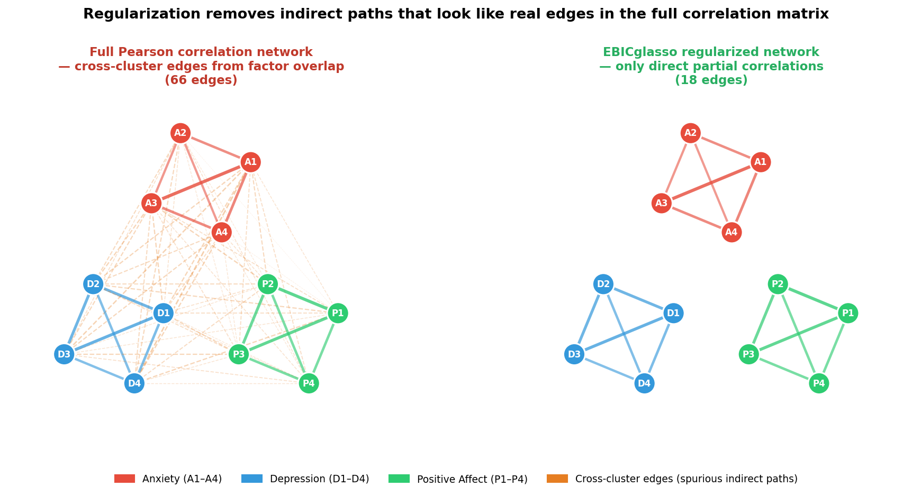

# Psychometric Networks Skill

A skill for the network approach to psychological measurement — treating questionnaire items and clinical symptoms as nodes in a Gaussian Graphical Model rather than indicators of a latent variable. It gives the agent the conviction to apply field-specific conventions that the base model underuses: the `bootnet` accuracy-and-stability workflow, CS-coefficient thresholds, the goldbricker redundancy check, the Bringmann critique of betweenness and closeness, the Robinaugh Expected Influence fix for mixed-valence affect networks, and the Burger et al. (2023) reporting standards. This is an **intersection skill** — it assumes the user's general psychometrics and network-analysis parent skills are loaded and focuses only on what is specific to running these methods on psychological items.

## Installation

```bash
npx skills add https://github.com/JacobElder/jakes-skills/tree/main/psychometric-networks
```

Or manually:

```bash
cp -r jakes-skills/psychometric-networks ~/.claude/skills/psychometric-networks
```

Once installed, the skill applies automatically when the user mentions GGMs on items or symptoms, EBICglasso, bootnet, qgraph, IsingFit, graphicalVAR, mlVAR, mgm, psychonetrics, EGAnet, CS-coefficients, expected influence, edge accuracy, the network theory of psychopathology, or the latent-vs-network debate.

---

## Example use cases

### "My 15-node depression network has 91 edges — it's a hairball"

> I ran EBICglasso on my 15-node depression item network (N=210) using bootnet with default settings and got 91 edges out of a possible 105. Almost everything connects to everything — it's a hairball. Is this typical? What's going wrong and how do I make the network interpretable?

Without the skill, the response lists several diagnostic possibilities but never leads with gamma as the primary lever or names goldbricker for node redundancy:

> 91/105 edges is a red flag — EBICglasso is *supposed* to produce sparse networks. Something is pushing regularization toward near-zero, and there are several likely culprits.
>
> **1. Strong common factor structure (most likely root cause).** Depression scales are explicitly designed to be highly intercorrelated... even *after* partialling out neighbors, substantial residual associations survive regularization. GLASSO can't zero them out because they're genuinely non-zero partial correlations under a strong-factor structure.
>
> **2. γ tuning parameter too low.** The EBIC hyperparameter γ controls the complexity penalty. The bootnet default is `tuning = 0.5`, but if you're using `gamma = 0`... you get much denser networks. Check what you actually ran.
>
> **3. Pearson correlations on ordinal data.** If your depression items are Likert-scale... and you used Pearson correlations, the input matrix is misspecified. Polychoric correlations are the correct input for ordinal items.
>
> **Fix 1: Use `cor_auto` for polychoric correlations... Fix 2: Increase γ... Fix 3: Switch to TMFG...**

With the skill, the response leads with Pearson-on-Likert as the primary suspect, then correctly names goldbricker for node redundancy and explains gamma as the sparsity lever:

> 91/105 edges is genuinely pathological — that's 87% density on what should be a sparse partial-correlation graph. This isn't typical of a well-estimated network; it's a diagnostic signal. Here are the most likely culprits in priority order.
>
> **1. You're almost certainly using Pearson correlations on Likert data (primary suspect).** The bootnet default for `estimateNetwork(..., default = "EBICglasso")` uses `corMethod = "cor"` — raw Pearson. Depression items are ordinal, and Pearson correlations systematically **overestimate** the true association between ordinal items relative to polychoric correlations. Inflated input correlations mean the graphical lasso has less to shrink, so it keeps edges it should zero out.
>
> Fix this first, before anything else:
> ```r
> net <- estimateNetwork(data, default = "EBICglasso",
>                        corMethod = "cor_auto", tuning = 0.5)
> ```
> `cor_auto` inspects each variable: if it has ≤7 distinct integer values it computes polychoric correlations via lavaan, otherwise Pearson. For a 15-item depression scale this will almost always switch the entire matrix to polychoric, and you can expect a meaningfully sparser network after this single change.
>
> **2. Check for node redundancy with `goldbricker`.** Depression questionnaires are notorious for near-duplicate items. If your scale includes anything like *"I feel sad"* and *"I feel blue / depressed"*, those two items have nearly identical conditioning sets — EBICglasso will keep a strong edge between them because the lasso can't tell a theoretically-meaningful edge from a measurement artifact. Run `networktools::goldbricker(data)` to flag redundant pairs before estimation.
>
> **3. Try a more conservative EBIC gamma.** The field default is `tuning = 0.5`, but that's a *starting point*, not sacred. Higher gamma penalizes model complexity more, producing a sparser graph. Report gamma = 0.5 as your primary result and use gamma = 1.0 as a robustness check. If your key substantive claims disappear at gamma = 1.0, that's important to report.

---

### "A reviewer asked me to follow reporting standards for my GGM"

> I've finished a GGM network analysis of anxiety symptoms (N=340, 12 nodes, EBICglasso with gamma=0.5 and polychoric correlations). A previous reviewer criticized my write-up for not following current reporting standards. What should my methods and results sections include?

Without the skill, the response gives a solid general checklist but never names the authoritative reporting standards paper, and omits the cross-sectional/causal limitation as a required element:

> Great question — and a timely one, since reviewer expectations for network papers have crystallized substantially around a handful of landmark methodological papers. Here's what current standards call for.
>
> **Methods:** Node selection rationale; correlation type (polychoric); EBICglasso, γ = 0.5; layout algorithm for reproducibility; which centrality indices you will report.
>
> **Stability analyses ← most commonly missing.** Current standards (Epskamp et al., 2018) require: bootstrapped edge accuracy CIs, edge weight difference tests, CS-coefficients per centrality index.
>
> **Results:** Network visualization with edges colored positive/negative; full edge weight matrix; centrality results flagging which indices have CS ≥ 0.25; stability results with CS-coefficient per index and bootstrap CI plot.

With the skill, the response opens by naming Burger et al. (2023), frames causal limitations as a required element alongside the technical checklist, and flags the goldbricker check as something reviewers now expect:

> Good timing to get this right — the field has converged on a reasonably explicit checklist since **Burger et al. (2023), "Reporting standards for psychological network analyses in cross-sectional data," *Psychological Methods*.**
>
> **Methods — network estimation subsection:** (1) Estimator, package, and version; (2) `cor_auto` with explanation that items with ≤7 unique integers get polychoric correlations via `lavaan`; (3) tuning parameter γ = 0.5 with citation to Epskamp & Fried (2018); (4) node selection rationale — *the single most underreported element in early network papers*. Also note whether you checked for node redundancy (`networktools::goldbricker()`); with 12 anxiety items there's a real risk that near-synonymous items produce spuriously strong edges.
>
> **Methods — stability subsection** (the section most commonly flagged by reviewers):
>
> | Check | Method | What to report |
> |---|---|---|
> | Edge-weight accuracy | Non-parametric bootstrap, 1,000 iterations | Bootstrapped 95% CIs; note distinguishable edges via difference test |
> | Centrality stability | Case-dropping bootstrap, 1,000 iterations | **CS-coefficient for each centrality index reported** |
> | Difference tests | Bootstrapped edge and centrality difference tests | Which pairs are statistically distinguishable |
>
> If any CS-coefficient < 0.25, you **cannot interpret that centrality index** — it needs to be dropped from the results, not just flagged.
>
> **Explicit cross-sectional limitations statement.** This is not optional. A GGM on cross-sectional data cannot establish causal direction among symptoms, cannot establish that one node activates another, and cannot support intervention targets. State this in your Discussion. Reviewers at *Psychological Medicine*, *JAMA Psychiatry*, and methodology-aware outlets will look for it.

---

### "I'm interpreting centrality but my bootstrapped CIs overlap"

> My centrality plot shows node A has Strength = 0.42 (bootstrapped 95% CI: [0.18, 0.61]) and node B has Strength = 0.39 (CI: [0.17, 0.58]). My co-author says the heavily overlapping CIs mean A and B aren't significantly different in centrality and I shouldn't say either is 'more central'. Is that right?

Without the skill, the response correctly identifies the overlap fallacy but doesn't name the bootstrapped difference test or state the practical norm:

> Your co-author is applying a common shortcut that is actually incorrect. Overlapping confidence intervals do NOT mean two values are not significantly different...
>
> The width of the confidence interval for the *difference* between two estimates is generally narrower than what you'd infer by looking at whether the individual intervals overlap. Visual overlap is neither necessary nor sufficient for statistical non-significance...
>
> Run a formal test if you need to make a specific claim about ordering. In network analysis, this means running a bootstrapped difference test using `bootnet`.

With the skill, the response makes the same correction but adds the critical practical note — that non-distinguishability is the norm, not an anomaly:

> Your co-author's reasoning is wrong, but the practical conclusion may still be right — for a different reason.
>
> **The logic error:** overlapping bootstrapped CIs do not imply the difference is non-significant. The CI for the *difference* between two estimates is narrower than what visual inspection of individual intervals would suggest. Non-overlap is sufficient for significance but not necessary. The correct test is the bootstrapped difference test from `bootnet`.
>
> **The practical reality:** in most psychometric networks, few pairs of centrality values are statistically distinguishable from one another. Running the difference test typically reveals that you cannot claim any specific ordering among nodes with confidence. This is the norm — not a problem with your network or your sample. It means centrality *ordering* across nodes is more interpretable as a whole than any specific pairwise claim.
>
> What this means for your write-up: run the difference test, report whether A and B are distinguishable, and if they are not, describe centrality in relative/ordinal terms without singling out specific nodes. "Restlessness had the highest Strength, though the difference from the next-ranked node was not statistically significant" is defensible; "restlessness is the most central node" without the difference test is not.

---

## Example output

### Regularization removes indirect paths that look like real edges

A full Pearson correlation network of 12 symptom items (4 anxiety, 4 depression, 4 positive affect) produces a dense, nearly uninterpretable graph — almost every item connects to every other. EBICglasso removes the indirect paths, revealing the true conditional dependence structure.



**Left** — Full Pearson correlation network: dense cross-cluster edges everywhere. Indirect paths (anxiety item → depression item through shared variance in a common neighbor) masquerade as direct relationships. **Right** — EBICglasso regularized network: sparse. Only edges that survive partial correlation regularization remain; cross-cluster edges are zeroed out because they are fully explained by within-cluster paths. The skill enforces `cor_auto` (polychoric correlations for Likert items) as the first fix for hairball density, checks for node redundancy with `goldbricker` before estimation, and requires the Burger et al. (2023) reporting checklist including a mandatory cross-sectional causal limitations statement.

---

## What the skill does

The base model knows the psychometric network literature. The skill gives the agent the *specific field conventions* to apply them correctly. The key moves:

- **Lead with node redundancy before estimation.** The `goldbricker` check (`networktools::goldbricker()`) is the first thing to run before EBICglasso, not an afterthought. Dense hairball networks are usually a node-redundancy or gamma problem, in that order. The skill enforces this diagnostic hierarchy.
- **Apply the CS-coefficient thresholds precisely.** CS ≥ 0.5 acceptable, ≥ 0.25 minimum to interpret, < 0.25 do not interpret. These are field conventions most base-model responses soften or omit.
- **Distinguish Expected Influence from Strength.** For mixed-valence affect networks, Strength (sum of absolute weights) masks sign and misranks nodes that have both large positive and large negative edges. Expected Influence (Robinaugh et al., 2016) is the correct default. The skill enforces this choice contextually rather than always recommending one over the other.
- **Name Burger et al. (2023) for reporting.** The authoritative reporting checklist for cross-sectional GGMs. The base model gives solid generic checklists; the skill names the paper and frames causal limitations as a required, not optional, element.
- **Gate the Bringmann critique.** Betweenness and closeness are inappropriate for dense weighted partial-correlation graphs (Bringmann et al., 2019) — but this caveat belongs only in psychometric contexts, not as a response to generic graph-theory questions. The skill applies the critique where relevant and stays neutral where it isn't.
- **State the difference-test norm.** Few centrality pairs are typically statistically distinguishable in published psychometric networks. This is the expected outcome, not a methodological failure, and users should frame their results accordingly.

---

## Benchmark: skill vs. base model

Evaluated across 4 iterations. Evals are conversational prompts graded by an LLM judge against specific, objective expectations. Executor and grader are separate calls to eliminate self-grading inflation.

### Iteration 4 — final results (8 scenarios, 39 total expectations)

```
with_skill:    100%   (39/39 expectations)
without_skill:  84.6%  (33/39 expectations)
delta:         +15.4pp
```



```mermaid
xychart-beta horizontal
    title "Pass rate by eval (■ with skill  □ base model)"
    x-axis ["Reporting standards", "Non-trigger", "Node selection", "Stability", "Hairball tuning", "Bootstrap CI", "Expected influence", "GGM estimation"]
    y-axis "Pass rate (%)" 0 --> 100
    bar [100, 100, 100, 100, 100, 100, 100, 100]
    bar [80, 100, 75, 100, 80, 80, 80, 83]
```

| Eval | With skill | Without skill | Delta |
|------|:---:|:---:|:---:|
| ggm-estimation-likert | 100% | 83% | +17pp |
| expected-influence-vs-strength | 100% | 80% | +20pp |
| bootstrap-ci-vs-difference-test | 100% | 80% | +20pp |
| hairball-gamma-tuning | 100% | 80% | +20pp |
| stability-interpretation | 100% | 100% | +0pp |
| node-selection-question | 100% | 75% | +25pp |
| negative-trigger-generic-network | 100% | 100% | +0pp |
| reporting-standards-checklist | 100% | 80% | +20pp |

The two non-discriminating evals (stability-interpretation, negative-trigger) reflect topics where base-model coverage already matches the skill. They remain as regression guards.

### Where the base model fails most

| Scenario | What the gap is | With skill | Without skill |
|---|---|:---:|:---:|
| node-selection-question | Misses node redundancy as a concrete concern; never names `goldbricker` | 100% | 75% |
| ggm-estimation-likert | Misses the Epskamp, Borsboom & Fried (2018) tutorial reference | 100% | 83% |
| hairball-gamma-tuning | Uses `cor_auto` in code but never explicitly names Pearson-on-Likert as a cause of hairball density | 100% | 80% |
| expected-influence-vs-strength | Names EI as the right index but doesn't make the unipolar-equivalence distinction | 100% | 80% |
| bootstrap-ci-vs-difference-test | Corrects the CI fallacy but doesn't state that non-distinguishability is the norm | 100% | 80% |
| reporting-standards-checklist | Gives a solid checklist but omits cross-sectional/causal limitations as required | 100% | 80% |

### Iteration history

| Iteration | With skill | Without skill | Delta | Notes |
|---|:---:|:---:|:---:|---|
| 1 | 92.3% | 89.7% | +2.6pp | Baseline; 5 of 8 evals non-discriminating |
| 2 | 97.4% | 87.2% | +10.3pp | 4 evals redesigned; goldbricker + betweenness gate added to skill |
| 3 | 97.4% | 84.6% | +12.8pp | Difference-test norm sentence added; eval 3 gap closed |
| 4 | **100%** | **84.6%** | **+15.4pp** | Pearson-on-Likert→hairball link added; 39/39 with skill |

The jump from iteration 1 to iteration 2 reflects both skill improvements (two targeted additions) and eval redesign (replacing four non-discriminating evals with harder probes). Iteration 3→4 added an explicit sentence connecting Pearson-on-ordinal inflation to hairball density, closing the last with-skill gap.

---

## Eval suite

| # | Eval | What it tests |
|---|------|--------------|
| 1 | `ggm-estimation-likert` | Full GGM pipeline on Likert data: EBICglasso, cor_auto, gamma, bootnet, canonical citation |
| 2 | `expected-influence-vs-strength` | Choosing Expected Influence over Strength for mixed-valence affect networks |
| 3 | `bootstrap-ci-vs-difference-test` | Overlapping CIs ≠ non-significant difference; name the bootstrapped difference test; state the norm |
| 4 | `hairball-gamma-tuning` | Dense hairball network: gamma as primary lever, cor_auto fix, node redundancy |
| 5 | `stability-interpretation` | Applying CS-coefficient thresholds (0.25/0.50) to specific reported values |
| 6 | `node-selection-question` | Node selection as theoretical choice; goldbricker for redundancy; Fried's work |
| 7 | `negative-trigger-generic-network` | Betweenness question with no psychometric context: answer generically, don't over-trigger |
| 8 | `reporting-standards-checklist` | Burger et al. (2023) checklist: estimation details, bootstrapped CIs, CS-coefficients, causal limitations |

---

## Sources

- **Epskamp, S., Borsboom, D. & Fried, E. I. (2018).** "Estimating psychological networks and their accuracy: A tutorial paper." *Behavior Research Methods* 50: 195–212. — The primary tutorial; bootstrapped accuracy and stability workflow.
- **Burger, J., et al. (2023).** "Reporting standards for psychological network analyses in cross-sectional data." *Psychological Methods*. — The authoritative reporting checklist.
- **Borsboom, D. (2017).** "A network theory of mental disorders." *World Psychiatry* 16: 5–13. — The theoretical manifesto for the network approach to psychopathology.
- **Robinaugh, D. J., Millner, A. J. & McNally, R. J. (2016).** "Identifying highly influential nodes in the complicated grief network." *Journal of Abnormal Psychology* 125: 747–757. — Introduction of Expected Influence centrality.
- **Bringmann, L. F., et al. (2019).** "What do centrality measures measure in psychological networks?" *Journal of Abnormal Psychology* 128: 892–903. — Why betweenness and closeness are inappropriate for dense weighted partial-correlation graphs.
- **Fried, E. I., Epskamp, S., Nesse, R. M., Tuerlinckx, F. & Borsboom, D. (2016).** "What are 'good' depression symptoms? Comparing the centrality of DSM and non-DSM symptoms of depression in a network analysis." *Journal of Affective Disorders* 189: 314–320. — Node selection shapes network structure.
- **Fried, E. I. (2017).** "The 52 symptoms of major depression: Lack of content overlap among seven common depression scales." *Journal of Affective Disorders* 208: 191–197. — Node heterogeneity in depression measurement.
- **Isvoranu, A. M., Epskamp, S., Waldorp, L. J. & Borsboom, D. (Eds.) (2022).** *Network Psychometrics with R: A Guide for Behavioral and Social Scientists.* Routledge. — Current textbook.
- **Constantin, M. A., Schuurman, N. K. & Vermunt, J. (2022).** "A general Monte Carlo method for sample size analysis in the context of network models." *Psychological Methods.* — Power analysis via simulation for network studies.
- **Forbes, M. K., Wright, A. G. C., Markon, K. E. & Krueger, R. F. (2017).** "Evidence that psychopathology symptom networks have limited replicability." *Journal of Abnormal Psychology* 126: 969–988. — Replication critique of cross-sectional networks.
- **Marsman, M., et al. (2018).** "An introduction to network psychometrics: Relating Ising network models to item response theory models." *Multivariate Behavioral Research* 53: 15–35. — Statistical equivalence between Ising models and latent-variable IRT models.
