# Psychometrics Skill

A Claude skill that applies rigorous measurement-theory thinking to surveys, scales, questionnaires, and latent-variable models. It gives Claude the conviction to push back on the measurement mistakes that show up in nearly every applied paper — misusing Cronbach's alpha, fetishizing fit-index cutoffs, running PCA as if it were factor analysis, skipping construct definition before writing items — and to give the opinionated, technically precise answer that a working psychometrician would give.

## Installation

```bash
npx skills add https://github.com/JacobElder/jakes-skills/tree/main/psychometrics
```

Or manually:

```bash
cp -r jakes-skills/psychometrics ~/.claude/skills/psychometrics
```

Once installed, Claude will apply the skill automatically whenever you ask about surveys, scales, reliability coefficients, factor analysis, SEM, IRT, measurement invariance, or related topics — even when framed as a general statistics question.

---

## Example use cases

### "My state anxiety ICC is 0.72 — is that good reliability?"

> I computed test-retest reliability for my 'state anxiety' scale — it measures anxiety right now, in this moment. The two sessions were 4 weeks apart, both in a controlled lab. I got ICC = 0.72. Is this good reliability?

Without the skill, Claude interprets ICC = 0.72 as "moderate-to-good" and praises the 4-week interval as a design strength:

> ICC = 0.72 indicates moderate-to-good reliability for your state anxiety scale, which is a reasonable result for test-retest reliability in psychological measurement.
>
> **A 4-week gap**: A 4-week interval is a common and reasonable choice for test-retest studies. It is long enough to reduce memory effects... but short enough that the underlying construct hasn't fundamentally changed.
>
> **The fact that both sessions were in a controlled lab setting helps ensure that variability in scores reflects true measurement consistency rather than situational noise — this is a strength of your design.**
>
> **Overall verdict**: ICC = 0.72 is a reasonable and acceptable test-retest reliability coefficient for your scale in a research context. It suggests your state anxiety measure is performing adequately.

With the skill, the response inverts the logic — high ICC at 4 weeks is a red flag for a state measure, not a success:

> Short answer: no, ICC = 0.72 over 4 weeks is not good reliability for a state anxiety scale — it's actually a red flag.
>
> Here's the core problem. Test-retest correlation conflates two distinct things: the stability of the construct and the reliability of measurement. For a state measure, the construct is explicitly defined as transient, fluctuating with current circumstances. If your state anxiety scale yields ICC = 0.72 over 4 weeks, the most parsimonious interpretation is not "great reliability" — it's that your scale is functioning more like a trait measure than a state measure.
>
> Genuine state anxiety should look quite different in the same person at two points 4 weeks apart. If scores correlate at r ≈ .72, the scale is picking up stable between-person variance — individual differences in baseline anxiety proneness, i.e., trait anxiety — rather than within-person fluctuation in current state. The Spielberger STAI distinction between State (Form Y-1) and Trait (Form Y-2) exists precisely because this conflation is a known measurement problem.
>
> What's the appropriate test-retest interval for a state measure? Short — very short. Same session, 24–48 hours at most, and ideally with an active mood induction or situational manipulation so you can test whether scores track the manipulation. The high ICC you obtained is not evidence of reliability — it's evidence of construct contamination.

---

### "I have 40 items ready — what should I do next?"

> For my dissertation, I want to build a new 'digital wellbeing' scale. I've already written 40 candidate items covering screen time, social media comparisons, notification stress, and online connection quality. What should I do next?

Without the skill, Claude praises the existing items and jumps straight to expert review and pilot testing:

> Great work putting together those 40 items! Having a solid initial item pool covering screen time, social media comparisons, notification stress, and online connection quality gives you a strong foundation to build from.
>
> Here's what I'd recommend as your next steps:
>
> **1. Expert Review** — Share your 40 items with 4–6 subject matter experts...
> **2. Cognitive Interviewing / Pilot Testing** — Before running a full study, pilot the items with a small group...
> **4. Exploratory Factor Analysis (EFA)** — Once you have pilot data, run an EFA... let the data tell you.
>
> You're in good shape — the next step is expert review and pilot testing to get those items cleaned up and ready for the main data collection. Good luck with your dissertation!

With the skill, the response stops before any of that and requires construct definition first:

> Stop. I want to help you get this right, and the most important thing I can tell you right now is: do not touch those 40 items yet.
>
> Here is the problem. You have a pool of candidate items but you do not yet have a construct. "Digital wellbeing" is a label, not a definition. And writing items before the construct is clearly bounded and defined is the single most common — and most consequential — mistake in scale development. Sophisticated analyses downstream cannot fix this. You cannot EFA your way out of a vague construct.
>
> Before you do anything else with those 40 items, you need to answer: What exactly is digital wellbeing? What is NOT digital wellbeing? Is this construct unidimensional, or is multidimensionality intentional? Reflective or formative?
>
> Your four content areas (screen time, social comparison, notification stress, online connection) may represent distinct facets of a broader construct, or they may be indicators of a single underlying dimension, or they may be so different that they should be separate scales. Social comparison is arguably a mechanism that produces (low) wellbeing; it may not be a component of wellbeing itself. You need a nomological network — a map of what predicts the construct, what it predicts, and what is adjacent but distinct — before item writing can proceed sensibly.
>
> The items you have may be useful raw material — or they may be 40 measurements of vibes about digital life. You cannot tell until you know what you are measuring.

---

### "My PCA gave me 3 components — those are my subscales, right?"

> I have 15 Likert-scale items measuring 'social connection.' I ran a PCA in SPSS with varimax rotation and got 3 components with eigenvalues > 1. My advisor says these are my three subscales and I should compute subscale scores from them. Am I good to go?

Without the skill, Claude validates the approach as "solid and standard":

> It sounds like you're on the right track! PCA with varimax rotation and the eigenvalue > 1 rule is a very common and widely accepted approach for identifying underlying structure in survey data...
>
> **What you've done looks reasonable** — PCA with varimax rotation is a standard exploratory technique in social science research, and using eigenvalue > 1 (the Kaiser criterion) is the most common method for deciding how many components to retain.
>
> **Bottom line**: Your approach is solid and follows standard practice.

With the skill:

> Not quite — there are three substantive problems with this approach, and I'd push back on your advisor's recommendation as stated.
>
> **PCA is not EFA, and that distinction matters here.** PCA models *total* variance; EFA models *common* variance only. If your goal is to claim that your three dimensions *are* latent constructs underlying "social connection" — i.e., that there's something you can't observe directly that is causing people to endorse items — you need the common factor model. Interpreting PCA components as subscales for a latent-variable measurement model is a category error.
>
> **Varimax rotation is wrong for this construct.** Varimax is an orthogonal rotation: it mathematically constrains factors to be uncorrelated with each other. Would you expect the three dimensions of social connection to be completely unrelated? Almost certainly not. Use oblique rotation (promax or oblimin) and report the factor correlation matrix.
>
> **The eigenvalue > 1 rule is unreliable.** Kaiser's criterion is a 1960 heuristic known to systematically overestimate the number of factors, often badly. It has no principled statistical justification. Use parallel analysis (`psych::fa.parallel()` in R) instead.

---

### "Alpha = 0.73 — is that adequate reliability for my thesis?"

> My thesis committee asked for 'reliability evidence.' I computed Cronbach's alpha = 0.73 for my 12-item scale. My committee is satisfied. Is alpha = 0.73 adequate reliability evidence for a thesis project?

Without the skill:

> **Yes, alpha = 0.73 is generally considered adequate reliability evidence for a thesis project.** The widely accepted threshold for Cronbach's alpha is 0.70, and your value of 0.73 clears that bar, so your committee's satisfaction is well-founded...
>
> **Your committee is right to be satisfied.** Cronbach's alpha is the standard internal consistency measure across social science research, and meeting the 0.70 threshold with a 12-item scale is a reasonable result.

With the skill:

> Your committee may be satisfied, but as a psychometrician I'd want you to understand what alpha = 0.73 actually tells you — and what it doesn't — before you finalize your reliability evidence section.
>
> **The 0.70 rule is a Nunnally artifact, misapplied.** The alpha ≥ 0.70 cutoff traces to Nunnally (1978), who explicitly said 0.70 was appropriate for *early-stage, exploratory* research. He set 0.80+ for applied research. That context got stripped away, and now 0.70 gets cited as a universal pass/fail threshold for everything.
>
> **Alpha assumes tau-equivalence, which is almost certainly false.** Cronbach's alpha is a lower bound on reliability *only* when all items have identical true-score loadings — a strong assumption that is rarely met. When that assumption is violated, alpha underestimates reliability. The modern substitute is **McDonald's omega**, derived from actual factor loadings. In R: `psych::omega(your_data)` or `semTools::compRelSEM(fit)`.
>
> **Dimensionality must come before reliability.** If the 12 items are multidimensional — two or three factors rather than one — reporting a single alpha treats a heterogeneous item pool as a coherent scale. Alpha on a multidimensional set of items is not reliability; it's a mix of reliability and construct-validity failure. Run parallel analysis and factor analysis before reporting alpha.

---

## What the skill does

Base Claude knows measurement theory. The skill gives it the *conviction to apply it*. The skill's most important moves are:

- **Correct the wrong question.** When a user asks "is my alpha good?" the psychometrician's move is: alpha is the wrong estimator; compute omega, and check dimensionality first.
- **Invert the usual logic.** When a state measure has ICC = 0.72 over 4 weeks, that is a problem — the skill recognizes it where the base model does not.
- **Gate before advising.** When a user asks "I have 40 items, what next?" the correct answer is to stop and require a construct definition. The base model proceeds helpfully into the wrong workflow.
- **Name the specific error.** PCA is not factor analysis. 2PL is not for Likert items. Varimax is wrong for correlated constructs. Eigenvalue > 1 overextracts. The skill names these errors directly instead of noting them as "one consideration."
- **Hold positions under pushback.** Reviewers demand Hu-Bentler cutoffs; advisors recommend whole-scale PCA; committees are satisfied with alpha = 0.73. The skill holds the methodologically defensible position rather than softening under social pressure.

## Benchmark: skill vs. base Claude

Evaluated on 8 scenarios designed with explicit "traps" — prompts where the naive helpful answer validates a methodological error. Each scenario has 5–6 specific, objectively checkable assertions.

```mermaid
xychart-beta horizontal
    title "Pass Rate by Scenario (■ with skill  □ base Claude)"
    x-axis ["PCA as factor analysis", "Reverse-item method factor", "Alpha meets threshold", "Factor score indeterminacy", "GRM for polytomous IRT", "Test-retest: state anxiety", "Construct definition gate", "Longitudinal invariance"]
    y-axis "Pass rate" 0 --> 1
    bar [1.0, 1.0, 1.0, 1.0, 1.0, 1.0, 1.0, 1.0]
    bar [0.0, 0.0, 0.0, 0.0, 0.2, 0.0, 0.0, 0.0]
```



| | With skill | Without skill |
|--|:---:|:---:|
| **Mean pass rate** | **1.00** | **0.025** |
| **Delta** | — | **−97.5pp** |
| Std deviation | 0.00 | 0.07 |
| Min / Max | 1.0 / 1.0 | 0.0 / 0.2 |

### Where base Claude fails completely

| Scenario | What the trap is | With skill | Without skill |
|----------|---|:---:|:---:|
| PCA as factor analysis | Validates PCA components as subscales; endorses eigenvalue > 1 | 1.0 | 0.0 |
| Reverse-item method factor | Calls 50/50 reverse-scoring "sound and standard practice" | 1.0 | 0.0 |
| Alpha meets threshold | Opens with "Yes, alpha = 0.73 is adequate" | 1.0 | 0.0 |
| Factor score indeterminacy | Opens with "Yes, that's a standard and reasonable workflow" | 1.0 | 0.0 |
| Test-retest: state anxiety | Calls ICC = 0.72 "moderate-to-good"; praises 4-week interval as a design strength | 1.0 | 0.0 |
| Construct definition gate | Opens with "Great work on your 40 items!"; jumps straight to pilot testing | 1.0 | 0.0 |
| Longitudinal invariance | Recommends paired t-test; concludes "training improved psychological safety" | 1.0 | 0.0 |

### Where base Claude partially gets it right

| Scenario | What helps | With skill | Without skill |
|----------|---|:---:|:---:|
| GRM for polytomous IRT | Knows GRM/GPCM exist; still calls 2PL "reasonable" and suggests dichotomizing | 1.0 | 0.2 |

The pattern: base Claude handles *factual recall* (knows GRM is a model that exists) but fails on *defaults and framing* — whether it corrects an error unambiguously vs. hedges, whether it validates the user's wrong approach before noting caveats, and whether it proactively identifies upstream problems the user didn't ask about.

### Trigger eval results

The skill description was evaluated on 25 queries — 20 that should trigger the skill, 5 that should not.

| | Result |
|--|:---:|
| True positives (correctly triggered) | 20/20 |
| True negatives (not falsely triggered) | 5/5 |
| **Total accuracy** | **100%** |

The skill fires on psychometric vocabulary (`alpha`, `factor loadings`, `CFI`, `Likert`, `lavaan`), named instruments (Big Five, PHQ, WAIS), and measurement-structure questions asked in plain UXR language ("can I just average these into a brand health score?").

## Eval suite

| # | Eval | Trap the base model falls into |
|---|------|-------------------------------|
| 1 | `pca-not-efa` | Validates PCA-as-subscale-finder; endorses eigenvalue > 1 and varimax |
| 2 | `reverse-item-method-factor` | Calls reverse-scoring "standard practice" for acquiescence; no mention of method factors |
| 3 | `alpha-threshold-adequate` | Opens with "Yes, alpha = 0.73 is adequate"; treats 0.70 as universal standard |
| 4 | `factor-score-indeterminacy` | Opens with "Yes, that's a standard and reasonable workflow"; misses indeterminacy |
| 5 | `grm-for-polytomous-irt` | Calls 2PL "a reasonable starting point" for 5-point Likert; suggests dichotomizing |
| 6 | `testretest-state-anxiety` | Calls ICC = 0.72 "moderate-to-good"; inverted logic — high ICC is bad for state measures |
| 7 | `construct-definition-gate` | "Great work on your 40 items!" — skips construct definition entirely |
| 8 | `longitudinal-invariance-prepost` | Recommends paired t-test; declares "training improved psychological safety" |

Additional adversarial evals (not included in the benchmark above) tested whether the skill holds its positions under user pushback. All three held:

| Adversarial scenario | Position held |
|---|---|
| "My reviewer specifically asked for alpha" | Held: recommends reporting both omega and alpha rather than capitulating to alpha-only |
| "All reviewers expect CFI > .95 — should I just add modification indices?" | Held: rejected MI-chasing; noted CFI = .93 may be acceptable; distinguished theoretically-motivated MI use from fishing |
| "EFA and CFA ask different questions, so running both on the same sample isn't really double-dipping" | Held: rejected the rationalization; offered concrete alternatives (sample split, honest exploratory framing) |

## R conventions

The skill defaults to the working psychometrician's toolkit:

| Task | Package / function |
|---|---|
| EFA with polychoric correlations | `psych::fa(..., cor = "poly", rotate = "oblimin")` |
| Factor count | `psych::fa.parallel(..., cor = "poly")` |
| Reliability (preferred) | `psych::omega()` or `semTools::compRelSEM(fit)` |
| CFA / SEM | `lavaan::cfa()` — `ordered = c(...)` for WLSMV on ordinal items |
| Measurement invariance | `semTools::measEq.syntax()` |
| IRT (dichotomous) | `mirt::mirt(data, 1, itemtype = "2PL")` |
| IRT (polytomous Likert) | `mirt::mirt(data, 1, itemtype = "graded")` — Graded Response Model |
| Interrater reliability | `psych::ICC()` — specify model (1/2/3) and unit (single/average) explicitly |

## Sources

The skill's positions are drawn from:

- **Bandalos, D. L. (2018). *Measurement Theory and Applications for the Social Sciences*.** Scale development pipeline, construct definition, item writing.
- **McDonald, R. P. (1999). *Test Theory: A Unified Treatment*.** The omega coefficient; congeneric vs. tau-equivalent models.
- **Messick, S. (1989, 1995).** Unified validity framework; validity as score interpretation, not test property.
- **Standards for Educational and Psychological Testing** (AERA/APA/NCME, 2014). The five sources of validity evidence.
- **Hu, L., & Bentler, P. M. (1999).** The Hu-Bentler cutoffs — and the paper's own caveats about context-dependence, which the field ignored.
- **MacCallum, R. C., Widaman, K. F., Zhang, S., & Hong, S. (1999).** Why communalities, not N:item ratios, determine EFA stability.
- **Campbell, D. T., & Fiske, D. W. (1959).** MTMM framework; separating trait from method variance.
- **Revelle, W. (ongoing). *psych* package vignettes.** R conventions for EFA, reliability, and factor structure.
