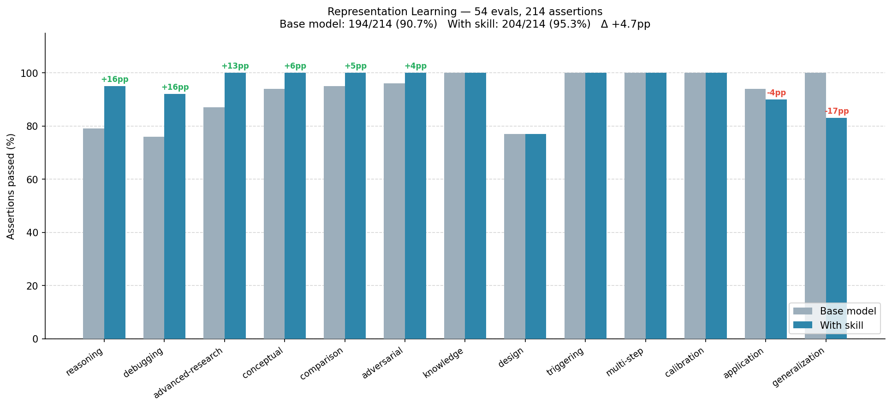

# Representation Learning Skill

A skill that gives the agent the depth to reason about learned representations the way a strong ML researcher does — not just recall definitions, but catch the failure modes that produce confident, formula-correct, wrong answers.

It encodes thirteen settled positions: cosine similarity is just Euclidean distance on L2-normalized vectors (the real question is whether to normalize); raw mean-pooled BERT embeddings are anisotropic and near-useless for similarity; modern SSL is collapse-avoidance, not feature-learning-by-magic; contrastive and masked-modeling objectives produce different geometries; unsupervised disentanglement is provably impossible without inductive biases; a linear probe measures decodability, not causal use; VAEs are latent-variable models and posterior collapse is the signature failure; tuned matrix-factorization baselines beat most neural recommenders; embeddings are point estimates while LVMs give distributions; t-SNE/UMAP geometry is not quantitatively trustworthy; more dimensions is not better; a reward model represents what the preference data rewards, not what humans want; and the backbone, not the projection head, is what you serve and evaluate after contrastive SSL training.

Five bundled diagnostic scripts (`anisotropy_effective_rank.py`, `collapse_spectrum.py`, `alignment_uniformity.py`, `linear_probe_with_controls.py`, `cka_rsa.py`) give the agent verified, self-testing implementations — each with `--selftest` — so it can run rather than re-derive subtle math (CKA centering, control-task selectivity, effective rank from singular values).

## Installation

```bash
npx skills add https://github.com/JacobElder/jakes-skills/tree/main/representation-learning
```

Or manually:

```bash
cp -r jakes-skills/representation-learning ~/.claude/skills/representation-learning
```

Once installed, the skill applies automatically when the user asks which similarity metric to use (cosine vs Euclidean vs dot product), why bi-encoder vs cross-encoder matters for RAG, how to fine-tune vs freeze an encoder, why embedding or retrieval quality is bad, how to evaluate or compare representations across models, why a VAE collapsed or gives blurry samples, what contrastive learning actually does, or how to design a representation pipeline — even if they never use those exact words.

Also fires for questions involving word2vec/BERT/CLIP/SBERT, vector-DB/ANN search, two-tower or matrix-factorization recommenders, metric learning, disentanglement, reward modeling in RLHF, probing and interpretability, multimodal alignment, and graph or knowledge-graph embeddings.

---

## Example use cases

### "My BERT embeddings for semantic search are terrible"

> I'm using mean-pooled BERT embeddings for semantic search, but totally unrelated sentences are coming back as highly similar. Is this a bug in my code or expected?

Without the skill, the response suggests checking the pooling implementation and perhaps trying a different similarity threshold — treating the problem as a code or configuration issue:

> There are a few things to check. First, verify you're actually mean-pooling over all tokens including the [CLS] token — some implementations skip it. Second, confirm you're computing cosine similarity and not Euclidean distance on raw vectors. Third, make sure you're normalizing the vectors before computing similarity. If these are correct, you may need to try a different threshold for "similar" — out-of-the-box BERT similarities often cluster near the high end.

With the skill, the response names the root cause directly — anisotropy — and gives the correct fix:

> **This is expected behavior for mean-pooled BERT — it's a known property of contextual LM embeddings, not a bug in your code.**
>
> Contextual LM embeddings are severely **anisotropic**: they occupy a narrow cone in the embedding space (Ethayarajh 2019; Gao et al. 2019 "representation degeneration problem"). All embeddings point in roughly the same direction, so cosine similarities are inflated (typically 0.85–0.99) and barely discriminate between semantically different sentences. The numbers you're seeing are correct — the metric just isn't informative.
>
> **The fix:** don't use raw BERT mean-pooling for semantic similarity. Use a model that was contrastively fine-tuned for sentence similarity:
>
> - **SBERT (sentence-transformers):** `all-MiniLM-L6-v2` or `all-mpnet-base-v2` — trained with a contrastive objective so embeddings are isotropic and cosine is actually informative.
> - **SimCSE:** same idea, trained with in-batch negatives.
>
> If you must use BERT, apply whitening first:
> ```python
> from sklearn.preprocessing import StandardScaler
> whitened = StandardScaler().fit_transform(bert_embeddings)
> # Now cosine similarity is meaningful
> ```
>
> The intuition: contrastive training pushes the embedding distribution toward isotropy (uniform on the sphere), which is why cosine similarity works there. BERT's MLM objective doesn't have this property.

---

### "My VAE gives blurry noise when I sample from the latent space"

> My VAE trains fine (reconstruction loss is low) but when I sample random points from the latent space I just get blurry garbage. What's happening?

Without the skill, the response attributes the problem to insufficient training, low latent dimensionality, or beta annealing, and suggests training longer or increasing the KL weight:

> A few possibilities: (1) Your latent space dimensionality might be too small to capture the data distribution. (2) The KL weight might be too high, over-regularizing the latent space. (3) The decoder might not be expressive enough. Try increasing latent dim, reducing the KL weight, or training for more epochs with a learning rate warmup.

With the skill, the response identifies the specific failure mode — posterior collapse — and explains the mechanism:

> **Your VAE has likely undergone posterior collapse.** Low reconstruction loss + garbage random samples is the signature: the decoder learned to ignore the latent variable entirely (KL → 0), reconstructing inputs from scratch each time instead of through the latent code. Random samples produce garbage because z has no effect on the decoder.
>
> The mechanism: with a powerful decoder (especially a convolutional or autoregressive one), it's easier for the model to minimize the ELBO by "explaining away" z and driving KL to zero than by encoding meaningful information in the latent. The variational posterior collapses to the prior: q(z|x) ≈ p(z).
>
> **Diagnosis:** Plot the KL term per latent dimension over training. If most dimensions show KL ≈ 0, you've collapsed.
>
> **Fixes (in order of invasiveness):**
> 1. **KL annealing** — start with β=0 and ramp up slowly so the decoder first learns to use z, then learns to compress. `β_t = min(1, t / T_warmup)`.
> 2. **Free bits** — enforce a minimum KL per dimension: `max(λ, KL_i)` (Kingma et al. 2016). Prevents all-zero KL.
> 3. **Weakened decoder** — use a shallower decoder or add dropout; makes "explaining away" z costly.
> 4. **β-VAE** — set β > 1 to pressure the encoder to use the latent efficiently, then fine-tune.
>
> Also check whether your reconstruction loss is log-likelihood or MSE — MSE's scale relative to the KL term is often miscalibrated and can encourage collapse.

---

### "My linear probe on BERT gets 94% on POS tags — does BERT use POS internally?"

> My linear probe on BERT hidden states gets 94% accuracy at predicting part-of-speech tags. Does that mean BERT uses POS tags internally to make its predictions?

Without the skill, the response interprets high probe accuracy as evidence of internal use:

> Yes, this strongly suggests BERT has learned to encode part-of-speech information internally. The 94% accuracy on a linear probe shows this syntactic feature is readily accessible in BERT's representations, which aligns with the broader literature showing that transformer models learn hierarchical linguistic structure through pretraining.

With the skill, the response distinguishes decodability from causal use — a critical interpretability distinction:

> **High linear-probe accuracy shows the information is *decodable* from BERT's representations — it does not show that BERT causally uses it.**
>
> These are different claims. The probe tells you: a linear classifier can recover POS tags from BERT's hidden states. It says nothing about whether BERT's downstream predictions (masked token, next sentence) *depend on* that information.
>
> Confusing the two is the single most common error in probing interpretability work. The correct inference chain is:
>
> - **Decodability:** POS information is linearly present in the layer-h representation (94% probe accuracy tells you this).
> - **Use:** BERT's predictions causally depend on POS. To claim this, you need **intervention**, not a probe.
>
> Two ways to claim causal use:
> 1. **Amnesic probing / INLP** (Ravfogel et al. 2020) — iteratively project out the POS direction and see if downstream loss increases. If BERT's prediction quality drops, the information was load-bearing.
> 2. **Activation patching** — corrupt the POS-encoding dimension at inference and measure the effect on the model's output.
>
> Also check **selectivity** (Hewitt & Liang 2019): train a control probe on random labels, same architecture. If the control task is also 85–90%, your 94% reflects the probe's capacity to memorize, not the representation's information content.

---

## Benchmark

60 capability evals across 13 categories (54-eval benchmark run below; 6 additional evals for Matryoshka embeddings and CLIP modality gap added after initial benchmark). Graded by `claude-haiku-4-5-20251001`; responses from `claude-sonnet-4-6`.



**Overall (54-eval run):** base model 194/214 (90.7%) → with skill 204/214 (95.3%), **+4.7pp**

Largest gains on the categories where intuition most often fails:

| Category | Base | With skill | Δ |
|---|---|---|---|
| Debugging | 76% | 92% | **+16pp** |
| Reasoning | 79% | 95% | **+16pp** |
| Advanced research | 87% | 100% | **+13pp** |
| Conceptual | 94% | 100% | **+6pp** |
| Comparison | 95% | 100% | **+5pp** |

Key differentiators (evals where the base model most consistently fails without the skill):

- **BERT anisotropy / raw mean-pooling for similarity** — base model treats this as a code or threshold issue; skill names the root cause and gives the contrastive-finetuning fix
- **Posterior collapse in VAEs** — base model suggests training longer or increasing KL weight; skill identifies the signature pattern (low recon loss + garbage samples) and gives the KL-annealing / free-bits diagnosis
- **Probe decodability vs causal use** — base model interprets 94% linear-probe accuracy as "the model uses this"; skill distinguishes decodability, selectivity, and causal evidence via INLP/activation patching
- **In-batch softmax popularity bias in two-tower retrieval** — base model misses the logQ sampling correction; skill flags the frequency bias and gives the correction
- **Matryoshka vs standard embedding truncation** — base model accepts truncating standard model dimensions; skill explains that prefix-truncation requires Matryoshka training and offers PCA as the post-hoc alternative
- **CLIP modality gap** — base model accepts cross-modal cosine scores at face value; skill flags that image and text embeddings occupy separate cones so cross-modal and within-modal scores are not on the same scale
