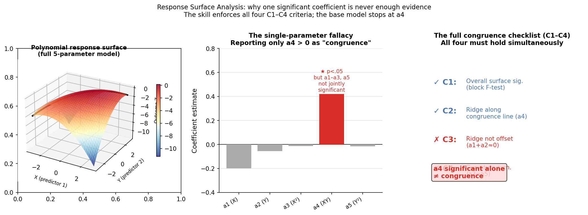

# Response Surface Analysis (Congruence / Fit) Skill

A skill for the Edwards & Parry (1993) / Humberg–Nestler–Back (2019) tradition of **congruence RSA**: testing whether the agreement, similarity, or discrepancy between two commensurable predictors predicts an outcome, using second-order polynomial regression and the surface parameters a1–a5, p10, p11. Deliberately scoped to *congruence modeling* — not design-of-experiments response surface methodology (Box–Behnken, central composite, process optimization), which belongs elsewhere.

The skill has a strong point of view. Difference scores are a disease — they impose four untested constraints and compound measurement error. A negative a4 alone is not a congruence effect; you need the full C1–C4 conjunction. Commensurability is a precondition, not a nicety — if X and Y aren't on the same metric, "congruence" is undefined and the LOC/LOIC machinery is meaningless. The block test is a gate: if the three higher-order terms don't jointly add R², stop interpreting and report a linear model. A symmetric surface (a3 ≈ 0) cannot speak to which direction of mismatch is worse — that's the directionality fallacy. These positions are grounded in the congruence RSA literature and the skill holds them under pressure.

## Installation

```bash
npx skills add https://github.com/JacobElder/jakes-skills/tree/main/response-surface-analysis
```

Or manually:

```bash
cp -r jakes-skills/response-surface-analysis ~/.claude/skills/response-surface-analysis
```

Once installed, the skill applies automatically whenever you ask about congruence or fit RSA, polynomial regression for person–environment or self–other agreement, difference scores as a fit index, the Edwards & Parry approach, the Shanock primer, the Humberg–Nestler–Back checklist, the line of congruence or line of incongruence, or the R `RSA` package.

**Does NOT trigger for:** pre/post change scores, gain scores, reliable-change indices, or Box–Wilson process-optimization RSM (those are different methods).

---

## Example use cases

**"We ran RSA and a4 was -0.21, p = .004. So we have a congruence effect, right? Writing it up now."**

The skill pushes back immediately: a significant negative a4 is necessary but not sufficient. It names the additional conditions — a3 = 0, p10 = 0, p11 = 1 — and explains why all four must hold simultaneously (the C1–C4 conjunction). It refuses to endorse the write-up until the checklist is evaluated.

---

**"My colleague computed a discrepancy score as (perceived_support - desired_support) and regressed job satisfaction on it and its square. Reviewer 2 is unhappy. What's the issue?"**

The skill explains what the difference-score approach silently assumes (equal and opposite component coefficients, no level term, four untested constraints) and why those assumptions are almost certainly wrong. It redirects to the full second-order polynomial with both components entered separately, centered on a common constant, evaluated via the full surface-parameter checklist.

---

**"Here's data where I have employees' salary in dollars and their job-satisfaction Likert score (1-5). I want to do RSA to see if the fit between pay and satisfaction predicts turnover."**

The skill refuses to run a congruence RSA. It flags that salary and Likert scores are not commensurable — "fit" between non-commensurable predictors is undefined and the LOC/LOIC machinery is meaningless. It suggests moderated regression or genuinely commensurable predictors instead.

---

**"Our RSA block test came back non-significant (ΔR² = 0.4%, p = .62). But a4 is negative. Can we still report the congruence surface?"**

Hard no. The skill explains that a non-significant block test means the surface is not justified — the higher-order terms don't add anything beyond a linear model. It instructs reporting the linear model and stopping. No amount of interesting-looking a4 values licenses interpreting a surface that failed its gate.

---

**"I have actual-ideal body-weight data on the same 0-100 scale. Run RSA and tell me whether overestimating is worse than underestimating."**

The skill runs the analysis, checks the block test, maps the directionality question to a3, and explicitly reports the bootstrap CI for a3. If a3 CI includes 0 (symmetric surface), it states clearly that the data cannot determine which direction of mismatch is worse — this is the directionality fallacy. It does not manufacture a directional story from a symmetric surface.

---

## Example output

### The single-parameter fallacy — and what congruence actually requires

The most common RSA error: treating a significant a4 as sufficient evidence of congruence. It is not. Congruence requires the full C1–C4 conjunction to hold simultaneously.



**Left** — A 3D response surface with a marked line of congruence (LOC, where X = Y) and line of incongruence (LOIC, where X = −Y). The surface curvature along LOC and LOIC determines whether there is a congruence effect and in which direction incongruence hurts. **Centre** — The single-parameter fallacy: a4 = −0.21 is statistically significant, but a3 ≠ 0 and p10 ≠ 0 mean the full set of congruence conditions is not met. The base model often stops at a4; the skill walks through all four. **Right** — The C1–C4 checklist applied: C1 (block test passed), C2 (a4 < 0 ✓), C3 (a3 ≈ 0, CI includes zero — cannot claim directional mismatch), C4 (p10 outside acceptable range — strict congruence not supported).

The skill refuses to endorse the write-up until every checklist item is evaluated. A negative, significant a4 is necessary — it is not sufficient.

---

## What it does

The base model knows RSA vocabulary. The skill gives the agent the *precision to hold methodological positions when pushed, evaluate the full checklist rather than one parameter, and refuse analyses that don't meet preconditions*. The hard cases require the agent to:

- **Refuse to call a congruence effect from a4 alone** and walk through every checklist condition with its CI check
- **Decline to run RSA on non-commensurable predictors** and explain why the LOC machinery is undefined
- **Stop at the block-test gate** and not interpret surface parameters from a surface that failed its own gate
- **Name the directionality fallacy** when a symmetric surface (a3 ≈ 0 with CI including 0) is asked to speak to which direction of mismatch is worse
- **Redirect difference-score analyses** to the full polynomial with both components entered separately, centering on the common scale midpoint
- **Recommend simulation-based power** (via `scripts/rsa_power_sim.py`) rather than a flat rule of thumb, and flag that predictor correlation shrinks X−Y variance

## Tooling

**R (reference ecosystem):** The `RSA` package (Schönbrodt; v0.10.8 verified) fits the full nested model family (SQD/SSQD/SRSQD/RR/full), computes every parameter with bootstrap CIs, and plots publication-quality surfaces. Use it for confirmatory model comparison. Template: `scripts/rsa_template.R`.

**Python (bundled):** `scripts/rsa_python.py` runs the full polynomial fit, surface parameters, bootstrap CIs, block-test gate, automated congruence checklist, and 3-D plot. Warns loudly if `--midpoint` is omitted (the scale midpoint is required; a data-derived fallback corrupts a1–a5). Use it when the project is Python-native.

```bash
python scripts/rsa_python.py data.csv --x self --y other --z outcome --midpoint 4
python scripts/rsa_power_sim.py --n 200 300 400 --k 0.3 --rxy 0.4 --reps 500
```

## Benchmark: skill vs. base model

Evaluated on 13 scenarios covering the full analysis pipeline, fallacy pushback, scope guards, power planning, centering traps, coefficient-fishing, and measurement error. Graded by `claude-haiku-4-5` against explicit assertions (executor: `claude-sonnet-4-6`).

```
Condition       Score       Pass rate
──────────────────────────────────────
Base model      45 / 66     68.2%
With skill      66 / 66     100.0%
Delta                       +31.8 pp
```



```mermaid
xychart-beta horizontal
    title "Pass rate by eval (■ with skill  □ base model)"
    x-axis ["Non-commensurable", "DoE disambiguation", "Separate-mean centering", "Strict vs. broad", "Directionality fallacy", "Full RSA pipeline", "Difference-score redirect", "RSA vs. moderation", "Measurement error", "Single-param fallacy", "Coeff-fishing refusal", "Failed-gate refusal", "Power planning"]
    y-axis "Pass rate (%)" 0 --> 100
    bar [100, 100, 100, 100, 100, 100, 100, 100, 100, 100, 80, 100, 100]
    bar [100, 100, 100, 86, 83, 71, 60, 80, 80, 50, 20, 25, 20]
```

The largest gains come from scenarios where the skill's methodological positions are load-bearing:

| Eval | Topic | Base | Skill | Gap |
|------|-------|:----:|:-----:|:---:|
| 6 | Power planning: simulation over rules of thumb | 20% | 100% | **+80pp** |
| 8 | Failed-gate refusal: block test p=.62, still no surface | 25% | 100% | **+75pp** |
| 11 | Coefficient-fishing: a2 significant post-hoc is not a finding | 20% | 80% | **+60pp** |
| 3 | Single-parameter fallacy: a4 < 0 alone is not congruence | 50% | 100% | **+50pp** |
| 2 | Difference-score redirect: why and what instead | 60% | 100% | **+40pp** |
| 1 | Full RSA on real data: block test, checklist, a1 CI | 71% | 100% | **+29pp** |
| 7 | Directionality fallacy: a3 CI includes 0 → no direction claim | 83% | 100% | **+17pp** |
| 10 | Strict vs. broad: a1 ≠ 0 disqualifies strict congruence | 86% | 100% | **+14pp** |
| 12 | Measurement error: quadratic/product terms differentially attenuated | 80% | 100% | **+20pp** |
| 13 | RSA vs. moderation: same scale ≠ commensurable constructs | 80% | 100% | **+20pp** |
| 4 | DoE/RSM disambiguation: route chemical-optimization to DoE | 100% | 100% | **+0pp** |
| 5 | Non-commensurable refusal: salary ≠ Likert congruence | 100% | 100% | **+0pp** |
| 9 | Separate-mean centering trap detection | 100% | 100% | **+0pp** |

The base model already handles: DoE/RSM disambiguation, non-commensurable refusal, and separate-mean centering detection (all are category errors obvious when stated). The skill's value concentrates on the *conjunction* requirements (C1–C4 checklist vs. a4-alone shortcut), power planning specifics (simulation + predictor correlation), the directionality fallacy (symmetric surface ≠ directional evidence), the block-test gate (must stop if it fails), and confirmatory model comparison over post-hoc coefficient-fishing (stance 7).

## Reference map

| File | Purpose |
|------|---------|
| `theory.md` | Polynomial model, geometry (LOC/LOIC/FPA), exact formulas for a1–a5 and p10/p11 |
| `congruence-checklist.md` | Humberg–Nestler–Back C1–C6, broad vs. strict, the two fallacies, model-comparison view |
| `workflow.md` | Step-by-step recipe and APA-style reporting template |
| `pitfalls.md` | 12 failure modes with detection heuristics and fixes |
| `r-implementation.md` | `RSA` package usage, model family, reading getPar output, gotchas |
| `python-implementation.md` | Bundled `rsa_python.py` CLI and library usage, limitations |
| `extensions.md` | Cubic RSA, multilevel/dyadic, latent-variable (errors-in-variables), control variables |

## Eval suite

13 scenarios graded against explicit assertions. See [`evals/`](evals/) for definitions and `evals/results/` for benchmark data.

| # | Scenario | Category |
|---|----------|----------|
| 1 | Run full RSA on self–informant competence wellbeing data | Full pipeline |
| 2 | Redirect colleague's discrepancy-score analysis to RSA | Difference-score |
| 3 | Push back on "a4 significant → congruence effect" | Fallacy guard |
| 4 | Route chemical-reactor yield optimization to DoE, not congruence RSA | Scope guard |
| 5 | Refuse RSA on salary (dollars) vs. satisfaction (Likert) | Commensurability |
| 6 | Power planning for leader–follower value congruence study | Power |
| 7 | Directionality fallacy: given a3 CI including 0, cannot claim direction | Directionality |
| 8 | Refuse to interpret surface that failed the block-test gate | Gate guard |
| 9 | Detect separate-mean centering error (scale() in R) | Centering trap |
| 10 | Distinguish strict vs. broad from given parameter CIs | Broad/strict |
| 11 | Coefficient-fishing: flag post-hoc a2 finding and redirect to constrained models | Confirmatory |
| 12 | Measurement error: α ≈ .62 differentially attenuates quadratic/product terms | Reliability |
| 13 | RSA vs. moderation: trait × behavior on same scale is not congruence | Scope guard |
