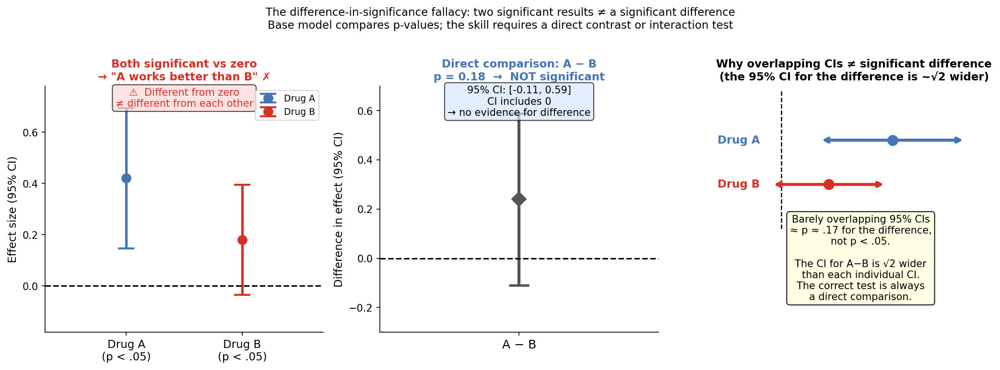

# Robust Statistics Skill

A skill for reasoning about applied statistics the way an experienced methodologist does: starting from *what is being estimated* and *what could go wrong for this specific goal at this specific sample size*, rather than running a checklist of assumption tests and mapping them to a fixed menu of procedures.

The skill has two points of view. The first is that **assumption policing** is the default failure mode to prevent — "Shapiro-Wilk rejected, so you can't use a t-test" is almost never how a senior statistician reasons. The second is that **over-engineering** is the same vice in reverse — reflexively appending alternatives when the simple method is adequate is just as misleading. The skill holds both positions.

Grounded in Gelman & Hill (*Data Analysis Using Regression and Multilevel/Hierarchical Models*), Rubin (*Multiple Imputation for Nonresponse in Surveys*), Gelman & Stern (2006), Gelman & Carlin (2014), Westreich & Greenland (2013), and the robust-inference literature (Huber, White, Long & Ervin, Efron & Hastie).

## Installation

```bash
npx skills add https://github.com/JacobElder/jakes-skills/tree/main/robust-statistics
```

Or manually:

```bash
cp -r jakes-skills/robust-statistics ~/.claude/skills/robust-statistics
```

Once installed, the skill fires whenever the user asks about statistical testing, regression, or model choice on messy real data — e.g. "is a t-test okay despite skew?", "OLS vs GLM?", "transform, bootstrap, or robust SEs?", "what does this comparison actually estimate?", "should I log-transform?", "is this assumption violated?", or any mention of p-values, standard errors, estimands, residual diagnostics, assumption checks (Shapiro-Wilk, Levene, Breusch-Pagan), bootstrapping, clustering, count/proportion/skewed outcomes, or missing data.

---

## Example use cases

### "The effect is significant in men but not women — so it differs by sex, right?"

> I ran the same regression in men and women separately. In men the coefficient on treatment is 0.42 (p = 0.03). In women it's 0.31 (p = 0.12). So the treatment effect is significant in men but not women. Does this mean the treatment works differently across sexes?

Without the skill, the base model often validates the comparison or frames the interaction test as an optional refinement:

> This pattern is suggestive of differential effectiveness. The effect in men is statistically significant while the effect in women is not, which supports your interpretation. To formally test whether the effects differ, you could add an interaction term (treatment × sex), but your separate-regression approach provides an initial indication of effect heterogeneity.

With the skill, the response opens with a clear no and explains why the comparison is invalid as stated:

> No — that's the difference-in-significance fallacy. You've observed that one p-value crossed 0.05 and another didn't, but you haven't tested whether the two coefficients differ from each other. Those thresholds aren't designed to serve as a comparison between estimates.
>
> Here's the problem made concrete: if both true effects are around 0.35 and men have a larger sample, you could easily get p = 0.03 in men and p = 0.12 in women by chance — two draws from essentially the same distribution. The difference in p-values tells you about sample sizes and standard errors, not about whether the effects themselves differ.
>
> The correct test is a direct comparison. Add an interaction term — treatment × sex — and test its coefficient. The SE of a difference is √(SE₁² + SE₂²), which is larger than either individual SE; that's why a "significant in one, not the other" pattern so often fails the formal interaction test.

---

### "Shapiro-Wilk didn't reject — so normality is fine, right?"

> I ran Shapiro-Wilk on my residuals (n=150, OLS regression) and got p = 0.08. So normality isn't violated and my inference is valid, right?

Without the skill, the base model often partially validates the conclusion while appending a note about large n:

> Three separate issues here worth untangling: Failing to reject ≠ confirming normality. p = 0.08 means the test didn't find sufficient evidence against normality — not that normality holds... At n=150 you're in a reasonably comfortable position with the CLT... While you can't definitively "confirm" normality, your OLS inference is probably sound.

With the skill, the response leads with both errors in the premise before arriving at the same practical conclusion:

> Two separate mistakes here, and fixing both changes your reasoning but probably leaves your conclusion standing.
>
> **p = 0.08 is not evidence that normality holds.** It means Shapiro-Wilk didn't detect a significant departure — absence of evidence, not evidence of absence. "The test didn't reject" is never a valid reason to proceed; the valid reason is a direct judgment that any deviation is inconsequential for your goal.
>
> **Normality of residuals is not what OLS inference requires anyway.** OLS inference rests on the sampling distribution of the *coefficient estimator* being approximately normal — and that follows from the CLT applied to the estimator, not from the raw residuals being normally distributed. At n=150, the CLT almost certainly delivers this regardless of residual shape.
>
> So your inference is probably valid — but the reason is "n=150 is large enough for the CLT to operate on the estimator," not "Shapiro-Wilk p = 0.08."

---

### "My data are right-skewed — I must log-transform before running regression, right?"

> Everyone knows you must log-transform right-skewed data before running a regression. My revenue data are heavily right-skewed. Should I log-transform?

Without the skill, the base model often partially corrects the premise but still hedges toward recommending the transform:

> Not quite — this is a very common misconception worth unpacking... OLS assumes the *residuals* are approximately normal, not the outcome variable itself... **Alternatives worth considering for revenue:** Gamma GLM with log link, heteroskedasticity-robust SEs, quantile regression...

With the skill, the response corrects the false premise directly and stops before recommending transforms without knowing the estimand:

> No — "you must log-transform right-skewed data" conflates a modeling choice with a data-cleaning step. Log-transforming changes your model: you are no longer estimating E[Y|X] but E[log Y|X]. The coefficients now describe multiplicative relationships on the geometric mean, not additive effects on the mean. Whether that is appropriate depends on what you are trying to estimate, not on whether the raw data are skewed.
>
> The two cases where log is clearly right: (1) the data-generating process is genuinely multiplicative — revenue often is, since growth compounds — and you want to model it that way; (2) you find large heteroskedasticity in OLS residuals that the log scale stabilizes. The case where it is wrong: you care about the arithmetic mean or marginal effects on the original scale, in which case the log transform produces results on a scale stakeholders cannot interpret and introduces retransformation bias if you back-transform.

---

## Example output

### The difference-in-significance fallacy

"Significant in one group, not the other" is not evidence that the effects differ. The correct test is a direct comparison of the two coefficients — and its SE is √(SE₁² + SE₂²), which is larger than either individual SE.



**Left** — Drug A (β = 0.42, p = 0.03) and Drug B (β = 0.31, p = 0.12) both plotted against zero. Drug A's CI excludes zero; Drug B's CI includes it. The naive reading: A works, B doesn't. **Centre** — The same two estimates plotted against *each other*: the difference is 0.11, with a CI of [−0.10, +0.32]. The CI easily includes zero (p = 0.18). The two effects cannot be distinguished. **Right** — The key geometry: the SE of a difference is √(SE₁² + SE₂²) ≈ 1.41× larger than either individual SE, which is exactly why "just outside the threshold" vs "just inside the threshold" so often fails to hold up as a real comparison.

The skill opens with "No — that's the difference-in-significance fallacy" and explains the correct test before offering any alternatives.

---

## What the skill does

The base model has strong statistical knowledge. The skill's job is to change **defaults and framing** — whether it pushes back on a false premise or validates it with caveats, whether it names the correct estimand move before choosing a procedure, whether it holds the "simple method is fine here" position when over-engineering is the real risk.

The skill's most important moves:

- **Reject the difference-in-significance fallacy.** "Significant in subgroup A, not in subgroup B" is not evidence that effects differ — the correct test is an interaction term.
- **Treat assumption tests as descriptive, not gatekeepers.** Shapiro-Wilk p > .05 is not confirmation of normality. Levene p > .05 is not confirmation of homoskedasticity. Reason about whether the violation is consequential, not whether the test rejected.
- **Correct false universal rules concisely.** "You must log-transform skewed data," "non-normal data prohibits a t-test," "you must apply Bonferroni" — each gets corrected in one or two paragraphs, not a lecture.
- **Name the causal estimand in RCTs.** In a randomized experiment, the difference in means is the unbiased causal estimand — randomization eliminates confounding by design. State this, don't bury it.
- **Flag Type M/S errors from underpowered significant results.** A small study returning a large significant effect is more likely inflated than real — the significance filter creates upward bias.
- **Warn about the Table 2 fallacy.** Coefficients from a multivariable model are conditional effects, not total causal effects — they require different adjustment sets.
- **Handle post-selection inference.** Stepwise regression invalidates the p-values in the final model — the selection step is implicit multiplicity.
- **Apply MCAR/MAR/MNAR taxonomy correctly.** Complete-case analysis is unbiased under different conditions than researchers typically assume.
- **Stop when the simple method is adequate.** "Welch's t-test is fine here" is a complete answer — don't append alternatives that imply a problem that doesn't exist.

---

## Benchmark: skill vs. base model

Evaluated against 37 evals: 21 from the original suite (testing a range of statistical reasoning), 16 new evals (targeting specific failure modes). Each eval uses `must_pass` assertions (necessary conditions) and `scored` assertions (80% threshold required). All 37 evals confirmed across both conditions.

| | With skill | Without skill |
|--|:---:|:---:|
| **Differentiating evals (skill wins)** | **15/15 PASS** | **14/15 FAIL** |
| **Non-differentiating evals (both pass)** | **22/22 PASS** | **22/22 PASS** |

### Where the base model fails — the 15 differentiating evals

| Eval | What it tests | Delta |
|---|---|:---:|
| Subgroup comparison fallacy | "Significant in men (p=0.03), not women (p=0.12) — effect differs" | +100pp |
| Lord's paradox (ANCOVA vs change score) | "Which is correct: change score or ANCOVA?" — baseline declares ANCOVA always correct | +80pp |
| Residual diagnostics (QQ + funnel) | Non-normal QQ and heteroskedasticity pattern — what to do and what it means | +40pp |
| Median income estimand | Asking for median difference; deciding between t-test, Mann-Whitney, quantile regression | +40pp |
| Large-n asymptotics scope | "n=2.3M so I don't have to worry about assumptions" — what large n actually rescues | +25pp |
| Shapiro-Wilk false comfort | "p = 0.08, so normality is fine and inference is valid" | +25pp |
| Count regression estimand | Support-ticket counts: when Poisson/NB vs OLS, and what each buys | +20pp |
| Beta regression scope | Proportions outcome: when to use beta vs logit-transformed OLS vs LPM | +20pp |
| Pre/post matched groups | ANCOVA on matched pre/post data — what the pre-score adjustment achieves | +20pp |
| RCT causal estimand | Randomized experiment: difference in means is the unbiased causal estimand | +20pp |
| Table 2 fallacy | Reporting all logistic regression coefficients as causal effects | +20pp |
| MAR subtlety for complete-case | 20% outcome missingness: when complete-case is valid beyond MCAR | +20pp |
| Quantile regression nuance | Distribution-free property and heterogeneous-effects estimand | +20pp |
| Log-transform false rule | "Everyone knows you must log-transform right-skewed data" | +20pp |
| VIF multicollinearity | Reviewer demands dropping variables due to VIF > 5 — what VIF actually means for inference | +20pp |

### Non-discriminating evals — base model already handles these

The base model passes 22 evals without the skill. These span: Type M/S errors under low power, post-selection inference, permutation sharp vs weak null, CLT at large n, Bonferroni vs Holm, zero-inflated counts, logistic regression separation, bootstrap CIs, causal confounding from voluntary participation, LPM vs logistic, mediator/collider identification, regression to the mean, and standard GLM family selection.

The skill's differential value concentrates on **subtle nuances the base model glosses over** (the mediator-specific MAR subtlety, quantile regression's distribution-free property, what exactly large n rescues) and on **cases where the user states a false premise confidently** (false universal rules, subgroup comparison fallacy, assumption-test as confirmation, Lord's paradox). The base model handles direct knowledge questions well; the skill changes behavior when the question is framed as "is my approach right?" with a flawed premise embedded.

---

## Eval suite

37 evals across two categories.

**Category 1 — Statistical reasoning (evals 1–21):** Two-group comparisons, GLM family selection, overdispersion, zero-inflation, count regression, logistic regression, survival analysis, causal identification, quantile regression, missing data, heteroskedasticity, clustered SEs, bootstrap, permutation tests, proportions outcomes, pre/post designs.

**Category 2 — Targeted failure modes (evals 22–37):** Difference-in-significance fallacy, Type M/S errors, Table 2 fallacy, post-selection inference, missing data MCAR/MAR/MNAR, quantile regression estimand, permutation test over-engineering, adversarial false premises, Shapiro-Wilk as normality confirmation, Bonferroni mandatory rule, Lord's paradox / ANCOVA vs change score, mediator vs confounder identification, regression to the mean.

---

## Structure

```
robust-statistics/
├── SKILL.md                              ← top-level routing and core principles (always loaded)
└── references/
    ├── robustness.md                     ← CLT/Berry-Esseen intuition, Welch, skew vs heavy tails
    ├── estimands.md                      ← group comparisons, OVB, descriptive vs causal, ANCOVA
    ├── glm-families.md                   ← logistic, Poisson, NB, gamma, beta, zero-inflated, ordinal
    ├── robust-inference.md               ← sandwich SEs, bootstrap, permutation, quantile regression
    ├── diagnostics.md                    ← residuals, leverage, overdispersion, calibration, separation
    ├── philosophy.md                     ← estimands vs procedures, asymptotics, Type M/S, practical vs statistical significance
    ├── worked-examples.md               ← reproducible simulations: t-test under skew; overdispersion SE inflation
    ├── inference-validity.md             ← difference-in-significance, Type M/S, Table 2 fallacy, post-selection, multiple comparisons
    └── missing-data.md                   ← MCAR/MAR/MNAR, complete-case validity, MI, FIML, MNAR sensitivity
```

---

## Sources

- **Gelman, A., & Hill, J. (2007).** *Data Analysis Using Regression and Multilevel/Hierarchical Models.* Cambridge University Press.
- **Gelman, A., & Stern, H. (2006).** The difference between "significant" and "not significant" is not itself statistically significant. *The American Statistician*, 60(4), 328–331.
- **Gelman, A., & Carlin, J. (2014).** Beyond power calculations: Assessing Type S (sign) and Type M (magnitude) errors. *Perspectives on Psychological Science*, 9(6), 641–651.
- **Gelman, A., & Loken, E. (2014).** The statistical crisis in science. *American Scientist*, 102(6), 460.
- **Westreich, D., & Greenland, S. (2013).** The Table 2 fallacy: Presenting and interpreting confounder and modifier coefficients. *American Journal of Epidemiology*, 177(4), 292–298.
- **Rubin, D. B. (1976).** Inference and missing data. *Biometrika*, 63(3), 581–592.
- **White, H. (1980).** A heteroskedasticity-consistent covariance matrix estimator and a direct test for heteroskedasticity. *Econometrica*, 48(4), 817–838.
- **Long, J. S., & Ervin, L. H. (2000).** Using heteroscedasticity consistent standard errors in the linear regression model. *The American Statistician*, 54(3), 217–224.
- **Efron, B., & Hastie, T. (2016).** *Computer Age Statistical Inference.* Cambridge University Press.
- **Berry, A. C. (1941); Esseen, C.-G. (1942).** Berry-Esseen theorem — rate of CLT convergence under finite variance and skewness.
- **Ioannidis, J. P. A. (2008).** Why most discovered true associations are inflated. *Epidemiology*, 19(5), 640–648.
