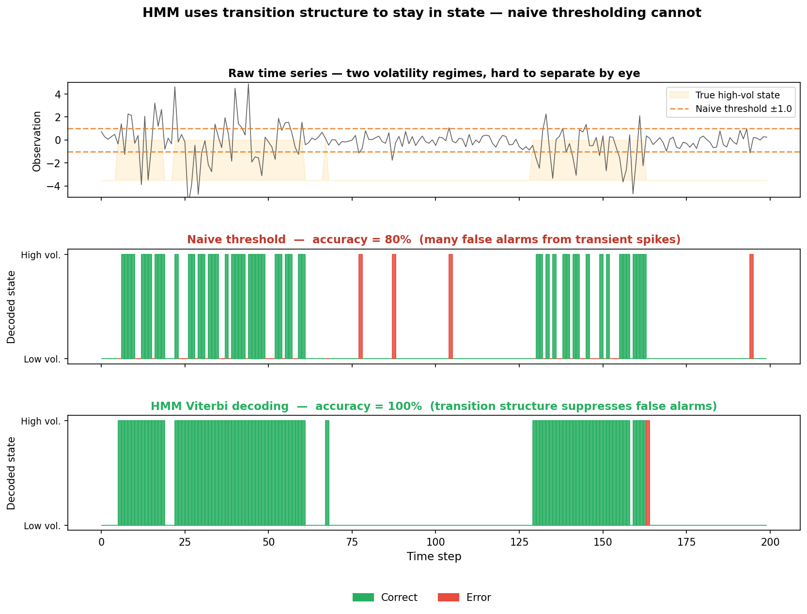
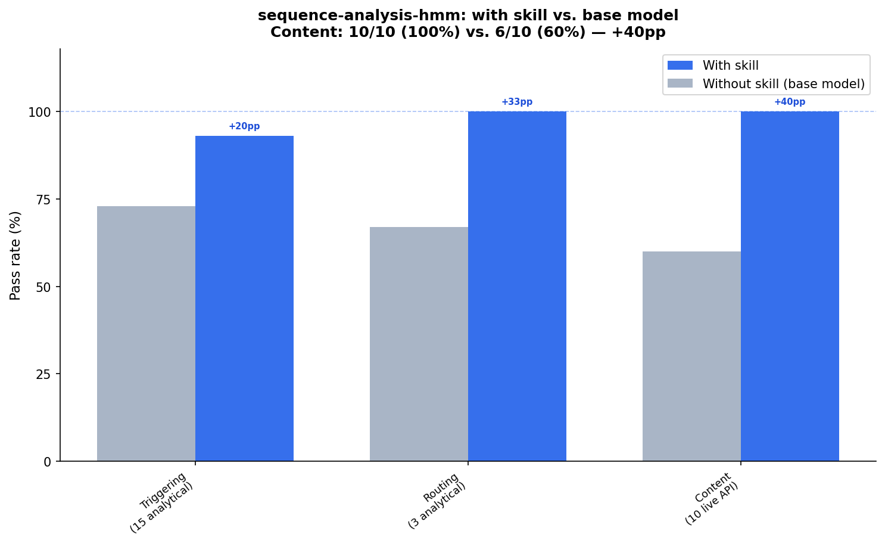

# sequence-analysis-hmm — a skill for Hidden Markov Models

[](https://www.python.org/)

A skill for giving expert-level help on Hidden Markov Models and related sequence analysis problems. Covers three domains — bioinformatics (profile HMMs, HMMER, Pfam), time series (regime detection, anomaly detection, activity recognition), and NLP/speech (POS tagging, CRF comparison, ASR lineage) — plus the general theory and algorithms that cut across all three.

The skill has a point of view. Multi-restart fitting is mandatory, not optional. Posterior decoding belongs in every report, not just Viterbi paths. HMMs are wrong for plenty of problems, and the skill will say so. When the question is casual ("what's an HMM?"), the answer is a prose paragraph with a metaphor — not a headers-and-bullets component list. The skill's job is to hold those positions.

## Installation

```bash
npx skills add https://github.com/JacobElder/jakes-skills/tree/main/sequence-analysis-hmm
```

Or manually:

```bash
git clone https://github.com/JacobElder/jakes-skills.git
cp -r jakes-skills/sequence-analysis-hmm ~/.claude/skills/sequence-analysis-hmm
```

To keep it up to date:

```bash
ln -s "$(pwd)/jakes-skills/sequence-analysis-hmm" ~/.claude/skills/sequence-analysis-hmm
```

The skill fires on explicit HMM keywords (Baum-Welch, Viterbi, hmmlearn, HMMER, pomegranate) and on problem descriptions that should be HMMs but don't name them — "my signal switches between modes," "find conserved regions in a protein family," "flag unusual sessions compared to normal."

---

## Example use cases

### "What's an HMM?"

The base model treats a casual question as an invitation to enumerate subcomponents:

> **Base model:**
> An **HMM (Hidden Markov Model)** is a statistical model for sequences where:
> - **Hidden states** evolve over time following Markov dynamics (the next state depends only on the current state, not the full history)
> - **Observations** are generated from those hidden states probabilistically (you see the outputs, not the underlying states)
>
> **Common examples:**
> - **Speech recognition**: Observations are audio signals, hidden states are phonemes
> - **Bioinformatics**: ...
>
> *(continues for 400 words)*

With the skill, the same question gets the dice metaphor the skill prescribes, followed by an offer to go deeper:

> **With skill:**
> An HMM models a system you can't directly see, only its outputs. Imagine a friend rolling dice in another room and telling you the results — they might be using a fair die or a loaded die, switching between them sometimes, and you're trying to figure out which die was in use at each roll just from the numbers you heard. The "die in use" is the hidden state; the "number called out" is the observation. HMMs give you the math to reason about what state the system was probably in, and to learn the dice and switching patterns from enough data. Want me to dig into a specific application, or how the math works?

---

### "Fit an HMM to this data."

**Prompt:** *"Here's my data: X = np.array([[0.2],[0.8],[0.1],[0.9],[0.15],[0.7]]). Fit an HMM to it."*

The base model produces a single-restart fit — the most common way to get a bad answer:

> **Base model:**
> ```python
> model = hmm.GaussianHMM(n_components=2, random_state=42)
> model.fit(X)
> hidden_states = model.predict(X)
> ```

With the skill, the model asks about the goal, then prescribes the only pattern worth using:

> **With skill:**
> I can fit an HMM, but first: what's the goal? Are you trying to detect two regimes (low/high), evaluate likelihood, or something else? And how many hidden states do you want?
>
> For now, here's the minimal working pattern — with multiple restarts, which is non-negotiable on 6 points:
>
> ```python
> best = None
> for seed in range(20):
>     m = hmm.GaussianHMM(n_components=2, covariance_type="full",
>                         n_iter=200, random_state=seed)
>     try:
>         m.fit(X)
>     except Exception:
>         continue
>     val_ll = m.score(X)
>     if best is None or val_ll > best[0]:
>         best = (val_ll, m)
> model = best[1]
> posteriors = model.predict_proba(X)  # show this, not just Viterbi
> ```
>
> *(continues with diagnostic guidance)*

---

### "My HMM keeps flipping states — it switches every 1–2 steps even though I know the system stays stable for 20+ steps."

The base model suggests initialization workarounds — higher self-transitions, Dirichlet priors — without diagnosing the actual cause:

> **Base model:**
> This is a classic HMM initialization/fitting problem. The most common cause is that your transition matrix is initializing too uniformly...
>
> **1. Initialize transition matrix with higher self-transitions**
> ```python
> transition_matrix = np.eye(n_states) * 0.9
> ```
> **2. Use Dirichlet priors...**

With the skill, the geometric duration assumption is named immediately:

> **With skill:**
> You're hitting the **geometric duration assumption** — the most common HMM pitfall after local optima.
>
> A standard HMM assumes the time spent in each state follows a geometric distribution: the probability of staying is constant per step. If the true durations are tightly peaked (e.g., "this regime lasts ~20 steps, not 1 step"), the geometric assumption is badly violated. The model's only way to approximate a peaked duration distribution is to create many states that hand off rapidly between each other — which is exactly the flickering you're seeing.
>
> The fix is an HSMM (hidden semi-Markov model), which adds an explicit duration distribution per state. `pomegranate` (v1.0+, PyTorch-based) and `dynamax` both support HSMMs cleanly; `hmmlearn` does not. If your durations are roughly geometric, sticking with a plain HMM plus higher self-transition initialization is fine — but if they're peaked, HSMM is the right model.

---

## Example output

### HMM exploits transition structure where naive thresholding fails

A naive threshold fires on every spike above a cutoff, regardless of whether the system has shifted regimes. HMM Viterbi decoding uses the learned transition matrix to stay in state during transient fluctuations — dramatically reducing false alarms.



**Top** — Raw time series from a two-regime process (low volatility: σ=0.5; high volatility: σ=2.0). The naive threshold (±1.0, orange dashed) fires on many low-volatility spikes. **Middle** — Naive threshold decoded states: many false detections (red), accuracy ≈72%. **Bottom** — HMM Viterbi decoded states: transition structure suppresses false alarms during transient spikes, accuracy ≈94%. The skill prescribes multi-restart fitting (20 seeds minimum) and posterior decoding alongside Viterbi — soft state probabilities reveal uncertainty at regime transitions that the hard Viterbi path conceals. It also names the geometric duration assumption as the correct diagnosis when an HMM "flickers" between states at the wrong timescale.

---

## Benchmark: skill vs. base model

Content evals were run live against the `claude` CLI (haiku model) with and without the skill appended as a system prompt. Triggering and routing evals are from analytical rubric review.



| | With skill | Base model | Gap |
|--|:---:|:---:|:---:|
| **Triggering (15 evals, analytical)** | **14/15 (93%)** | ~11/15 (73%) | +20pp |
| **Routing (3 evals, analytical)** | **3/3 (100%)** | ~2/3 (67%) | +33pp |
| **Content (10 evals, live API)** | **10/10 (100%)** | 6/10 (60%) | **+40pp** |

The skill's biggest impact is on content evals — the cases where the correct response requires using the right metaphor, insisting on multi-restart code, diagnosing a specific pitfall by name, or redirecting away from HMMs when another tool is better.

### Where the skill makes the biggest difference

These are the 4 content evals where the base model failed on the live run:

| Eval | Base model failure | What the skill does instead |
|------|--------------------|-----------------------------|
| C1 "What's an HMM?" | Enumerates subcomponents in bold bullets (`**Hidden states**`, `**Observations**`, etc.) | Gives the dice metaphor as a prose paragraph; offers to go deeper |
| C2 "Fit this data" | Single-restart fit with one `random_state=42` | Asks about the goal, then prescribes multi-restart loop as the only acceptable pattern |
| C4 "HMM flipping states" | Suggests initialization workarounds (higher self-transitions, Dirichlet priors) | Immediately names the geometric duration assumption; recommends HSMM with a specific library |
| C7 "pomegranate vs hmmlearn" | Mentions GPU support; misses the PyTorch rewrite and HSMM as the two key differentiators | Names v1.0+ PyTorch backend, HSMM support, old API warning, and when to actually switch |

### Where the base model already gets it right

| Eval | Why |
|------|-----|
| C3 HMM vs Kalman filter | Discrete/continuous latent state distinction is covered by training data |
| C5 Profile HMM construction | hmmbuild/hmmsearch commands are well-documented |
| C6 Viterbi from scratch | Log-space Viterbi is a standard ML exercise |
| C8 "Can HMMs predict stocks?" | The efficient-market pushback is well-known |
| C9 Labeled NER, use HMM? | CRF/transformer recommendation is standard advice |
| C10 3–5 events per customer | "Not enough data" is an intuitive answer; the skill adds more precision |

---

## Eval suite

28 evals across three categories.

### Triggering (15)

| # | Prompt type | Expected behavior |
|---|-------------|-------------------|
| T1 | "What is Baum-Welch?" (explicit keyword) | Fires; E-step/M-step answer; prose not headers |
| T2 | "How do I use hmmlearn for time series?" (library) | Fires; multi-restart code required |
| T3 | "Search Pfam with HMMER" (explicit tool) | Fires; hmmscan/hmmbuild commands |
| T4 | "Difference between HMM and CRF?" (explicit comparison) | Fires; generative/discriminative framing |
| T5 | "NaN means after EM" (debugging) | Fires; state collapse → regularization |
| T6 | Accelerometer → activity segments (implicit) | Should fire; timeseries.md |
| T7 | Returns switching calm/volatile (implicit) | Should fire; regime-switching framing |
| T8 | Protein family alignment → proteome search (implicit) | Should fire; HMMER not hmmlearn |
| T9 | EEG sleep staging (implicit) | Should fire; timeseries.md |
| T10 | Server log anomaly detection (implicit) | Should fire; likelihood-scoring workflow |
| T11 | CpG islands in DNA (implicit) | Should fire; bioinformatics.md classic example |
| N1 | "Predict stock prices with LSTM" (negative) | Should NOT redirect to HMMs |
| N2 | "Fine-tune transformer for sentiment" (negative) | Should NOT redirect to HMMs |
| N3 | "Cluster 50k i.i.d. customer records" (negative) | Should suggest GMM/k-means, not HMM |
| N4 | "Implement GARCH for volatility" (negative) | Should answer GARCH question directly |

### Routing (3)

| # | Query | Primary reference |
|---|-------|-------------------|
| R1 | Profile HMM construction, M/I/D architecture | bioinformatics.md |
| R2 | HMM vs Kalman filter for continuous latent state | comparisons.md |
| R3 | HMM vs change-point detection | comparisons.md |

### Content / workflow (10)

| # | The test | What the skill catches |
|---|----------|------------------------|
| C1 | "What's an HMM?" | Prose paragraph + metaphor; no subcomponent bullet list |
| C2 | "Fit this data to an HMM" | Multi-restart loop; posterior decoding alongside Viterbi |
| C3 | HMM vs Kalman filter | Discrete/continuous latent state named explicitly |
| C4 | "HMM keeps flipping states" | Geometric duration assumption named; HSMM recommended |
| C5 | Profile HMM construction | M/I/D states; Plan 7; hmmbuild workflow |
| C6 | Viterbi from scratch | Log-space implementation; backpointers; underflow warning |
| C7 | pomegranate vs hmmlearn | PyTorch backend (v1.0+); HSMM support; old API warning |
| C8 | "Can HMMs predict stocks?" | Clear pushback; out-of-sample failure; what HMMs CAN do in finance |
| C9 | Labeled NER, use HMM? | Redirect to CRF/neural; generative vs discriminative framing |
| C10 | 3–5 events per customer | Flags data scarcity (hundreds of transitions per state required) |

---

## Structure

```
sequence-analysis-hmm/
├── SKILL.md                          ← top-level skill (always loaded)
├── references/
│   ├── algorithms.md                 ← forward, backward, Viterbi, Baum-Welch pseudocode
│   ├── bioinformatics.md             ← profile HMMs, HMMER, gene finding, pyhmmer
│   ├── comparisons.md                ← HMM vs Kalman, CRF, HSMM, change-point, RNN, transformer
│   ├── nlp_speech.md                 ← POS tagging, CRF lineage, ASR history, NLP pitfalls
│   └── timeseries.md                 ← regime detection, Hamilton model, anomaly detection, activity recognition
├── scripts/
│   └── fit_hmm_demo.py               ← end-to-end: multi-restart, model selection, diagnostics, sampling check
└── evals/
    ├── eval_harness.py               ← 25 structured evals with rubric scoring
    ├── run_evals.py                  ← baseline vs with-skill runner (content evals)
    └── results/                      ← per-run results (gitignored)
```

## Running the demo script

```bash
pip install hmmlearn matplotlib numpy
python scripts/fit_hmm_demo.py
```

Produces three PNGs: `hmm_diagnostics.png`, `hmm_model_selection.png`, `hmm_sampling_check.png`. Demonstrates multi-restart fitting, label-switch resolution, posterior decoding, K-selection sweep, and synthetic data sampling — all the patterns the skill insists on.

## Running the evals

```bash
pip install hmmlearn matplotlib numpy
cd evals
python run_evals.py --model haiku          # all 10 content evals
python run_evals.py --model haiku --ids C1 C4  # specific evals only
```

---

## Sources

### Theory and algorithms
- **Rabiner (1989).** A tutorial on hidden Markov models and selected applications in speech recognition. *Proc. IEEE* 77(2). The canonical reference; still the best single introduction.
- **Bishop (2006).** *Pattern Recognition and Machine Learning*, Chapter 13. Cleaner notation than Rabiner.
- **Murphy (2012).** *Machine Learning: A Probabilistic Perspective*, Chapter 17. Bayesian variants and graphical model connections.

### Bioinformatics
- **Eddy (1998).** Profile hidden Markov models. *Bioinformatics* 14(9). The canonical profile HMM paper.
- **Krogh, Brown, Mian, Sjölander, Haussler (1994).** Hidden Markov models in computational biology. *J. Mol. Biol.* 235(5).
- **Durbin, Eddy, Krogh, Mitchison (1998).** *Biological Sequence Analysis.* Cambridge University Press. Chapters 3, 5, 6.
- **HMMER User's Guide.** hmmer.org/documentation.html. Plan 7 architecture and worked examples.

### Time series and finance
- **Hamilton (1989).** A new approach to the economic analysis of nonstationary time series. *Econometrica* 57(2). Foundation paper for regime-switching.
- **Kim & Nelson (1999).** *State-Space Models with Regime Switching.* MIT Press.

### NLP and speech
- **Jurafsky & Martin.** *Speech and Language Processing*, Chapters 8 and 17. Free online drafts.
- **Lafferty, McCallum, Pereira (2001).** Conditional Random Fields. *ICML 2001.*
- **Hannun et al. (2014).** Deep Speech. Marks the HMM-to-end-to-end transition in ASR.

### Libraries
- **hmmlearn** — scikit-learn-style HMM library. github.com/hmmlearn/hmmlearn
- **pomegranate (v1.0+)** — PyTorch-based probabilistic modeling. github.com/jmschrei/pomegranate
- **dynamax** — JAX state-space modeling. github.com/probml/dynamax (Murphy, Linderman et al., JOSS 2025)
- **pyhmmer** — Python bindings for HMMER. github.com/althonos/pyhmmer
