# survey-design

Design, review, and repair self-report surveys and questionnaires. Covers question wording, response format selection, scale construction, instrument assembly, response-bias mitigation, and the specific errors that originate at design time.

## Installation

```bash
npx skills add https://github.com/JacobElder/jakes-skills/tree/main/survey-design
```

Or manually:

```bash
cp -r jakes-skills/survey-design ~/.claude/skills/survey-design
```

Once installed, the skill applies automatically whenever you ask about survey design, questionnaire wording, scale construction, response format selection, agree/disagree scales, "select all that apply," acquiescence bias, leading questions, double-barreled items, response-style mitigation, or instrument assembly — including informal descriptions like "we want to add a quick pulse survey" or "can you review our questionnaire?"

---

## Example use cases

### "We want to keep it simple — just Strongly Agree / Disagree"

> We're designing a quick employee engagement pulse. To keep it simple, we want a 2-point response scale: Agree or Disagree.

Without the skill, the model accommodates the choice and moves on:

> A 2-point scale is perfectly usable for a quick pulse. You lose some nuance compared to a 5-point scale, but the simplicity may increase completion rates. Just make sure your items are clearly worded so respondents know what they're agreeing or disagreeing with.

With the skill, the model names the variance loss before offering to help:

> A 2-point scale costs you a lot here — but not for the reason most people think.
>
> The primary problem isn't nuance; it's that dichotomizing continuous attitudes discards most of the variance you're trying to measure. Employees who feel "somewhat engaged" and "extremely engaged" get the same score. In practice, 2-point agree/disagree items measure almost nothing: all items pile near "Agree" in any halfway-positive workplace context, and you can't distinguish the signal you care about from ceiling effects.
>
> The specific finding on format: for agree/disagree worded items, 5 response options outperform 7 and 11 on reliability, completion time, and validity. Five is the evidence-based choice here, not "more options = more granularity."
>
> If the real goal is brevity, the fix is fewer *items*, not fewer *options* — three well-targeted 5-point items outperform ten 2-point items on every psychometric criterion.

---

### "Our product features question will have 15 options — we'll use 'select all that apply'"

> We're asking respondents which of our 15 product features they use. We'll use a "Select all that apply" format so they can pick as many as they want.

Without the skill, the model suggests a few tips and moves on:

> SATA (Select All That Apply) is a natural fit for this question. A few tips: randomize the option order to avoid position bias, consider adding a "None of the above" option, and keep the list short enough that respondents won't get fatigued — 15 options is on the longer side, so trimming where possible would help.

With the skill, the model flags the satisficing mechanism before any tips:

> SATA has a systematic undercount problem that's important to understand before choosing it. The satisficing mechanism works like this: respondents scan the list, select the first few options that feel "good enough," and stop — not because they've considered all options, but because selection feels complete. Items near the bottom of a 15-item SATA list are reliably underselected regardless of their true prevalence, by roughly 15–25% relative to the top items.
>
> For 15 features, this matters: if you rotate the order, the systematic undercount moves with the rotation — you can diagnose satisficing, but you can't correct for it after the fact.
>
> **Better approaches for this use case:**
> - **Forced-choice ranking:** "Which 3 features do you use most?" reduces cognitive load and gives clean priority data.
> - **Binary yes/no per feature (grid):** each feature gets its own yes/no question. More items, but each is independently answered without satisficing across the list. Watch for straightlining if the grid is long.
> - **SATA with position rotation:** acceptable if you only need relative prevalence and plan to report with position-order context. Just don't report raw SATA endorsement rates as absolute usage.

---

## Example output

### Acquiescence bias inflates cross-construct correlations

When all items use an agree/disagree format, people who tend to agree ("yea-sayers") raise every score regardless of item content. This inflates the apparent correlation between anxiety and extraversion — two constructs that are genuinely near-orthogonal — and erodes discriminant validity.


**Left** — Agree/disagree format: acquiescence tendency contaminates all 8 items. Cross-construct correlations (A1–A4 with E1–E4) are meaningfully elevated (mean r ≈ 0.28) even though the underlying constructs are independent. **Right** — Balanced or forced-choice format: acquiescence cannot inflate scores because there is no direction to agree with. Cross-construct correlations drop to near zero (mean r ≈ 0.02) and the two constructs are cleanly separated. The skill names acquiescence as a **structural design problem** — not a statistical correction to apply after data collection — and recommends balanced formats, forced-choice items, or mixed-keyed batteries at design time, before the data is contaminated.

---

## What it does

The base model knows survey design facts but gives accommodating responses. When a user insists on a methodologically weak design, it opens with "Sure, I can help you finalize the survey with those choices!" — validating a 2-point Agree/Disagree scale and "select all that apply" grids without explaining what either costs. When reviewing a survey, it lists abstract bias names without providing concrete rewrites. When asked how many scale points to use, it defers to "it depends" without stating the specific finding (reliability plateaus at 5–7 for agree/disagree; 5 beats 7 and 11 for that format specifically).

The skill gives the agent the conviction to explain the *specific* data-quality cost of each design decision — the variance loss from a 2-point scale, the satisficing mechanism that makes "select all that apply" undercount late items, the acquiescence inflation that biases agree/disagree batteries — and hold that position when a user or their colleague pushes back. It also enforces a clean boundary: questions about post-collection measurement modeling (reliability coefficients, factor analysis, IRT) are handed off to the psychometrics skill rather than improvised here.

This skill owns decisions made *before and during* data collection:

- **Question wording** — double-barreled, leading/loaded, presuppositions, ambiguity, negations, sensitive questions, demographic and identity items (gender two-step, race multi-select, age bands, prefer-not-to-say)
- **Response format** — open vs. closed; rating, ranking, SATA vs. forced-choice, semantic differential, slider; bipolar vs. unipolar structure; branching / two-step sequences
- **Scale construction** — number of points, midpoint, full verbal labeling
- **Instrument assembly** — question order, length/fatigue, mode effects, pretesting, attention checks
- **Response-style mitigation** — acquiescence, extreme responding, midpoint bias, straightlining, social desirability

The **psychometrics skill** handles what happens after data exists: reliability estimation, factor analysis (EFA/CFA), IRT, measurement invariance, and statistical correction of response styles. Sampling design and post-collection weighting are out of scope for both.

## Benchmark: skill vs. base model

**+52pp** — 100% with skill vs. 48.5% base (36/36 assertions across 6 evals).

```mermaid
xychart-beta horizontal
    title "Pass rate by eval (■ with skill  □ base model)"
    x-axis ["Pushback on bad design", "Calibration (clean survey)", "Psychometrics boundary", "Scale-points decision", "Design engagement pulse", "Review customer-sat survey"]
    y-axis "Pass rate (%)" 0 --> 100
    bar [100, 100, 100, 100, 100, 100]
    bar [17, 57, 67, 60, 57, 57]
```



| Eval | What it tests | With skill | Without |
|---|---|---|---|
| Review customer-sat survey | Detects double-barreled, leading, acquiescence, SATA, sensitive items, scale labeling; provides concrete rewrites | 7/7 | 4/7 |
| Design engagement pulse | Format choices, fatigue management, sensitive item placement, named-bias justification | 7/7 | 4/7 |
| Scale-points decision | Rejects "more is always better"; gives the 5-vs-7 evidence including the agree/disagree-specific finding | 5/5 | 3/5 |
| Psychometrics boundary | Declines CFA/EFA request and hands off cleanly | 3/3 | 2/3 |
| Calibration (clean survey) | Does NOT invent flaws in a well-designed instrument | 7/7 | 4/7 |
| Pushback on bad design | Explains data-quality costs and recommends correct alternatives when user insists on weak choices | 6/6 | 1/6 |

Biggest gap on the pushback eval (+83pp): the base model validates the user's bad choices and provides formatting tips; the skill explains why each choice loses data quality and what to do instead.

## Reference files

| File | Contents |
|---|---|
| `references/question-wording.md` | Wording rules with before/after rewrites; demographic & identity questions |
| `references/response-formats.md` | Format taxonomy; bipolar vs. unipolar; branching; scale-points debate; midpoint; labeling |
| `references/response-styles-and-error.md` | Satisficing model; acquiescence, ERS, MRS, straightlining; social desirability; mode effects |
| `references/questionnaire-assembly.md` | Order effects; length/fatigue; nonresponse; pretesting; attention checks |

