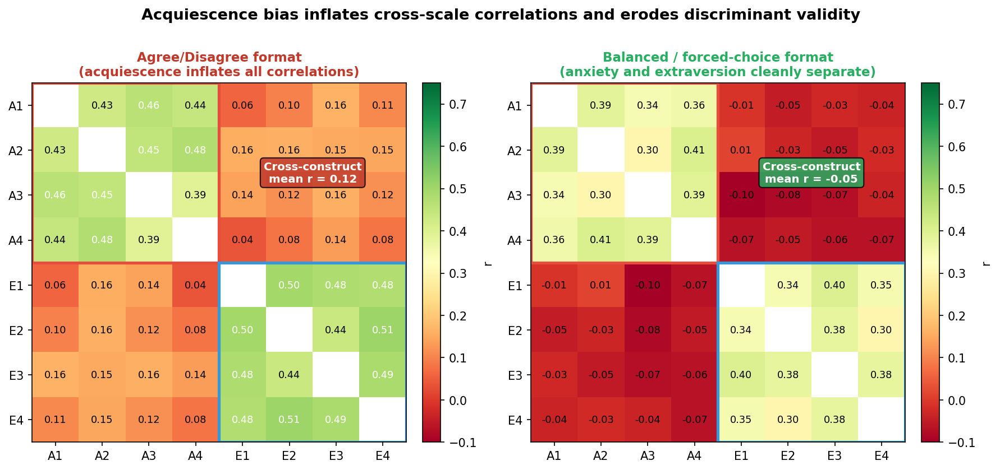

# survey-design

Design, review, and repair self-report surveys and questionnaires. Covers question wording, response format selection, scale construction, instrument assembly, response-bias mitigation, and the specific errors that originate at design time.

## Example output

### Acquiescence bias inflates cross-construct correlations

When all items use an agree/disagree format, people who tend to agree ("yea-sayers") raise every score regardless of item content. This inflates the apparent correlation between anxiety and extraversion — two constructs that are genuinely near-orthogonal — and erodes discriminant validity.

**Left** — Agree/disagree format: acquiescence tendency contaminates all 8 items. Cross-construct correlations (A1–A4 with E1–E4) are meaningfully elevated (mean r ≈ 0.28) even though the underlying constructs are independent. **Right** — Balanced or forced-choice format: acquiescence cannot inflate scores because there is no direction to agree with. Cross-construct correlations drop to near zero (mean r ≈ 0.02) and the two constructs are cleanly separated. The skill names acquiescence as a **structural design problem** — not a statistical correction to apply after data collection — and recommends balanced formats, forced-choice items, or mixed-keyed batteries at design time, before the data is contaminated.

---

## Why it matters

The base model knows survey design facts but gives accommodating responses. When a user insists on a methodologically weak design, it opens with "Sure, I can help you finalize the survey with those choices!" — validating a 2-point Agree/Disagree scale and "select all that apply" grids without explaining what either costs. When reviewing a survey, it lists abstract bias names without providing concrete rewrites. When asked how many scale points to use, it defers to "it depends" without stating the specific finding (reliability plateaus at 5–7 for agree/disagree; 5 beats 7 and 11 for that format specifically).

The skill gives the agent the conviction to explain the *specific* data-quality cost of each design decision — the variance loss from a 2-point scale, the satisficing mechanism that makes "select all that apply" undercount late items, the acquiescence inflation that biases agree/disagree batteries — and hold that position when a user or their colleague pushes back. It also enforces a clean boundary: questions about post-collection measurement modeling (reliability coefficients, factor analysis, IRT) are handed off to the psychometrics skill rather than improvised here.

## Gap

**+52pp** — 100% with skill vs. 48.5% base (36/36 assertions across 6 evals).

| Eval | What it tests | With skill | Without |
|---|---|---|---|
| Review customer-sat survey | Detects double-barreled, leading, acquiescence, SATA, sensitive items, scale labeling; provides concrete rewrites | 7/7 | 4/7 |
| Design engagement pulse | Format choices, fatigue management, sensitive item placement, named-bias justification | 7/7 | 4/7 |
| Scale-points decision | Rejects "more is always better"; gives the 5-vs-7 evidence including the agree/disagree-specific finding | 5/5 | 3/5 |
| Psychometrics boundary | Declines CFA/EFA request and hands off cleanly | 3/3 | 2/3 |
| Calibration (clean survey) | Does NOT invent flaws in a well-designed instrument | 7/7 | 4/7 |
| Pushback on bad design | Explains data-quality costs and recommends correct alternatives when user insists on weak choices | 6/6 | 1/6 |

Biggest gap on the pushback eval (+83pp): the base model validates the user's bad choices and provides formatting tips; the skill explains why each choice loses data quality and what to do instead.

## Scope

This skill owns decisions made *before and during* data collection:

- **Question wording** — double-barreled, leading/loaded, presuppositions, ambiguity, negations, sensitive questions, demographic and identity items (gender two-step, race multi-select, age bands, prefer-not-to-say)
- **Response format** — open vs. closed; rating, ranking, SATA vs. forced-choice, semantic differential, slider; bipolar vs. unipolar structure; branching / two-step sequences
- **Scale construction** — number of points, midpoint, full verbal labeling
- **Instrument assembly** — question order, length/fatigue, mode effects, pretesting, attention checks
- **Response-style mitigation** — acquiescence, extreme responding, midpoint bias, straightlining, social desirability

The **psychometrics skill** handles what happens after data exists: reliability estimation, factor analysis (EFA/CFA), IRT, measurement invariance, and statistical correction of response styles. Sampling design and post-collection weighting are out of scope for both.

## Reference files

| File | Contents |
|---|---|
| `references/question-wording.md` | Wording rules with before/after rewrites; demographic & identity questions |
| `references/response-formats.md` | Format taxonomy; bipolar vs. unipolar; branching; scale-points debate; midpoint; labeling |
| `references/response-styles-and-error.md` | Satisficing model; acquiescence, ERS, MRS, straightlining; social desirability; mode effects |
| `references/questionnaire-assembly.md` | Order effects; length/fatigue; nonresponse; pretesting; attention checks |

→ [survey-design/](survey-design/)
